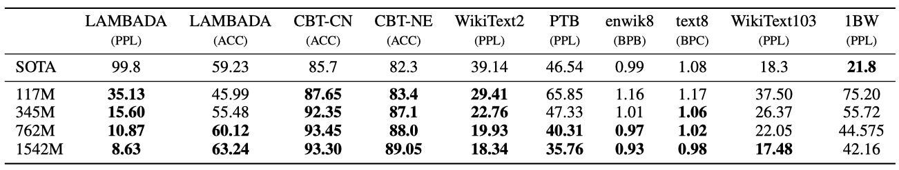

+++
author = "Kurt"
title = "GPT-2"
date = "2024-01-01"
description = "Language Models are Unsupervised Multitask Learners"
categories = [
    "Paper Review"
]
tags = [
    "NLP",
    "LLM",
    "GPT",
]
+++

## Abstract

언어 모델은 웹페이지로 구성된 새로운 데이터셋인 'WebText'으로 학습 함으로써, 질문 응답, 기계 번역 등의 작업을 명시적인 지도 없이 배우기 시작한다는 것을 발견하였다. 특히, GPT-2는 웹텍스트에 대해 underfitting이지만, zero-shot 환경에서 8개 테스트 언어 모델링 데이터셋 중 7개에서 state-of-the-art를 달성하였다. 즉, 언어 처리 시스템이 자연적 설명으로부터 과제수행능력을 배우는 언어처리모델을 개발할 수 있는 방법을 제안하였다.

## Introduction

기계 학습 시스템은 대규모 데이터셋, 고용량 모델, 지도 학습을 이용해 학습된 작업에서 우수한 성과를 보이지만, 데이터 분포의 작은 변화나 작업 정의에 민감하게 반응하고,매우 좁은 범위의 문제에서만 뛰어난 성능을 보여주고 있다. 그래서 보다 일반적인 문제 해결 능력을 갖춘 범용적인 모델 개발이 필요하며, 이는 결국 각각의 작업에 대해 훈련 데이터셋을 수동으로 생성하고 라벨링할 필요 없이 다양한 작업을 수행할 수 있는 모델을 의미한다.

기계 학습 시스템을 만드는 주요한 방법은 훈련 예제를 수집하여 시스템을 학습시키고, independent and identically distributed (IID)에서 성능을 테스트하는 것이다. 이 방법은 좁은 범위의 과제에서는 잘 작동하지만, 범용적인 이해를 필요로 하는 캡션 모델, 독해, 이미지 분류 등에서 높은 성능을 내지 못했으며, 이 방법의 한계를 보여주었다.

일반화하는 능력이 부족한 주요 원인으로 많은 연구가 단일 영역의 dataset과 단일 과제에만 맞춘 학습에만 치중되어 있기 때문이라고 보고 있다. 이를 개선하기 위해 다양한 도메인과 작업에서 훈련하고 성능을 측정하는 것이 필요하며, GLUE와 decaNLP 같은 benchmark dataset이 제안되었다.

다중 작업 학습(Multitask learning)는 일반 성능을 향상에 높이는 유망한 방법이지만, NLP에서는 아직 초기 연구 단계이다. 최근의 기계학습 시스템의 일반화를 위해서는 수백에서 수천 개의 학습 샘플을 필요로 하며, 다중 작업 학습을 위해서도 그만큼 많은 수의 효과적인 트레이닝 쌍이 필요하다. 현재의 기술로는 dataset을 필요한 수준까지 계속 확장하는 것이 어려우며, 따라서 다중 작업 학습을 위한 새로운 접근법이 필요하다. 

현재 언어 작업에서 최고 성능을 보이는 모델은 사전 학습과 지도 학습을 결합한 방식을 사용한다. 이 접근법은 오랜 역사를 가지고 있으며, transfer 방식이 점차 유연해지고 있다. 초기에는 단어 벡터가 학습되어 특정 작업에 적용되었고, 그 다음으로는 순환 네트워크의 문맥 표현이 transfer 되었다. 최근 연구에서는 특정 작업에 특화된 아키텍처가 필요 없으며, 대신 self-attention block만으로 충분하다고 제안하고 있다.

현재의 방법들은 작업 수행을 위해 여전히 지도 학습이 필요하다. 하지만 지도 데이터가 거의 없거나 전혀 없을 때, 언어 모델이 상식적인 추론이나 감성 분석 등의 특정 작업을 수행하는 데 잠재력이 있다는 것이 다른 연구에서 보여져 왔다.

이 논문에서는 언어 모델이 parameter나 아키텍처 변경 없이 zero-shot setting에서 다양한 작업을 수행할 수 있는 능력을 보여준다. 이 접근법은 전이 학습의 일반화 추세를 이어가며, 작업에 따라 유망한 결과와 경쟁력 있는 성과, 그리고 state-of-the-art를 달성하는 잠재력을 보여준다.

## Approach

핵심은 언어 모델링(language modeling)이며, 이는 각 원소가 일련의 symbol $(s_1, s_2, ..., s_n)$ 으로 구성된 예제 $(x_1, x_2, ..., x_n)$ 에서 비지도분포 추정을 하는 것으로 정의된다. 언어의 순차적 특성 때문에 기호들에 대한 결합 확률은 조건부 확률의 곱으로 분해하는 것이 일반적이다.

$$p(x) = \prod_{i=1}^n p(s_n | s_1, s_2, ..., s_{n-1}) $$

이 방법은 $p(x)$ 및 $p(s_{n-k}, ..., s_n | s_1, ..., s_{s-k-1})$ 형태의 조건부의 샘플링과 추정을 가능하게 하며, 최근에는 Transformer와 같은 self-attention 아키텍처의 발전으로 이러한 조건부 확률을 계산하는 모델의 표현력이 크게 향상되었다.

단일 작업을 수행하는 학습은 확률론적 프레임워크에서 조건부 분포 $p(output | input)$를 추정하는 것으로 볼 수 있다. 하지만 일반적인 시스템은 동일한 입력에 대해 수행해야 하는 다양한 작업을 고려해야 한다. 이를 위해, 시스템은 $p(output | input, task)$를 모델링해야 한다. 이는 다중학습과 메타학습 환경에서 다양하게 형식을 갖는다. McCann et al. (2018)은 언어를 활용하여 작업, 입력, 출력을 기호 시퀀스로 지정하는 방법을 제시하였고, 이 방법을 사용하여 MQAN이라는 단일 모델을 훈련시켜 다양한 작업을 수행할 수 있음을 보여주었다.

언어 모델링은 출력 symbol에 대한 명시적인 지도 없이도 다양한 작업을 학습할 수 있다. 이는 감독된 학습 목표와 비감독된 학습 목표가 실질적으로 같기 때문인데, 이 두 목표의 global minimum은 동일하다. 예비 실험에서는 충분히 큰 언어 모델은 이러한 설정에서 다중 작업 학습을 수행할 수 있지만, 명시적으로 감독된 방법보다 학습 속도가 느리다는 것이 확인되었다.

대화(dialog)의 맥락에서 자연어를 직접 학습하는 방법은 매력적인 접근법이지만, 상호작용이 필요없는 인터넷 사이트에 존재하는 방대한 양의 데이터를 활용하는 방법을 선택하였다. 충분한 용량을 가진 언어 모델은 자연어 시퀀스에서 작업을 추론하고 수행하며, 이를 통해 더 잘 예측하도록 학습할 것으로 예상된다. 모델은 비지도 다중작업 학습을 수행하게 될 것이며, 다양한 작업에서 언어 모델의 제로샷 성능을 분석하였다.

### Training Dataset

이전 연구들은 주로 한정된 도메인의 텍스트를 가지고 언어 모델을 학습시켰다. 하지만 이 논문에서는 가능한 한 다양한 도메인과 맥락에서 작업을 수집하기 위해, 크고 다양한 dataset을 구축하였다.

다양하고 방대한 텍스트의 출처로 웹 스크랩인 Common Crawl이 유망하지만, 데이터 품질 문제가 있습니다. 

이 dataset을 사용하는 대신, 문서의 품질을 중요시하는 새로운 웹 스크랩을 만들었다. 전체 웹 스크랩을 수동으로 필터링하는 비용을 줄이기 위해, 사람들이 선별한 웹 페이지를 대상으로 했다. 특히, 적어도 3 카르마를 받은 Reddit의 모든 외부 링크를 스크랩했는데, 이는 사용자들이 해당 링크를 유익하거나 재미있게 여겼는지의 지표로 볼 수 있다.

결과적으로 나온 dataset인 WebText는 45백만 링크의 텍스트 부분집합을 포함하고 있으며, 텍스트 추출을 위해 Dragnet과 Newspaper 내용추출기를 사용하였다. 이 논문의 모든 결과는 2017년 12월 이후 링크를 제외한 초기 버전의 WebText를 사용하며, 이는 de-duplication과 cleaning 과정을 거친 후 40GB, 약 800만 개의 문서를 포함하고 있다. Wikipedia 문서는 분석을 복잡하게 할 수 있어 WebText에서 제외하였다.

### Input Representation

일반적인 언어 모델은 어떤 문자열의 확률도 계산하고 생성할 수 있어야 한다. 하지만 현재의 대규모 언어 모델은 전처리 과정으로 인해 모델링 가능한 문자열 범위가 제한된다. 유니코드 문자열을 UTF-8 바이트로 처리하는 것은 이를 해결하나, 현재 바이트 수준의 언어 모델은 대규모 데이터셋에서 단어 수준의 언어 모델만큼 효과적이지 않다. WebText에서 바이트 수준 언어 모델을 훈련시키려 했으나, 이와 비슷한 성능 격차를 경험하였다.

Byte Pair Encoding(BPE)는 문자와 단어 수준 언어 모델링 사이의 중간 지점이다. 자주 나오는 symbol sequence의 단어수준 입력과 자주 나오지 않는 symbol sequence의 글자수준 입력을 적절히 보간(interpolate)한다. BPE 구현은 byte sequence가 아닌 unicode code points에서 동작한다. 이러한 구현은 모든 unicode 문자열을 모델링하기 위해 전체 unicode symbol의 전체 공간을 포함해야 한다. multi-symbol token을 추가하기 전 130,000개가 넘는 token을 포함하는 기본사전을 필요로 하게 된다. 이는 보통의 32,000개에서 64,000개의 token의 사전에 비해 지나치게 크다. 반면, byte수준의 BPE의 사전은 256개의 token만을 필요로 한다. 그러나 BPE를 byte sequence에 직접 적용하면, 토큰 어휘를 구축하기 위한 BPE의 greedy frequency 기반 heuristic 때문에 최적이 아닌 병합이 발생한다. 예를 들어, 'dog'와 같은 일반적인 단어가 다양한 형태로 나타나면서 제한된 어휘 슬롯과 모델 용량이 최적화되지 않을 수 있다. 이를 해결하기 위해 byte sequence에 대해 문자 범주를 넘어서 병합하는 것을 방지하고, 공백에 대한 예외를 추가하여 압축 효율을 향상시키고 단어의 분열을 최소화하였다.

이 입력 표현법은 단어 수준 언어 모델의 이점과 byte 수준 접근법의 범용성을 결합시킨다. 이러한 접근법은 어떤 unicode 문자열에도 확률을 부여할 수 있으므로, 사전 처리, 토큰화, 어휘 크기와 관계없이 모든 데이터셋에서 언어 모델을 평가할 수 있다.

### Model

Transformer 기반 아키텍처를 사용하며, 이는 주로 OpenAI GPT 모델을 따른다. 몇 가지 수정사항은 레이어 정규화의 위치 변경, 추가적인 레이어 정규화의 삽입, 모델 깊이를 고려한 초기화 방식의 수정, 그리고 잔여 레이어 가중치의 스케일링이다. 또한, 어휘는 50,257개로 확장되었고, 맥락 크기와 배치 크기도 각각 1024 토큰과 512로 증가시켰다.

## Experiments

크기별로 네 개의 언어 모델을 훈련시키고 벤치마킹하였다. 가장 작은 모델의 크기는 원래의 GPT와 같으며, 두 번째로 작은 모델은 BERT의 가장 큰 모델과 같다. 가장 큰 모델인 GPT-2는 GPT보다 10배 이상 많은 parameter를 가지고 있다. 각 모델의 learning rate는 WebText의 5%인 held-out 샘플을 사용하여 수동 조정하으며, 모든 모델은 여전히 WebText에 underfitted 되었으며 더 오래 학습시키면 더 높은 성능을 얻을 수 있을 것이다.

### Language Modeling

GPT-2 모델은 문자 단위(byte level)에서 작동하고, 손실이 큰 전처리나 토큰화가 필요 없으므로 모든 언어 모델 benchmark에서 평가할 수 있다. WebText 언어 모델에 따른 dataset의 로그-확률을 계산하는 방식으로 평가 하였다. WebText 언어 모델은 표준화된 텍스트, 토큰화 유물, 섞인 문장, <UNK> 문자열(40 billion 바이트 중 26번만 발생) 등을 예측해야 하기 때문에 많은 데이터셋에서 일반 분포 밖에서 테스트되어야 한다.

WebText 언어 모델은 도메인과 데이터셋 간에 잘 transfer되며, zero-shot setting에서 8개의 dataset 중 7개에서 state-of-the-art를 달성하였다.

### Children’s Book Test

Children’s Book Test(CBT)는 다양한 카테고리의 단어에 대한 언어 모델의 성능을 평가하기 위한 테스트로, 생략된 단어에 대한 10개의 가능한 선택 중 올바른 것을 예측한다. 

모델 크기가 증가함에 따라 성능이 지속적으로 개선되며, GPT-2는 일반 명사에서 93.3%, 개체명에서 89.1%의 성능을 달성하였다.

### LAMBADA

LAMBADA dataset은 텍스트의 장거리 의존성(long-range dependencies)을 평가한다. GPT-2는 이 테스트에서의 perplexity를 99.8에서 8.6으로, 정확도를 19%에서 52.66%로 향상시켰다. 추가적으로, stop-word filter를 추가함으로써 정확도를 63.24%로 더욱 향상시켰다.

### Winograd Schema Challenge

Winograd Schema Challenge는 텍스트의 모호성을 해결하는 능력을 통해 시스템의 상식적 추론 능력을 측정하고자 한다. GPT-2는 정확도를 7% 향상시켜 70.70%를 달성하였다.

### Reading Comprehension

CoQA(The Conversation Question Answering dataset)는 7가지 다른 분야의 문서와 문서에 대한 질문자-답변자 사이의 자연어 대화가 쌍을 이루고 있다. CoQA 테스트는 독해능력과 대화에 기반한 모델의 답변능력을 평가한다. GPT-2는 미세조정 없이 55 F1 score를 달성해 4개 중 3개의 다른 모델을 능가하였다.

### Summarization

GPT-2의 요약 능력은 CNN과 Daily Mail dataset을 사용해서 테스트했다. 문서 이후에 "TL;DR:" 토큰을 추가하고 Top-k 랜덤 샘플링을 통해 요약을 유도했다. 

처음 생성된 3개의 문장을 요약 결과로 하여 실험한 결과, 기사의 최근 내용에 초점을 맞추거나 특정 세부사항을 혼동하는 경향이 있다. "TL;DR:" 토큰 없이 실험한 경우, 성능이 더 하락한 것을 보면 힌트를 통한 Task 유도가 유의한 결과를 냄을 확인할 수 있었다.

### Translation

번역 능력은 WMT-14 English-French dataset을 사용해서, 영어-프랑스어, 프랑스어-영어 두가지 경우에서 비교가 진행되었다. 번역 성능은 다른 Task에 비해 좋지 상대적으로 좋지 않다. 영어-프랑스어 테스트에서 5 BLEU를, 프랑스어-영어 테스트에서는 11.5 BLEU를 달성했다. 

### Question Answering

언어 모델에 얼마나 많은 정보가 들어있는지 테스트하기 위해 factoid-style의 질문에 얼마나 정확한 답을 생성하는지 평가한다. Natural Questions dataset을 이용해 GPT-2의 성능을 평가하였고 '정확히 일치 하는지' 여부(exact match metric)를 지표로 비교한다. 질문의 4.1%에 대해 올바르게 답을 하였고, 이는 기존의 모델들보다 5.3배 높은 정확도이다. 매우 작은 모델들은 대체로 1%를 넘지 못하는 성능을 보였는데, 아직까지는 모델의 크기가 QA에 있어서 매우 중요한 요인이라는 것을 확인할 수 있었다. 또한, 가장 확신하는 1%의 질문에 대해 63.1%의 정확도를 보였지만, 이는 여전히 정보 검색과 문서 질문 답변 추출을 결합한 시스템의 30%에서 50% 범위의 성능보다 훨씬 떨어진다.

## Generalization vs Memorization

최근 연구에 따르면, 일반적인 이미지 데이터셋에는 상당한 양의 중복된 이미지가 포함되어 있어, 기계 학습 시스템의 일반화 성능을 과대평가하게 만든다. 데이터셋의 크기가 커질수록 이 문제는 더욱 심화될 가능성이 있으며, 이는 테스트 데이터가 얼마나 훈련 데이터에도 포함되어 있는지 분석하는 것이 중요함을 의미한다.

이를 연구하기 위해, WebText 훈련 데이터의 8-gram을 포함하는 Bloom 필터를 생성하였고, 주어진 데이터셋에 대해 그 데이터셋의 8-gram 중 얼마나 많은 비율이 WebText 훈련 세트에도 포함되어 있는지를 계산하였다.

일반적인 언어 모델 데이터셋의 테스트 세트는 WebText 훈련 세트와 1-6%의 중복을 가지며, 평균 중복률은 3.2%이다. 많은 데이터셋은 자신의 훈련 분할과 더 큰 중복을 가지며, 평균 중복률은 5.9%이다.

데이터 중복을 최소화하는 방향으로 접근하였으며, 이러한 중복이 성능에 작은, 하지만 일관적인 향상을 가져다 준다는 분석 결과를 얻었다. 중복 제거 기법을 개선함으로써 이러한 문제에 대해 더욱 효과적으로 대응할 수 있다. 그리고 이러한 중복 제거 과정에서는 n-gram 중첩 기반의 방법을 활용하는 것이 중요하다.

또한, WebText 언어 모델의 성능이 기억력에 의존하는지를 확인하기 위해 해당 모델이 자체 테스트 세트에서 어떤 성능을 보이는지 검사하였다. 이 결과, 모델 크기가 커짐에 따라 훈련 세트와 테스트 세트에서의 성능이 함께 향상되는 경향을 보였으며, 이로부터 GPT-2가 WebText에 대해 완벽하게 적합하지 않음을 추측할 수 있다.

마지막으로, GPT-2가 말하는 유니콘의 발견에 대한 뉴스 기사를 작성하는 능력을 보여주었다. 이는 GPT-2의 창의성을 보여주는 한 예로 볼 수 있다.

## Related Work

이 연구는 더 큰 dataset에서 학습된 큰 언어 모델의 성능을 측정하는 데 중점을 두었다. 이 연구는 이전 연구와 비슷한 방향성을 가지고 있으며, 우리의 실험 결과는 주어진 목표의 세부 작업에 대한 추세가 큰 파라미터 범위로도 지속되는 것을 확인하였다.

생성 모델에서는 RNN 언어 모델이 줄 너비를 추적하고 인용문이나 댓글을 감지하는 등의 흥미로운 기능을 배우는 것이 확인되었다. 또한, 위키백과 기사를 생성하도록 훈련된 모델이 언어 간 이름 번역을 배울 수 있음이 관찰되었다.

iWeb Corpus같이 웹 페이지의 대형 텍스트 말뭉치를 필터링하고 구성하는 다양한 방법, 모든 단어 벡터 표현 학습을 확대하거나, 기계 번역 모델에서 파생된 표현의 사용을 탐색하는 사전학습 방법, seq2seq 모델 등이 연구 되었고, 언어모델의 사전학습이 잡담이나 대화 같은 어려운 생성문제에 맞춰 미세조정할 때 도움이 된다는 것을 밝혀내었다.

## Discussion

비지도 사전 학습 방법의 표현에 대한 많은 연구가 있었으며, 이는 비지도 학습이 유망한 연구 영역임을 시사한다. GPT-2는 독해에 대해 경쟁력 있는 성능을 보였지만, 요약 등의 작업에 대해서는 아직 기본적인 수준에 불과하다. 많은 NLP 작업에서 GPT-2의 제로샷 성능을 연구했지만, 아직 많은 실용적인 작업에서는 성능이 무작위 수준에 불과한 경우가 많다. 제로샷 성능은 GPT-2의 잠재적 성능의 기준을 설정하지만, 미세 조정을 통한 성능의 상한선은 아직 불분명하다. 더욱이, GPT-2의 추가 훈련 데이터와 용량이 단방향 표현의 비효율성을 극복하기에 충분한지는 아직 불확실하다.

decaNLP나 GLUE와 갈은 benchmark에서 미세조정 할 것을 계획하고 있으며, GPT-2의 학습데이터와 그 크기가 BERT에서 말한 단방향 표현의 비효율성을 극복할 수 있을 만큼 충분한지도 확실치 않다고 한다.

## Conclusion

충분히 크고 다양한 dataset으로 학습된 큰 언어 모델인 GPT-2는 여러 도메인과 데이터셋에서 잘 수행하며, 테스트된 8개 언어 모델링 dataset 중 7개에서 state-of-the-art를 달성하였다. 이는 고용량 모델이 다양한 텍스트에 대한 가능성을 극대화하는 훈련을 통해, 명확한 지도 없이도 많은 작업을 수행하는 법을 배우기 시작한다는 것을 시사한다.

## Reference

* [Paper](https://cdn.openai.com/better-language-models/language_models_are_unsupervised_multitask_learners.pdf)
* [Code](https://github.com/openai/gpt-2)