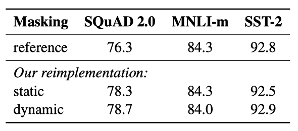

+++
author = "Kurt"
title = "RoBERTa"
date = "2024-01-03"
description = "A Robustly Optimized BERT Pretraining Approach"
categories = [
    "Paper Review"
]
tags = [
    "NLP",
    "LLM",
    "BERT",
]
+++

## Abstract

언어 모델의 사전 학습은 큰 성능 향상을 가져왔지만, 다른 접근법 간의 비교는 어렵다. 학습 과정은 비용이 많이 들며, hyperparameter 선택이 결과에 큰 영향을 미친다. 이 연구는 BERT 학습을 재현하고, 핵심 hyperparameter와 학습 데이터 크기의 영향을 측정하는데, 이를 통해 BERT가 undertrained 상태였으며, 그 이후의 모든 모델의 성능을 맞추거나 능가할 수 있다는 것을 발견했다. RoBERTa는 여러 테스트에서 state-of-the-art를 달성하였고, 이는 이전에 간과된 설계의 중요성을 보여준다.

## Introduction

이 연구는 BERT의 사전 학습 방법을 재현하고, 그 효과를 평가했다. 연구 결과 BERT는 상당히 학습이 부족했으며, 이를 개선하기 위한 새로운 학습 방법 RoBERTa를 제안했다. RoBERTa는 더 큰 배치와 더 많은 데이터에서 모델을 더 오래 학습시키고, 다음 문장 예측 목표를 제거하며, 더 긴 시퀀스에서 학습시키고, 학습 데이터에 적용되는 마스킹 패턴을 동적으로 변경한다. 이 개선된 학습 방법은 GLUE와 SQuAD에서 BERT의 성능을 뛰어넘었다. 또한, 새로운 데이터셋인 CCN EWS를 사용하고, 사전 학습에 더 많은 데이터를 사용하면 성능이 더욱 향상된다는 것을 확인하였다.

## Background

BERT의 사전 학습 방식과 실험적으로 검토할 학습 선택 사항에 대해 간단히 소개한다.

### Setup

BERT는 두 개의 토큰 시퀀스인 $x_1, ..., x_N$과 $y_1, ..., y_M$을 연결하여 입력으로 사용한다. 이 두 세그먼트는 특별한 토큰들로 구분되어 BERT에 하나의 입력 시퀀스로 제공된다:

$$ [CLS], x_1, ..., x_N, [SEP], y_1, ..., y_M, [EOS]. $$

$M$과 $N$은 $M + N < T$라는 제약하에 있으며, 여기서 $T$는 최대 시퀀스 길이를 제어하는 parameter이다. 모델은 대량의 레이블이 없는 텍스트 말뭉치로 사전 학습된 후, 최종 목표 레이블 데이터를 사용하여 미세 조정된다.

### Architecture

사전 학습 동안, BERT는 masked language modeling과 next sentence prediction 두 가지 작업을 사용한다.

#### Masked Language Model (MLM)

입력 시퀀스의 토큰 중 무작위로 선택된 일부가 특별한 토큰 [MASK]로 대체된다. masked language modeling 목표는 마스크된 토큰을 예측하는 것이다. 입력 토큰의 15%가 선택되어 대체되며, 이 중 80%는 [MASK]로, 10%는 그대로 두고, 나머지 10%는 임의의 어휘 토큰으로 대체된다. 이 과정은 학습 기간 동안 한 번만 수행되지만, 실제로는 데이터가 복제되어 모든 학습 문장에 동일한 마스크가 적용되지 않는다.

#### Next Sentence Prediction (NSP)

NSP(Next Sentence Prediction)는 원문에서 두 세그먼트가 이어지는지 예측하는 방법이다. 긍정 예시는 연속된 문장을, 부정 예시는 다른 문서의 세그먼트를 사용해 만든다. NSP 목표는 문장 쌍 간의 관계를 파악하는 자연어 추론 등의 downstream task에서 성능을 향상시키기 위해 설계되었다.

### Optimization

BERT는 Adam 최적화를 사용하며, learning rate는 처음 10,000 step 동안 서서히 높아진 후 선형적으로 감소한다. 모든 레이어와 attention weights에 대해 0.1의 dropout을 사용하고, GELU 활성화 함수를 활용한다. 모델은 1,000,000 업데이트 동안 사전 학습되며, 최대 512 토큰의 256 시퀀스를 포함하는 미니배치를 사용한다.

### Data

BERT는 총 16GB의 압축되지 않은 텍스트인 BOOK CORPUS와 영어 WIKIPEDIA 조합으로 학습된다.

## Experimental Setup

BERT의 복제 연구에 대한 실험적 설정을 설명한다.

### Implementation

FAIRSEQ에서 BERT를 재구현하고, 대부분의 원래 BERT 최적화 hyperparameter를 따랐다. 하지만 peak learning rate과 warmup step 수는 각 설정에 따라 별도로 조정했다. 또한, Adam epsilon 항에 따라 학습이 매우 민감하며, 이를 조정하여 성능을 개선했다.

### Data

BERT 스타일의 사전 학습은 대량의 텍스트에 크게 의존하며, 데이터 크기를 늘릴수록 최종 작업 성능이 향상될 수 있다. 이 연구에서는, 가능한 많은 데이터를 수집하여 실험을 진행하고, 각 비교에 적절한 데이터의 전체적인 품질과 양을 맞출 수 있도록 했다. 압축되지 않은 텍스트로 총 160GB를 넘는 다양한 크기와 도메인의 5개의 영어 말뭉치를 사용하였다:

* BOOK CORPUS와 영어 WIKIPEDIA. BERT를 학습시키는데 사용된 원래 데이터이다. (16GB).
* CC-N EWS, CommonCrawl News dataset의 영어 부분에서 수집한 것. 이 데이터는 2016년 9월부터 2019년 2월까지 크롤링된 6300만 개의 영어 뉴스 기사를 포함하고 있다. (필터링 후 76GB).
* OPEN WEB TEXT, WebText 코퍼스의 오픈 소스 재현, 텍스트는 Reddit에서 최소 세 번 이상의 추천을 받은 URL에서 추출된 웹 콘텐츠이다. (38GB)
* STORIES, Winograd 스키마의 스토리 같은 스타일을 맞추기 위해 필터링된 CommonCrawl 데이터의 부분 집합을 포함하고 있다. (31GB).

### Evaluation

다음 세 가지 benchmark를 사용하여 사전 학습된 모델을 평가한다.

#### GLUE

GLUE 벤치마크는 자연어 이해 시스템을 평가하기 위한 9개의 dataset 모음이다. 이는 단문 분류 또는 문장 쌍 분류 작업으로 구성되며, 참가자들은 제출 서버와 리더보드를 통해 자신의 시스템을 평가하고 비교할 수 있다.

학습 데이터에서 사전 학습된 모델을 미세 조정하여 개발 세트에서 결과를 보고하였으며, 이 절차는 원래의 BERT 논문을 따른다.

#### SQuAD

Stanford Question Answering Dataset(SQuAD)는 문맥과 질문을 제공하며, 작업은 문맥에서 관련 부분을 추출하여 질문에 답한다. SQuAD는 V1.1과 V2.0 두 버전이 있으며, V2.0 버전은 제공된 문맥에서 답하지 않는 질문도 포함하여 작업이 더 도전적이다.

SQuAD V1.1에서는 BERT와 같은 방법으로 범위를 예측하며, SQuAD V2.0에서는 추가적인 이진 분류기를 사용하여 질문이 답변 가능한지를 예측한다. 이는 분류와 범위 손실 항을 합산하여 훈련되며, 평가 시 답변 가능으로 분류된 쌍에만 범위 인덱스를 예측한다.

#### RACE

ReAding Comprehension from Examinations(RACE)은 28,000개 이상의 지문과 100,000개 가까운 질문을 포함한 대규모 독해 dataset이다. 이 dataset은 중국의 중고등학생들을 대상으로 한 영어 시험에서 수집되었다. RACE에서는 각 지문에 대해 여러 질문을 풀고, 네 가지 선택지 중 정답을 고르는 작업을 수행한ㄴ다. RACE는 다른 dataset에 비해 긴 문맥을 가지고 있으며, 대부분의 질문에서 추론 능력을 요구한다.

## Training Procedure Analysis

BERT 모델을 성공적으로 사전 학습하기 위해 중요한 선택 사항들을 탐색하고 정량화한다. $BERT_{BASE}$와 동일한 구성 (L = 12, H = 768, A = 12, 110M params)으로 BERT 모델을 학습한다.

### Static vs. Dynamic Masking

BERT는 무작위로 토큰을 마스킹하고 예측한다. 각 학습 인스턴스에서 동일한 마스크를 계속 사용하는 것을 피하기 위해, 학습 데이터를 10번 복제하여 각 시퀀스가 40회의 학습 동안 다양하게 마스킹될 수 있게 했다. 이를 모델에 시퀀스를 제공할 때마다 새로운 마스킹 패턴을 생성하는 동적 마스킹과 비교하였다.

재구현에서 정적 마스킹은 원래 BERT와 유사한 성능을 보였고, 동적 마스킹은 정적 마스킹과 비슷하거나 약간 더 좋은 성능을 보여주었다. 이 결과와 동적 마스킹의 효율성을 고려하여, 이 후 실험에서는 동적 마스킹을 사용하였다.

### Model Input Format and Next Sentence Prediction

원래 BERT 사전 학습에서는 모델이 두 개의 연결된 문서 세그먼트를 관찰하며, 이들은 같은 문서에서 연속적으로 추출되거나 다른 문서에서 추출된다. 모델은 Next Sentence Prediction(NSP) 손실을 통해 관찰한 문서 세그먼트가 같은 문서에서 왔는지, 다른 문서에서 왔는지 예측하도록 훈련된다.

NSP 손실의 중요성은 원래 BERT 모델 훈련에서 중요한 요소로 가정되었으며, NSP를 제거하면 성능이 저하되는 것이 관찰되었다. 그러나 최근의 일부 연구에서는 NSP 손실의 필요성에 의문을 제기하였다. 이러한 차이점을 더 잘 이해하기 위해, 다양한 훈련 형식을 비교하고 있다.

* SEGMENT - PAIR + NSP: BERT의 원래 입력 형식을 따르며 NSP 손실을 포함한다. 각 입력은 여러 자연스러운 문장을 포함한 세그먼트 쌍이 있으며, 총 길이는 512 토큰 이하여야 한다.
* SENTENCE - PAIR + NSP: 각 입력은 하나의 문서의 연속적인 부분 또는 별개의 문서에서 추출된 자연스러운 문장 쌍을 포함한다. 이러한 입력은 512 토큰보다 훨씬 짧으므로, 총 토큰 수가 SEGMENT - PAIR + NSP와 비슷하게 유지되도록 배치 크기를 늘린다. NSP 손실은 유지된다.
* FULL - SENTENCES: 각 입력은 하나 이상의 문서에서 연속적으로 샘플링된 문장으로 채워져 있으며, 총 길이는 최대 512 토큰이다. 문서가 끝나면 다음 문서에서 샘플링을 시작하고, 문서 사이에는 추가 구분자 토큰을 넣는다. NSP 손실은 제거된다.
* DOC - SENTENCES: 입력은 FULL - SENTENCES와 유사하게 구성된다. 문서 끝 부분에서 샘플링된 입력은 512 토큰보다 짧을 수 있어, 이런 경우에는 배치 크기를 동적으로 늘려 FULL SENTENCES와 같은 총 토큰 수를 유지한다. NSP 손실은 제거한다.

원래의 SEGMENT - PAIR 입력 형식과 SENTENCE - PAIR 형식을 비교했으며, 둘 다 NSP 손실을 유지하되 후자는 단일 문장을 사용한다. 개별 문장 사용은 모델이 장거리 의존성을 학습하지 못함으로써 성능을 저하시킨다는 것을 발견하였다.

NSP 손실 없이 훈련과 단일 문서의 텍스트 블록을 사용한 학습(DOC - SENTENCES)을 비교했을 때, 이 설정이 $BERT_{BASE}$ 결과를 능가하며, NSP 손실을 제거하면 downstream task 성능이 향상된다는 것을 발견하였다.

마지막으로, 단일 문서의 시퀀스(DOC - SENTENCES)가 여러 문서의 시퀀스(FULL - SENTENCES)보다 약간 더 나은 성능을 보이지만, DOC - SENTENCES 형식은 배치 크기가 변동적이므로, 나머지 실험에서는 FULL SENTENCES를 사용하였다.

### Training with large batches

Neural Machine Translation의 이전 연구에 따르면, earning rate가 적절하게 증가할 때 아주 큰 mini-batches를 사용한 학습은 최적화 속도와 성능 모두를 개선시킬 수 있다는 것이 증명되었다. 최근의 연구는 BERT 또한 큰 배치 학습에 적합하다는 것이 밝혀졌다.

배치 크기를 증가시키면서 $BERT_{BASE}$의 Perplexity와 성능을 비교하였고, 큰 배치로 훈련하면 마스크 언어 모델링 목표의 Perplexity와 정확도가 향상된다는 것을 관찰했다. 또한, 큰 배치는 분산 데이터 병렬 훈련을 통해 더 쉽게 병렬화할 수 있다.

### Text Encoding

Byte-Pair Encoding(BPE)는 자연어 말뭉치의 큰 어휘를 처리하기 위해 문자와 단어 수준 표현의 중간 형태를 사용한다. BPE는 훈련 말뭉치의 통계 분석을 통해 추출된 subword unit를 사용한다. byte를 사용한 BPE는, Unknown 토큰 없이도, 50K units의 서브워드 사전으로 학습을 진행할 수 있다.

기존의 BERT는 character level의 BPE를 사용했다. RoBERTa는 추가 전처리나 토크나이징 없이 larger byte-level BPE로 학습을 진행한다.

Byte level BPE는 몇 개의 태스크에서 성능이 떨어진다는 단점이 있지만, 성능 하락폭이 크지 않고 universal 인코딩의 장점이 있다고 판단하여 본 연구에서 Byte level BPE를 적용하였다.

## RoBERTa

BERT 사전 학습 절차를 수정하여 end-task 성능을 향상시키는 방안을 제안한다. 이를 모두 합쳐서 그 효과를 평가한 결과, RoBERTa라는 새로운 설정이 만들어졌다. RoBERTa는 동적 마스킹, NSP 손실 없는 전체 문장, 큰 미니 배치, 더 큰 바이트 수준 BPE를 사용하여 학습된다.

또한, 사전 학습에 사용된 데이터와 데이터를 통한 학습 통과 횟수라는 두 가지 중요한 요소를 조사했다. 이를 검증하기 위해 $BERT_{LARGE}$ 아키텍처를 따라 RoBERTa를 훈련시켰고, BOOK CORPUS와 WIKIPEDIA dataset을 사용하여 100K 단계 동안 사전 학습 하였다.

RoBERTa는 원래의 $BERT_{LARGE}$ 결과에 비해 크게 향상된 성능을 보여준다. 추가로, 다양한 데이터셋을 결합하여 훈련시킨 결과, 모든 downstream task에서 성능이 더욱 개선되었다.

또한, 사전 학습 단계를 100K에서 300K, 그리고 500K로 늘렸을 때, downstream task 성능에서 상당한 향상을 보여주었다. 이렇게 학습된 모델들은 대부분의 작업에서 $XLNet_{LARGE}$를 능가하였다.

마지막으로, GLUE, SQuaD, 그리고 RACE라는 세 가지 다른 benchmark에서 최적의 RoBERTa 모델을 평가하였다. 이는 모든 다섯 가지 dataset에 대해 500K 단계로 훈련된 RoBERTa를 기준으로 한 것이다.

### GLUE Results

GLUE에 대해 두 가지 미세 조정 설정을 고려했다. 첫 번째는 각 GLUE 작업에 대해 RoBERTa를 별도로 미세조정 했으며, 각 작업에 대한 중간 개발 세트 결과를 앙상블 없이 측정했다. 두 번째는 GLUE 리더보드를 통해 RoBERTa를 다른 모델과 비교했다. 단일 작업 미세 조정에만 의존하였다. 특히, RTE, STS, 그리고 MRPC에서는 MNLI 단일 작업 모델에서 시작하여 미세 조정 하는 것이 도움이 되었다. 각 작업에 대해 5에서 7개의 모델을 앙상블하였다.

RoBERTa가 GLUE 작업 개발 세트 9개 모두에서 state-of-the-art를 달성하였다. $BERT_{LARGE}$와 동일한 구조를 사용하면서도, $BERT_{LARGE}$와 $XLNet_{LARGE}$를 능가하였다. 이는 모델 구조와 사전학습 목표 이외의 요인들이 중요할 수 있다는 점을 시사한다.

앙상블 설정에서는, RoBERTa를 GLUE 리더보드에 제출하여 9개 작업 중 4개에서 state-of-the-art를 달성하였고, 가장 높은 평균 점수를 얻었다. 이는 RoBERTa가 다중 작업 미세 조정에 의존하지 않는다는 점에서 특히 주목할만하다.

### SQuAD Results

SQuAD에 대해 과거의 복잡한 접근법 대신 단순한 방법을 채택하였다. BERT와 XLNet이 추가 QA 데이터셋을 훈련 데이터에 포함시킨 반면, 이 연구에서는 제공된 SQuAD 훈련 데이터만으로 RoBERTa를 미세조정 하였다. 모든 레이어에 대해 동일한 learning rate를 사용하였다.

RoBERTa는 SQuAD v1.1 개발 세트에서 XLNet과 동일한 성능을 보여주며, SQuAD v2.0에서는 XLNet을 약간 상회하는 새로운 state-of-the-art를 달성하였다.

RoBERTa를 공개 SQuAD 2.0 리더보드에 제출했고, 추가적인 학습 데이터를 사용하지 않았음에도 불구하고, 단일 모델 제출 중 거의 모든 시스템을 능가하는 성과를 보여주었다. 데이터 증강에 의존하지 않는 시스템 중에서는 가장 높은 점수를 받았다.

### RACE Results

RACE에서는 텍스트, 관련 질문, 네 개의 후보 답변이 제공되며, 시스템은 정답을 분류해야 한다. RoBERTa를 이 작업에 맞게 수정했으며, 각 후보 답변을 해당 질문과 텍스트에 연결하여 처리하였다. 전체 길이가 512 토큰을 초과하지 않도록 조정했다.

RACE 테스트 세트에서의 결과는 RoBERTa가 중학교와 고등학교 환경 모두에서 state-of-the-art를 달성하였다.

## Related Work

다양한 사전 학습 방법들은 언어 모델링, 기계 번역, 마스킹된 언어 모델링 등의 목표를 가지고 설계되었다. 최근 연구에서는 마스킹된 언어 모델 목표를 사용해 사전 학습하고, 각 작업에 대해 모델을 미세 조정하는 방법을 사용하였다. 그러나 새로운 방법들은 다중 작업 미세 조정, 엔티티 임베딩 통합, 범위 예측, 자동회귀 사전 학습의 변형 등을 통해 성능을 향상시켰다. 일반적으로, 더 큰 모델을 더 많은 데이터로 훈련함으로써 성능이 향상되었다.

## Conclusion

BERT 모델을 사전 학습시키는데 있어 다양한 디자인 결정을 신중하게 평가했다. 모델을 더 오래 훈련하고, 더 큰 배치로 더 많은 데이터를 사용하며, 다음 문장 예측 목표를 제거하고, 더 긴 시퀀스를 훈련하며, 훈련 데이터에 적용된 마스킹 패턴을 동적으로 변경하면 성능이 크게 향상됨을 발견했다. 이러한 개선된 사전 학습 절차를 RoBERTa라 부르며, GLUE, RACE, SQuAD에서 state-of-the-art를 달성하였다. 

## Reference

* [Paper](https://arxiv.org/pdf/1907.11692.pdf)
* [Code](https://github.com/facebookresearch/fairseq)