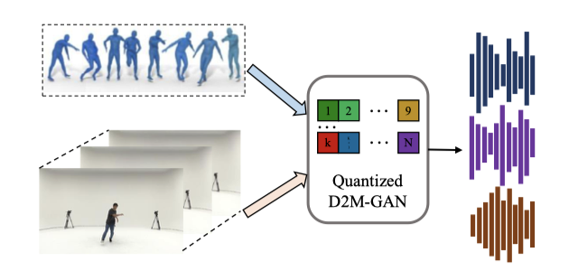
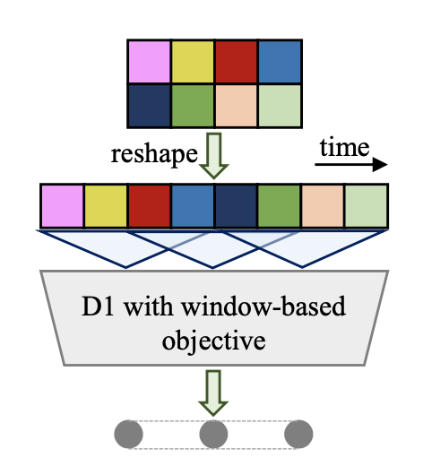
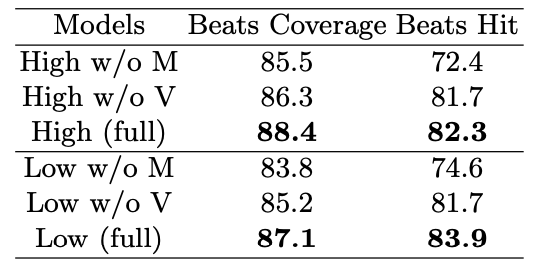

+++
author = "Kurt"
title = "D2M-GAN"
date = "2024-08-30"
description = "Quantized GAN for Complex Music Generation from Dance Videos"
categories = [
    "Paper Review"
]
tags = [
    "Audio",
    "Music Generation",
]
+++

## Abstract

Dance2Music-GAN (D2M-GAN)을 소개한다. D2M-GAN은 댄스 비디오에 맞춰 복잡한 음악을 생성하는 새로운 프레임워크로, 댄스 비디오 프레임과 신체 움직임을 입력으로 받아 적합한 음악을 생성한다. 기존의 조건부 음악 생성 방식과 달리, VQ 오디오 표현을 사용하여 다양한 스타일의 댄스 음악을 생성하며, 광범위한 실험과 평가를 통해 효과성을 입증하였다. 실제 TikTok 비디오를 포함한 데이터셋을 제공하며, 향후 연구에 유용한 출발점이 될 것이다. 

---

## Introduction

"음악과 춤이 조화를 이룰 때, 그 마법은 마음과 정신을 사로잡는다." 춤과 음악은 오랜 세월 동안 우리의 삶을 풍요롭게 해왔으며, TikTok과 같은 플랫폼에서 춤 영상이 인기를 끌면서 그 중요성이 현대 사회에서도 부각되고 있다. 이에 따라 춤 동작과 음악 간의 생성 작업을 연구하는 새로운 연구들이 활발히 진행 중이다.

춤 비디오에서 음악을 생성하는 것은 두 가지 이유로 어려운 과제다. 첫째, 음악 신호는 고차원적이고 시간적 일관성이 필요하지만, 춤 생성 연구는 상대적으로 저차원적인 움직임 데이터를 출력한다. 이를 해결하기 위해 중간 상징적 오디오 표현(예: 피아노 롤, MIDI)을 사용하지만, 이는 음악의 유연성이 제한된다. 둘째, 각 악기마다 별도 모델이 필요해 복잡한 음악 스타일과 실제 상황에서 일반화가 어렵다.

이 격차를 해소하기 위해, 벡터 양자화된 오디오 표현을 사용해 춤 비디오에서 복잡한 음악 샘플을 생성하는 새로운 적대적 멀티모달 프레임워크를 제안한다. VQ-VAE와 VQ-GAN의 성공을 바탕으로 양자화된 벡터를 중간 오디오 표현으로 사용하여, 기존 상징적 표현보다 실제 음악을 더 잘 표현한다. 이 프레임워크는 시각적 프레임과 춤 동작을 입력받아 오디오 VQ 표현을 생성하고, 이를 JukeBox 디코더로 raw 오디오로 복원한다. 또한, 계층적 구조를 통해 확장성과 음악의 충실도를 높인다.

마지막으로, TikTok에서 수집한 445개의 춤 비디오와 85개의 노래로 이루어진 실제 연계된 춤-음악 데이터셋을 제공한다. 이는 기존 데이터셋보다 더 도전적이고 실제 상황을 잘 반영해, 향후 연구의 새로운 기준을 제시한다.

데이터셋을 활용해 제안된 프레임워크의 효율성과 견고성을 입증하는 실험을 진행하였다. 비트, 장르, 일관성 측면에서 춤과의 대응성 및 음악의 전반적인 품질을 평가한 결과, 이 논문의 모델이 여러 음악적 요소에서 경쟁 방법들을 능가하는 그럴듯한 춤 음악을 생성할 수 있음을 확인하였다.

요약하자면, 주요 기여는 다음과 같다:

* D2M-GAN을 제안하여, 벡터 양자화(VQ) 표현을 통해 춤 비디오에서 복잡하고 자유형식의 음악을 생성한다.
* VQ 생성기와 다중 스케일 판별기를 사용하여 음악의 시간적 상관관계와 리듬을 효과적으로 포착하고 복잡한 음악을 생성한다.
* 조건부 생성 음악에 대한 포괄적인 평가 프로토콜을 도입하고, D2M-GAN이 기존 방법들보다 더 복잡하고 그럴듯한 음악을 생성함을 보여준다.
* 현장에서 촬영된 춤 비디오로 구성된 새로운 데이터셋을 생성하여, 조건부 음악 생성에 대한 도전적인 설정을 확립하고 프레임워크의 우수성을 입증한다.

---

## Related Work

**Audio, Vision and Motion.** 최근 멀티모달 학습에서는 오디오, 비전, 모션 데이터를 결합하는 연구가 증가하고 있으며, 이러한 학습된 오디오-비주얼 표현은 다양한 작업에 활용된다. 반면, 이 연구와 관련된 또 다른 분야는 움직임과 소리 간의 상관관계를 조사해왔다. 대부분의 연구는 오디오 신호를 기반으로 2D 포즈 또는 3D 동작을 생성하거나, 움직임으로부터 소리를 생성하는 모델을 제안한다. Zhao et al. 은 동작 경로로부터 소리를 생성하고, Gan et al. 은 공연 비디오에서 음악을 생성하며, Di et al. 은 동작과 리드믹 특성에 따라 비디오 배경 음악을 생성하였다. 반면, 이 연구는 비전과 모션 데이터를 입력으로 받아 음악을 생성하는 세 가지 모달리티를 결합한다.

**Music Generation.** raw 음악 생성은 고차원 오디오 데이터와 복잡한 시간적 상관관계로 인해 어렵다. 기존 접근법은 중간 오디오 표현을 사용하여 계산 요구를 줄이고 학습을 단순화한다. Musegan은 1D 피아노 롤을 사용하고, Music Transformer는 2D MIDI 유사 표현을, Melgan은 멜-스펙트로그램을 사용한다. 최근 JukeBox는 벡터 양자화(VQ) 표현을 기반으로 한 모델을 소개하며, 이 연구의 프레임워크도 VQ 표현을 채택하였다.

**Vector Quantized Generative Models.** VQ-VAEs는 디스크리트 코드와 학습된 프라이어를 사용해 이미지와 오디오 생성에서 효과를 보여주었다. VQ-VAE는 이미지, 비디오, 음성을 생성하며, 개선된 버전은 다중 스케일 구조를 갖춘다. Esser et al. 은 VQ 표현을 GAN 기반 고해상도 이미지 생성에 활용하고, Dhariwal et al. 은 VQ-VAE 기반 음악 생성 모델 JukeBox를 제안하였다. VQ 표현은 복잡한 음악 장르를 유연하게 표현하며, 데이터 차원을 줄인다. 이 연구의 프레임워크는 GAN과 VAE를 결합하여 춤 비디오로부터 VQ 표현을 생성하고, VAE 기반 디코더로 음악을 합성한다.

---

## Method

제안된 D2M-GAN은 두 수준의 모델로 구성된 계층적 구조를 가지고 있으며, 각 수준은 모션, 비주얼, VQ(생성기 및 다중 스케일 판별기 포함), 음악 합성기 모듈로 이루어져 있다. 이 구조는 음악 품질과 계산 비용 간의 절충을 유연하게 조정할 수 있도록 설계되었다.

### Data Representations

D2M-GAN의 추론 단계에서는 댄스 비디오의 시각적 프레임과 신체 동작 데이터를 입력으로 사용한다. 학습 시에는 실제 음악 오디오가 판별기 학습에 사용된다. 신체 동작 데이터는 SMPL 또는 2D 신체 키포인트로 표현되며, 시각적 프레임은 Kinectics에서 사전 학습된 모델로 I3D 특징을 추출한다. 음악 데이터는 VQ를 사용하여 처리하며, JukeBox의 120만 곡 데이터셋으로 학습된 코드북을 활용한다.

### Generator

생성기 $ G = \lbrace G_m, G_v, G_{vq} \rbrace $는 동작 모듈 $ G_m $, 시각 모듈 $ G_v $, 그리고 VQ 모듈의 주요 VQ 생성기 $ G_{vq} $를 포함한다. 이 생성기는 융합된 동작-시각 데이터를 입력으로 받아 원하는 VQ 오디오 표현을 출력한다.

$$ f_{vq} = G_{vq}(G_m(x_m), G_v(x_v)) = G(x_m, x_v) $$

여기서 $ x_m $과 $ x_v $는 각각 동작과 시각 입력 데이터이다. $ f_{vq} $는 출력 VQ 표현이다. 모든 모듈은 합성곱 기반의 피드포워드 네트워크로 구현된다. 주요 VQ 생성기에서는 GAN 학습의 안정성을 높이기 위해 숨겨진 층에 대해 누설 정류 활성화 함수(Leaky ReLU)를 사용하고, 출력 전 마지막 층에는 tanh 활성화 함수를 사용한다.

배치 정규화와 적절한 활성화 함수 설계는 GAN 훈련의 안정성에 필수적이다. tanh 함수는 출력 VQ 표현을 -1과 +1 사이로 제한하므로, 이를 σ 팩터로 확장하여 사전 학습된 코드북을 사용할 수 있게 한다. 음악 생성에 유리한 넓은 수용 영역을 위해, 큰 커널 크기의 합성곱 층과 팽창된 잔여 블록을 추가하였다. 모든 하위 모듈은 함께 최적화된다.

### Multi-Scale Discriminator

D2M-GAN의 판별기는 생성된 VQ 특징 시퀀스의 장기 의존성을 포착하기 위해 다중 스케일 아키텍처를 사용한다. 이 판별기는 3개의 모듈 $D_1, D_2, D_3$로 구성되어 있으며, 각각 1배, 2배, 4배로 다운샘플링된 VQ 특징을 처리한다. VQ 표현은 입력 전에 시간 차원에서 재구성되며, 창 기반 목표를 사용하여 VQ 시퀀스의 작은 조각들 간의 분포를 구별하여 일관성을 향상시킨다.

### Lookup and Synthesis

VQ 표현 생성 후, 코드북 조회를 통해 가장 가까운 항목을 검색하고, JukeBox의 디코더를 음악 합성기로 미세 조정한다. 이 과정에서 GAN 기반 기술을 사용하여 디코더를 생성기로, 기존 판별기 아키텍처를 유지한다.

### Training Objectives

**GAN Loss.** 제안된 D2M-GAN을 학습하기 위해 음악 생성에 맞춰 조정된 GAN의 힌지 손실을 사용한다. 판별기와 생성기에 대한 손실 함수는 각각 다음과 같다:

$$ L_{adv.}(D;G) = \sum_k L_{adv.} (D_k; G)$$
$$ = \sum_k (E_{\phi(x_a)}[\min(0, 1 - D_k(\phi(x_a)))] + E_{(x_m,x_v)}[\min(0, 1 + D_k(G(x_m, x_v)))]) $$

$$ L_{adv.}(G;D) = E_{(x_m,x_v)} \left[\sum_k - D_k(G(x_m,x_v))\right] $$

여기서 $ x_a $는 원본 음악, $ \phi $는 JukeBox의 미세 조정된 인코더이며, $ k $는 다중 스케일 판별기의 수를 나타낸다.

**Feature Matching Loss.** 오디오 신호의 세부 사항을 강화하기 위해 피처 매칭 손실을 훈련 목표에 포함한다. 이 손실은 실제와 생성된 VQ 특징의 판별기 피처 맵 간의 L1 거리로 정의된다.

$$ L_{FM}(G;D) = E_{(x_m,x_v)} [ \sum_{i=1}^T {{1}\over{N_i}} || D^i (\phi(x_{\alpha})) - D^i (G(x_m, x_v)) ||_1 ] $$

**Codebook Commitment Loss.** 코드북 커밋먼트 손실은 생성된 VQ 특징과 코드북 조회 과정 후에 원본 VQ 특징의 코드북 항목 간의 L1 거리로 정의된다.

$$ L_{code}(G) = E_{(x_m,x_v)} \left[ || \text{LookUp}(\phi(x_a)) - G(x_m, x_v) ||_1 \right] $$

**Audio Perceptual Losses.** 인지적 청각 품질 향상을 위해, 시간 및 주파수 도메인에서 원본 오디오와 생성된 오디오 간의 L1 거리를 계산하는 인지 손실을 사용한다. 이는 다음과 같이 정의된다:

$$ L_{wav}(G) = E_{(x_m,x_v)} \left[ \| x_a - G(x_m, x_v) \|_1 \right] $$

$$ L_{Mel}(G) = E_{(x_m,x_v)} \left[ \| \theta(x_a) - \theta(G(x_m, x_v)) \|_1 \right] $$

여기서 $ \theta $는 멜 스펙트로그램을 계산하는 함수이다.

**Final Loss.** 생성기 모듈의 최종 훈련 목표는 다음과 같습니다:

$$ L_G = L_{adv.}(G;D) + \lambda_{fm} L_{FM}(G;D) + \lambda_c L_{code} + \lambda_{wav} L_{wav} + \lambda_{mel} L_{Mel} $$

여기서 하이퍼파라미터 $\lambda$ 값은 3, 15, 40, 15로 설정된다.

---

## Experiments

### Experimental Setup

**Datasets.** 두 가지 데이터셋에서 실험을 수행하여 방법의 효과를 검증하였다. AIST++ 데이터셋은 3D 동작 주석이 있는 AIST 데이터셋의 하위 집합으로, 학습, 검증, 테스트 세트가 겹치지 않도록 나누어진다. 이 데이터셋에는 10개의 댄스 장르와 60곡의 노래가 포함되어 있다.

또한, TikTok 댄스-음악 데이터셋을 수집하였으며, 이 데이터셋은 445개의 비디오와 85곡의 노래를 포함한다. 비디오는 다양한 배경과 불완전한 인체 스켈레톤 데이터를 가지고 있어 학습의 난이도를 높인다.

**Implementation Details.** 실험에서는 22.5 kHz 샘플링 속도를 사용하며, 비디오와 오디오 세그먼트는 2초 길이로 설정한다. GAN 학습에는 Adam 옵티마이저(학습률 1e-4, β1 = 0.5, β2 = 0.9)를 사용하고, VQ 생성기에는 σ = 100을 적용한다. 판별기의 수는 3으로 설정하고 배치 크기는 16이다. JukeBox 합성기 미세 조정 시에는 Adam 옵티마이저(학습률 1e-5, β1 = 0.5, β2 = 0.9)를 사용하며, 생성된 음악 데이터에는 디노이징을 수행한다.

**Comparisons.** 제안된 방법을 다음과 비교한다. Foley Music: 키포인트 데이터로 MIDI 생성 후, 단일 악기 소리로 변환. Dance2Music: 단일 악기 소리의 음악 생성. CMT: MIDI를 사용한 비디오 배경 음악 생성. Ground Truth: 원본 댄스 비디오 음악. JukeBox: JukeBox 모델을 통한 음악 생성 또는 재구성.

### Music Evaluations

생성된 음악을 평가하기 위해 두 가지 범주를 사용하는 프로토콜을 설계하였다. 1. 상관관계 평가: 생성된 음악과 입력 댄스 비디오 간의 관계를 측정하고, 이를 기존 모델들과 비교한다. 2. 품질 평가: 음악의 전반적인 품질을 원본 오디오와 JukeBox로 재구성한 샘플, 그리고 실제 샘플을 비교하여 평가한다.

**Rhythm.** 음악의 리듬은 댄스 비디오 입력에서 중요한 요소로, 댄스 비트와 생성된 음악 리듬의 일치를 평가하기 위해 두 가지 객관적 점수, 즉 비트 커버리지 점수와 비트 히트 점수를 사용한다. 비트 커버리지 점수는 생성된 비트의 전체 비트 대비 비율을, 비트 히트 점수는 정렬된 비트의 총 비트 대비 비율을 측정한다. D2M-GAN이 경쟁 방법들보다 우수한 점수를 기록하였다.

**Genre and Diversity.** 생성된 음악 샘플이 주어진 댄스 스타일과 일치하는 장르인지 평가하기 위해 장르 정확도(genre accuracy)를 계산한다. 이를 위해 AIST++에서 유사도 점수가 높은 음악 샘플을 검색하고, VGG 유사 네트워크로 추출한 오디오 특징 간의 유클리드 거리로 유사도를 측정한다. 장르가 일치하는 세그먼트의 비율을 계산하여 장르 정확도를 평가한다.

D2M-GAN의 장르 정확도 점수가 경쟁 방법들보다 높다. 이는 D2M-GAN이 VQ 오디오 표현을 사용해 복잡한 댄스 음악을 생성할 수 있어 다양성과 조화가 개선되기 때문이다.

**Coherence.** 댄스 비디오와 조건화된 음악의 일관성을 평가하기 위해 Mean Opinion Scores(MOS) 테스트를 수행한다. 평가자들이 댄스와 음악의 일관성을 1에서 5 사이의 점수로 평가하며, D2M-GAN이 다른 방법들보다 높은 점수를 기록하였다. 이는 D2M-GAN이 댄스 비디오와 잘 조화되는 복잡한 음악을 생성함을 보여준다.

**Overall Quality.** 이 연구는 댄스-음악 상관관계 학습에 중점을 두지만, 생성된 음악 샘플의 음향 품질도 평가한다. MOS 테스트 결과, D2M-GAN이 JukeBox와 유사한 음향 품질을 제공하며, 공정성을 위해 동일한 오디오 홉 길이 모델과 비교한다. 고품질 오디오 합성은 매우 도전적이며, 예를 들어 20초 길이의 샘플을 생성하는 데 3시간이 걸린다.

**Results on the TikTok Dataset.** TikTok 댄스-음악 데이터셋은 AIST++ 보다 더 도전적이며, D2M-GAN의 강건성을 확인할 수 있다.

### Ablation Studies

**Sequence Length.** 주요 실험에서는 2초 샘플을 사용했으나, 이 연구의 모델은 더 긴 시퀀스 길이로도 효과적으로 학습하고 테스트할 수 있다.

**Data Modality.** 입력 데이터에서 댄스 동작 또는 시각적 프레임을 제거한 소거 연구 결과, 동작 데이터가 음악 리듬에 더 큰 영향을 미치며, 이는 음악 리듬이 댄스 동작과 밀접하게 연관되어 있다는 예상과 일치한다.

**Loss function.** 다양한 손실의 영향을 분석한 결과, mel-spectrogram을 기반으로 한 오디오 지각 손실 Lmel이 음악 리듬 생성에 중요한 역할을 한다는 것을 확인하였다. 이는 Lmel이 고주파를 잘 포착하여 댄스 비트와 밀접하게 연관되기 때문이다.

**Model Architecture.** 모델 아키텍처와 디자인 기술 측면에서 D2M-GAN의 변형을 테스트한 결과, 다중 스케일 판별기 레이어, 생성기 스케일링, 판별기 리쉐이프 기법이 중요하다는 것을 확인하였다.

---

## Conclusion and Limitations

결론적으로, VQ 오디오 표현을 통해 댄스 비디오에서 음악을 생성하는 D2M-GAN 프레임워크를 제안한다. 그러나 현재 작업에는 오디오 품질과 추론 속도에 한계가 있으며, JukeBox의 성능이 주요 병목 지점이다. 빠른 추론과 높은 품질을 균형 있게 달성하기 위해, MIDI 음악 표현을 사용한 자동 작곡 접근 방식을 탐색할 필요가 있다.

---

## Reference

* [Paper](https://arxiv.org/pdf/2204.00604)
* [GitHub](https://github.com/L-YeZhu/D2M-GAN)