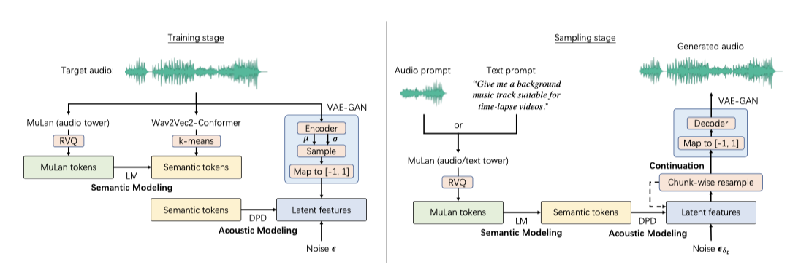
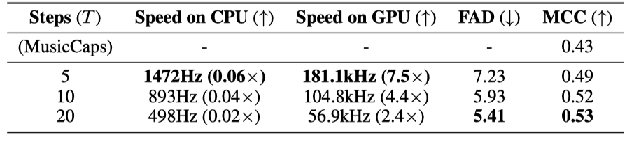

+++
author = "Kurt"
title = "MeLoDy"
date = "2024-05-14"
description = "Efficient Neural Music Generation"
categories = [
    "Paper Review"
]
tags = [
    "Audio",
    "Music Generation",
]
+++

## Abstract

본 논문은 최신 음악 생성 기술인 MusicLM의 작업량을 대폭 줄인 새로운 모델 MeLoDy를 제시한다. MusicLM의 의미론적 모델링을 기반으로, MeLoDy는 새로운 dual-path diffusion(DPD) 모델과 오디오 VAE-GAN을 활용하여 음악 오디오를 효율적으로 생성한다. 이를 통해 10초나 30초 길이의 음악 샘플링 시 전달 횟수를 각각 95.7% 또는 99.6%까지 줄이면서도 MusicLM과 동등한 품질의 음악을 생성할 수 있다. MeLoDy는 샘플링 속도의 향상과 무한 연속 생성 가능성을 제공하며, 음악성, 오디오 품질, 텍스트 연관성 면에서도 최고 수준을 달성한다.

---

## Introduction

최근 몇 년간 심층 생성 모델의 발전으로 음악 생성이 큰 관심을 받아왔다. 언어 모델(LMs)은 장기적 맥락에서의 복잡한 관계를 모델링하는 데 탁월하며, AudioLM과 같은 작업들이 이를 오디오 합성에 성공적으로 적용하였다. 또한, diffusion probabilistic 모델(DPMs)도 음성, 사운드, 음악 합성에서 뛰어난 능력을 보여주며 생성 모델 분야에서 주목받고 있다.

자유 형식 텍스트를 이용한 음악 생성은 다양한 음악 설명의 범위로 인해 도전적이다. MusicLM과 Noise2Music 같은 기존 모델들은 대규모 데이터셋 훈련을 통해 높은 충실도와 텍스트 프롬프트 준수로 최신 생성 성능을 보였지만, 큰 계산 비용이 발생한다. 반면, DPMs 기반 Moûsai는 고품질 음악 샘플링을 효율적으로 가능하게 했으나, 시연한 사례가 적고 다이내믹스가 제한적이었다. 인간 피드백을 고려한 인터랙티브한 음악 생성을 위해서는 높은 효율성을 가진 생성 모델이 필수적이다.

LMs와 DPMs의 장점을 결합하는 것에 초점을 맞춘 이 연구에서는, MusicLM의 최고 수준 LM인 의미적 LM을 활용하여 음악의 의미 구조를 모델링하고, DPMs의 비자동 회귀적 특성을 이용해 효율적으로 음향을 모델링한다. 이를 통해, 이 논문은 음악 생성 분야에 여러 새로운 기여를 제시한다.

1. MeLoDy는 LM-guided diffusion 모델로, MusicLM보다 훨씬 적은 반복으로 고품질 음악을 실시간보다 빠르게 생성한다.
2. dual-path diffusion(DPD) 모델은 의미 조건부 전략을 사용해 세밀한 음향 정보를 효율적으로 동시 모델링한다.
3. DPD의 새로운 샘플링 체계는 이전 방법보다 생성 품질을 개선한다.
4. 오디오 VAE-GAN은 연속적인 잠재 표현을 학습하고, DPD와 함께 고품질 오디오를 합성한다.

---

## Related Work

**Audio Generation** 음악 생성 모델들은 빠르게 고품질 음악을 생성할 수 있지만, 자유 형식 텍스트를 입력으로 사용할 수 없고 단일 장르에만 특화된다. Mubert와 Riffusion같은 산업계 음악 생성기도 있지만, MusicLM과 비교해 자유 형식 텍스트 처리에는 한계가 있다. 또한, AudioSet를 이용한 텍스트-투-오디오 합성기들은 자유 형식 텍스트로 음악을 생성할 수 있으나 음악성은 제한적이다. AudioLM은 조건 없이 피아노 오디오를 이어가며, SoundStorm은 non-autoregressive decoding을 통해 AudioLM을 가속화하여 빠른 속도로 음향을 생성한다. MeLoDy는 고품질 음향을 생성하기 위해 5에서 20회의 전방 패스가 필요하다.

**Network Architecture** 제안한 DPD 구조는 오디오 분리에 사용된 이중 경로 네트워크에서 영감을 받았고, Luo 등이 제시한 세분화 기반 처리 아이디어로 인해 여러 최신 연구가 진행되었다. 확산 모델의 목표가 소스 분리의 특별한 경우로 볼 수 있기에, 이 이중 경로 구조는 대략적이고 세밀한 음향 모델링을 동시에 가능하게 한다.

---

## Background on Audio Language Modeling

### Audio Language Modeling with MusicLM

MusicLM은 AudioLM의 오디오 언어 모델링 접근 방식을 따라, 오디오 합성을 다양한 정밀도의 오디오 토큰을 사용한 언어 모델링으로 본다. 이 모델에서는 오디오를 대표하기 위해 두 가지 토큰화 방식을 사용한다.

* **Semantic Tokenization:** SSL에서 나온 표현들에 대한 K-means, e.g., w2v-BERT
* **Acoustic Tokenization:** Neural audio codec, e.g., SoundStream

AudioLM은 음향 토큰의 계층 구조를 효과적으로 다루기 위해 모델링을 거친 단계와 미세 단계로 나누며, 이를 통해 세 가지 언어 모델링 작업을 정의한다: semantic 모델링, coarse acoustic 모델링, fine acoustic 모델링.

조건 토큰 시퀀스 $c_1:T_{cnd}$ 와 대상 토큰 시퀀스 $u_1:T_{tgt}$ 를 정의한 후, 각 모델링 작업에서 θ로 매개변수화된 Transformer-decoder는 autoregressive 모델링 문제를 해결하려고 한다.

$$ p_θ(u_1:T_{tgt} | c_1:T_{cnd}) = \Pi_{j=1}^{T_{tgt}} p_θ (u_j | [c_1, ..., c_{T_{cnd}}, u_1, ..., u_{j−1}]) $$

AudioLM은 조건 토큰을 대상 토큰에 접두사로 붙이며, semantic 모델링에는 조건이 없고, coarse acoustic 모델링은 semantic 토큰, fine acoustic 모델링은 coarse acoustic 토큰을 조건으로 사용한다. 이 언어 모델들은 실제 토큰으로 병렬 학습이 가능하지만, 추론 시에는 순차적 샘플링이 필요하다.

#### Joint Tokenization of Music and Text with MuLan and RVQ

MusicLM은 오디오 전용 학습의 장점을 보존하기 위해, 대규모 음악 데이터와 약하게 연관된 자유 형식 텍스트에 개별적으로 학습 가능한 두 탑 구조의 오디오-텍스트 임베딩 모델인 MuLan에 의존한다. MuLan은 음악 오디오와 텍스트 설명을 같은 임베딩 공간으로 사전 학습시키며, MusicLM에서는 이 임베딩을 residual vector quantization(RVQ)로 토큰화한다.

MusicLM은 AudioLM과 달리 MuLan 토큰을 접두사로 사용하여 semantic 및 coarse acoustic 모델링을 수행한다. 학습 시, 오디오는 MuLan 음악 타워를 통해 임베딩되고, 이후 RVQ를 통해 MuLan 토큰으로 변환된다. 이 토큰들은 semantic과 coarse acoustic 모델을 조건화한다. 텍스트 프롬프트로 음악을 생성할 때는 MuLan 텍스트 타워에서 얻은 임베딩이 RVQ를 통해 토큰화되며, 이를 바탕으로 고해상도 음악 오디오가 생성된다.

---

## Model Description

MeLoDy는 representation 학습을 위해 MuLan, Wav2Vec2-Conformer, 오디오 VAE 세 모듈과, semantic 및 음향 모델링을 위해 language model(LM)과 dual-path diffusion(DPD) 모델을 사용한다. 음악의 semantic 구조를 모델링하기 위해 LM을 활용하며, MuLan 모델을 사전 학습하여 조건 토큰을 얻고, semantic 토큰화에는 컨포머 블록을 사용하는 Wav2Vec2-Conformer를 사용한다.

### Dual-Dath Diffusion: Angle-Parameterized Continuous-Time Latent Diffusion Models

제안된 dual-path diffusion (DPD) 모델은 연속 시간에서의 diffusion probabilistic 모델(DPMs)의 변형으로, 저차원 잠재 표현을 사용하여 DPMs의 계산 부담을 줄인다. 이 모델은 사전 학습된 오토인코더를 활용해 원시 데이터를 잠재 공간에서 재구성한다.

DPD에서는 가우시안 diffusion 과정 $z_t$를, 연속 미분 가능한 함수 $α_t$와 $σ_t$에 의해 정의한다. 이 과정에서 $α_t = cos(πt/2)$, $σ_t = sin(πt/2)$로 설정함으로써 삼각 함수의 좋은 성질을 활용한다. 이를 통해 $σ_t$는 variational을 유지하며($√1 − α_t^2$), $z_t$는 각도 $δ$를 사용하여 re-parameterized될 수 있다.

$$ z_δ = cos(δ) z + sin(δ) ϵ \ \text{for any} \ δ ∈ [0, π/2], \ ϵ ∼ N(0, I) $$

$δ$가 $0$에서 $π/2$로 증가함에 따라 $z_δ$의 노이즈가 증가하는 것이 순방향 diffusion 과정을 정의한다.

샘플 생성을 위해, θ-parameterized된 variational 모델을 이용하여 diffusion 과정을 역방향으로 실행시킨다. $π/2$를 T 단계로 나누어 $z_{π/2}$에서 $z$를 샘플링한다.

$$ p_θ (z | z_{π/2}) = \int_{z_{δ_{1:T-1}}} \Pi_{t=1}^{T} p_θ (z_{δ_t − ω_t} | z_{δ_t}) dz_{δ_{1:T−1}}, \ \ δ_t = \begin{cases} {{π}\over{2}} − \sum_{i=t+1}^T ω_i, & 1 \leq t < T \\\ {{π}\over{2}}, & t = T \end{cases} $$

각도 일정은 $ω_1, ..., ω_T$로 표현되며, 합이 $π/2$가 된다. Schneider et al.은 모든 $t$에 대해 $ω_t = π/2T$인 균일 일정을 제안하였다. 샘플링 초반에 큰 단계를 취하고 이후 작은 단계를 취하는 것이 샘플 품질을 개선할 수 있음이 밝혀졌다. 이에 따라, 더 안정적이고 고품질의 결과를 제공하는 새로운 선형 각도 일정을 설계하였다.

$$ ω_T = {{π}\over{6T}} + {{2πt}\over{3T(T+1 )}} $$

#### Multi-Chunk Velocity Prediction for Long-Context Generation

모델 학습에서 신경망은 다양한 노이즈 스케일을 가진 $M$개 청크로 이루어진 멀티-청크 타겟 $v_{tgt}$ 예측을 맡는다. 이는 오디오 잠재 변수의 길이 $L$과 잠재 차원 $D$를 포함하는 $z$, $z_δ$, $ϵ$에 기반하여, $v_{tgt}$을 $v_1 ⊕ ··· ⊕ v_M$으로 정의한다.

$$ v_m := cos(δ_m) ϵ [L_{m−1}: L_m, :] − sin(δ_m) z [L_{m−1}: L_{m}, :], L m := \big\lfloor {{mL}\over{M}} \big\rfloor $$

NumPy 슬라이싱 구문을 사용해 $m$번째 청크를 찾고, 학습마다 $δ_m ∼ Uniform[0, π/2]$으로 노이즈 스케일을 결정한다. $θ$ 학습엔 [1, 48] 범위의 MSE 손실을 사용한다.

$$ L_{diff} := \mathbb{E}_{z, ϵ, δ_1, ..., δ_M} \big[ \parallel v\_{tgt} − \hat{v}_θ (z\_{noisy} ; c) \parallel_2^2 \big], $$

$$ z_{noisy} := cos(δ_m) z [L_{m−1} : L_m, :] + sin(δ_m) ϵ [L_{m−1}: L_m, :], $$

MeLoDy에서는 학습 중 SSL 모델로부터 얻은 의미 토큰들과 추론 시 LM에 의해 생성된 토큰들을 사용하여 DPD 모델을 조건화한다. 실험을 통해, 토큰 기반 조건을 사용하여 음악의 의미를 제어하고 diffusion 모델이 각 토큰의 임베딩을 학습하게 함으로써 생성 안정성이 크게 개선됨을 확인하였다. 추가적으로, 멀티-청크 예측 지원을 위해 $M$ 청크의 각도를 나타내는 벡터를 조건에 추가한다.

$$ c := \lbrace u_1, ..., u_{TST}, δ \rbrace, δ := [δ_1]_{r=1}^{L_1} ⊕ ··· ⊕ [δ_M]\_{r=1}^{L_M} \in \mathbb{R}^L $$

스칼라 $a$를 B번 반복해 B길이 벡터를 만드는 연산을 설명한다. 삼각함수의 정체성을 적용한 DDIM 샘플링을 통해 간소화된 업데이트 규칙을 도출한다.

$$ z_{δ_t − ω_t} = cos(ω_t) z_{δ_t} − sin(ω_t) \hat{v}_θ (z\_{δ_t} ; c), $$

$t = T$에서 $t = 1$까지 실행하여 $z$ 샘플을 획득한다.

#### Dual-Path Modeling for Efficient and Effective Velocity Prediction

잡음이 섞인 잠재 변수와 조건을 통합해 효과적인 속도 예측을 위한 의미 토큰을 사용하는 $\hat{v}_θ$의 방법을 소개하며, 오디오 분리에서 영감을 받은 수정된 이중 경로 기술과 함께 새로운 효율적인 음향 모델링 아키텍처를 제안한다. 

먼저, DPD에서 조건이 어떻게 처리되는지를 설명한다.

**Encoding Angle Vector** 잠재 변수의 프레임 노이즈 스케일 $δ ∈ \mathbb{R}^L$을 인코딩할 때, 위치 인코딩 대신 두 학습 가능한 벡터 $e_{start}, e_{end} ∈ \mathbb{R}^{256}$을 이용한 Slerp 유사 구면 보간을 사용한다.

$$ E_δ := MLP (sin(δ) ⊗ e_{start} + sin(δ) ⊗ e_{end} ) ∈ \mathbb{R}^{L×D_{hid}} , $$

MLP(x)는 RMSNorm과 GELU 활성화를 통해 입력 $x$를 은닉 차원 $\mathbb{R}^{D_{hid}}$로 변환한다. 여기서 $W_1, W_2, b_1, b_2$는 학습 가능한 parameter이다.

**Encoding Semantic Tokens** 의미 정보를 나타내는 이산 토큰들은 벡터의 조회 테이블을 사용해 실수 벡터로 변환된다. Wav2Vec2-Conformer의 클러스터 수에 해당하는 어휘 크기를 기반으로 한다. 이 토큰들을 시간 축에 따라 쌓고 MLP를 적용하여 최종적으로 $E_{st} ∈ \mathbb{R}^{T_{ST} \times D_{hid}}$를 얻는다.

조건 임베딩이 주어졌을 때, $z_{noisy}$(학습 시) 또는 $z_{δ_t}$(추론 시) 입력은 먼저 선형 변환 및 각도 임베딩과의 합을 거쳐 처리된다. 이후 이중 경로 처리를 위한 분할이 이루어진다.

**Segmentation** 분할 모듈은 2차원 입력을 $K$ 길이의 $S$개 반중복 세그먼트로 나누어 3차원 텐서 $H$로 표현한다. 이는 시퀀스 처리 길이를 sub-linear(O(√L))로 줄여 전체 시퀀스 처리의 학습 난이도를 감소시키고, MeLoDy가 더 높은 빈도의 잠재 요소를 활용할 수 있게 한다.

**Dual-Path Blocks** 분할 후, $N$개의 이중 경로 블록을 위한 3차원 텐서 입력을 얻는다. 각 블록은 세그먼트 간 처리를 위한 거친 경로와 세그먼트 내 처리를 위한 세밀한 경로의 두 단계를 포함한다. 거친 경로 처리에는 Roformer 네트워크를, 세밀한 경로 처리에는 bi-directional RNN을 사용한다. 이 과정은 오디오 구조의 세밀한 세부 사항을 더 잘 재구성하기 위함이다. 각 처리 단계는 self-attention 및 cross-attention layer, 그리고 feature-wise linear modulation(FiLM)를 통해 노이즈 제거를 개선한다.

**Coarse-Path Processing** 이중 경로 블록에서는 거친 경로를 먼저 병렬로 처리한다.

$$ \mathbb{H}_{c-out}^{(i)} := \text{RepeatSegments} \big( \big[ \text{Roformer} \big( \text{MergeSegments} \big( \mathbb{H}^{(i)} \big) [:, k, :] \big), k = 0, ..., K\_{MS}^{(i)} − 1 \big] \big) $$

이중 경로 블록에서 거친 경로 출력은 $\mathbb{H}^{(i)}$와 동일한 형태를 가지며, 세그먼트를 압축하고 확장하는 MergeSegments와 RepeatSegments 연산을 통해 세그먼트 간 정보를 집계한다. 병합은 열을 평균내어 수행되고, $K_{MS}^{(i)}$ 정의는 블록 인덱스에 따라 텐서의 폭을 변화시킨다. 이는 중간 블록에서 가장 짧고 양 끝에서 가장 긴 세그먼트를 생성된다. 원래 길이를 유지하기 위해 Roformer에서 도입된 반복 연산이 사용된다.

**Fine-Path Processing** fine-path input $\mathbb{H}\_{f-in}^{(i)}$은 RMSNorm $\big( \mathbb{H}^{(i)} + \mathbb{H}_{c-out}^{(i)} \big)$로 얻어지며, 행을 병렬로 처리하는 두 층의 SRU에 입력된다.

$$ \mathbb{H}_{f-out}^{(i)} := \big[ \text{FiLM} \big( \text{SRU} \big( \mathbb{H}\_{f-in}^{(i)} [s, :, :] \big), E_δ \big[ {{sL}\over{S}}, : \big] + {{1}\over{T\_{ST}}} \sum\_{t=0}^{T\_{ST} - 1} E\_{ST} [t, :] \big), s=0, ..., S - 1 \big] $$

FiLM(x, m)은 입력 $x$와 변조 조건 $m$에 대해 브로드캐스트 곱셈을 적용하는 함수이다. 다음 이중 경로 블록의 입력은 $\mathbb{H}^{(i+1)} := RMSNorm( \mathbb{H}\_{f-in}^{(i)} + \mathbb{H}\_{f-out}^{(i)})$으로 정의되며, $N$개의 이중 경로 블록을 처리한 후 3차원 텐서는 중첩-더하기 방식으로 2차원 행렬로 변환된다. 최종적으로, 예측된 속도가 얻어진다.

$$ \hat{v}\_θ (z_{noisy}; c) := \text{RMSNorm} \big( \text{OverlapAdd} \big( \mathbb{H}^{(N+1)}) \big) \big) W_{out} $$

$W_{out} ∈ \mathbb{R}^{D_{hid} × D}$는 학습 가능한 parameter이다.

### Audio VAE-GANs for Latent Representation Learning

Rombach et al. 은 latent diffusion 모델(LDMs)을 위한 KL-regularized 이미지 오토인코더를 통해 고품질 이미지 생성의 안정성을 입증하였다. 이 오토인코더는 VAE와 유사하게 KL 패널티를 부과하지만, GAN처럼 적대적으로 학습된다. 이를 VAE-GAN이라 부르며, 이미지 생성에 유망하지만 오디오 파형에 대한 성공적인 방법은 부족하다. 이 연구에서는 DPD 모델에 적용 시 현저한 안정성을 보인 오디오 VAE-GAN을 제안한다.

오디오 VAE-GAN은 24kHz 오디오 재구성을 위해 스트라이딩 요소 96을 사용하여 250Hz 잠재 시퀀스를 생성한다. 디코더는 HiFi-GAN 구조를 따르고, 인코더는 업샘플링 대신 컨볼루션 기반 다운샘플링을 적용한다. adversarial 학습에는 다기간 및 다해상도 스펙트로그램 discriminator를 사용한다. diffusion 모델의 정상 범위와 일치시키기 위해 인코더 출력은 [-1, 1] 범위로 매핑되며, 이는 극단적인 값을 0.1% 미만으로 걸러내는 역할을 한다.

### Music Inpainting, Music Continuation and Music Prompting with MeLoDy

제안된 MeLoDy는 임의의 노이즈 조작을 통해 오디오 inpainting(interpolation)과 오디오 continuation(extrapolation)을 지원한다. diffusion 모델이 오디오 inpainting에는 성공적이었지만, 비자기회귀적 특성 때문에 오디오 continuation에는 어려움이 있었다. MeLoDy는 또한 MuLan을 기반으로 비슷한 스타일의 음악을 생성하는 음악 프롬프트 기능을 제공한다. 

---

## Experiments

### Experimental Setup

**Data Preparation** MeLoDy는 보컬 없는 음악에 초점을 맞춘 257k시간의 음악 데이터로 학습되었으며, ChatGPT를 사용하여 태그 기반의 텍스트를 음악 캡션으로 확장하였다. 이는 195.3M MuLan 학습에 활용되어, 오디오마다 캡션 또는 태그를 무작위로 연결함으로써 모델의 자유 형태 텍스트 처리 능력을 향상시켰다.

**Semantic LM** 429.5M LLaMA 모델을 사용하여 음악LM과 유사한 parameter를 가진 의미론적 모델링을 진행하였다. MuLan RVQ를 통해 12개의 접두사 토큰을 생성하였고, 199.5M Wav2Vec2-Conformer에서 얻은 25Hz 임베딩을 1024-중심 k-means로 이산화하여 10초 길이의 의미론적 토큰을 학습 목표로 설정하였다.

**Dual-Path Diffusion** DPD 모델은 숨겨진 차원 768, 블록 수 8로 설정해 총 296.6M parameter를 가진다. 10초 길이 입력을 L=2500으로 나누어 M=4 부분으로 청킹하고, K=64 크기의 세그먼트로 S=80 세그먼트를 생성하였다. 샘플과 조건 간 일치를 개선하기 위해 분류자 없는 지도를 적용하고, 학습 중에는 교차 주의를 자기 주의로 0.1 확률로 대체한다. 샘플링은 예측 속도를 선형 결합하며, 모든 생성에는 2.5 스케일의 분류자 없는 지도가 사용된다.

**Audio VAE-GAN** 오디오 VAE-GAN은 96의 홉 사이즈로 24kHz 음악 오디오를 250Hz의 잠재 시퀀스로 인코딩하였다. 잠재 차원 D는 16이며, 총 압축율은 6배입니다. 인코더는 256개의 숨겨진 채널을, 디코더는 768개를 사용한다. 전체적으로, 오디오 VAE-GAN은 100.1M의 parameter를 포함한다.

### Performance Analysis

**Objective Metrics** 생성된 오디오와 MusicCaps 참조 오디오 사이의 Frećhet audio distance(FAD)를 통해 생성 품질을 대략적으로 측정하고, 사전 학습된 MuLan을 사용한 MuLan cycle consistency(MCC)으로 텍스트와 오디오의 상관성을 평가한다.

**Inference Speed** 제안한 MeLoDy의 샘플링 효율성을 평가한 결과, 단 5개의 샘플링 단계로도 참조 세트보다 높은 MCC 점수를 달성하였다. 이는 생성된 샘플이 MusicCaps 캡션과 더 관련이 깊고, 제안된 DPD가 기존 LMs보다 훨씬 낮은 비용으로 효과적으로 작동함을 의미한다.

**Comparisons with SOTA models** MeLoDy는 대규모 음악 데이터셋에서 학습된 MusicLM과 Noise2Music과 비교하여 평가되었다. 동일한 텍스트 프롬프트를 사용하여 7명의 음악 프로듀서가 음악성, 오디오 품질, 텍스트 연관성 측면에서 평가하였다. 총 777번의 비교를 통해 1,554개의 평가가 수집되었다. 결과적으로, MeLoDy는 음악성과 텍스트 연관성에서 MusicLM과 Noise2Music과 유사한 성능을 보였으며, 오디오 품질에서는 두 모델을 모두 능가하였다(p < 0.05, p < 0.01). 또한, MeLoDy는 MusicLM과 Noise2Music에 비해 훨씬 적은 NFEs를 사용하여 효율성을 입증하였다.

**Diversity Analysis** diffusion 모델의 특징인 높은 다양성을 검증하기 위해, MeLoDy는 감정이나 시나리오 등의 텍스트 프롬프트에 기반한 생성 다양성과 유효성을 평가하는 추가 실험을 수행하였다. 데모 페이지에 공개된 샘플 결과에서는 다양한 악기와 질감의 조합을 확인할 수 있었다.

**Ablation Studies** 제안된 방법의 두 측면에 대한 연구에서, 적은 샘플링 단계에서 음향 문제를 줄이는 효과적인 일정을 제안했고, dual-path 구조가 signal-to-noise ratio(SNR) 개선에서 다른 LDM 구조보다 우수함을 입증하였다.

---

## Discussion

**Limitation** 비자연적인 보컬 방지를 위해 주로 무보컬 음악을 포함한 학습 데이터로 인해 프롬프트 범위가 제한되며, 학습 말뭉치는 팝과 클래식에 약간 편향되어 있다. 또한, 10초 세그먼트로 학습함으로써 긴 생성물의 다이내믹스가 제한된다.

**Broader Impact** 음악 프로듀서, 콘텐츠 크리에이터, 일반 사용자 모두가 낮은 진입 장벽으로 창의력을 자유롭게 표현할 수 있는 음악 창작 도구로 큰 가능성을 지닌다고 믿는다. MeLoDy는 인간의 피드백을 반영하는 상호작용적 창작을 지원하며, LoRA 기술을 통해 음악 스타일의 정밀 조정이 가능하다.

---

## Reference

* [Paper](https://arxiv.org/pdf/2305.15719)
* [Demo](https://efficient-melody.github.io/)