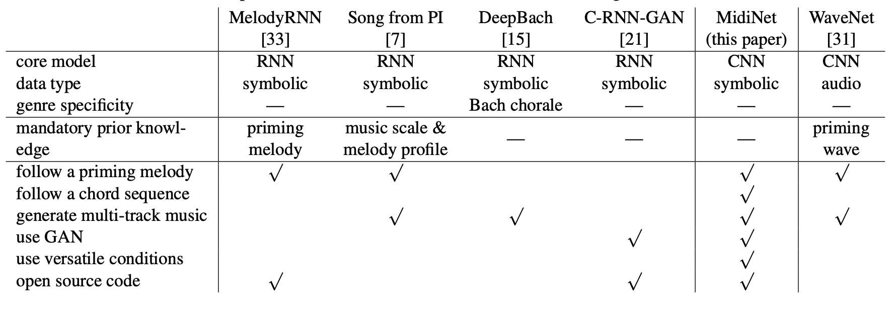
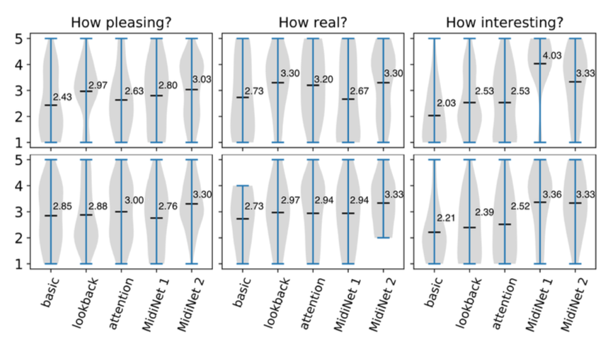

+++
author = "Kurt"
title = "MidiNet"
date = "2024-09-30"
description = "A Convolutional Generative Adversarial Network for Symbolic-domain Music Generation"
categories = [
    "Paper Review"
]
tags = [
    "Audio",
    "Music Generation",
]
+++

## Abstract

대부분의 음악 생성 신경망 모델은 순환 신경망(RNN)을 사용하지만, DeepMind의 WaveNet 모델은 합성곱 신경망(CNN)도 현실적인 음악 파형을 생성할 수 있음을 보여준다. 이에 따라 CNN을 사용해 상징적 도메인에서 멜로디를 한 마디씩 생성하는 방법을 조사하였다. 판별기를 포함한 생성적 적대 신경망(GAN)을 통해 멜로디 분포를 학습하며, 코드 진행이나 이전 마디의 멜로디를 조건으로 사용할 수 있는 새로운 조건부 메커니즘을 제안한다. 결과적으로 생성된 MidiNet 모델은 여러 MIDI 채널을 지원하며, 사용자 연구를 통해 MidiNet과 Google의 MelodyRNN 모델이 생성한 8마디 멜로디를 비교한 결과, MidiNet의 멜로디가 더 흥미롭고 쾌적하다는 평가를 받았다.

---

# Introduction

알고리즘적 작곡은 1959년에 시작되었고, 1989년부터 신경망을 활용한 음악 생성이 이루어졌다. 최근 몇 년 동안 딥 뉴럴 네트워크가 대규모 데이터를 학습하며 음악 생성에서 주목을 받았고, 그에 따른 모델들이 많이 제안되었다.

대부분의 음악 생성 신경망 모델은 순차적인 생성 과정에 적합한 순환 신경망(RNN)을 사용하며, 이전 이벤트 정보를 바탕으로 현재 이벤트를 생성한다. 예시로는 기호적 도메인 생성을 위한 MelodyRNN과 오디오 도메인 생성을 위한 SampleRNN이 있다.

딥 컨볼루션 신경망(CNN)을 사용한 음악 생성 시도는 적지만, WaveNet 모델은 오디오 도메인에서 현실적인 음악 생성을 보여주었으며, CNN이 RNN보다 학습 속도와 병렬화에서 유리함을 시사한다.

본 논문에서는 멜로디 생성을 위한 CNN 기반 모델을 제안하며, 멜로디를 연속적으로 생성하는 대신 한 마디씩 순차적으로 생성하는 방식을 사용한다. 이를 통해 각 마디의 음표 존재를 나타내는 2D 행렬에 컨볼루션을 적용할 수 있다.

이 연구에서는 생성자 CNN에 랜덤 노이즈를 입력하여 이를 2D 악보 형태로 변환한다. 이 변환은 전치 컨볼루션을 사용하여 이루어지며, 판별자 CNN은 이 표현이 실제 MIDI인지 생성된 것인지를 예측한다. 이는 생성적 적대 신경망(GAN)을 구성하며, 생성자와 판별자는 미니맥스 이론에 따라 반복적으로 학습된다.

이 GAN은 마디 간 시간적 의존성을 고려하지 않으므로, 이전 마디의 정보를 사용해 현재 마디를 생성하는 새로운 조건부 메커니즘을 제안한다. 이를 위해 conditioner CNN을 학습시켜 이전 마디의 정보를 생성자 CNN에 통합하며, RNN 없이도 임의의 개수의 마디를 생성할 수 있다.

이 연구의 모델은 랜덤 노이즈를 입력으로 사용하여 멜로디를 처음부터 생성할 수 있으며, conditioner CNN을 통해 사전 지식을 활용하여 코드 진행이나 프라이밍 멜로디에 따라 음악을 생성한다. 같은 프라이밍 멜로디로도 매번 다른 결과를 생성할 수 있다.

이 모델은 다양한 조건을 사용해 다양한 음악을 생성할 수 있으며, feature matching을 통해 조건이 결과에 미치는 영향을 제어한다. 또한, 텐서를 처리하여 다채널 MIDI와 여러 트랙을 생성할 수 있다. 이 고도로 적응 가능한 모델 구조는 RNN 대안으로 유용할 수 있으며, 이를 MidiNet이라고 부른다.

우리 실험에서는 MidiNet과 MelodyRNN 모델이 생성한 8마디 멜로디를 비교하였다. MidiNet의 유연성을 보여주기 위해, 코드 진행을 추가하거나 다른 아키텍처를 사용한 두 가지 설정을 실험하였다.

---

## Related Work

최근 음악 생성을 위한 딥 뉴럴 네트워크 모델들이 제안되었다. 이 모델들은 프라이밍 음표에 따라 멜로디나 오디오 파형을 생성하거나, 멜로디에 다른 파트를 동반하거나, 인간과 듀엣을 연주하는 방식이다.

Google Brain의 Magenta 프로젝트에서 제안한 MelodyRNN 모델은 신경망을 이용한 음악 생성의 유명한 예로, 세 가지 RNN 모델이 있으며, lookback RNN과 attention RNN이 포함된다. 이 모델들의 소스 코드와 사전 훈련된 모델은 공개되어 있으며, 프라이밍 멜로디를 기반으로 멜로디 시퀀스를 생성하는 기능을 갖추고 있어, 본 연구에서는 MelodyRNN을 평가 기준선으로 사용한다.

Song from PI는 RNN을 사용해 멜로디, 드럼, 코드를 생성하여 다중 트랙 팝 송을 만든다. 하지만 음악적 스케일과 멜로디 프로필에 대한 사전 지식이 필요하며, 이는 MidiNet과 다른 모델들에서는 요구되지 않는다.

DeepBach는 J. S. Bach 스타일의 4부 합창 음악 작곡을 위한 RNN 모델로, 리듬, 음표, 코드 등 사용자 정의 제약 조건을 적용할 수 있다.

C-RNN-GAN은 GAN을 사용해 다양한 멜로디를 생성하지만, 프라이밍 멜로디나 코드 시퀀스를 따른 음악 생성을 위한 조건부 메커니즘이 부족하다.

WaveNet은 음성 및 음악의 원시 파형을 생성하는 CNN 기반 모델로, 이 논문에서는 기호적 도메인 생성에 집중한다.

---

## Methods

### Symbolic Representation for Convolution

우리 모델은 MIDI 파일을 마디로 나누어 음악을 기호적으로 표현하며, 음표 이벤트는 h × w 크기의 행렬로 나타낸다. 여기서 h는 음표 수, w는 시간 단계를 의미한다. 멜로디 생성 시 각 시간 단위당 하나의 활성 음표만 존재하며, 속도를 생략하면 이진 행렬을 사용한다. 다중 트랙 음악은 여러 행렬로 생성할 수 있다.

이 표현 방식은 긴 음표와 짧은 반복 음표를 구별하기 어렵다. 향후 음표 시작을 강조하는 확장이 필요하다.

### Generator CNN and Discriminator CNN

MidiNet은 수정된 DCGAN을 기반으로, 판별기 D와 생성기 G가 서로 학습하여 실제와 생성된 데이터를 구별하거나 속이는 방식으로 작동한다. 입력은 랜덤 노이즈 벡터 z이고, 출력은 생성된 h × w 행렬 X이다.

$$
\min_G \max_D V(D, G) = \mathbb{E}\_{\mathbf{x} \sim p_{\text{data}}(\mathbf{x})} [\log D(\mathbf{x})] + \mathbb{E}\_{\mathbf{z} \sim p_{\mathbf{z}}(\mathbf{z})} [\log(1 - D(G(\mathbf{z})))]
$$

$X∼p_{data}(X)$는 실제 데이터 샘플링, $z∼p_z(z)$는 랜덤 분포 샘플링을 의미한다. 일반적인 GAN에서는 생성자(G)와 판별자(D)를 반복 훈련하여 G를 점진적으로 개선한다.

판별자(D)는 여러 합성곱 층과 완전 연결층으로 구성된 CNN이다. 교차 엔트로피 손실 함수를 사용해 최적화되며, 실제 데이터(X)에는 출력을 1에 가깝게, 생성된 데이터(G(z))에는 0에 가깝게 한다. 출력층에서는 시그모이드 뉴런을 사용해 출력을 [0, 1] 범위로 제한한다.

반면, 생성자 CNN의 목표는 생성된 데이터에 대해 D의 출력을 1에 가깝게 만드는 것이다. 이를 위해 벡터 z를 행렬 X로 변환하는데, 먼저 몇 개의 완전 연결층을 사용한 후, 전치 합성곱(transposed convolution) 층으로 업샘플링한다.

미니맥스 게임의 특성으로 인해 GAN 훈련은 불안정성과 모드 붕괴 문제에 직면한다. 이를 개선하기 위해 우리는 피쳐 매칭과 일면 레이블 스무딩 기법을 적용한다. 피쳐 매칭은 추가 L2 정규화 항을 통해 실제 데이터와 생성된 데이터의 분포를 가깝게 만드는 방법이다. G 학습 시 다음 두 항을 추가한다:

$$ \lambda_1 \left\| E[X] - E[G(z)] \right\|_2^2 + \lambda_2 \left\| E[f(X)] - E[f(G(z))] \right\|_2^2, $$

여기서 $f$는 판별자의 첫 번째 합성곱 층이며, $\lambda_1$과 $ \lambda_2 $는 경험적으로 설정하는 파라미터이다.

### Conditioner CNN

GAN 기반 이미지 생성에서는 벡터를 사용해 조건을 부여하는 사전 지식을 인코딩할 수 있다. 길이가 n인 조건 벡터를 중간 층에 추가하기 위해 값을 복제해 모양을 맞춘 후, 중간 층에 결합한다. 이를 1차원 조건(1-D conditions)이라고 한다.

GAN에서 생성 결과가 h-by-w 행렬일 때, 각 항목에 조건을 부여하면 편리하다. 예를 들어, 이전 마디의 멜로디를 h-by-w 행렬로 표현해 현재 마디의 생성에 조건으로 사용할 수 있다. 이러한 조건 행렬은 D의 입력층에 추가해 전체 층에 영향을 줄 수 있으며, G에서는 조건 행렬을 작은 벡터로 변형해 중간 층에 포함시키는 메커니즘이 필요하다.

생성기 CNN의 반대 역할을 하는 조건부 CNN을 사용해 이 목표를 달성하고자 한다. 조건부 CNN은 입력 h-by-w 조건 행렬을 몇 개의 합성곱 층으로 처리하며, 생성기 CNN과 동일한 필터 모양을 사용해 출력이 서로 호환되는 형태를 갖도록 한다. 이를 통해 조건부 CNN의 출력과 생성기 CNN의 대응 층을 연결해 생성 과정에 영향을 줄 수 있다. 학습 시에는 동일한 경사를 공유하며 조건부 CNN과 생성기 CNN을 동시에 학습한다.

### Tunning for Creativity

MidiNet의 창의성과 규칙성 균형을 위해 두 가지 방법을 제안한다. 첫째, G의 일부 층에만 조건을 적용해 더 자유롭게 하고, 둘째, λ1과 λ2 값을 높여 생성 음악이 기존 음악과 더 유사하도록 한다.

---

## Implementation

### Dataset

이 논문에서는 멜로디 생성을 위해, 각 파일에 멜로디 채널이 명확히 지정된 MIDI 데이터셋이 필요하다. 이를 위해 TheoryTab에서 멜로디와 코드 채널을 가진 팝 음악 1,022개의 MIDI 탭을 수집하였다. 이를 통해 코드 없이 멜로디 채널만 학습하는 버전과 코드로 조건화하여 멜로디를 생성하는 두 가지 MidiNet 버전을 구현할 수 있다.

24개의 기본 코드 삼화음 외의 코드를 포함한 MIDI 탭을 제외하고, 나머지 탭을 8마디씩 분할한 후, 멜로디와 코드 채널을 별도로 전처리하였다.

멜로디는 16분음표를 기본 단위로 설정하고, 두 옥타브(C4-B5)로 조정하며, 음표 속도는 무시하였다. 전처리 후 24개의 음표만 사용하지만, 모든 128개의 MIDI 음표를 고려해 모델 붕괴를 감지할 수 있게 하였다. 데이터에 쉼표가 없어 침묵 차원은 필요하지 않아 h=128이다.

코드는 13차원 표현을 사용하여 첫 12차원은 키, 마지막 차원은 코드 유형을 나타내며, 각 마디당 하나의 코드만 존재하도록 정리하였다.

전처리 후 526개의 MIDI 탭이 남았고, 데이터 증강을 위해 멜로디와 코드를 12개의 키로 원형 이동시켜 최종적으로 50,496 마디의 데이터셋을 생성하였다.

### Network Specification

이 연구의 모델은 TensorFlow로 구현되었으며, 생성기는 100 길이의 랜덤 벡터를 입력받아 두 개의 완전 연결층을 거친 후 1-by-2 행렬로 재구성된다. 그 후 네 개의 전치 합성곱 층을 사용한다. 조건기는 네 개의 합성곱 층으로, 첫 번째 층은 128-by-1 필터를, 나머지 층은 1-by-2 필터를 사용한다. 생성기 마지막에 가장 높은 활성화 값을 가진 노트만 출력하는 층을 추가하였다.

기울기 소실 문제를 방지하기 위해, 첫째, 생성기와 조건기는 두 번 업데이트하고 판별기는 한 번만 업데이트하였다. 둘째, 판별기는 두 개의 합성곱 층과 하나의 완전 연결층만 사용하였다.

MidiNet의 다른 파라미터들을 미세 조정하고, 실험에서 다음의 세 가지 변형을 고려하였다.

#### Model 1: Melody generator, no chord condition

이 변형은 이전 마디의 멜로디를 사용하여 현재 마디를 생성한다. G와 조건기 CNN의 합성곱 층에서 필터 수를 256으로 설정하고, λ1과 λ2는 각각 0.1과 1로 설정하였다. D는 2D 조건 없이 실제와 생성된 멜로디를 구별한다.

학습 단계에서는 빈 마디를 추가한 후, 두 개의 연속된 마디를 샘플링하여 첫 번째 마디를 실제 데이터로, 두 번째 마디를 2D 조건으로 사용하였다. 학ㅂ 후, G는 첫 번째 마디는 실제 멜로디로 시작하고, 이후 생성된 멜로디를 조건으로 삼아 8마디를 생성하였다.

#### Model 2: Melody generator with chord condition, stable mode

이 변형은 코드 채널을 사용하여, 현재 마디의 코드를 1D 조건으로 멜로디를 생성한다. 즉, 모델이 주어진 코드 진행에 맞는 멜로디를 생성한다.

코드 조건을 강조하기 위해, G의 마지막 전치 합성곱 층에서만 2D 조건을 사용하고, 나머지 층과 D의 입력에는 1D 코드 조건을 사용하였다. λ1=0.01, λ2=0.1로 설정하고, G의 전치 합성곱 층에 128개의 필터, 조건기 CNN에 16개의 필터를 사용하였다. 이로 인해 멜로디 생성기가 코드 진행을 따르며 안정적이고 코드 제약을 잘 준수한다.

#### Model 3: Melody generator with chord condition, creative mode

이 변형은 G의 모든 전치 합성곱 층에 2D 조건을 추가해 더 창의적인 멜로디 생성기를 만든다. 이로 인해 G가 코드 제약을 위반해 이전 마디의 멜로디를 따를 수 있으며, 때때로 불쾌하지만 창의적인 결과를 생성한다. 이 모델은 멜로디를 여러 번 들은 후 선택해야 하지만, 인간 작곡가에게 영감을 줄 수 있다.

---

## Experimental Result

생성된 결과의 미적 품질을 평가하기 위해 21명의 참가자와 연구를 진행하였다. 이 중 10명은 음악 이론을 이해하고 아마추어 음악가로 활동한 경험이 있어 전문가로 분류했다.

MidiNet을 Google Magenta의 세 가지 MelodyRNN 모델(기본 RNN, 룩백 RNN, 어텐션 RNN)과 비교하였다. 학습 데이터에서 100개의 프라이밍 멜로디를 선택하여 8마디 길이의 멜로디를 생성하게 하였다. 사용자 연구에서는 MelodyRNN과의 비교를 위한 모델 1과 코드 사용 효과를 탐구하는 모델 2를 고려했으며, 모델 2는 코드 채널을 따르지만 연구에서는 재생하지 않았다.

각 참가자는 100개의 프라이밍 멜로디 중 3개의 생성 결과를 무작위로 선택해 들었다. 음악 순서는 편향을 피하기 위해 섞었으며, 참가자들은 각 멜로디를 얼마나 기분 좋고, 실제 같으며, 흥미로운지 1에서 5까지 평가하였다. 모든 음악은 실제로 자동 생성된 것이었다.

사용자 연구 결과, MelodyRNN 모델 중 룩백 RNN과 어텐션 RNN이 기본 RNN보다 더 높은 성과를 보였으며, 룩백 RNN의 평균값은 기분 좋음과 실제 같음에서 약 3, 흥미로움에서 약 2.5였다.

MidiNet 모델 1은 MelodyRNN 모델들과 비슷한 기분 좋고 실제 같은 평가를 받았으며, 제안된 조건기 CNN이 시간 정보를 효과적으로 학습함을 보여준다. 또한, MidiNet 모델 1은 MelodyRNN보다 더 흥미로운 멜로디를 생성했으며, 음악적 배경이 있는 사람들은 평균 4, 없는 사람들은 3.4로 평가하였다. 전문가들은 대부분 3 이상을 주었다.

셋째, 코드를 사용하는 MidiNet 모델 2는 기분 좋고 실제 같음에서 가장 높은 평가를 받았고, 흥미로움에서는 세 가지 MelodyRNN 모델을 능가했으나, 전문가들 사이에서는 MidiNet 모델 1보다 낮은 평가를 받았다.

전문가들은 멜로디가 다양성이 부족하거나 음악 이론을 위반하면 인위적으로 들린다고 평가하였다. MidiNet 모델 1은 이전 마디에 의존해 예상치 못한 음을 생성할 수 있어 인위적으로 들리지만, 모델 2는 코드 채널을 활용해 음악적 맥락을 제공하며 더 자연스럽게 들린다. 다만, 음악 이론의 위반이 창의성과 흥미를 더할 수 있다는 점도 있다. MelodyRNN 모델은 반복적이고 덜 흥미로운 경향이 있으며, MidiNet은 더 나은 균형을 맞출 가능성을 보여주었다.

위 그림은 MidiNet의 다양한 모델로 생성된 멜로디를 보여준다. (a)는 MidiNet 모델 1이 이전 마디 조건을 효과적으로 활용하는 모습을, (b)는 코드 조건을 강조한 모델 2를, (c)는 코드와 이전 마디 조건이 결합된 모델 3을 보여준다. 모델 3에서는 인접 마디 간 연결이 강화된 결과를 볼 수 있다.

---

## Conclusion

다양한 사전 지식을 활용하는 조건부 메커니즘을 갖춘 CNN-GAN 기반의 MidiNet을 제시했으며, 유연한 구조로 다양한 음악을 생성할 수 있다. 평가 결과, MidiNet은 RNN의 강력한 대안이 될 수 있음을 보여준다.

향후, MidiNet을 다중 트랙 음악 생성과 속도 및 쉼표를 포함하도록 확장하고, 강화 학습과 음악 정보 검색 모델을 활용할 계획이다.

---

## Reference

* [Paper](https://arxiv.org/pdf/2208.08706)
* [GitHub](https://github.com/RichardYang40148/MidiNet)