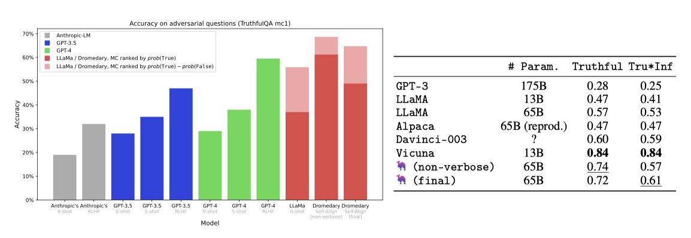
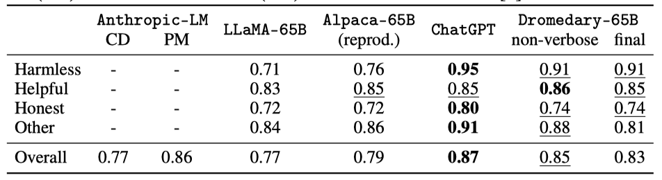

+++
author = "Kurt"
title = "Dromedary"
date = "2024-03-22"
description = "Principle-Driven Self-Alignment of Language Models from Scratch with Minimal Human Supervision"
categories = [
    "Paper Review"
]
tags = [
    "LLM",
    "Milestone",
]
+++

## Abstract

최근 AI 보조 에이전트들은 인간의 의도에 맞추기 위해 인간의 감독과 피드백에 크게 의존하고 있지만, 이는 비용과 품질, 다양성, 일관성, 편향 문제를 야기할 수 있다. 이를 해결하기 위해, 최소한의 인간 감독으로 AI의 자체 정렬을 가능하게 하는 새로운 방식인 SELF-ALIGN을 제안하고, 이를 LLaMA-65b 모델에 적용한 Dromedary라는 AI 보조 에이전트를 개발하였다. Dromedary는 매우 적은 인간 주석으로도 여러 최신 AI 시스템보다 우수한 성능을 보여준다. 이 연구를 통해 AI의 효율적인 감독, 편향 감소, 제어 가능성 개선을 위한 더 많은 연구를 장려하기 위해 Dromedary의 코드와 데이터를 공개하였다.

---

## Introduction

대규모 언어 모델(LLMs)을 인간의 가치와 의도에 맞게 조정하는 문제가 중요한 연구 주제로 부상하였다. 최신 AI 시스템, 예를 들어 ChatGPT나 GPT-4의 발전에 따라, 이들 시스템을 인간의 지시와 피드백을 통해 미세 조정하는 방법에 크게 의존하고 있다. 그러나 이 방법은 비용이 많이 들고, 인간의 주석에서 발생할 수 있는 품질과 편향 문제를 포함한 여러 문제를 안고 있다.

LLM alignment 문제를 해결하기 위해 SELF-ALIGN 이라는 새로운 방식을 제안한다. 이 방식은 몇 가지 인간이 정의한 원칙을 통해 AI 에이전트의 행동을 안내함으로써, 인간 감독의 노력을 크게 줄이고 주석이 거의 필요 없게 한다. 접근법은 다음과 같은 네 가지 핵심 단계를 포함한다:

1. **(Topic-Guided Red-Teaming) Self-Instruct:** Wang et al. 의 self-instruct 메커니즘을 이용해, 175개의 기본 프롬프트와 20개의 주제별 프롬프트를 추가하여 다양한 지시문을 생성함으로써, AI 시스템의 학습을 위한 다양한 맥락과 시나리오의 폭넓은 커버리지를 보장한다.

2. **Principle-Driven Self-Alignment:** AI 모델의 응답 품질과 행동 규칙을 위해 16개의 인간 작성 원칙을 제공한다. 이 원칙들은 유용하고 윤리적이며 신뢰할 수 있는 응답을 위한 지침 역할을 한다. 문맥 내 학습(ICL)을 통해, AI 시스템이 다양한 상황에서 이 규칙들을 어떻게 준수하는지를 보여주는 5개의 예시를 사용한다. 이러한 원칙과 예시, 자체 지시 프롬프트를 통해, LLM은 해로운 또는 잘못 형성된 질문에 대한 답변을 거부하고 그 이유를 설명할 수 있는 규칙을 활성화한다.

3. **Principle Engraving:** 세 번째 단계에서는 원본 LLM을 자체 반응으로 미세 조정하고, 이 과정을 통해 시스템이 다양한 질의에 대해 유용하고 윤리적이며 신뢰할 수 있는 응답을 바로 생성할 수 있게 한다. 미세 조정된 LLM은 원칙과 ICL 예시 없이도 새 질의에 대한 고품질 응답을 직접 제공할 수 있다.

4. **Verbose Cloning:** 마지막으로, 시스템이 더 상세하고 포괄적인 응답을 제공하도록 context distillation를 사용한다.

SELF-ALIGN 과정은 이전 AI 시스템들보다 훨씬 적은, 300줄 미만의 주석으로 진행된다. 이는 인간 주석의 필요성을 크게 줄이며, 원칙 기반 접근 방식이 언어 생성에 있어 원칙과 규칙을 효과적이고 효율적으로 신경 언어 모델과 조율한다는 것을 입증한다.

최근 모델들은 큰 LLM들을 더 작고 관리하기 쉬운 모델로 정제해 강력한 대화 능력을 달성했지만, 여전히 인간의 집중적인 감독에 의존한다. 반면, 이 연구의 접근 방식은 기존 LLM들과 독립적으로, 처음부터 언어 모델을 조율하는 데 초점을 맞추며, 이를 self-alignment from scratch 이라고 부른다. 이는 기존 방식과 구별되는 주요한 특징이다.

SELF-ALIGN 방법론의 코드를 오픈 소스로 제공하여 연구 커뮤니티의 협업과 혁신을 도모한다. 이는 비상업적 연구용 LLaMA-65b 언어 모델을 기반으로 하며, RLHF와 다른 전략을 통해 AI 조율 기술을 확장하고, AI 시스템을 강력하고 책임감 있게, 인간의 가치와 잘 조화되게 개선하는 방법에 대한 깊은 이해를 목표로 한다.

---

## Related Works

**AI Alignment** AI alignment 분야는 최근 주목받으며, GPT-4 같은 LLMs는 다양한 작업에서 탁월함을 보여주었다. 이 분야의 핵심 전략 중 하나는 인간 피드백을 통해 모델을 미세 조정하는 것이며, Ouyang et al. 과 Bai et al. 의 연구는 이를 통해 모델의 유용성과 진실성을 개선하고 유해한 출력을 줄이는 방법을 탐색하였다. 이 과정은 많은 인간의 주석을 필요로 한다.

Constitutional AI(CAI)는 인간의 라벨을 사용하지 않고 AI가 자가 비판, 수정, 선호 모델을 통해 자기 개선을 하는 연구이다. 인간이 만든 규칙을 기반으로, 안전하고 신뢰할 수 있으며 효과적인 AI 시스템 발전을 목표로 한다. SELF-ALIGN과 CAI는 모두 규칙 기반 AI alignment 기술이지만, 중요한 차이점이 있다.

* SELF -ALIGN은 사용자 질문에 기반해 규칙을 스스로 선택하고 적절한 응답을 생성하는 반면, CAI는 사용자 질문과 모델 응답을 검토해 개선된 출력을 내는 자가 비판 방법론을 사용한다.
* CAI는 인간의 피드백에서 보상을 배우는 RLHF 웜업이 필요한 반면, SELF-ALIGN은 최소한의 인간 감독으로 언어 모델 alignment를 시작한다.
* SELF-ALIGN은 언어 모델의 토큰 한계로 인해 모든 규칙을 포함하는 데 제한이 있지만, CAI는 생성 후 자가 비판 방법을 사용하여 토큰 한계 제약이 없다.

**State-of-the-art AI Assistants** 최근 몇 년 간 AI 보조 에이전트는 대폭 발전하였다. InstructGPT는 supervised finetuning (SFT)과 reinforcement learning from human feedback (RLHF)을 통해 학습된 선구적 모델이며, 상업용 AI 보조인 ChatGPT도 큰 성공을 거두었다. Alpaca와 같은 오픈소스 모델은 비용 효율적이고 접근성 있는 대안을 제공하며, Vicuna, Koala, Baize 등은 ChatGPT의 출력을 기반으로 새로운 챗봇을 생성하였다. Dolly-V2와 OpenAssistant는 각각 새로운 데이터 포인트와 자체 데이터 수집을 통해 AI 보조 영역의 사용성과 접근성을 확장하고 있다. 이 모든 발전은 오픈소스 분야에서 중요한 진전을 이루고 있다.

SELF-ALIGN은 최소한의 인간 감독으로부터 독립적으로 개발된 새로운 거대 언어 모델(LLMs) alignment 기술에 집중한다. 이는 기존 AI 시스템에 대한 의존 없이 AI 모델의 alignment 가능성을 탐구하는 연구이다. 

---

## Our Method: SELF-ALIGN

SELF-ALIGN은 네 단계로 구성된다. 첫 번째 **Topic-Guided RedTeaming Self-Instruct**는 언어 모델을 이용해 다양성을 높이는 지시를 생성한다. 두 번째 **Principle-Driven Self-Alignment**은 AI가 따라야 할 원칙을 설정하고 윤리적이고 신뢰할 수 있는 응답을 위한 학습을 제공한ㄴ다. 세 번째 **Principle Engraving** 단계에서는 모델을 미세 조정하여 바로 적절한 응답을 할 수 있게 한다. 마지막 **Verbose Cloning** 단계는 너무 간결하거나 간접적인 응답을 보완하여 사용자 질문에 대해 자세한 답변을 생성한다.

### Topic-Guided Red-Teaming Self-Instruct

Self-Instruct 방법은 사전 학습된 대규모 언어 모델을 이용해 다양한 지시사항과 출력을 생성하는 반자동 반복 과정이다. 이는 처음에 175개의 수동 지시사항으로 시작해, 반복적으로 품질이 낮거나 반복적인 것을 제거하며 새로운 작업을 추가해 작업량을 확장한다. Alpaca에서 이 방법은 새로운 질의와 출력을 생성하는 데 사용되었다.

생성된 적대적 지시사항의 다양성과 범위를 향상시키기 위해 Topic-Guided RedTeaming Self-Instruct 라는 확장 방법을 소개한다. 이를 위해, 기계 학습 모델이 답변하기 어렵거나 잘못된 정보로 답할 수 있는 20가지 적대적 지시사항을 수동으로 개발하였다.

기본 LLM을 이용해 특정 유형에 맞는 새로운 주제(예: 물)를 생성하고, 중복 제거 후 그 주제와 유형에 해당하는 새로운 지시사항을 만든다. 적대적 지시 유형과 다양한 주제에 초점을 맞춘 추가 프롬프트를 통해 AI는 더 다양한 맥락과 시나리오를 탐색하게 된다.

### Principle-Driven Self-Alignment

The Principle-Driven Self-Alignment 기법은 윤리적인 원칙에 따라 AI의 조화를 목표로 한다. 이 방법은 Topic-Guided RedTeaming Self-Instruct를 사용하여 AI가 확립된 원칙을 따르는 응답을 생성하도록 하며, 인간의 감독을 최소화하려고 한다.

The Principle-Driven Self-Alignment 과정은 AI 어시스턴트에게 16가지 기본 원칙을 제시하며 시작된다. 예를 들어, 사용자의 안전과 윤리적 행동을 우선하는 등의 원칙을 포함합니다. 이후, 내부 생각이라는 과정을 통해 이 원칙들을 적용하는 방법을 보여주기 위한 다섯 가지 상황별 학습(ICL) 시연이 제공된다.

새로운 질문이 Self-Alignment에 의해 생성될 때, 그 질문은 예시 목록에 추가되고, 기본 LLM은 이러한 내부 생각 후 답변 과정을 따라 자가 조정된 응답을 생성한다.

이 논문에서 저자들은 연구 목적으로 탐색적인 원칙 설계를 진행하였다. 기존 헌법적 AI, 새로운 빙 챗봇, 그리고 AI 성능 향상에 기여한 최근 연구들에서 영감을 받아 총 열여섯 가지 원칙을 도출하였다. 이 원칙들은 윤리, 정보 제공, 도움됨, 질문 평가, 추론, 다면적, 솔직함, 지식 암송, 고정성, 명확화, 숫자에 민감함, 시간에 따른 지식, 단계별, 균형잡힌 정보 제공적 관점, 창의성, 운영성을 포함한다.

### Principle Engraving

Principle Engraving은 SELF-ALIGN 방법론에서 AI 모델이 정의된 원칙에 맞는 응답을 생성하도록 조정하는 핵심 과정이다. 이 단계에서는 원칙을 기반으로 한 미세 조정을 통해 LLM의 parameter에 원칙을 효과적으로 적용한다.

Principle Engraving은 AI 모델의 alignment를 개선하고 토큰 사용을 줄여 추론 시 컨텍스트 길이를 늘린다. 경험적 관찰에 따르면, 이 방법으로 미세 조정된 모델은 alignment 벤치마크에서 기존 모델을 초과 성능을 보여준다. 이 개선은 모델이 유용하고 윤리적이며 신뢰할 수 있는 출력을 직접 최적화함으로써 얻어진 일반화 효과 때문일 가능성이 높다.

### Verbose Cloning

principle-engraved 모델 테스트에서 두 가지 문제를 발견하였다: 1) 모델이 너무 간단한 답변을 자주 내놓는다는 점과 2) 때때로 사용자 질문에 직접 대답하기보다는 관련 위키피디아 내용을 반복한다는 점이다.

이러한 도전 과제 해결을 위해 Verbose Cloning 단계를 추가하였다. 이 과정은 자세한 응답을 생성하는 원칙 각인 모델의 확장 버전을 만들고, 컨텍스트 증류를 통해 사용자 질문에 광범위하게 응답하는 새 모델을 개발한다. 이는 합성 질문을 학습하고 장황한 프롬프트로 응답을 유도하는 방식으로 진행된다. 장황한 프롬프트는 모델의 수다스러움을 촉진하기 위해 설계되었다.

---

## Evaluation

Dromedary는 벤치마크 데이터셋에서 정량적, 여러 데이터셋에서는 질적으로 평가되며, 생성된 텍스트는 기본적으로 temperature 0.7로 디코딩된다.

### Dromedary and Baseline Models

**Dromedary** Dromedary는 LLaMA-65b 언어 모델을 기반으로 한 AI 어시스턴트로, SELF-ALIGN 과정을 통해 개발되었다. 이 AI는 네 단계를 모두 적용한 Dromedary (final)과 마지막 장황한 복제 단계를 제외한 Dromedary (non-verbose)의 두 변형으로 조사된다.

**Baseline Models** LLaMA, Text-Davinci-003, ChatGPT(GPT-3.5), GPT-4와 같은 연구용 언어 모델과 그 후속작들, 그리고 이를 바탕으로 한 Alpaca, Vicuna, Dolly-V2 같은 특화된 모델들을 비교한다. 이들 모델은 맥락적으로 관련성 높은 고품질 내용 생성에서 중요한 발전을 보였으며, 각각의 모델은 언어 모델의 성능과 상업적 응용에 대한 독특한 통찰을 제공한다. Anthropic-LM의 결과는 비공개이지만, 중요한 벤치마크를 제공한다.

### Benchmark Results

#### TruthfulQA

TruthfulQA 벤치마크는 모델이 실제 세계의 진실된 주장을 식별하는 능력을 평가하며, 객관식과 생성 두 가지 작업으로 구성된다.

Multiple-Choice(MC) 작업에서 모델은 참과 거짓의 답변 중 참된 답을 고르는 능력을 시험받는다. 수정된 순위 결정 방식을 통해, Dromedary는 GPT-4 등 다른 모델들을 뛰어넘어 MC1 정확도에서 69라는 새로운 최고 기록을 세웠다.

생성 작업에서 모델은 질문에 대한 전체 문장 답변을 생성한다. Dromedary는 진실성과 정보성 측면에서 GPT-3, LLaMA, Alpaca보다 높은 점수를 얻었으나, ChatGPT 기반의 Vicuna 모델에는 못 미쳤다.

#### BIG-bench HHH Eval

BIG-bench HHH Eval은 모델을 도움, 정직, 무해함의 측면에서 평가하는 MC 작업이다. 이 평가에서 Dromedary는 특히 무해함 지표에서 LLaMA와 Alpaca 같은 다른 모델들을 크게 앞서며 성능을 보였고, 강력한 ChatGPT 모델에 비해서는 약간 못 미치는 결과를 보여주었다.

#### Vicuna Benchmark Questions (Evaluated by GPT-4)

Chiang et al.은 GPT-4를 이용한 챗봇 성능 자동 평가 프레임워크를 제시했으며, 이를 통해 LLaMA, Alpaca, ChatGPT, Bard, Vicuna 등의 챗봇 답변을 수집해 Dromedary와 비교한다.

GPT-4를 활용해 챗봇 응답을 평가한 결과, Dromedary는 Text-Davinci-003과 Alpaca보다 우수하지만 ChatGPT와 Vicuna에는 미치지 못하는 것으로 나타났다. 또한, ChatGPT와의 상대적 성능 비교도 제공된다.

#### Discussions

**A New AI Alignment Paradigm** 기존의 first-following-then-align 방식과 달리, SELF-ALIGN은 Principle-Driven Self-Alignment과 Principle Engraving을 통해 해악성과 신뢰성을 먼저 개선하고, 이후 Verbose Cloning으로 도움이 됨을 향상시킨다. 어느 패러다임이 더 우월한지는 향후 연구가 필요하다.

**Verbose Tax: Analysis on Verbose Cloning** SELF-ALIGN의 Verbose Cloning은 모델이 상세한 응답을 더 잘 생성하게 하지만, 신뢰할 수 있는 응답 순위를 매기는 능력에는 해를 끼친다. 이를 verbose tax라 칭하며, 모델의 도움이 되는 생성 능력을 향상시키면서 신뢰성과 무해함을 유지하는 방법에 대한 추가 연구가 필요하다.

### Qualitative Demonstrations

Dromedary의 장단점을 깊게 이해하기 위해, 다양한 상황에서 모델의 성능을 질적으로 분석한다. 특히 해로운 또는 민감한 질문에 대한 포괄적이고 세밀한 응답 생성 능력에 초점을 맞춘다. Anthropic-LM(HH RLHF)과 다른 기준점의 결과는 Bai et al. 에서, Vicuna 벤치마크 질문에 대한 다른 기준점 결과는 Chiang et al. 에서 참조된다.

---

## Conclusion & Future Work

Alpaca와 Vicuna 모델은 대규모 언어 모델에서 추출한 강력한 대화 능력을 보여주었다. 이에 영감을 받아, Dromedary 모델을 소개한다. 이 모델은 principle-driven self-alignment 방식으로 처음부터 학습되어 적은 인간의 주석만을 필요로 한다. LLM의 지식을 활용하여 원하는 방식으로 AI가 행동하게 하며, 이는 고품질의 상호작용과 모델 제작자의 가이드라인을 존중하는 응답을 가능하게 한다. 이는 기존 시스템에 의존하지 않고 언어 모델의 새로운 정렬 기술을 개발하는 새로운 방향을 제시한다.

미래 연구를 위해 다음과 같은 연구 방향을 제안한다:

* Dromedary의 16가지 self-alignment 원칙에 대한 절제 연구를 실시하여 특정 원칙을 추가하거나 제거하는 것이 미치는 영향을 평가한다.
* Constitutional AI 기반 self-critique 및 강화 학습 기법을 적용하여 Dromedary의 성능을 더욱 향상시킨다.
* SELF-ALIGN 의 실세계 적용 가능성과 효과를 평가하기 위해 인간 평가를 수행한다.
* 기존의 오픈 소스 주석 데이터, 예를 들어 15k 원본 instruction-following 데이터의 더 나은 활용 방안을 조사한다.
* Principle-guided self-alignment 방식은 다양한 윤리적, 문화적 맥락에서 AI 모델의 정렬을 위한 다중 이해관계자 커뮤니티와의 협력을 촉진한다. 이 방법은 긍정적인 결과를 위해 지속적인 노력이 필요함을 강조한다.

---

## Reference

* [Paper](https://arxiv.org/pdf/2305.03047.pdf)
* [GitHub](https://github.com/IBM/Dromedary)