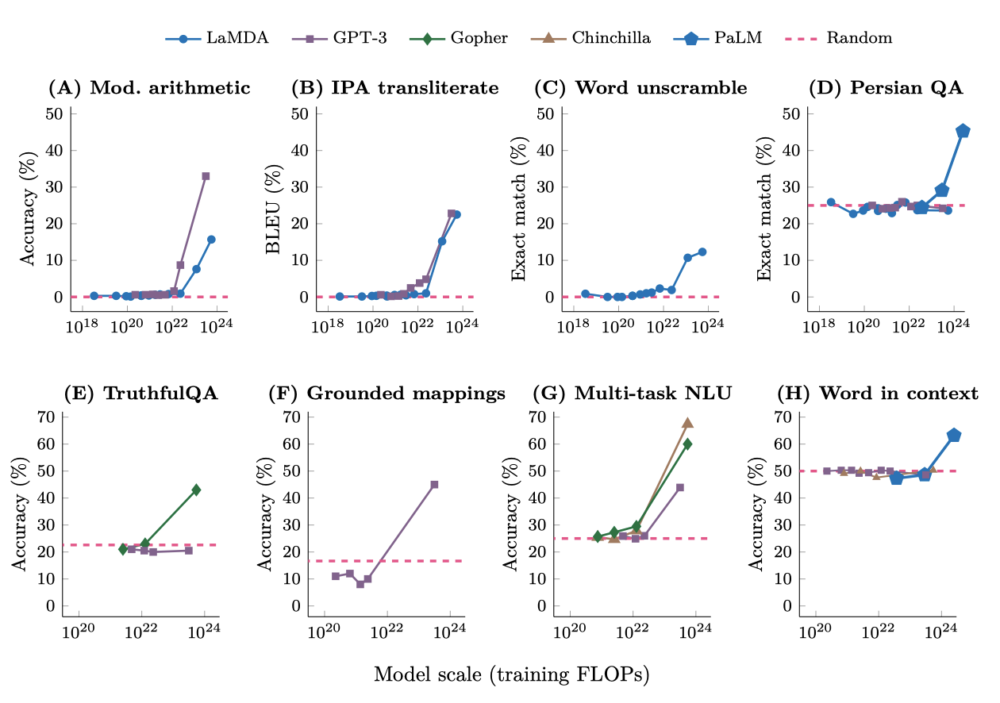
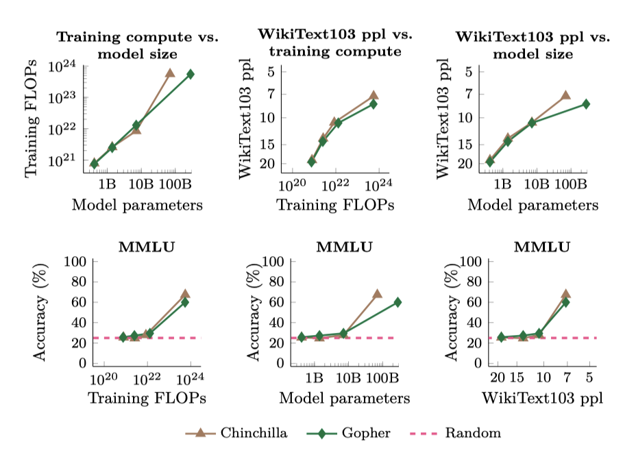

+++
author = "Kurt"
title = "Emergent Abilities"
date = "2024-02-04"
description = "Emergent Abilities of Large Language Models"
categories = [
    "Paper Review"
]
tags = [
    "LLM",
    "Milestone",
]
+++

## Abstract

언어 모델을 확장하면 다양한 downstream task에서 성능과 샘플 효율성이 예측 가능하게 향상된다. 하지만, 이 논문에서는 큰 언어 모델에서만 나타나는 "emergent abilities"이라는 예측 불가능한 현상에 대해 논의한다. 이는 작은 모델의 성능을 extrapolating 함으로써는 예측할 수 없으며, 추가적인 확장이 언어 모델의 능력 범위를 더욱 확장시킬 수 있는지에 대한 질문을 제기한다.

---

## Introduction

언어 모델의 크기를 늘리는 것이 NLP 작업의 성능과 효율성을 향상시킨다는 것은 잘 알려져 있다. 이는 scaling law를 통해 예측될 수 있으며, cross-entropy 손실의 스케일링 곡선은 이를 잘 보여준다. 그러나 특정 작업에서는 규모에 따른 성능 개선이 계속되지 않는 경우도 있어, 이러한 작업은 미리 예측하기 어렵다.

이 논문에서는 대규모 언어 모델의 예측할 수 없는 능력 emergence 현상에 대해 논의한다. 이 "emergence" 개념은 물리학, 생물학, 컴퓨터 과학 등 여러 분야에서 널리 논의되어 왔다. 노벨 물리학상 수상자인 Philip Anderson의 1972년 에세이 "More Is Different"에 기반한, Steinhardt (2022)가 수정한 일반적인 "emergence"의 정의를 사용한다: 

> *Emergence is when quantitative changes in a system result in qualitative changes in behavior.*

이 연구에서는 학습 계산과 모델 parameter의 수로 측정한 모델 규모에 따른 emergence 현상을 연구한다. 대규모 언어 모델의 emergence 능력을 작은 규모 모델에서는 없지만 큰 규모 모델에서 나타나는 능력으로 정의하며, 이는 작은 규모 모델의 성능 개선을 통해 예측할 수 없다. 이전 연구에서 발견된 emergence 능력을 조사하고, 다양한 환경에서 분류한다. 이는 능력이 어떻게 획득되는지, 그리고 규모가 더 커지면 더 많은 능력이 emergence 하는지에 대한 연구를 촉진한다.

---

## Emergent Abilities Definition

emergence 라는 개념은 넓게 사용되며 다양한 방식으로 해석될 수 있다. 이 연구에서는 대규모 언어 모델의 emergence 능력에 대한 구체적인 정의를 고려한다:

> *An ability is emergent if it is not present in smaller models but is present in larger models.*

emergence 능력은 작은 규모 모델에서의 성능 향상 추세를 extrapolating 함으로써 직접 예측할 수 없다. 스케일링 곡선을 통해 보면, emergence 능력은 특정 임계 규모에 이르기 전까지는 무작위에 가까운 성능을 보이지만, 그 이후에는 랜덤 이상의 성능 향상을 보인다. 이러한 질적 변화는 phase transition 이라고도 하며, 이는 작은 규모의 시스템을 검사할 때는 예상되지 않는 전반적인 행동의 큰 변화를 의미한다.

현대의 언어 모델은 계산량, 모델 parameter 수, 학습 데이터 크기 등을 확장하는 방식으로 발전해 왔다. 이 논문에서는 학습 계산량을 기준으로 모델의 성능을 비교하고 분석하였으며, 더 많은 계산량으로 학습된 모델이 더 많은 parameter를 가질 가능성이 높다는 것을 보여주었다. 이는 대부분의 dense Transformer 언어 모델이 학습 계산량을 모델 parameter와 비례하여 확장했기 때문이다.

학습 데이터셋 크기도 중요하지만, 대부분의 언어 모델이 모든 모델 크기에 대해 고정된 학습 예제를 사용하기 때문에 이것을 대비한 그래프는 제시하지 않는다. 여기서는 학습 계산량과 모델 크기에 초점을 맞추지만, 모든 규모를 적절하게 포착하는 단일 지표는 없다. 예를 들어, Chinchilla는 Gopher의 parameter의 1/4을 가지지만 비슷한 학습 계산량을 사용하며, sparse mixture-of-expert 모델은 dense 모델보다 학습/추론 계산량 당 더 많은 parameter를 가진다. 일반적으로, emergence를 여러 상관 변수의 함수로 보는 것이 현명할 수 있다.

능력이 처음으로 나타나는 규모는 여러 요인에 따라 달라지며, 이는 능력의 고정된 특성이 아니다. 더 좋은 품질의 데이터로 학습된 모델은 더 적은 계산량이나 parameter로도 능력이 emergence 될 수 있다. 반면, emergence 능력은 데이터의 양, 품질, 모델의 parameter 수 등에 의존한다. 현대의 언어 모델은 아직 최적의 학습 방법이 발견되지 않았을 수 있으며, 이해는 시간이 지남에 따라 발전할 것이다. 이 논문의 목표는 특정 규모가 필요하다는 주장이 아니라, 이전 연구에서 emergence 된 행동의 예를 논의하는 것이다.

---

## Few-Shot Prompted Tasks

GPT-3에서 대중화된 프롬프팅 패러다임에서의 emergence 능력에 대해 논의하다. 프롬프팅에서는 사전 학습된 언어 모델에게 과제 프롬프트를 제공하고, 추가 학습이나 parameter 업데이트 없이 응답을 완성한다. Brown et al. 은 몇 가지 input-output 예를 모델의 컨텍스트에 포함시키는 few-shot 프롬프팅을 제안하였다. 이는 보이지 않는 추론 시간의 예제에 대해 모델이 작업을 수행하도록 요청하기 전에 사용된다.

특정 규모까지 무작위 성능을 보이다가 그 이후에 성능이 크게 향상되면, few-shot 프롬프팅으로 작업을 수행하는 능력이 emergence 된 것이다.

**BIG-Bench.** GPT-3와 LaMDA는 학습 계산량이 증가할 때마다 성능이 크게 향상된다. 비슷한 emergence 현상은 국제 음성 알파벳에서 발음 표기로 변환, 단어의 글자 뒤섞기 복원, 페르시아어 질문-답변 등의 작업에서도 동일한 모델 규모에서 발생한다.

**TruthfulQA.** 이 벤치마크는 GPT-3 모델에 대해 적대적으로 구성되어 있으며, 가장 큰 모델 크기로 확장되어도 성능이 무작위 수준을 넘지 못한다. 하지만, Gopher 모델은 가장 큰 크기로 확장될 때 성능이 무작위 수준보다 20% 이상 향상된다.

**Grounded conceptual mappings.** 이 작업에서도, 가장 큰 GPT-3 모델을 사용할 때만 성능이 무작위 수준을 넘어선다.

**Multi-task language understanding.** GPT-3, Gopher, Chinchilla 등의 모델은 특정 크기 이상으로 확장될 때만 성능이 크게 향상된다. 이 결과는 광범위한 주제에 대한 지식 기반 질문 해결 능력이 특정 규모 이상의 모델에서만 가능함을 시사한다.

**Word in Context.** GPT-3와 Chinchilla는 가장 큰 모델 크기로 확장되어도 무작위 수준보다 나은 성능을 보이지 못한다. 하지만, PaLM이 훨씬 더 큰 규모로 확장되었을 때 무작위 수준을 넘어서는 성능이 나타났다.

---

## Augmented Prompting Strategies

few-shot 프롬프팅은 거대 언어 모델과의 상호작용에서 가장 많이 사용되지만, 다른 프롬프팅과 미세 조정 전략들도 제안되고 있다. 특히, 충분한 규모의 모델에 적용될 때까지 성능 개선이 없거나 해로운 기법도 결국은 emergence 능력으로 간주된다.

**Multi-step reasoning.** 다단계 추론 작업은 언어 모델에게 큰 도전이었다. 하지만, 최근 "chain-of-thought" 프롬프팅 전략은 언어 모델이 최종 답변을 제공하기 전에 중간 단계를 생성하도록 안내함으로써 이 문제를 해결하였다. 이 방법은 특정 규모 이상으로 확장될 때만 표준 프롬프팅을 능가한다. 또한, 설명을 추가하여 few-shot 프롬프팅을 강화했을 때도 비슷한 성능 향상이 나타났다.

**Instruction following.** 언어 모델이 작업을 설명하는 지시사항을 읽어 새로운 작업을 수행하는 연구가 진행되고 있다. 지시사항으로 표현된 작업에 대해 미세조정하면, 언어 모델은 보지 못한 작업에 대한 지시사항에 적절하게 반응하는 것이 확인되었다. 하지만, 이 기법은 특정 규모 이상의 모델에서만 성능이 향상되었다. 더 작은 encoder-decoder T5 모델을 미세조정함으로써도 이러한 행동이 유도될 수 있음이 확인되었다.

**Program execution.** 다단계 계산 작업을 수행하는 데 있어, 중간 출력을 예측하도록 언어 모델을 미세조정 하면 성공적인 실행이 가능해진다. 그러나 이 방법은 특정 규모 이상의 모델에서만 효과가 있음이 확인되었다. 예를 들어, 8자리 수의 덧셈에서는 $\sim 9 \cdot 10^{19}$ 학습 FLOPs (40M parameter) 이상의 모델에서만 스크래치패드 사용이 도움이 된다.

**Model calibration.** 언어 모델의 중요한 연구 방향 중 하나는 캘리브레이션인데, 이는 모델이 어떤 질문에 올바르게 대답할 수 있을지 예측하는 능력을 측정한다. True/False 기법과 표준 캘리브레이션 방법 두 가지를 비교한 결과, True/False 기법의 우월성은 가장 큰 모델 규모로 확장될 때만 나타났다.

---

## Discussion

few-shot 프롬프팅 능력 등 다양한 능력들은 충분히 큰 언어 모델에서만 관찰되며, 이는 작은 모델에서의 성능을 통해 예측할 수 없다. 이러한 emergence 능력은 사전 학습에 포함되지 않은 작업들에서 나타나므로, 언어 모델이 수행할 수 있는 작업의 전체 범위를 정확히 알 수 없다. 이는 더 큰 규모의 모델로 확장함으로써 새로운 능력이 emergence 될 수 있음을 시사한다. 현재 언어 모델이 수행할 수 없는 작업들은 미래에 능력이 emergence 될 가능성이 높은 후보이다.

규모 증가가 새로운 기법을 가능하게 하는 능력은 이론적인 것이 아니다. 예를 들어, GPT-3를 크게 확장해도 Word in Context (WiC) 벤치마크에서 무작위 수준 이상의 one-shot 프롬프팅 성능을 얻지 못하였다. 그러나 나중의 연구에서는 decoder만 있는 언어 모델을 더욱 확장함으로써 이 작업에서 무작위 수준 이상의 성능을 달성하는 것이 가능하다는 것을 발견하였다. 이는 구조적 변경 없이도 성능 향상을 가져올 수 있다는 것을 보여준다.

### Potential explanations of emergence

emergence 능력의 다양한 예시가 있지만 왜 그런 방식으로 나타나는지는 아직 명확히 설명되지 않았다. 특정 작업은 특정 규모 이상의 모델을 필요로 하는 이유에 대한 직관을 제공할 수 있다. 예를 들어, 순차 계산을 요구하는 다단계 추론 작업은 일정 깊이의 모델이 필요할 수 있다. 또한, 더 많은 parameter와 학습은 세계 지식을 필요로 하는 작업에 도움이 될 수 있다. 예를 들어, closed-book 질문-답변에서 좋은 성능을 내려면, 압축된 지식 베이스를 포착할 수 있는 충분한 parameter를 가진 모델이 필요할 수 있다.

emergence 능력을 측정하는 평가 지표의 선택은 중요하다. 예를 들어, 정확한 문자열 일치를 사용하는 것은 점진적인 개선을 emergence로 가려낼 수 있다. 이와 유사하게, 다단계 문제에 대해 최종 답안만 평가하는 경우, 부분적으로 올바른 해결책에 대한 인정이 없을 수 있다. 하지만 이러한 방식은 중간 단계의 품질이 무작위 수준 이상으로 갑자기 emergence 하는 이유를 설명하지 못하며, 많은 분류 작업에서 emergence 능력이 계속 관찰되므로, 부분 점수를 부여하지 않는 평가는 불완전한 설명일 수 있다.

cross-entropy 손실을 측정하는 대체 평가를 통해, 6개의 emergence BIG-Bench 작업을 분석하였다. 이 분석은 작은 모델 규모에서도 cross-entropy 손실이 개선되며, 이는 log-likelihood의 개선이 downstream 지표에 의해 가려질 수 있다는 것을 보여준다. 그러나 이 분석은 downstream 지표가 왜 emergence 하거나 어떤 규모에서 emergence가 일어나는지를 예측할 수는 없다. 전반적으로, 규모가 emergence 능력을 가능하게 하는 요소를 파악하기 위해 더 많은 연구가 필요하다.

### Beyond scaling

특정 규모에서 emergence 능력이 나타나지만, 더 작은 규모에서도 이를 달성할 수 있다. 즉, 모델 규모만이 emergence 능력을 해제하는 유일한 요소는 아니다. 거대 언어 모델 학습의 발전으로 새로운 구조, 더 높은 품질의 데이터, 개선된 학습 절차를 가진 작은 모델에서도 특정 능력이 emergence 될 수 있다. 예를 들어, 더 적은 모델 parameter를 가진 PaLM 62B는 LaMDA 137B와 GPT-3 175B보다 더 나은 성능을 보여주었다. 이는 높은 품질의 학습 데이터와 구조적 차이 덕분일 수 있다. 또한, 다른 사전 학습 목표를 통해 emergence 능력을 해제하는 것도 가능하다는 것이 밝혀졌다.

한 번 능력이 발견되면, 추가 연구를 통해 더 작은 규모의 모델에서도 사용 가능해질 수 있다. 예를 들어, 작업을 설명하는 자연어 지시사항을 따르는 언어 모델의 연구가 진행되고 있다. 초기에는 큰 모델에서만 작동하였지만, 새로운 연구를 통해 더 작은 규모의 모델에서도 유사한 기능을 구현하게 되었다. 더불어, 미세 조정과 인간의 피드백에서 강화 학습 방법을 적용한 모델은 더 큰 모델보다 더 나은 성능을 보이며, 다양한 사용 사례에서 뛰어난 성능을 보여주었다.

언어 모델의 few-shot 프롬프팅 능력 향상에 대한 연구가 있다. 이는 언어 모델링이 특정 downstream 행동을 촉진하는 이유에 대한 이론적 연구와 연관되어 있다. 사전 학습 데이터의 특정 특징과 특정 모델 구조가 few-shot 학습과 연관되어 있음이 확인되었고, 이는 더 작은 모델에서 emergence 능력을 가능하게 할 수 있다. 또한, 학습 데이터의 임계 빈도가 구문 규칙 학습을 활성화하는 것으로 나타났다. 이러한 연구는 emergence 능력에 대한 규모 임계값을 낮추는 데 중요하며, 이를 통해 이러한 능력에 대한 연구를 더 넓게 공유할 수 있게 된다.

단순히 규모를 증가시키는 것에는 한계가 있다. 하드웨어 제약에 의해 병목 현상을 겪을 수 있고, 일부 능력은 아직 emergence 되지 않았거나 절대로 emergence 되지 않을 수 있다. 예를 들어, 큰 학습 데이터셋의 범위를 벗어난 작업은 중요한 성능을 얻지 못할 수 있다. 또한, 능력이 emergence 된 후에 성능이 정체될 수 있어, 규모 확장이 능력을 원하는 수준에 도달하게 할 보장은 없다.

### Another view of emergence

언어 모델의 성능은 규모(예: 힉습 FLOPs 또는 모델 parameter)와 밀접한 관련이 있지만, 이는 emergence 능력을 이해하는 유일한 방법이 아니다. 특정 작업에 대한 능력의 emergence는 언어 모델의 일반 텍스트 말뭉치에 대한 perplexity로도 분석될 수 있다. 예를 들어, 언어 모델의 WikiText103 perplexity와 MMLU 벤치마크 성능 관계를 보여주는 그래프가 있다. 이는 학습 FLOPs와 모델 parameter와의 관계를 보여주는 그래프와 함께 제시된다.

이 연구에서 고려된 모델들의 경우, WikiText103 perplexity와 학습 FLOPs가 높은 상관관계를 보여 emergence 능력의 그래프가 비슷하다. 하지만, vanilla dense Transformer 모델을 넘어 새로운 기술이 개발되면서, 이런 상관관계는 앞으로 유지되지 않을 수 있다. 예를 들어, 검색 기능이 강화된 모델은 더 적은 학습 계산량과 모델 parameter로도 높은 WikiText103 perplexity를 보일 수 있다. 또한, 모델 간 비교에서 WikiText103 perplexity 사용은 학습 데이터 구성 차이 등으로 복잡할 수 있다. 결국, emergence 능력은 여러 상관 변수의 함수로 보는 것이 적절할 것이다.

### Emergent risks

사전 학습에 명시적으로 포함되지 않은 상태에서 emergent 능력이 few-shot 프롬프팅에서 관찰되듯이, 위험 요소도 발생할 수 있다. 큰 언어 모델의 사회적 위험, 예를 들어 truthfulness, bias, toxicity 등은 연구 분야가 늘어나고 있다. 이런 위험 요소들은 "emergent"으로 정확하게 특성화되는지 여부에 상관없이 중요하며, 일부 경우에는 모델 규모와 함께 증가한다. emergent 능력에 대한 연구가 언어 모델의 스케일링을 촉진하므로, 이들이 emergent되지 않더라도 모델 규모와 함께 증가하는 위험에 대해 인식하는 것이 중요하다.

특정 사회적 위험과 모델 규모 간의 관계에 대한 연구 결과를 요약하면 다음과 같다. 성별 bias를 측정하는 WinoGender에서는 모델 규모 확장이 성능을 향상시켰다. 하지만 모호한 상황에서는 규모 확장에 따라 bias가 증가할 가능성이 있다. toxicity에 대해서는, 큰 언어 모델이 toxicity가 강한 응답을 생성할 수 있지만, 적절한 프롬프트를 제공함으로써 이를 완화할 수 있다. 더 큰 모델이 학습 데이터를 더 잘 기억하는 경향이 있지만, 중복 제거 방법을 통해 이를 줄이는 동시에 성능을 향상시킬 수 있다. 마지막으로, GPT-3 모델이 클수록 인간의 거짓말을 따라하는 경향이 있지만, 규모를 확장하면 무작위 선택보다 더 나은 성능을 보일 수 있다.

emergence 위험은 미래의 언어 모델에서만 존재하거나 현재 모델에서 아직 발견되지 않은 현상을 포함한다. 이런 행동은 백도어 취약점, 부주의한 기만, 유해한 컨텐츠 생성 등이 있을 수 있다. 이런 위험을 발견하고 완화하기 위해 데이터 필터링, 예측, 거버넌스, 그리고 자동으로 유해한 행동을 발견하는 방법들이 제안되었다.

### Sociological changes

여기서 논의된 emergence 능력은 모델 행동에 초점을 두고 있으며, NLP에서의 여러 emergence 형태 중 하나이다. 규모 증가는 언어 모델에 대한 커뮤니티의 인식과 사용 방식을 변화시키는 사회학적 변화를 일으킨다. NLP는 전통적으로 과제별 모델에 초점을 두었지만, 최근에는 학습 데이터에 명시적으로 인코딩되지 않은 다양한 과제를 수행하는 "general purpose"의 모델에 대한 연구와 개발이 확장되었다.

규모 확장이 몇 번의 shot을 통해 프롬프트된 general-purpose 모델이 특정 과제를 위해 세밀하게 튜닝된 이전 모델의 성능을 능가하는 경우, general-purpose 모델로의 사회학적 변화가 나타난다. 예를 들어, GPT-3 175B, PaLM 540B, Flamingo 80B 등의 모델은 각자의 벤치마크에서 state-of-the-art를 달성하였다. 이런 능력들은 예측 가능한 규모 확장 곡선을 따르므로 반드시 emergence 능력은 아니지만, NLP 커뮤니티에서 general-purpose 모델로의 변화를 보여준다.

general-purpose 언어 모델이 소수의 예시로도 보지 못한 과제를 수행하는 능력은 NLP 연구 커뮤니티를 넘어 다양한 응용 분야에서 활용되고 있다. 이런 모델은 로봇 조작, 사용자 상호작용, 다중 모달 추론 등에 사용되며, 실제 세계에서도 GitHub CoPilot와 같은 제품이나 OpenAI의 GPT-3 API와 같은 서비스로 적용되고 있다.

### Directions for future work

emergence 능력에 대한 미래의 연구는 더 능력 있는 언어 모델을 학습하고, 언어 모델이 과제를 더 잘 수행할 수 있도록 하는 방법을 포함할 수 있다.

**Further model scaling.** 모델을 더 크게 확장하는 것은 언어 모델의 능력을 향상시키는 방향으로 보이지만, 이는 계산 비용이 많이 들고 하드웨어 문제를 해결해야 하는 도전이 있다. 따라서, 다른 접근법이 거대 언어 모델의 emergence 능력 개선에 중요한 역할을 할 것으로 예상된다.

**Improved model architectures and training.** 모델 아키텍처와 학습 절차를 향상시키면, emergence 능력이 우수한 고품질 모델을 만들 수 있으며 이는 계산 비용을 줄일 수 있다. sparse mixture-of-experts 구조를 사용하면 모델의 parameter 수를 늘릴 수 있다. 또한, 다양한 계산량을 사용하거나 지역화된 학습 전략을 사용하거나 외부 메모리를 추가하는 등 다양한 방식으로 계산 효율성을 향상시킬 수 있다. 이러한 접근법들은 초기 단계에 있지만 많은 가능성을 보여주고 있다. 하지만 이들이 널리 채택되려면 추가 연구가 필요하다.

**Data scaling.** 언어 모델이 구문, 의미, 세계 지식을 획득하는 데는 충분한 데이터셋에서 오랜 시간 동안 학습하는 것이 중요하다는 것이 입증되었다. 최근 연구는 최적의 모델을 학습시키는 데 필요한 데이터 양이 과소평가되었다고 주장하며, 이는 학습 데이터의 중요성을 강조하였다. 대규모 데이터셋을 수집하여 모델을 더 오래 학습하면, 모델 크기의 제약 하에서도 더 많은 능력을 emergence 시킬 수 있다.

**Better techniques for and understanding of prompting.** few-shot 프롬프팅은 간단하고 효과적이지만, 일반적인 프롬프팅 개선을 통해 언어 모델의 능력을 더 확장할 수 있다. 출력 확률 보정이나 노이즈 채널 사용 등의 간단한 수정은 다양한 작업 성능을 향상시키며, 중간 단계를 포함하는 예제 확장은 다단계 추론 작업을 가능하게 한다. 프롬프팅의 성공 요인을 더 잘 이해하고 탐색함으로써, 더 작은 모델에서도 emergence 능력을 이끌어낼 수 있는 방법을 찾을 수 있다. 또한, 시간이 지나며 더 강력한 모델이 개발됨에 따라 프롬프팅의 최선의 관행도 변화할 것으로 보인다.

**Frontier tasks.** 언어 모델은 다양한 작업을 수행할 수 있지만, 여전히 무작위 정확도 이상을 달성하지 못하는 작업들이 많다. 이런 작업들은 대개 추상적인 추론을 요구하는데, 이에 대한 이해를 높이는 연구가 필요하다. 또한, 다언어 emergence와 같은 새로운 연구 방향이 두드러지고 있으며, 이는 모델 크기와 학습 데이터가 중요한 역할을 하는 것을 보여준다. 더 나아가, 여러 모달리티에서의 프롬프팅과 같은 새로운 도전 과제를 탐색할 수 있다.

**Understanding emergence.** 큰 언어 모델에서 emergence 능력이 왜 그리고 어떻게 발생하는지는 미래 연구의 개방된 질문이다. 이 논문의 초기 분석들은 emergence의 원인이나 예측 방법에 대한 완전한 답변을 제공하지 못하였다. 미래 연구는 emergence를 새롭게 분석할 수 있으며, 이는 미래 모델의 능력 예측과 더 능력 있는 언어 모델 학습 방법에 대한 새로운 통찰을 제공할 수 있다.

---

## Conclusions

특정 계산 규모에서만 중요한 성능을 보이는 언어 모델의 발현 능력에 대해 논의하였다. 이런 능력은 다양한 모델과 작업, 실험 상황에 걸쳐 나타나며, 언어 모델을 확장함으로써 최근에 발견되었다. 이러한 능력이 어떻게 나타나며, 더 많은 확장이 더 많은 발현 능력을 가능하게 할지는 자연어 처리(NLP) 분야의 중요한 미래 연구 주제이다.

---

## Reference

* [Paper](https://arxiv.org/pdf/2206.07682.pdf)