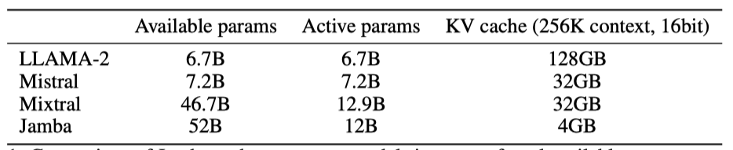
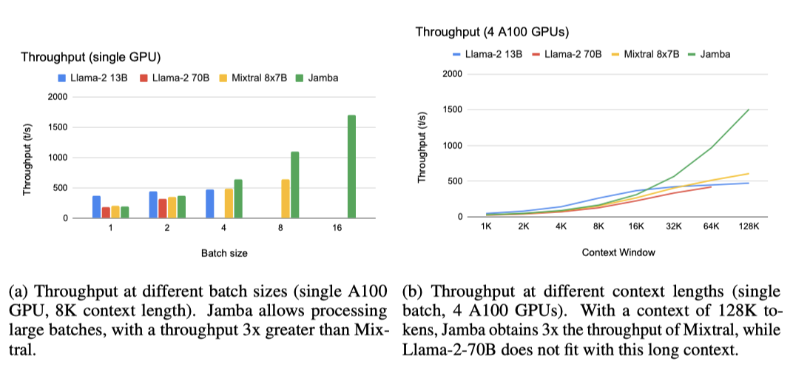
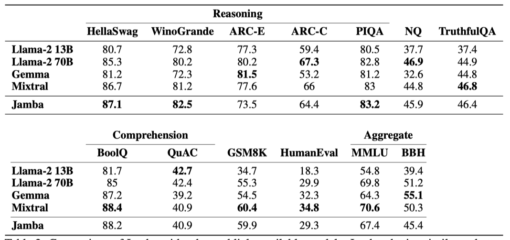
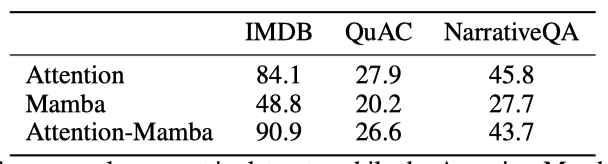
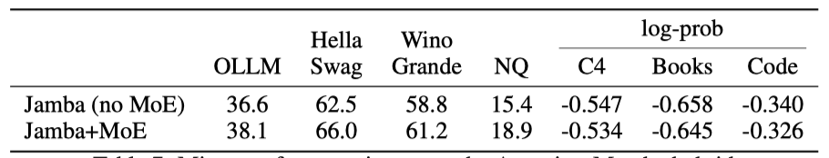

+++
author = "Kurt"
title = "Jamba"
date = "2024-05-20"
description = "A Hybrid Transformer-Mamba Language Model"
categories = [
    "Paper Review"
]
tags = [
    "LLM",
    "Milestone",
]
+++

## Abstract

Jamba는 새로운 하이브리드 Transformer-Mamba mixture-of-experts(MoE) 아키텍처를 기반으로 한 대규모 언어 모델이다. 이 아키텍처는 Transformer와 Mamba layer를 교차 배치하고, 일부 레이어에 MoE를 추가하여 모델 용량을 확장하면서도 활성 파라미터 사용을 효율적으로 관리한다. 단일 80GB GPU에 맞는 강력한 모델로, 높은 처리량과 작은 메모리 사용량을 제공하며 표준 벤치마크와 긴 컨텍스트 평가에서 최신 성능을 달성한다. 최대 256K 토큰 컨텍스트 길이에서 강력한 결과를 보여주며, 아키텍처의 결정적인 요소를 연구하고 이 아키텍처의 흥미로운 특성을 공유할 계획이다. 

---

## Introduction

Jamba는 transformer layer, Mamba layer, 그리고 mixture-of-experts 구성 요소를 결합한 새로운 하이브리드 구조의 공개 대규모 언어 모델이다. 이 모델은 개선된 성능과 높은 처리량을 제공하며, 80GB GPU에 맞도록 설계된 7B 기반 모델(active parameter 12B, total available parameter 52B)을 포함한다. Jamba 구조는 사용자의 하드웨어와 성능 요구에 따라 다양한 디자인 선택을 지원한다.

Jamba의 새로움은 하이브리드 Transformer-Mamba 구조에 있으며, transformer의 높은 메모리 및 계산 요구와 단일 요약 상태 부재로 인한 단점을 해결한다. 반면, RNN은 이러한 문제를 겪지 않지만, 학습 비용이 많이 들고 long context를 효과적으로 처리하지 못하는 단점이 있다.

최근의 state space model(SSM)인 Mamba는 RNN보다 학습이 효율적이고 장거리 관계 처리에 뛰어나지만 transformer 언어 모델에 비해 성능이 떨어진다. Jamba는 transformer와 Mamba layer를 결합하여 메모리 사용, 효율적인 학습, 긴 컨텍스트 처리의 밸런스를 맞춘다.

최근 여러 연구에서 attention과 SSM 모듈을 결합하는 다양한 시도가 있었다. 이들 중 일부는 SSM과 attention layer를 혼합하거나 교차 배치하는 방식으로, 작은 모델에서부터 최대 1.3B parameter 모델까지 다양한 규모에서 실험을 진행하였다. 특히, self-attention layer 앞이나 뒤에 SSM layer를 추가하거나, MLP layer를 Mamba layer로 대체하는 등의 방법이 시도되었으며, 이는 주로 음성 인식과 같은 단순한 작업에서 개선을 보였다. 그러나 이러한 시도들은 Jamba와는 달리 SSM과 attention의 결합 방식이나 구현 규모 측면에서 차이가 있다. Jamba는 이러한 연구들 중에서도 첫 번째 생산급 attention-SSM 하이브리드 모델로, 하이브리드 아키텍처를 확장하는 데 있어 여러 장애물을 극복해야 했다.

Jamba는 모델 용량을 늘리면서 계산 요구를 적게 하는 MoE layer를 사용한다. 이는 큰 모델을 효율적으로 학습할 수 있는 방식이며, 일부 MLP layer에 적용된다. MoE layer와 expert 수가 많을수록 총 모델 parameter는 증가하지만, 동시에 active parameter 수와 계산 요구도 늘어난다. Jamba에서는 모든 다른 layer마다 MoE를 적용하고, 각 토큰마다 상위 2개의 expert를 선택하는 방식으로 16명의 expert를 활용한다.

Jamba는 다양한 벤치마크에서 Mixtral-8x7B와 비슷하고 Llama-2 70B와도 경쟁하는 성능을 보여주었다. 특히, 256K 토큰까지 지원하는 가장 긴 컨텍스트 길이를 가지며, 긴 컨텍스트 평가에서 대부분의 데이터셋에서 Mixtral을 능가한다. Jamba는 또한 매우 효율적이며, 긴 컨텍스트의 경우 Mixtral-8x7B보다 3배 높은 처리량을 달성한다. 더욱이, Jamba는 128K 토큰 이상의 컨텍스트에서도 단일 GPU에 맞을 수 있어, 비슷한 크기의 attention-only 모델과 차별화된다.

Jamba(active parameter 12B, total available parameter 52B)를 Apache 2.0 라이선스로 공개한다. 이는 Jamba의 새로운 아키텍처가 커뮤니티의 추가 연구와 실험을 필요로 한다고 판단했기 때문이다. 다양한 절제 실험과 7B parameter 규모의 연구, 250B 토큰까지의 학습을 통해 얻은 인사이트를 바탕으로 설계되었다. 이러한 연구 결과를 바탕으로 모델 체크포인트를 공개할 예정이다.

---

## Model Architecture

Jamba는 Transformer, Mamba layer(recent state-space model), mixture-of-experts 모듈을 결합한 하이브리드 디코더 구조입니다. 이 조합을 Jamba block이라 칭한다.

Transformer, Mamba, 그리고 MoE 요소의 결합은 메모리 사용량, 처리량, 품질 간의 균형을 유연하게 조정한다. MoE 모델은 active parameter가 총 parameter 수보다 적을 수 있어, 메모리 사용량을 오해할 수 있다. 긴 콘텍스트에서 Transformer 모델의 확장 시 KV 캐시가 제한 요소가 되며, Mamba 레이어로의 교체는 KV 캐시 크기를 줄인다. 이 연구의 아키텍처는 기본 Transformer 대비 8배 작은 KV 캐시를 목표로 하며, 256K 토큰 컨텍스트에서도 Jamba의 작은 KV 캐시 유지 장점을 보여준다.

처리량 측면에서, 짧은 시퀀스에는 attention 기능이 적은 계산을 요구하지만, 긴 시퀀스에서는 대부분을 차지한다. Mamba layer는 계산이 더 효율적이므로, 이들의 비율을 높이면 긴 시퀀스의 처리량이 개선된다.

기본 구성 요소인 Jamba block은 Mamba 또는 Attention layer로 구성되며, 이들은 attention 또는 Mamba 모듈과 MLP를 포함한다. Jamba 블록은 $l$개의 layer로, $a:m$ 비율로 attention layer와 Mamba layer가 혼합된다.

Jamba에서는 모델 용량을 늘리고 계산량을 줄이기 위해 일부 MLP를 MoE layer로 대체할 수 있다. MoE는 매 $e$ layer마다 적용되며, 각 layer에는 $n개의 expert가 있고, 라우터가 각 토큰에 대해 상위 $K$개의 expert를 선택한다. 이는 Jamba 아키텍처의 다양한 조정 가능한 요소들이다.

* **l:** layer의 수
* **a:m**: attention layer 대 Mamba layer의 비율
* **e:** 단일 MLP 대신 MoE를 사용하는 빈도
* **n:** 각 layer당 expert의 총 수
* **K:** 각 토큰마다 사용되는 top expert의 수

Jamba는 설계를 통해 특정 속성에 우선순위를 둘 수 있는 유연성을 제공한다. 예를 들어, attention layer 대신 Mamba layer의 비율을 증가시키면 필요한 메모리 사용량을 줄이고 처리량을 개선할 수 있지만, 이는 모델의 성능을 다소 감소시킬 수 있다. 이는 긴 시퀀스 처리에 특히 유리하다.

$n, K, e$ 사이의 균형은 모델의 용량, 메모리 및 계산 요구 사항에 영향을 미친다. $n$을 늘리면 모델 용량이 증가하지만 메모리 사용량도 커진다. $K$를 증가시키면 active parameter와 계산량이 증가한다. 반면, $e$를 증가시키면 모델 용량이 줄어들지만 계산과 메모리 요구 사항이 감소하고 통신 의존성이 줄어든다.

Jamba의 Mamba layer는 대규모 모델 학습을 안정화하기 위해 RMSNorm을 포함한 정규화 기법을 사용한다.

Mamba layer 사용 시, positional embedding이나 RoPE와 같은 메커니즘이 불필요하여 위치 정보를 사용하지 않는다.

구조적 세부 사항은 GQA, SwiGLU 활성화 함수, MoE 부하 균형 조정을 포함하며, 어휘 크기는 64K이다. BPE로 학습된 토크나이저는 각 숫자를 별도의 토큰으로 처리하고, 더 일관된 토큰화를 위해 더미 공백을 제거하였다.

---

## Reaping the Benefits

### Jamba Implementation for a Single 80GB GPU

80GB GPU에 최적화된 구성으로 품질과 처리량에서 최고 성능을 목표로 하며, 이를 위해 4개의 Jamba block을 연속으로 사용한다.

* **l = 8:** 레이어의 수
* **a:m = 1:7:** attention layer 대 Mamba layer의 비율
* **e = 2:** 단일 MLP 대신 MoE를 사용하는 빈도
* **n = 16:** expert의 총 수
* **K = 2:** 각 토큰에서 사용되는 top expert의 수

a:m = 1:7 비율은 품질 면에서 최고의 성능을 내면서도 계산 효율이 가장 높은 변형으로, 예비 실험을 통해 결정되었다.

expert 구성은 80GB GPU에 맞추고 입력 데이터를 위한 메모리를 확보하기 위해 선택되었다. 각 계층에 평균적으로 약 8명의 expert를 배치하며, 고품질 유지와 계산 및 통신 요구 사항을 충족하기 위해 $n, K, e$를 조정하였다. MLP 대신 MoE를 격층마다 사용하며, 총 16명의 expert 중 각 토큰마다 두 명을 활용한다. 이 결정은 이전 MoE 연구에 기반하고 예비 실험을 통해 검증되었다.

Jamba가 80GB GPU에서 Mixtral의 2배, Llama-2-70B의 7배 컨텍스트 길이를 지원한다.

Jamba 모델은 최대 100만 토큰까지 학습되었으며, 공개된 모델은 최대 25만 6천 토큰 지원한다.

### Throughput Analysis

첫 번째 설정에서, Jamba는 큰 batch 처리를 통해 Mixtral보다 처리량을 3배 향상시킨다. 이는 단일 A100 80GB GPU와 8K 컨텍스트 길이에서 확인되며, Mixtral은 같은 active parameter 수임에도 batch 16을 처리할 수 없다.

두 번째 설정에서 Jamba는 4개의 A100 GPU로 128K 토큰에서 Mixtral보다 3배 높은 처리량을 보인다. 이는 Jamba가 아직 transformer 모델 최적화를 적용받지 않았음에도 불구하고 얻은 결과로, 향후 최적화가 이루어지면 처리량 격차가 더욱 커질 것으로 기대된다.

---

## Training Infrastructure and Dataset

모델은 NVIDIA H100 GPU에서 자체 개발된 대규모 학습 프레임워크를 사용하여 학습되었다. 이 프레임워크는 FSDP, 텐서 병렬성, 시퀀스 병렬성, 전문가 병렬성을 포함한다.

Jamba는 웹, 책, 코드의 텍스트 데이터를 담은 자체 데이터셋을 기반으로 2024년 3월까지 업데이트되어 학습되었으며, 데이터 처리에는 품질 필터링과 중복 제거가 포함된다.

---

## Evaluation

벤치마크는 실제 중요한 것과 부분적으로만 연결되며, 허영심 수치를 부풀리려는 유혹이 있지만, 여기 몇 가지 주요 결과를 제시한다.

### Academic Benchmarks

다양한 표준 학술 벤치마크를 사용한 결과를 보고한다.

**Common sense reasoning:** HellaSwag (10-shot), WinoGrande (5-shot), ARC-E (0-shot), ARC-Challenge (25-shot), PIQA (zero-shot)
**Reading Comprehension:** BoolQ (10-shots), QuAC (zero-shot).
**Others:** GSM8K (3-shot CoT), HumanEval (pass@1), Natural Questions closed-book (NQ; 5-shot), TruthfulQA (zero-shot)
**Aggregate benchmarks:** MMLU (5-shot), BBH (3-shot)

언어 모델 평가를 위한 벤치마크에서 Jamba를 Llama-2 13B, Llama-2 70B, Gemma 7B, Mixtral과 비교한다.

Jamba는 크기가 비슷하거나 더 큰 선도 모델들과 비교해 우수한 성능을 보이며, Llama-2보다 parameter 수가 적다. sparse 모델인 Jamba는 Mixtral과 유사한 active parameter를 가지지만, 긴 시퀀스에서 메모리 사용량이 적다. 특히, 하이브리드 구조 덕분에 KV 캐시가 매우 효율적이며, Llama-2 70B와 Mixtral보다 처리량이 최대 3배 더 높다.

요약하자면, Jamba는 하이브리드 구조로 state-of-the-art transformer 모델의 성능을 내면서도 SSM의 이점을 제공한다.

### Long-Context Evaluations

Jamba 모델은 최대 100만 토큰까지 학습됐고, 출시된 버전은 256K 토큰까지 처리 가능하다. 이번 섹션에서는 긴 컨텍스트 능력을 다양한 벤치마크를 통해 평가한다.

#### Needle-in-a-haystack

Jamba는 4개의 attention layer만 사용하면서도 needle-in-a-haystack 평가에서 뛰어난 성능을 보인다.

#### Naturalistic long-context evaluation

Jamba의 긴 컨텍스트 처리 능력을 테스트하기 위해, L-Eval의 가장 긴 컨텍스트 데이터셋 5개를 3번의 시도 포맷으로 사용한 질문-답변 벤치마크를 활용하였다. 평가는 NarrativeQA, LongFQA, Natural Questions, CUAD, SFiction 데이터셋에서 이루어졌으며, 이들의 평균 입력 길이는 6K에서 62K 토큰이다. 이러한 길이는 시도 포맷을 통해 추가로 확장된다.

Jamba는 대부분의 데이터셋과 평균에서 Mixtral을 능가하며, 긴 컨텍스트 작업에서 높은 효율성과 처리량을 보여준다.

---

## Ablations and Insights

이 섹션에서는 Jamba 아키텍처의 다양한 설계 선택에 대한 ablation experiment 결과를 논의한다. attention과 Mamba layer의 결합 이점, 이들의 최적 비율 및 교차 방법을 탐구하였다. 순수 Mamba의 한계와 attention-Mamba 하이브리드의 컨텍스트 내 학습 효과를 비교하고, 하이브리드 모델에 MoE를 추가한 이점을 설명한다. 또한, Jamba에서는 위치 정보가 불필요하며, Mamba layer에는 대규모 학습을 안정화하는 특별한 정규화가 필요하다는 추가 발견을 공유한다.

이 ablation experiment에서는 작은 데이터나 모델 규모에서도 효과적인 성능 지표를 보고한다.

* 학술 벤치마크: HellaSwag (10-shot), WinoGrande (5-shot), Natural Questions closed-book(NQ; 5-shot).
* HuggingFace OpenLLM leaderboard (OLLM): 여러 데이터셋의 요약 통계, 재현 결과를 보고한다.
* Perplexity evaluations: 세 영역(C4, 책, 코드)의 텍스트에 대한 log-prob (per byte)을 보고한다.

### Benefits of combining Attention and Mamba

Attention과 Mamba layer의 비율을 조사했으며, 1.3B parameter 모델이 250B 토큰에 대해 학습된 결과, 하이브리드 Jamba 모델이 순수 attention이나 Mamba 모델을 능가하였다. 1:3과 1:7 비율 모두 성능 차이가 거의 없었고, 1:7 비율이 더 계산 효율적이어서 이를 선택하였다.

50B 토큰으로 학습된 7B 모델에서 vanilla transformer, vanilla Mamba, attention-Mamba 하이브리드 모델의 성능을 비교하였다. 순수 Mamba는 경쟁력이 있지만 attention 보다는 약간 뒤처진다. 하이브리드 attention-Mamba는 순수 모델보다 성능이 뛰어나고, vanilla transformer보다 처리량이 더 좋다.

### Why does the Combination Work?

pure Mamba 모델은 초기에는 좋은 성능을 보였으나, IMDB, QuAC, NarrativeQA 벤치마크에서는 attention 모델보다 성능이 떨어졌다. 반면, 하이브리드 Attention-Mamba는 attention 모델과 비슷한 성능을 보였다.

pure Mamba 모델이 IMDB 데이터셋에서 "Positive" 또는 "Negative" 형식을 따르지 않고 "Very Good", "Bad" 등 다른 답변을 생성하는 문제가 있다. 이는 모델이 입력-출력 형식을 제대로 포착하지 못하는 것을 시사한다. 반면, 하이브리드 Attention-Mamba 모델은 형식을 잘 따른다.

SSM이 in-context learning(ICL)에 어려움을 겪을 가능성이 있다고 가정한다. Transformer 모델은 induction head를 통해 ICL을 수행하지만, pure Mamba 모델은 attention 메커니즘이 없어 ICL을 배우기 어렵다고 추측된다. 반면, 하이브리드 Attention-Mamba 모델은 8개의 layer 중 1개만 attention 메커니즘을 사용해도 성공적으로 ICL을 수행한다.

1.3B Attention-Mamba 하이브리드 모델의 attention 부분을 시각화한 결과, pure Mamba가 실패한 IMDB 예시에서 마지막 토큰(":")이 소수 예시의 레이블에 집중됨을 확인하였다. 이러한 attention head는 모델의 4, 12, 20 layer에서 총 12개 발견되었다.

향후 연구는 대규모 하이브리드 모델에서 ICL의 출현을 추가로 조사할 수 있으며, 공개된 체크포인트가 연구를 돕는다. 최근에는 Mamba와 같은 state-space 모델에서 attention 메커니즘과 비슷한 점수를 추출하는 연구가 있었는데, 이는 state-space 모델의 유도 능력 탐색에 새로운 방향을 제시한다.

### The Effect of Mixture-of-Experts (MoE)

최근 연구에 따르면, MoE(Mixture of Experts)는 계산 효율을 유지하면서 Transformer 언어 모델의 성능을 향상시킨다. 그러나 MoE가 대규모 상태 공간 모델, 특히 하이브리드 Attention-Mamba 구조와 잘 통합되는지는 명확하지 않다. MoE는 50B 토큰에 대해 7B parameter를 학습시킨 대규모 환경에서 하이브리드 Attention-Mamba 구조의 성능을 향상시킨다. MoE 변형은 총 16명의 expert 중 각 토큰마다 2명의 expert를 사용하며, 매 2 layer마다 적용된다.

### Stabilizing Mamba at large scale

Jamba 모델을 1.3B parameter로 학습할 때는 문제가 없었지만, 7B 기반의 더 큰 모델(12B/52B active/total parameter)로 확장할 때 큰 손실 스파이크가 발생하였다. 조사 결과, Mamba layer 내부의 큰 활성화 값이 원인이었고, 이를 해결하기 위해 RMSNorm을 추가하였다. 

### Jamba does not Require Explicit Positional Information

positional information 없이 attention layer에 RoPE를 적용한 Jamba 모델(1.3B parameter, 250B 토큰)의 결과가 유사해, 하이브리드 구조에서 명시적 위치 정보가 필수적이지 않을 수 있음을 나타낸다. 이는 Mamba layer가 암시적 위치 정보를 제공할 가능성을 시사한다.

---

## Conclusion

Attention과 Mamba layer를 결합한 Jamba라는 새로운 아키텍처를 소개하였다. MoE 모듈을 포함한 이 구조는 state-of-the-art 성능과 긴 문맥 지원을 제공한다. Jamba는 성능과 메모리 요구 사항을 균형 있게 유지하면서 높은 처리량을 보여준다. 또한, Attention과 Mamba layer의 비율 등 여러 설계를 실험하고 개발 과정에서의 발견을 공유하여 향후 연구에 도움이 될 것이다. 소규모 학습 모델 체크포인트를 공개할 예정이며, 이번 릴리스의 가장 큰 모델은 12B active parameter와 총 52B parameter를 가지며, 최대 256K 토큰을 지원하고 단일 80GB GPU에 맞다.

---

## Reference

* [Paper](https://arxiv.org/pdf/2403.19887)
* [HuggingFace](https://huggingface.co/ai21labs/Jamba-v0.1)