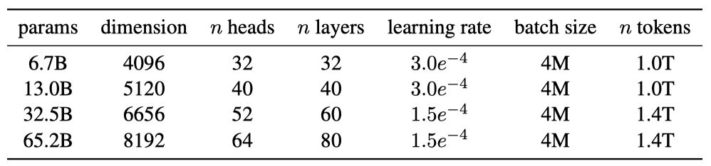
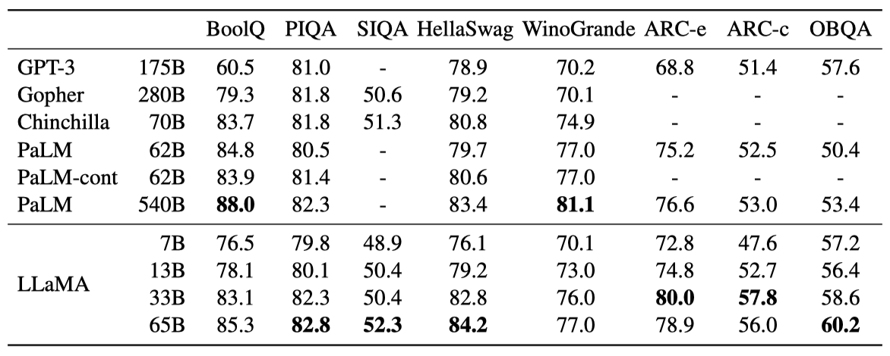
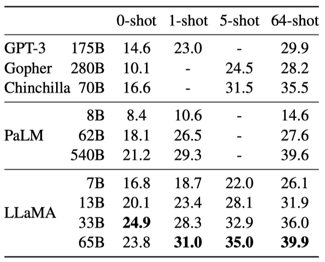
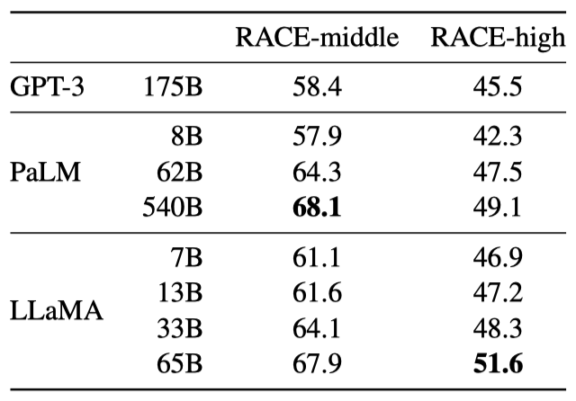
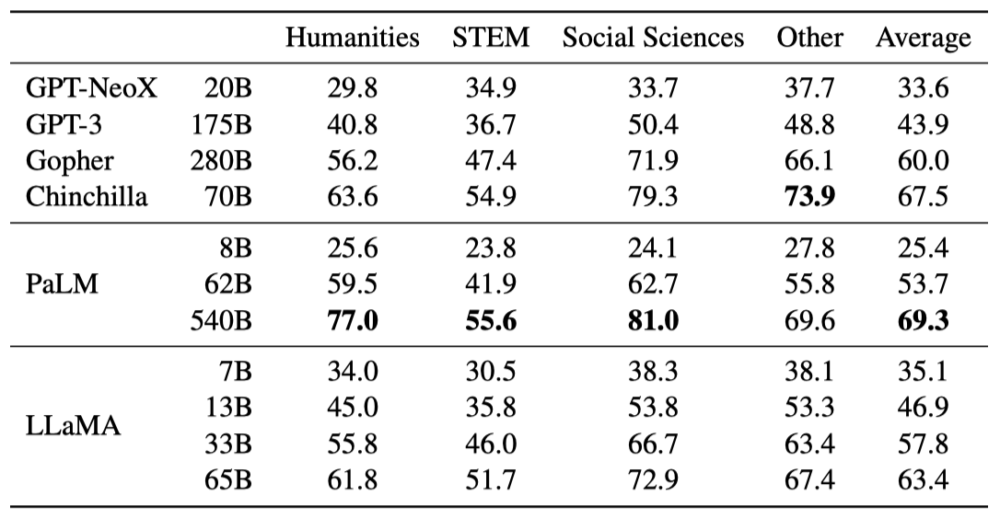
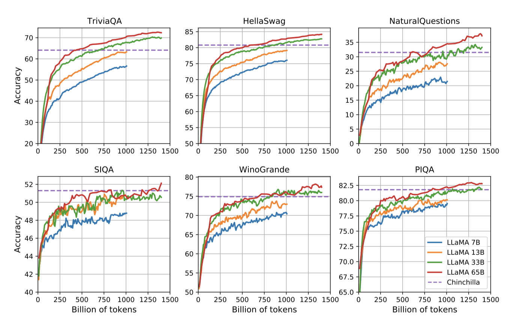
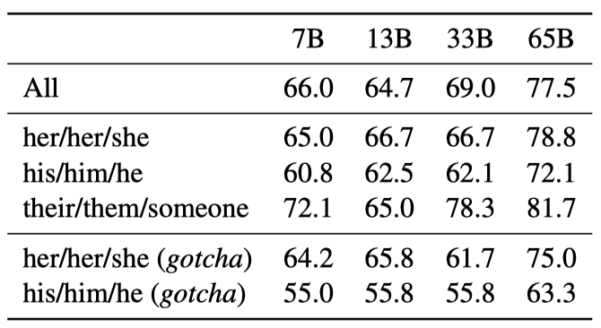
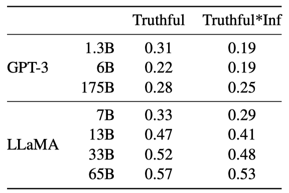
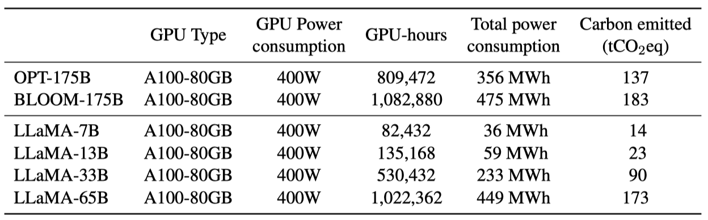

+++
author = "Kurt"
title = "LLaMA"
date = "2024-03-09"
description = "Open and Efficient Foundation Language Models"
categories = [
    "Paper Review"
]
tags = [
    "LLM",
    "Milestone",
]
+++

## Abstract

LLaMA는 7B에서 65B parameter의 기본 언어 모델 컬렉션이다. 이 모델들은 수조 개의 토큰에 대해 학습되었고, 공개적으로 사용 가능한 데이터셋만을 사용하여 최고 수준의 모델을 학습시킬 수 있음을 보여준다. 특히, LLaMA-13B는 대부분의 벤치마크에서 GPT-3를 능가하며, LLaMA-65B는 최고의 모델과 경쟁력이 있다. 이 모델들은 모두 연구 커뮤니티에 공개되었다.

---

## Introduction

거대 언어 모델(Large Languages Models, LLMs)은 텍스트 지시나 소수의 예제를 통해 새로운 작업을 수행할 수 있다. 이런 능력은 모델 규모를 충분히 확대할 때 나타났고, 이를 더 확대하려는 연구가 진행되고 있다. 하지만 최근 연구에서는 더 많은 parameter가 더 나은 성능을 가져다 주지 않는다는 것을 보여주었다. 오히려 주어진 컴퓨팅 예산 내에서 더 많은 데이터로 학습된 작은 모델이 최상의 성능을 보여주었다.

Hoffmann et al.의 연구는 학습 예산에 따라 데이터셋과 모델 크기를 어떻게 최적화할지에 초점을 맞추고 있다. 하지만 추론 예산을 고려하지 않았고, 이는 대규모 언어 모델을 서비스하는 데 중요하다. 특정 성능 목표가 있을 때, 학습 속도보다는 추론 속도가 더 빠른 모델이 선호되며, 큰 모델을 학습하는 것보다 작은 모델을 오래 학습하는 것이 추론에서 더 저렴하다는 것이 확인되었다. 10B 모델을 200B 토큰에서 훈련하는 것을 권장하지만, 1T 토큰 이후에도 7B 모델의 성능이 계속 향상되는 것을 발견하였다.

이 연구는 일반적으로 사용하는 것보다 더 많은 토큰으로 학습하여 다양한 추론 예산에서 최고의 성능을 달성하는 언어 모델, LLaMA를 개발했다. 이 모델은 7B에서 65B의 parameter를 가지며, 기존 최고의 언어 모델과 경쟁력이 있다. 예를 들어, 10배 작은 LLaMA-13B는 대부분의 벤치마크에서 GPT-3를 능가한다. 이 모델은 단일 GPU에서 실행될 수 있어 언어 모델의 접근성과 연구를 민주화(democratize)하는데 도움이 될 것이다. 또한, 65B parameter 모델은 최고의 거대 언어 모델과도 경쟁력이 있다.

이 연구는 공개적으로 이용 가능한 데이터만을 사용하여 Chinchilla, PaLM, GPT-3와 달리 오픈 소스와 호환성이 있다. 대부분의 기존 모델들은 공개적으로 이용 가능하지 않거나 문서화되지 않은 데이터에 의존한다. OPT, GPT-NeoX, BLOOM, GLM 등의 일부 예외가 있지만, 이들 중 어느 것도 PaLM-62B나 Chinchilla와 경쟁력이 없다.

이 논문에서는 transformer 아키텍처에 가한 수정 사항과 학습 방법을 소개하고, 이 모델의 성능을 표준 벤치마크와 비교한다. 또한, 책임감 있는 AI 커뮤니티의 최근 벤치마크를 사용하여 모델의 편향과 독성을 분석한다.

---

## Approach

이전 연구와 Chinchilla scaling law을 참고하여, standard optimizer를 이용해 대량의 텍스트 데이터에서 large transformer를 학습시키는 방식을 채택하였다.

### Pre-training Data

학습 데이터셋은 다양한 분야를 다루는 여러 출처의 조합이며, 공개적으로 사용 가능하고 오픈 소스와 호환되는 데이터만을 사용한다. 이는 학ㅂ 세트에서 특정 비율을 차지하는 다양한 데이터의 조합을 생성하였다.

**English CommonCrawl [67%].** 2017년부터 2020년까지의 CommonCrawl 덤프 5개를 CCNet 파이프라인을 사용해 전처리하였다. 이 과정에서 영어가 아닌 페이지 제거, 저질 내용 필터링, 데이터 중복 제거 등이 이루어졌으며, 위키피디아 참조 페이지와 무작위 페이지를 분류하는 모델을 학습시켰다.

**C4 [15%].** 탐색적 실험을 통해 다양한 전처리된 CommonCrawl 데이터셋의 사용이 성능 향상에 도움이 된다는 것을 확인하였다. 그래서 데이터에 C4 데이터셋을 포함시켰다. C4의 전처리 과정도 중복 제거와 언어 식별이 포함되어 있으며, 품질 필터링은 주로 웹페이지의 구두점, 단어, 문장 수 등의 휴리스틱에 의존한다.

**Github [4.5%].** Google BigQuery의 공개 GitHub 데이터셋을 사용하고, Apache, BSD, MIT 라이선스의 프로젝트만 선택하였다. 줄 길이나 알파벳/숫자 문자 비율을 기반으로 저질 파일을 필터링하고, 정규식을 사용해 보일러플레이트를 제거하였다. 마지막으로, 파일 수준에서 완전히 일치하는 부분을 중복 제거하였다.

**Wikipedia [4.5%].** 2022년 6월부터 8월까지의 기간 동안의 20개 언어(라틴 또는 키릴 문자 사용) 위키피디아 덤프를 추가했고, 하이퍼링크, 댓글 등의 형식화된 요소를 제거하기 위해 데이터를 처리하였다.

**Gutenberg and Books3 [4.5%].** 학습 데이터셋에는 공공 도메인의 Gutenberg Project와 대형 언어 모델 학습용 데이터셋인 ThePile의 Books3 섹션을 포함하고 있다. 책 레벨에서 90% 이상 내용이 겹치는 책을 제거하는 중복 제거를 수행하였다.

**ArXiv [2.5%].** arXiv의 Latex 파일을 처리하여 데이터셋에 과학적 데이터를 추가하였다. 첫 번째 섹션 이전과 참고문헌을 제거하고, .tex 파일의 댓글을 제거하며, 사용자가 작성한 정의와 매크로를 인라인으로 확장하여 논문 간 일관성을 높였다.

**Stack Exchange [2%].** 다양한 분야의 고품질 질문과 답변을 제공하는 Stack Exchange의 덤프를 포함시켰다. 가장 큰 28개 웹사이트의 데이터를 보존하고, 텍스트에서 HTML 태그를 제거한 후 답변을 점수 순으로 정렬하였다.

**Tokenizer.** SentencePiece의 구현을 사용하여 bytepair encoding(BPE) 알고리즘으로 데이터를 토큰화하며, 모든 숫자를 개별 숫자로 분리하고, 알 수 없는 UTF-8 문자를 바이트로 분해한다.

토큰화 후 학습 데이터셋은 대략 1.4T의 토큰을 포함하며, 대부분의 학습 데이터는 학ㅂ 중 토큰을 한 번만 사용한다. 단, 위키피디아와 책 분야는 예외로, 이 부분은 대략 두 번의 epoch를 수행한다.

### Architecture

이 연구의 네트워크는 transformer 아키텍처를 기반으로 하며, 그 후에 제안된 여러 가지 개선사항을 활용하였다. 이는 PaLM과 같은 다양한 모델에서도 사용되었다. 이러한 변화의 영감은 원래 아키텍처와의 주요 차이점에서 찾았다.

**Pre-normalization [GPT3].** 학습의 안정성을 위해, 각 transformer 하위 계층의 입력을 정규화하며, 이에는 Zhang and Sennrich가 소개한 RMSNorm 정규화 함수를 사용한다.

**SwiGLU activation function [PaLM].** 성능 향상을 위해 ReLU 비선형성을 Shazeer가 소개한 SwiGLU 활성화 함수로 대체하며, PaLM의 $4d$ 대신 ${{2}\over{3}}4d$ 차원을 사용한다.

**Rotary Embeddings [GPTNeo].** absolute positional embedding을 제거하고, 대신 Su et al. 이 소개한 rotary positional embedding(RoPE)을 네트워크 각 계층에 추가하였다.

### Optimizer

이 연구의 모델은 AdamW optimizer를 사용해 학습되며, cosine learning rate schedule, 0.1의 weight decay, 1.0의 gradient clipping, 2,000개의 warmup step을 적용하였다. 모델의 크기에 따라 학습률과 배치 크기를 조정하였다.

### Efficient implementation

모델의 학습 속도를 향상시키기 위해, 메모리 사용량과 런타임을 줄이는 causal multi-head attention의 efficient implementation을 사용한다. 이는 xformers 라이브러리에서 가능하며, 주의력 가중치를 저장하지 않고, 언어 모델링 작업의 인과성으로 인해 마스킹된 키/쿼리 점수를 계산하지 않는다.

학습 효율성을 높이기 위해, 체크포인팅을 사용하여 backward pass 동안 재계산되는 activation의 양을 줄였다. linear layer의 출력과 같은 계산 비용이 높은 activation을 저장하는 방식이다. 이를 위해 transformer layer의 backward 함수를 수동으로 구현하였고, 모델의 메모리 사용량을 줄이기 위해 모델과 시퀀스 병렬성을 사용하였다. 또한, activation 계산과 GPU 간 통신을 최대한 겹치게 하였다.

65B parameter 모델 학습시, 코드는 RAM이 80GB인 2048 A100 GPU에서 초당 약 380 토큰을 처리한다. 따라서, 1.4T 토큰이 포함된 데이터셋에서 학습하는데 대략 21일이 걸린다.

---

## Main results

이전 연구를 따라, zero-shot과 few-shot 작업을 진행하고 20개의 벤치마크 결과를 보고하였다.

* **Zero-shot.** 작업에 대한 텍스트 설명과 테스트 예시를 제공하며, 모델은 열린 생성을 이용해 답변을 제공하거나, 제안된 답변을 순위 매긴다.
* **Few-shot.** 작업의 몇 가지 예시와 테스트 예시를 제공하고, 모델은 이를 입력으로 받아 답변을 생성하거나 옵션을 순위 매긴다.

LLaMA는 공개되지 않은 언어 모델인 GPT-3, Gopher, Chinchilla, PaLM, 그리고 오픈소스 OPT 모델, GPT-J, GPTNeo 등과 비교한다. 또한, instruction-tuned 모델인 OPT-IML과 Flan-PaLM과도 비교한다.

LLaMA는 자유 형식 생성 작업과 다중 선택 작업에서 평가된다. 다중 선택 작업은 주어진 맥락에 따라 가장 적절한 완성을 선택하는 것이 목표이다. 완성의 문자 수로 정규화된 가능성을 사용하며, 특정 데이터셋에 대해서는 "답변:"이 맥락으로 주어진 완성의 가능성으로 정규화된 가능성에 따라 완성을 선택한다.

### Common Sense Reasoning

상식 추론 벤치마크 8개를 고려하여 평가를 진행한다. 이 데이터셋들은 Cloze와 Winograd 스타일의 작업, 다중 선택 질문 응답 등을 포함하고 있으며, zero-shot 설정에서 평가를 진행한다.

LLaMA-65B는 대부분의 벤치마크에서 Chinchilla-70B와 PaLM-540B를 능가하며, 크기가 10배 작은 LLaMA-13B 모델은 대부분의 벤치마크에서 GPT-3를 능가한다.

### Closed-book Question Answering

LLaMA는 Natural Questions과 TriviaQA라는 두 closed-book 질문 응답 벤치마크에서 기존 대형 언어 모델과 비교된다. LLaMA-65B는 zero-shot과 few-shot 설정에서 최고 성능을 보이며, 크기가 5-10배 작은 LLaMA-13B도 GPT-3와 Chinchilla와 경쟁력이 있다. LLaMA-13B는 추론 시 단일 V100 GPU에서 실행된다.

### Reading Comprehension

RACE 읽기 이해 벤치마크에서 평가한 결과, LLaMA-65B는 PaLM-540B와 경쟁력이 있으며, LLaMA-13B는 GPT-3를 몇 퍼센트 앞선다. 이 데이터셋은 중고등학생을 대상으로 한 영어 읽기 이해 시험에서 수집되었다.

### Mathematical reasoning

이 연구의 모델은 MATH와 GSM8k라는 두 수학적 추론 벤치마크에서 평가된다. 이 모델은 수학 데이터에 미세 조정되지 않음에도 불구하고, GSM8k에서 Minerva-62B를 능가하는 성능을 보여주었다. 이 결과는 각 문제에 대해 샘플을 생성하고 다수결 투표를 수행하는 maj1@k 방법을 이용하여 평가되었다.

### Code generation

자연어 설명을 바탕으로 코드를 작성하는 능력을 평가한 결과, 이 연구의 모델은 코드에 미세 조정되지 않은 기존의 언어 모델인 PaLM과 LaMDA와 비교할 수 있는 성능을 보여주었다. 이 모델은 프로그램의 설명과 입력-출력 예시를 받아 파이썬 프로그램을 생성하는 작업을 수행한다.

비슷한 수의 parameter를 가진 LLaMA는 코드에 특화되지 않은 LaMDA와 PaLM을 능가한다. 13B parameter 이상을 가진 LLaMA는 HumanEval과 MBPP에서 LaMDA 137B를 능가하며, LLaMA 65B는 훈련 시간이 더 길어도 PaLM 62B를 능가한다. 이 결과는 특정 온도에서 샘플링하여 얻은 것이다.

코드에 특화된 토큰에 대해 미세 조정하면 코드 작성 성능이 향상된다. 예를 들어, PaLM-Coder는 HumanEval에서 PaLM의 점수를 26.2%에서 36%로 높였다. 코드 작성을 위해 특별히 학습된 다른 모델들도 일반 모델보다 더 뛰어난 성능을 보이지만, 이는 본 논문의 범위를 벗어나는 내용이다.

### Massive Multitask Language Understanding

다양한 지식 도메인을 다루는 대규모 다중 작업 언어 이해 벤치마크(MMLU)에서, 이 연구의 모델인 LLaMA-65B는 평균적으로 Chinchilla70B와 PaLM-540B에 비해 뒤처진다. 이는 사전 학습 데이터에서 제한된 양의 책과 학술 논문만 사용했기 때문일 수 있이다. 이와 대조적으로, 이런 모델들은 최대 2TB의 책에 대해 학습되었으며, 이 때문에 Gopher는 이 벤치마크에서 GPT-3를 능가하는 성능을 보여준다.

### Evolution of performance during training

학습 중에 몇 가지 질문 응답 및 상식 벤치마크에서 모델의 성능을 추적하였다. 대부분의 벤치마크에서 성능은 꾸준히 향상되며, 이는 모델의 학습 perplexity와 관련이 있다. 그러나 SIQA와 WinoGrande는 예외로, SIQA는 성 큰 변성 관찰였고, WinoGrande는 성능과 학습 perplexity 사이 상관계 뚜렸했다.

---

## Instruction Finetuning

간단한 지시사항 데이터에 대해 빠르게 미세 조정하면 MMLU 성능이 빠르게 향상된다. 미세 조정되지 않은 LLaMA-65B는 이미 기본 지시사항을 따르지만, 소량의 미세 조정이 성능을 더욱 향상시킨다. 이는 본 논문의 주요 초점이 아니므로, 지시 모델인 LLaMA-I를 학습시키는 한 번의 실험만 수행하였다.

instruct 모델인 LLaMA-I는 MMLU에서 68.9%의 성능을 보여주며, 이는 OPT-IML 및 Flan-PaLM 시리즈 같은 기존의 적당한 크기의 지시 미세 조정 모델들을 능가한다. 그러나 이는 아직도 최첨단인 GPT code-davinci-002의 MMLU에서의 77.4에는 미치지 못한다.

---

## Bias, Toxicity and Misinformation

대형 언어 모델은 학습 데이터의 편향을 재현하고 확대하며, 독성이나 불쾌한 내용을 생성할 수 있다. 학습 데이터가 웹에서 가져온 대량의 데이터를 포함하고 있기 때문에, 모델이 이런 내용을 생성할 가능성을 파악하는 것이 중요하다. 이를 이해하기 위해, LLaMA-65B를 독성 내용 생성과 스테레오타입 감지를 측정하는 다양한 벤치마크에서 평가하였다. 그러나 이런 평가는 모델과 관련된 위험을 완전히 이해하는 데는 충분하지 않다.

### RealToxicityPrompts

언어 모델은 모욕, 혐오 발언 또는 위협 등의 독성을 가진 언어를 생성할 수 있다. 이를 철저히 평가하는 것은 어렵다. 최근 연구들은 RealToxicityPrompts 벤치마크를 사용해 모델의 독성을 평가했지만, 이 벤치마크는 모델이 프롬프트를 완성하고, 그 결과를 PerspectiveAPI로 자동 평가하는 방식으로 이루어진다. 이 제3자 API의 파이프라인을 제어할 수 없어, 이전 모델과의 비교가 어렵다.

100k의 프롬프트 각각에 대해 모델로 생성하고 독성 점수를 측정한다. RealToxicityPrompts의 기본 및 존중스러운 프롬프트 카테고리에서의 평균 점수는 문헌에서 보고된 것과 비교 가능하다. 그러나 독성은 모델 크기에 따라 증가하며, 특히 존중스러운 프롬프트에서 그렇다. 이는 모델 패밀리 내에서만 독성과 모델 크기 사이의 관계가 적용될 수 있음을 나타낸다.

### CrowS-Pairs

CrowSPairs 데이터셋을 이용해 모델의 편향을 평가한다. 이 데이터셋은 9개 범주의 편향을 측정할 수 있다. 각 예제는 스테레오타입과 반 스테레오타입으로 구성되며, zero-shot 설정에서 두 문장의 perplexity를 통해 모델의 스테레오타입 선호도를 측정한다. 더 높은 점수는 더 큰 편향을 나타낸다. 이 결과는 GPT-3와 OPT-175B와 비교되었다.

LLaMA는 평균적으로 다른 두 모델보다 약간 더 좋은 성능을 보인다. 특히 이 논문의 모델은 종교, 연령, 성별 등의 카테고리에서 뚜렷한 편향을 보이며, 이는 여러 차례의 필터링에도 불구하고 CommonCrawl에서 나온 것으로 보인다.

### WinoGender

성별 카테고리에 대한 모델의 편향을 더욱 깊게 조사하기 위해 WinoGender 벤치마크를 사용한다. WinoGender는 Winograd 스키마로 만들어진 공동 참조 해결 데이터셋으로, 모델이 대명사의 성별에 따라 공동 참조 해결 성능에 영향을 받는지로 편향을 평가한다.

각 문장은 "직업", "참가자", "대명사" 세 가지 언급으로 구성되며, 모델은 이를 통해 공동 참조 관계를 판단한다. 이는 모델이 직업과 관련된 사회적 편향을 잡아낼 수 있는지 확인하는 것이 목표이다. 예를 들어, "The nurse notified the patient that his shift would be ending in an hour."라는 문장에서 "His"가 누구를 가리키는지 모델이 판단한다. 그리고 "her/her/she", "his/him/he", "their/them/someone" 세 가지 대명사를 사용하여 성능을 평가한다.

모델은 "their/them/someone" 대명사에 대한 공동 참조 해결을 "her/her/she"와 "his/him/he" 대명사보다 더 잘 수행한다. 이는 이전 연구에서도 발견되었으며, 성별 편향을 나타낼 수 있다. 실제로, 모델은 문장의 증거를 사용하는 대신 직업의 대다수 성별을 사용하여 공동 참조 해결을 수행할 수 있다.

이 가설을 더 조사하기 위해, WinoGender 데이터셋의 "gotcha" 사례를 살펴보았다. 이는 대명사가 직업의 대다수 성별과 일치하지 않지만, 올바른 답이 직업인 경우를 말한다. LLaMA-65B가 이런 예제에서 더 많은 오류를 범함을 확인하였다. 이는 모델이 성별과 직업과 관련된 사회적 편향을 포착하고 있다는 것을 보여준다. 이러한 성능 저하는 성별에 관계없이 나타나, 편향이 있다는 것을 나타낸다.

### TruthfulQA

TruthfulQA는 모델의 진실성, 즉 사실을 판별하는 능력을 측정한다. 이는 실제 세계에 대한 진실을 기준으로 하고, 모델이 잘못된 정보나 거짓 주장을 만들어내는 위험을 평가할 수 있다. 질문은 다양한 스타일로 작성되었고, 38개의 카테고리를 포함하며, 적대적으로 설계되었다.

진실성 있는 모델을 측정하고 진실성과 유익함의 교집합을 측정하기 위해 모델의 성능을 보고한다. GPT-3와 비교했을 때, 두 카테고리 모두에서 더 높은 점수를 얻지만, 정답률은 여전히 낮다. 이는 모델이 잘못된 답변을 만들어낼 가능성이 있음을 보여준다.

---

## Carbon footprint

모델의 학습은 대량의 에너지를 소비하고, 이로 인해 이산화탄소가 배출되었다. 전체 에너지 소비와 그로 인한 탄소 발자국을 분석하며, 이를 위해 Wu et al. (2022)의 공식을 사용해 모델 학습에 필요한 Watt-hour과 탄소 배출량을 추정한다.

$$ Wh = GPU-h \times (\text{GPU power consumption}) \times PUE $$

전력 사용 효율(PUE)을 1.1로 설정한다. 네트워크 학습에 사용된 데이터 센터의 위치에 따라 탄소 배출량이 달라진다. 예를 들어, BLOOM은 $27 t CO_2 eq$, OPT는 $82 t CO_2 eq$의 탄소를 배출한다. 이 연구에서는 같은 데이터 센터에서 학습된 모델의 탄소 배출량을 비교하며, 데이터 센터의 위치를 고려하지 않고 미국의 평균 탄소 강도 인자를 사용한다. 이로 인해 탄소 배출량에 대한 공식이 도출된다.

$$ t CO_2 eq = MWh \times 0.385. $$

OPT와 BLOOM에 동일한 공식을 적용하여 공정하게 비교하였다. OPT의 경우 34일 동안 992개의 A100-80B가 필요했으며, 이 연구의 모델을 개발하는 데는 약 5개월 동안 2048개의 A100-80GB를 사용하였다. 이로 인해 약 2,638 MWh의 에너지가 소비되었고, 총 $1015 t CO_2 eq$의 탄소가 배출되었다. 이 모델들을 공개함으로써 미래의 탄소 배출을 줄일 수 있을 것으로 기대한다. 일부 모델은 작아서 단일 GPU에서 실행할 수 있다.

---

## Related work

**Language models** 언어 모델은 단어나 문자의 순서에 대한 확률 분포로, 자연어 처리의 핵심 문제이다. 이는 다음 토큰 예측의 형태로 종종 표현된다. 튜링이 "imitation game"을 통해 기계 지능을 측정하는 것을 제안한 이후, 언어 모델링은 인공 지능 발전의 지표로 제안되었다.

**Architecture.** 전통적인 언어 모델은 n-gram 통계에 기반하며, 다양한 스무딩 기법을 통해 드문 이벤트의 추정을 개선하였다. 최근 20년간 신경망을 활용한 언어 모델링이 성공적으로 이루어졌고, 특히 self-attention 기반의 transformer 네트워크는 긴 범위 의존성을 포착데 큰 발전끌어냈다.

**Scaling.** 언어 모델의 크기와 데이터셋 크기를 확장하는 것은 오래된 연구 주제이다. 2T 토큰으로 학습된 언어 모델이 기계 번역의 품질 향상에 이바지함을 확인하였다. 웹 규모 데이터에 대한 스무딩 기법의 확장 방법을 통해, CommonCrawl에서 975B 토큰에 대한 5-gram 모델을 학습시키고, 이로 500B개의 n-gram을 가진 모델을 만들었다. 또한 One Billion Word 벤치마크는 언어 모델의 발전을 측정하기 위한 대규모 훈련 데이터셋으로 소개되었다.

neural 언어 모델에서는 LSTM을 1B 개의 parameter로 확장하여 중요한 성과를 얻었다. 이후 transformer의 확장은 많은 NLP 작업의 개선을 이끌어냈다. 특히, GPT-3와 같은 대형 언어 모델들은 중요한 돌파구를 제공하였다. 스케일링이 딥러닝 모델의 성능에 미치는 영향을 연구한 결과, 모델과 데이터셋 크기 그리고 시스템 성능 사이에 power law가 존재함이 밝혀졌다. 마지막으로, 스케일링이 대형 언어 모델의 능력에 어떤 영향을 미치는지 연구가 이루어졌다.

---

## Conclusion

이 논문에서는 공개적으로 사용할 수 있는 데이터만을 사용하여 state-of-the-art를 달성한 언어 모델들을 제시하였다. 이 모델들은 기존의 대형 언어 모델과 경쟁력이 있다. 또한, 이러한 모델들을 공개함으로써 대형 언어 모델의 발전을 가속화하고, 강인성을 향상시키고, 독성과 편향 문제를 완화하는 데 도움이 될 것을 기대한다. 이들 모델을 지시사항에 미세 조정하는 것이 유망한 결과를 가져올 수 있음을 발견하였으며, 더 큰 규모의 모델을 미래에 출시할 계획이다.

---

## Reference

* [Paper](https://arxiv.org/pdf/2302.13971.pdf)
* [Github](https://github.com/facebookresearch/llama)