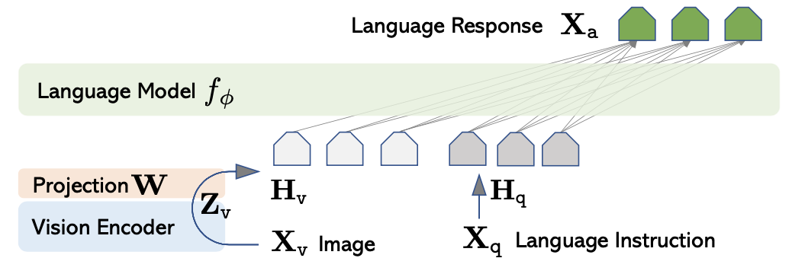

+++
author = "Kurt"
title = "LLaVA"
date = "2024-03-18"
description = "Visual Instruction Tuning"
categories = [
    "Paper Review"
]
tags = [
    "LLM",
    "Milestone",
]
draft = true
+++

## Abstract

기계 생성 지침 데이터를 사용해 대형 언어 모델(LLM)을 지침 조정하는 새로운 접근 방식을 제시한다. GPT-4를 이용해 멀티모달 언어-이미지 지침 따르기 데이터를 생성하고, 이를 기반으로 LLaVA: Large Language and Vision Assistant 모델을 개발하였다. LLaVA는 비전 인코더와 LLM을 연결한 멀티모달 모델로, 다양한 도전적인 작업을 평가할 수 있는 두 개의 벤치마크를 구성하였다. 실험 결과, LLaVA는 멀티모달 GPT-4와 유사한 성능을 보이며, GPT-4와 비교해 85.1%의 상대 점수를 기록하였다. Science QA에서는 92.53%의 최고 정확도를 달성하였다.

---

## Introduction

인간은 시각과 언어를 통해 세상을 이해하며, 각각의 채널은 고유한 장점을 지닌다. 인공지능의 주요 목표 중 하나는 이러한 다중 모달 지시를 따라 실제 작업을 수행할 수 있는 범용 어시스턴트를 개발하는 것이다.

연구 커뮤니티는 언어 보강 시각 모델 개발에 대한 관심이 높아졌으며, 이는 분류, 검출, 분할, 캡션 작성, 시각적 생성 및 편집에서 강력한 성능을 보여준다. 그러나 이러한 모델들은 작업을 독립적으로 해결하고 언어는 이미지 설명에만 사용되어, 상호작용성과 사용자 지시 적응성에 한계가 있다.

대규모 언어 모델(LLM)은 언어를 통해 다양한 작업 지시를 명확히 표현하고, 범용 어시스턴트를 위한 보편적 인터페이스로 활용될 수 있음을 보여주었다. ChatGPT와 GPT-4의 성공은 LLM의 지시 수행 능력을 입증했으며, LLaMA, Alpaca, Vicuna 등은 오픈 소스 LLM의 성능을 높였다. 이러한 연구는 모두 텍스트 기반이다.

이 논문에서는 instruction-tuning을 언어-이미지 다중 모달로 확장해 범용 시각 어시스턴트 개발을 위한 첫 시도로서, 다음과 같은 기여를 한다.

* 다중 모달 지시 데이터: ChatGPT/GPT-4를 활용해 이미지-텍스트 쌍을 지시 수행 형식으로 변환하는 파이프라인을 제시.  
* 대규모 다중 모달 모델: CLIP과 Vicuna를 연결한 모델을 생성된 데이터로 미세 조정해 성능을 검증, GPT-4와 결합해 Science QA에서 최첨단 성과 달성.  
* 벤치마크: 다양한 이미지와 지시를 포함한 두 개의 벤치마크, LLaVA-Bench를 제시.  
* 오픈 소스: 데이터, 코드베이스, 모델, 시각적 채팅 데모 공개.

---

## Related Work

**Multimodal Instruction-following Agents.** 컴퓨터 비전 분야에서 지시 수행 에이전트는 두 가지로 나뉜다: (i) **엔드투엔드 학습 모델**: 시각-언어 내비게이션과 이미지 편집 등 특정 작업에 맞춰 개별적으로 학습된다. (ii) **모델 조정 시스템**: LangChain이나 LLMs를 사용해 다양한 모델을 조정하는 시스템으로, Visual ChatGPT, X-GPT 등이 이에 해당한다. 이 논문에서는 여러 작업을 수행할 수 있는 엔드투엔드 언어-비전 다중 모달 모델 개발에 중점을 두고 있다.

**Instruction Tuning.** 자연어 처리(NLP)에서는 GPT-3, T5 등 대규모 언어 모델을 지시 조정하여 zero-shot 및 few-shot 일반화 능력을 향상시키는 방법이 연구되었다. 이를 통해 InstructGPT, FLAN-T5 등 지시 조정 모델이 개발되었으며, 이러한 아이디어를 컴퓨터 비전으로 자연스럽게 확장되었다. Flamingo, BLIP-2, FROMAGe와 같은 다중 모달 모델도 존재하지만, 비전-언어 지시 데이터로 명시적으로 조정되지 않아 다중 모달 작업에서 성능이 부족하다. 본 논문은 이 격차를 메우고 시각적 지시 조정의 효과를 연구한다. 시각적 지시 조정은 모델의 지시 수행 능력 향상을 목표로 하며, 시각적 프롬프트 조정과는 다르다.

---

## GPT-assisted Visual Instruction Data Generation

커뮤니티에서 이미지-텍스트 쌍과 같은 다중 모달 데이터의 급증을 경험했지만, 다중 모달 지시 수행 데이터는 부족하다. 이 연구에서는 ChatGPT/GPT-4를 활용하여 널리 존재하는 이미지 쌍 데이터를 기반으로 지시 수행 데이터를 수집할 것을 제안한다.

이미지 Xv와 캡션 Xc에 대해, GPT-4를 사용하여 질문 집합 Xq를 생성하고, 이를 기반으로 간단한 지시 수행 버전을 만들 수 있다: Human : Xq Xv$<$STOP$>$ Assistant : Xc$<$STOP$>$. 그러나 이 방법은 비용이 적지만 다양성과 깊이 있는 추론이 부족하다.

이 문제를 해결하기 위해, 언어 전용 GPT-4나 ChatGPT를 사용하여 시각적 콘텐츠가 포함된 지시 수행 데이터를 생성한다. 이미지의 시각적 특징을 텍스트 전용 GPT에 입력하기 위해, 캡션과 바운딩 박스라는 두 가지 상징적 표현을 활용한다.

이 상징적 표현을 통해 이미지를 LLM이 인식할 수 있는 시퀀스로 변환한다. COCO 이미지를 사용하여 세 가지 유형의 지시 수행 데이터를 생성하며, 각 유형에 대해 몇 가지 예제를 수동으로 설계하여 GPT-4의 인컨텍스트 학습에 사용한다.

* *Conversation.* 어시스턴트와 사람이 사진에 대해 질문과 답변을 주고받는 대화를 설계하며, 다양한 시각적 질문을 포함한다.
* *Detailed description.* 이미지에 대한 풍부한 설명을 위해 GPT-4에 질문 목록을 제공하고, 무작위로 선택한 질문으로 상세 설명을 생성한다.
* *Complex reasoning.* 시각적 내용에 대해 깊이 있는 추론 질문을 생성하며, 답변은 단계별 논리를 요구한다.

총 158,000개의 언어-이미지 지시 수행 샘플을 수집하였다. 이 중 58,000개는 대화, 23,000개는 상세 설명, 77,000개는 복잡한 추론에서 수집되었다. 초기 실험에서 GPT-4가 ChatGPT보다 더 높은 품질의 데이터를 제공한다는 것을 발견하였다.

---

## Visual Instruction Tuning

### Architecture

목표는 사전 학습된 LLM과 시각 모델의 능력을 효과적으로 활용하는 것이다. 언어 작업에서 최고의 지시 수행 능력을 가진 Vicuna 를 LLM으로 선택했습니다.

입력 이미지 $X_v$에 대해, 사전 학습된 CLIP 시각 인코더 ViT-L/14를 사용하여 시각적 특징 $Z_v$를 추출한다. 이 특징을 단어 임베딩 공간으로 변환하기 위해, 학습 가능한 프로젝션 매트릭스 $W$를 사용하여 언어 임베딩 토큰 $H_v$를 생성한다:

$$ H_v = W \cdot Z_v, Z_v = g(X_v) $$

따라서, 시각적 토큰 시퀀스 $ H_v $를 생성하며, 간단한 프로젝션 방식으로 데이터 중심 실험을 신속하게 진행할 수 있다. 더 정교한 이미지-언어 연결 방식, 예를 들어 Flamingo의 gated cross-attention이나 BLIP-2의 Q-former도 고려할 수 있으며, 이는 향후 연구로 남겨둔다.

### Training

각 이미지 $ X_v $에 대해 다중 턴 대화 데이터 $ (X_{1q}, X_{1a}, \cdots, X_{Tq}, X_{Ta}) $를 생성한다. 데이터를 시퀀스로 구성하고, 각 턴에서 어시스턴트의 응답을 답변으로, 지시를 $ X_{t_{\text{instruct}}} $로 설정한다. $ t = 1 $에서는 지시를 무작위로 선택하고, 나머지 턴에서는 $ X_{tq} $를 지시로 사용합니다.

$$
\mathbf{X}_{\text{instruct}}^t =
\begin{cases} 
    \text{Randomly choose } [\mathbf{X}_q^1, \mathbf{X}_v] \text{ or } [\mathbf{X}_v, \mathbf{X}_q^1], & \text{the first turn } t=1 \\\\
    \mathbf{X}_q^t, & \text{the remaining turns } t > 1
\end{cases}
$$

이로 인해 다중 모달 지시 수행 시퀀스의 통합 형식이 만들어지며, LLM의 예측 토큰에 대해 auto-regressive 학습 목표로 지시 조정을 수행한다.

길이 $ L $의 시퀀스에 대해, 목표 답변 $ X_a $의 확률은 다음과 같이 계산된다:

$$ p(X_a | X_v, X_{instruct}) = \prod_{i=1}^{L} p_\theta(x_i | X_v, X_{instruct}, <i, X_a, <i) $$

여기서 $ \theta $는 학습 가능한 파라미터이고, $ X_{instruct, <i} $와 $ X_{a, <i} $는 현재 예측 토큰 이전의 지시와 답변 토큰이다. 이미지를 기준으로 강조하기 위해 $ X_v $를 추가하며, 가독성을 위해 $ X_{system-message} $와 이전 $<$STOP$>$은 생략한다. LLaVA 모델 학습에는 두 단계의 지시 조정 절차를 사용한다.

**Stage 1: Pre-training for Feature Alignment.** 개념 범위와 학습 효율성을 위해, CC3M에서 595,000개의 이미지-텍스트 쌍을 필터링하고, 이를 단순 확장 방법으로 지시 수행 데이터로 변환한다. 각 샘플은 단일 턴 대화로 처리되며, 이미지에 대해 무작위로 질문을 샘플링하여 어시스턴트가 이미지를 간단히 설명하도록 요청한다. 학습 시 시각 인코더와 LLM의 가중치는 동결하고, 프로젝션 매트릭스 $ W $만을 학습하여 시각적 토크나이저를 조정한다.

**Stage 2: Fine-tuning End-to-End.** 시각 인코더의 가중치는 동결된 상태로 유지하고, LLaVA에서는 프로젝션 레이어와 LLM의 가중치만 업데이트한다. 학습 가능한 파라미터는 $ \theta = \lbrace W, \phi \rbrace $이다. 두 가지 사용 사례 시나리오를 고려한다.

* *Multimodal Chatbot.* 158,000개의 데이터로 챗봇을 학습시키며, 대화는 다중 턴, 나머지 두 가지는 단일 턴으로 샘플링된다.
* *Science QA.* ScienceQA 벤치마크에서 방법을 테스트한다. 질문에는 자연어 또는 이미지 컨텍스트가 포함되며, 어시스턴트는 자연어로 추론과 답변을 제공한다. 데이터를 단일 턴 대화로 구성하여 학습한다.

---

## Experiments

LLaVA의 지시 수행과 시각적 추론을 다중 모달 챗봇과 ScienceQA 데이터셋을 통해 평가한다. 모델은 8× A100s로 학습되며, CC-595K 서브셋에서 1 에폭 동안 학습하고, LLaVA-Instruct-158K 데이터셋에서 3 에폭 동안 미세 조정한다. 

### Multimodal Chatbot

---

## Reference

* [Paper](https://arxiv.org/pdf/2304.08485)
* [Github](https://github.com/haotian-liu/LLaVA)