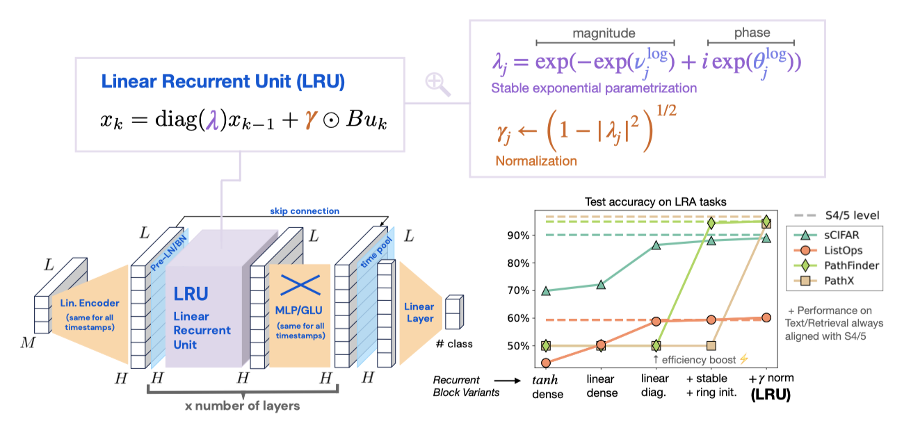
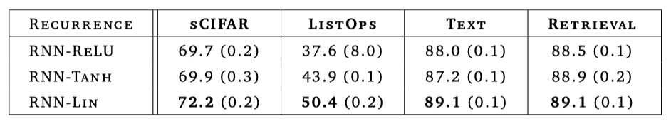

+++
author = "Kurt"
title = "LRU"
date = "2024-08-30"
description = "Resurrecting Recurrent Neural Networks for Long Sequences"
categories = [
    "Paper Review"
]
tags = [
    "LLM",
    "Milestone",
]
draft = true
+++

## Abstract

Recurrent Neural Networks(RNNs)는 긴 시퀀스에서 빠른 추론을 제공하지만 학습 속도가 느리고 최적화가 어렵다. 최근 Deep state-space models(SSMs)은 긴 시퀀스 모델링에서 뛰어난 성능과 빠른 훈련 속도를 보여주었다. 이 논문에서는 표준 신호 전파 기법을 통해 깊은 RNN의 성능을 개선하고 학습 속도를 높일 수 있음을 보여준다. 이를 위해 RNN의 회귀를 선형화하고 대각화하며, 매개변수화와 초기화를 개선하고, 순방향 전파를 적절히 정규화하는 방법을 사용하였다. 결과적으로 Long Range Arena 벤치마크에서 SSMs와 동일한 성능과 효율성을 갖춘 'Linear Recurrent Unit'을 제안한다.

---

## Introduction

순환 신경망(RNNs)은 딥러닝 초기부터 순차적 데이터 모델링에 중요한 역할을 해왔으나, 기울기 소실 및 기울기 폭주 문제로 인해 학습이 어렵고 장기 종속성 학습에 한계가 있다. 이를 해결하기 위해 LSTM, GRU 등 여러 기술이 개발되었지만, 여전히 계산이 순차적이어서 최적화가 느리고 확장하기 어렵다.

최근 Transformer 모델은 순차 데이터 처리에서 큰 성공을 거두었으며, RNNs보다 학습 시 확장성과 병렬화가 용이하다. 그러나 Transformer는 계산 및 메모리 비용이 시퀀스 길이에 따라 제곱적으로 증가하기 때문에 긴 시퀀스에 대해 비용이 많이 들 수 있다. 반면, RNNs는 시퀀스 길이에 선형적으로 비례하여, 비교적 짧은 시퀀스에서는 추론 속도가 더 빠를 수 있다.

Gu et al. (2021a)은 S4 모델을 소개하였다. S4는 deep state-space model(SSM)로, Long Range Arena (LRA) 벤치마크에서 뛰어난 성능을 보인다. S4는 연속 시간 선형 상태공간 모델에서 영감을 받았으며, attention 레이어의 $O(L^2)$ 병목 현상을 숨겨진 상태를 통해 극복한다. 이 모델은 RNN처럼 레이어를 전개하여 추론 시 효율적이며, 시간 차원에서 선형적이어서 학습 중 병렬화가 용이하다.

S4 모델은 추론 시 RNN과 유사하지만, 학습 중에는 미분 방정식의 연속 시간 시스템을 이산화하여 매개변수화하고, 다항식 투영 이론에 기반한 초기화를 사용한다. 그러나 후속 연구에서는 이러한 초기화가 성능에 필수적이지 않으며, 이론과 다른 이산화 규칙이 더 나은 성능을 낼 수 있다고 제안하였다. 따라서, S4의 독특한 특성과 그 단순화 가능성은 아직 명확하지 않다.

RNN과 deep state-space model(SSMs)의 유사성을 바탕으로, 긴 거리 추론을 위한 깊은 아키텍처에서 RNN의 성능과 한계를 연구하여 그 기본 메커니즘을 이해하는 것이 이 연구의 주요 목표이다.

> "deep state-space model(SSMs)의 성능과 효율성을 deep RNN으로 맞출 수 있을까?""

기본 RNN에 작은 변화를 주어 S4와 같은 deep state-space model의 성능과 효율성을 달성할 수 있음을 보여준다. 이 새로운 RNN 모델을 'Linear Recurrent Unit' 또는 줄여서 LRU라고 부른다.

**Main Steps.** 이 논문에서는 성능이 뛰어나고 효율적인 RNN 모델을 만드는 주요 단계를 설명하며, 새로운 관점과 신중한 분석을 통해 깊은 RNN의 훈련과 초기화에서의 도전 과제와 최선의 방법을 제시한다.

* **Linear Recurrences.** SSM 레이어를 기본 RNN 레이어로 교체하면 LRA에서 성능이 크게 떨어지지만, 선형 회귀를 사용하면 테스트 정확도가 향상된다. 선형 RNN과 비선형 MLP 블록을 조합하면 비선형 시퀀스 매핑을 효과적으로 모델링할 수 있으며, 비선형성을 제거하면 기울기 문제를 제어하고 학습을 병렬화할 수 있다. 이러한 점이 깊은 SSM의 성공을 부분적으로 설명한다.

* **Complex Diagonal Recurrent Matrices.** 밀집 선형 RNN 레이어는 대각 형태로 재매개변수화할 수 있으며, 이는 학습 속도를 크게 향상시킨다. 이러한 접근은 이전 SSM들에서도 사용되었으며, 선형 RNN 레이어의 효율성도 개선한다.

* **Stable Exponential Parameterization.** 대각 순환 행렬에 지수 매개변수를 사용하면 학습 중 안정성을 보장하고 긴 거리 추론을 촉진할 수 있음을 보여준다. 초기화 시 순환 레이어의 고유값 분포가 긴 거리 추론의 성능을 결정한다.

* **Normalization.** 긴 거리 의존성이 있는 작업에서 순방향 전파의 활성화 정규화가 중요하다고 설명하며, 이 수정으로 RNN이 LRA 벤치마크에서 깊은 SSM과 같은 성능을 발휘할 수 있음을 보여준다. 또한, 이 정규화가 S4의 이산화 구조와 어떻게 연결되는지 설명한다.

이 논문에서는 깊은 선형 순환 유닛(LRU) 아키텍처와 각 단계의 성능 영향을 요약한다. 주된 목적은 S4 모델의 성능을 초월하는 것이 아니라, 적절히 초기화된 단순 RNN이 긴 거리 추론에서 강력한 성능을 발휘할 수 있음을 보여주는 것이다.

---

## Preliminaries

RNNs과 SSMs의 주요 구성 요소를 비교하고, 방법론과 실험 설정을 설명한다.

### Recap of recurrent block structures

이 논문에서는 Vanilla RNNs와 최신 S4 계열 심층 SSMs의 주요 차이점을 중심으로 주요 아키텍처 구성 요소를 비교한다.

**RNN Layer.** $(u_1, u_2, \ldots, u_L)$을 $H$차원 입력 시퀀스라고 할 때, $N$차원의 은닉 상태를 가진 RNN 계층은 학습 가능한 매개변수 $\mathbf{A}$, $\mathbf{B}$, $\mathbf{C}$, $\mathbf{D}$를 통해 $H_{\text{out}}$ 차원의 출력 시퀀스 $(y_1, y_2, \ldots, y_L)$를 다음과 같이 계산한다:

$$ x_k = \sigma(\mathbf{A}x_{k-1} + \mathbf{B}u_k), y_k = \mathbf{C}x_k + \mathbf{D}u_k $$

여기서 $x_0 = 0$이며, $\sigma$는 주로 $\tanh$나 시그모이드 비선형 함수이다. $\sigma$가 항등 함수이면, 해당 RNN은 선형이다.

**S4-like recurrent layer.** 이 논문에서는 Gu et al. (2021a)에서 도입된 S4 재귀의 단순화된 버전을 제시한다. 입력 시퀀스 $(u_0, u_1, \ldots, u_{L-1})$는 $\Delta > 0$의 스텝 크기로 샘플링된 연속 시간 신호로 간주되며, 출력 시퀀스 $(y_0, y_1, \ldots, y_{L-1})$도 동일한 방식으로 샘플링된다. 이 모델은 다음과 같은 연속 시간 상태 공간 모델로 표현된다:

$$ \frac{d x_{ct}(t)}{dt} = \tilde{\mathbf{A}} x_{ct}(t) + \tilde{\mathbf{B}} u_{ct}(t), y_{ct}(t) = \Re(\tilde{\mathbf{C}} x_{ct}(t)) + \tilde{\mathbf{D}} u_{ct}(t), $$

여기서 $\tilde{\mathbf{A}}$는 대각선 형태의 복소수 행렬이며, $\tilde{\mathbf{B}}$, $\tilde{\mathbf{C}}$, $\tilde{\mathbf{D}}$는 복소수 매개변수이다. 이 모델은 연속 시간 특성을 무시하면 위 식과 비교했을 때 계산이 선형이고, 매개변수가 복소수라는 점이 차별점이다. 학습과 추론을 위해 이 시스템은 ZOH 방법을 사용해 이산화되며, 다음과 같은 형태를 가진다:

$$ x_k = \mathbf{A}x_{k-1} + \mathbf{B}u_k, y_k = \mathbf{C}x_k + \mathbf{D}u_k, $$

여기서 $\mathbf{A} = \exp(\Delta \tilde{\mathbf{A}})$ 등으로 정의된다.

**Some key differences.** RNN과 SSM의 주요 차이점은 다음과 같다:

- 위 식 은 선형이기 때문에 비선형 RNN과 달리 병렬 스캔을 사용해 효율적으로 병렬화할 수 있다.
- $A$와 $B$ 행렬은 이산화에 의해 규정된 방식으로 매개변수화되며, 매개변수를 공유한다. 이는 SSM이 연속 시간 매개변수를 학습하기 때문에 중요한 차이점이다.
- 대부분의 SSM은 HiPPO 이론으로 초기화된 복소수 대각 행렬을 사용하며, 이러한 초기화가 SSM의 성공에 중요한 역할을 한다.

이를 바탕으로, SSM 계층을 RNN으로 교체하고 S4와 유사한 성능을 회복하기 위한 단계를 연구하였다.

### Experimental setup

이 논문은 Long Range Arena 벤치마크(Tay et al., 2020)를 사용하여 장기 시퀀스 모델링 능력을 평가한다. 심층 SSM이 뛰어난 성능을 보여주었기 때문에, 이 벤치마크는 심층 RNN의 장기 모델링 능력을 탐구하는 데 적합하다. 

실험은 6개의 계층을 가진 네트워크에서 SSM 계층을 RNN 계층으로 교체하여 진행하며, 각 실험은 세 번 반복되어 평균과 표준 오류를 보고한다. 네트워크는 AdamW 옵티마이저로 학습되며, 학습률과 하이퍼파라미터는 로그 그리드에서 조정된다.

## Designing Performant Deep RNNs

이 섹션에서는 RNN이 LRA 벤치마크에서 심층 SSM과 유사한 성능을 내기 위해 필요한 단계를 설명한다. 서론에서 개요를 제시한 후, 각 단계는 실험적 증거와 이론적 고찰로 뒷받침된다. 

### Linear RNN layers are performant

이 연구의 주요 발견은 선형 RNN 계층이 비선형 MLP 또는 GLU와 결합될 때 매우 효과적이라는 점이다. 비선형성을 제거하고 단순히 $ x_k = A x_{k-1} + B u_k $로 계산하는 것만으로도 LRA 작업에서 성능이 향상되었다. 비록 선형 RNN의 성능이 S4보다 낮지만, 이 결과는 논문에서 비선형성을 제거할 동기를 제공한다. 이후 섹션에서는 선형 재귀의 장점을 활용해 학습 속도를 높이고, 장기 종속성을 학습하기 위한 초기화 및 정규화 방법을 제안한다. 텍스트와 검색 작업에서는 vanilla RNN이 깊은 SSM과 유사한 성능을 보인다.

결과는 비선형성이 RNN 성공의 핵심이라고 여겨지는 기존의 이론과 실제와는 달리, 선형 RNN 계층이 비선형 MLP 또는 GLU 블록과 결합될 때 효과적이라는 점을 보여준다. 깊은 모델에서 비선형성이 신호를 더 높은 주파수로 전달하여 시스템의 표현력을 높이고, 선형 RNN과 비선형 피드포워드 블록의 결합이 비선형 시스템을 잘 근사할 수 있음을 논의한다. 비선형 활성화는 학습 속도를 늦출 수 있다는 점도 강조된다.

### Using complex diagonal recurrent matrices is efficient

복소수 대각 행렬을 사용하여 깊은 선형 RNN의 학습과 추론 속도를 성능 저하 없이 크게 향상시킬 수 있음을 보여준다. 이 섹션에서는 Gupta et al. (2022a)의 DSS를 기반으로, Glorot 초기화된 선형 RNN의 초기화 스펙트럼에 맞춘 대각화된 버전을 구성하고, 초기화와 대각화가 성능에 미치는 영향을 분리하는 방법을 논의한다.

#### Linear RNN eigendecomposition

재귀 관계 $x_k = A x_{k-1} + B u_k$는 $x_{-1} = 0 \in \mathbb{R}^N$이라는 가정 하에 쉽게 전개할 수 있으며, 결과적으로:

$$ x_k = \sum_{j=0}^{k-1} A^j B u_{k-j} $$

행렬 $A$의 지수는 RNN에서 기울기 소실/폭주 문제를 유발한다. 비선형 RNN에서는 상태가 활성화 함수의 컴팩트 이미지에 제한되지만, 선형 RNN에서는 상태가 지수적으로 폭주하거나 소실될 수 있다. 이를 해결하기 위해, $A = P \Lambda P^{-1}$로 대각화할 수 있다.

$$ \bar{x}\_k = \sum_{j=0}^{k-1} \Lambda^j \bar{B} u_{k-j} $$

여기서 $\bar{x}_k := P^{-1} x_k$ 및 $\bar{B} := P^{-1} B$이다. 출력 $y_k = \Re[\bar{C} \bar{x}_k] + D u_k$를 계산하고, $\Lambda, \bar{B}, \bar{C}$를 학습하면 성능을 유지하면서도 효율적으로 학습할 수 있다.

**Are complex numbers really necessary?** 대각화된 비대칭 행렬을 간편하게 표현하기 위해 복소수를 사용한다. 그러나 실수를 사용해서도 유사한 효율을 얻을 수 있다.

**Stability.** 타임스탬프 $k$에서 $\bar{x}\_k$의 성분 $j$는 $|x_{k,j}| = O(|\lambda|^k)$로 진화한다. 따라서 안정성을 보장하려면 모든 $j$에 대해 $|\lambda_j| < 1$이어야 한다.

#### Learning in the diagonalized space

---

## Reference

* [Paper](https://arxiv.org/pdf/2303.06349)
* [Github](https://github.com/Gothos/LRU-pytorch)