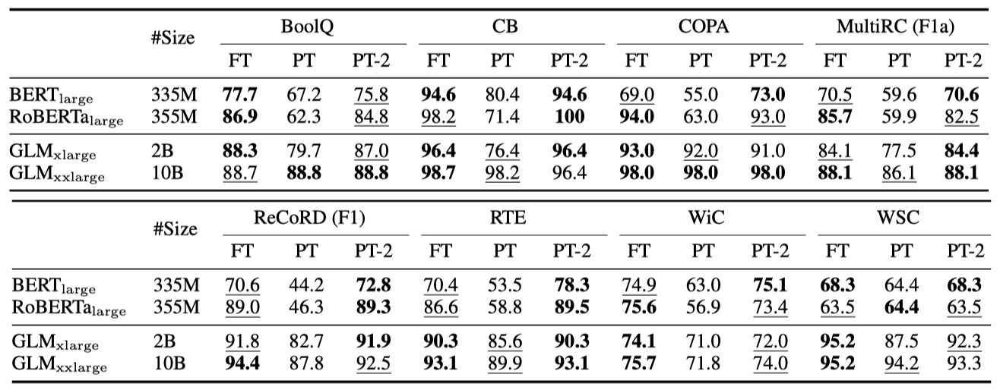
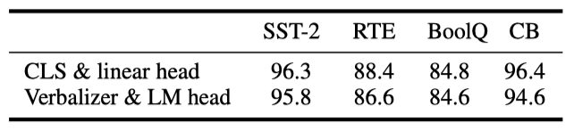

+++
author = "Kurt"
title = "P-Tuning v2"
date = "2024-03-28"
description = "Prompt Tuning Can Be Comparable to Fine-tuning Universally Across Scales and Tasks"
categories = [
    "Paper Review"
]
tags = [
    "LLM",
    "PEFT",
]
+++

## Abstract

prompt tuning은 학습 시 저장 공간과 메모리 사용을 줄이지만, 기존 방법들은 NLU에서 일반적인 모델에 잘 작동하지 않고 어려운 시퀀스 라벨링 작업에 대한 범용성이 부족하다. 그러나, 적절히 최적화된 prompt tuning은 다양한 모델 규모와 NLU 작업에 대해 보편적으로 효과적이며, 조정된 parameter가 극히 적음에도 미세조정과 동등한 성능을 제공한다. P-Tuning v2는 NLU에 최적화된 Deep Prompt Tuning의 구현으로, 미세조정의 대안이자 미래 연구의 강력한 기준이 될 수 있다.

---

## Introduction

사전 학습된 언어 모델들은 자연어 이해 작업의 성능을 향상시키지만, 미세 조정 방법은 학습 중 많은 메모리를 소모하고, 큰 모델 크기로 인해 추론 시 각 작업에 대한 모델 parameter를 유지하는 것이 불편하다.

**Prompting** 프롬프팅은 사전 학습된 모델의 parameter를 고정시키고 자연어 프롬프트로 언어 모델을 질의하여 학습 없이 사용한다. 이 방법은 모델 parameter의 단일 복사본만을 필요로 하지만, discrete 프롬프팅은 미세 조정에 비해 많은 경우 최적의 성능을 내지 못할 수 있다.

**Prompt tuning** 프롬프트 튜닝은 입력 시퀀스에 학습 가능한 연속적 임베딩을 추가하는 방식으로, 많은 작업에서 기존 프롬프팅보다 성능이 개선되었다. 하지만, 모델 크기가 10B parameter 미만일 때와 어려운 시퀀스 라벨링 작업에서는 미세 조정에 비해 성능이 떨어지는 것으로 나타났다.

이 논문의 핵심 기여는 적절히 최적화된 프롬프트 튜닝이 여러 모델 규모와 NLU 작업에서 미세 조정과 유사한 성능을 낼 수 있다는 것을 발견한 점이다. 이것은 프롬프트 튜닝의 보편적 가능성과 NLU에 대한 잠재력을 새롭게 보여준다.

P-tuning v2는 Deep Prompt Tuning의 최적화된 버전으로, 사전 학습된 모델의 모든 layer에 연속적 프롬프트를 적용함으로써 주요 개선을 이루었다. 이 접근법은 특히 소형 모델과 어려운 작업에서 미세 조정과의 격차를 줄이며, 미세 조정에 준하는 성능을 보장하기 위한 최적화 및 구현상의 중요한 세부 사항들을 제공한다.

실험 결과, P-tuning v2는 300M에서 10B parameter의 모델 규모와 어려운 시퀀스 태깅 작업에서 미세 조정과 비슷한 성능을 보여주었다. 또한, 미세 조정 대비 학습 가능한 parameter가 0.1%에서 3%로 적어 학습 시간과 저장 비용을 대폭 절감한다.

---

## Preliminaries

**NLU Tasks.** 이 연구에서는 NLU 과제를 간단한 분류 작업과 어려운 시퀀스 라벨링 작업으로 나눈다. 분류 작업은 라벨 공간을 대상으로 하며, GLUE와 SuperGLUE 데이터셋 대부분이 여기에 해당한다. 반면, 시퀀스 라벨링 작업은 토큰 시퀀스 분류를 다루며, 명명된 개체 인식과 추출형 질문 응답이 이에 속한다.

**Prompt Tuning.** 언어 모델 $M$에서, discrete 프롬프팅은 프롬프트 토큰 {"It", "is", "[MASK]"}를 사용해 영화 리뷰를 분류한다. 예로, "Amazing movie!" 리뷰는 임베딩 시퀀스 [e("Amazing movie!"), e("It"), e("is"), e("[MASK]")]로 변환된다.

Lester et al. (2021)과 Liu et al. (2021)은 NLU를 위해 사전 학습된 언어 모델의 parameter를 고정시키고 자연어 프롬프트 대신 학습 가능한 연속적 프롬프트를 사용하였다. 이 방법은 입력 임베딩 시퀀스에 학습 가능한 임베딩을 추가하여, 간단한 분류 작업에서 10B parameter 모델의 미세 조정과 유사한 성능을 달성하였다.

---

## P-Tuning v2

### Lack of Universality

Lester et al. (2021)과 Liu et al. (2021)의 연구는 다양한 NLP 응용 분야에서 효과적임이 입증되었으나, 보편성 부족으로 인해 미세 조정을 완전히 대체하기에는 아직 미흡하다.

**Lack of universality across scales.** Lester et al. (2021)에 따르면, 모델이 10B parameter를 초과할 경우 프롬프트 튜닝은 미세 조정과 유사한 성능을 낼 수 있지만, 100M에서 1B parameter를 가진 중간 크기 모델에서는 미세 조정보다 성능이 떨어진다.

**Lack of universality across tasks.** Lester et al. (2021)과 Liu et al. (2021)의 연구는 NLU 벤치마크에서 우수한 결과를 보였지만, 어려운 시퀀스 태깅 작업에서의 프롬프트 튜닝 효과는 입증되지 않았다. 시퀀스 태깅은 verbalizers와 호환되지 않을 수 있는 복잡한 작업이며, 실험 결과 이들 방법은 미세 조정에 비해 시퀀스 태깅에서 성능이 낮음을 보여준다.

이러한 도전을 고려하여, 규모와 NLU 작업에 걸쳐 보편적인 해결책으로 deep 프롬프트 튜닝을 적용하는 Ptuning v2를 제안한다.

### Deep Prompt Tuning

Lester et al. (2021)과 Liu et al. (2021)에서는 연속적인 프롬프트를 입력 임베딩 시퀀스에 삽입하는데, 이는 시퀀스 길이 제약으로 조정 가능한 parameter가 제한되고, 입력 임베딩이 모델 예측에 간접적인 영향을 미치는 문제를 야기한다.

P-tuning v2는 deep 프롬프트 튜닝을 적용하여, 다양한 layer에 프롬프트를 pre-fix 토큰으로 추가함으로써 도전을 해결한다. 이 방법은 작업별로 더 많은 조정 가능한 parameter를 제공하며(0.01%에서 0.1%-3%), 더 깊은 layer의 프롬프트는 모델 예측에 직접적인 영향을 미친다.

### Optimization and Implementation

최적의 성능을 위한 몇 가지 중요한 최적화 및 구현 팁이 있다.

**Reparameterization.** 이전 연구들은 학습 가능한 임베딩을 변환하기 위해 주로 reparameterization encoder인 MLP를 사용하였다. 하지만 NLU 분야에서는 MLP의 효용성이 작업과 데이터셋에 따라 다르다는 것을 발견하였다. 일부 데이터셋에서는 MLP가 성능을 일관되게 향상시키는 반면, 다른 데이터셋에서는 미미하거나 부정적인 영향을 미쳤다.

**Prompt Length.** P-Tuning v2에서는 프롬프트 길이가 중요하며, 다양한 NLU 작업은 서로 다른 프롬프트 길이에서 최고 성능을 보여준다. 간단한 분류 작업은 짧은 프롬프트를, 복잡한 시퀀스 라벨링 작업은 긴 프롬프트를 선호한다.

**Multi-task Learning.** 다중 작업 학습은 공유된 연속 프롬프트로 여러 작업을 함께 최적화하는 방식이다. P-Tuning v2에서 다중 작업은 선택적이지만, 성능 향상을 위해 더 나은 초기화로 사용될 수 있다.

**Classification Head.** 언어 모델링 헤드를 이용한 verbalizer 예측은 프롬프트 튜닝의 핵심이었으나, 전체 데이터 설정과 시퀀스 라벨링에는 부적합함을 발견하였다. 따라서 P-tuning v2는 BERT처럼 randomly-initialized classification head를 토큰 위에 적용한다.

P-tuning v2의 핵심 기여를 강조하기 위해, 기존 프롬프트 튜닝 방식과의 비교를 제시하였다.

---

## Experiments

P-tuning v2의 효과를 검증하기 위해, 다양한 사전 학습된 모델과 NLU 작업에 대한 실험을 진행하였다. 이 과정에서 미세 조정을 제외한 모든 방법은 언어 모델을 고정한 상태로 수행되었으며, 이는 Lester et al. (2021)의 방식을 따르고 Liu et al. (2021)의 방식과는 차이가 있다.

작업 특정 parameter 비율(예: 0.1%)은 프롬프트와 transformers’ parameter 비교로 나온다. 실험은 모두 완전 감독 설정에서, few-shot이 아니라는 점도 중요하다.

**NLU Tasks.** P-tuning v2의 NLU 능력 테스트를 위해, SuperGLUE 데이터셋을 사용하였고, 명명된 개체 인식, 추출형 질의응답, 의미 역할 라벨링 등 시퀀스 라벨링 작업들을 추가로 도입하였다.

**Pre-trained Models.** 평가를 위해 BERT-large, RoBERTa-large, DeBERTa-xlarge, GLMxlarge/xxlarge 등 다양한 크기(300M에서 10B)의 양방향 NLU 모델들을 사용하였다.

**Multitask Learning.** 다중 작업 설정에서는 작업 유형별로 데이터셋 학습 세트를 결합하고, 연속 프롬프트를 공유하며 각 데이터셋에 대해 별도의 선형 분류기를 사용한다.

### P-tuning v2: Across Scales

P-tuning v2는 작은 규모에서 모든 작업에 걸쳐 미세 조정과 동등한 성능을 보이며, 특히 RTE에서는 미세 조정보다 훨씬 뛰어난 성능을 나타낸다.

대규모(2B~10B)에서 GLM을 사용하면, 미세 조정과의 격차가 좁혀지며, 10B 규모에서 프롬프트 튜닝이 경쟁력을 갖는다는 것을 관찰하였다. 그러나 P-tuning v2는 모든 규모에서 미세 조정과 비슷한 성능을 보이면서도 미세 조정 대비 단 0.1%의 작업 특정 parameter만 필요하다.

### P-tuning v2: Across Tasks

P-tuning v2는 대부분의 작업에서 미세 조정과 유사한 성능을 보이지만, 특히 QA 같은 어려운 작업에서는 P-tuning과 Lester et al. (2021)이 낮은 성능을 나타낸다. SQuAD 2.0에서 비정상적인 결과는 답변 불가능한 질문 때문에 단일 레이어 프롬프트 튜닝의 최적화에 어려움을 겪었기 때문일 가능성이 있다. 다중 작업 학습은 QA를 제외한 대부분의 작업에서 P-Tuning v2의 성능을 크게 향상시킨다.

### Ablation Study

**Verbalizer with LM head v.s. [CLS] label with linear head.** 이전 방식에서 중요했던 LM 헤드를 가진 verbalizer 대신, P-tuning v2에서는 수천 개 parameter를 가진 linear head 튜닝이 가능하다. hyperparameter를 동일하게 유지하고 [CLS] 라벨만 LM 헤드 verbalizer로 변경하였다. SST-2, RTE, BoolQ는 "true"/"false", CB는 "true"/"false"/"neutral"를 사용하였다. 결과적으로 verbalizer와 [CLS] 성능 사이에 큰 차이가 없음을 확인했다.

**Prompt depth.** Lester et al. (2021) 및 Liu et al. (2021)과 P-tuning v2의 차이는 멀티 레이어 연속 프롬프트에 있다. 이 영향을 확인하기 위해, 특정 k layer에 프롬프트를 오름차순과 내림차순으로 추가하고 나머지는 그대로 두었다. 결과적으로, 같은 수의 parameter를 가진 상태에서 내림차순으로 프롬프트를 추가하는 것이 더 좋은 성능을 보였고, 특히 RTE에서는 17-24 layer에만 프롬프트를 추가해도 모든 레이어에 추가할 때와 유사한 성능을 얻을 수 있었다.

---

## Conclusions

P-tuning v2는 프롬프트 튜닝 방법을 제안한다. 기술적 신규성은 제한적이지만, 330M에서 10B parameter에 이르는 다양한 규모와 작업에서 미세 조정과 비슷한 성능을 낼 수 있다는 새로운 발견을 제시한다. 높은 정확도와 parameter 효율성으로, P-Tuning v2는 미세 조정의 대안이자 미래 연구의 강력한 기준이 될 수 있다.

---

## Reference

* [Paper](https://arxiv.org/pdf/2110.07602.pdf)
