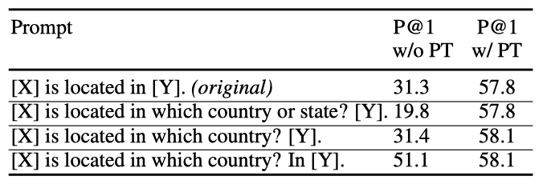
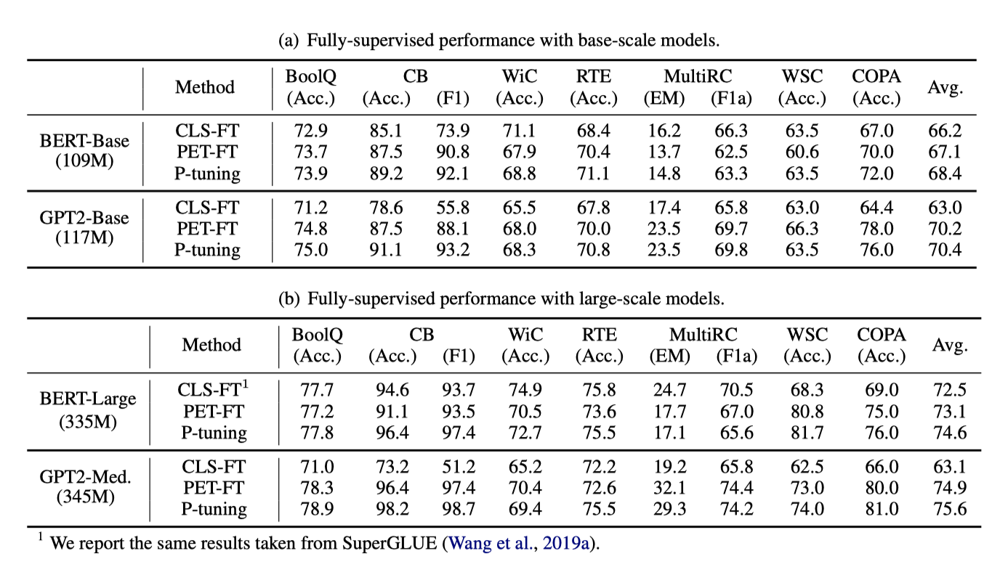
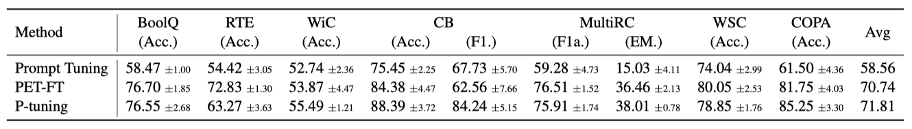
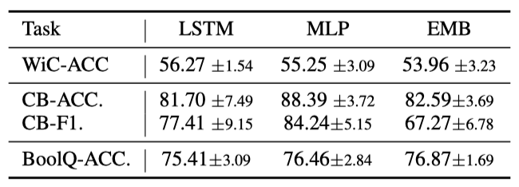

+++
author = "Kurt"
title = "P-Tuning"
date = "2024-03-24"
description = "GPT Understands, Too"
categories = [
    "Paper Review"
]
tags = [
    "LLM",
    "PEFT",
]
+++

## Abstract

사전 학습된 언어 모델에 자연어 패턴을 사용하는 것은 효과적이지만, manual discrete 프롬프트는 성능이 불안정할 수 있다. 이에 대한 해결책으로, 학습 가능한 연속 프롬프트 임베딩을 사용하는 P-Tuning 방법을 제안한다. P-Tuning은 다양한 discrete 프롬프트 사이의 격차를 줄이고, LAMA와 SuperGLUE 등 여러 NLU 작업에서 성능을 크게 향상시킨다. 이 방법은 fully-supervised 및 few-shot 설정에서, frozen 및 tuned 모델 모두에 효과적이다.

---

## Introduction

사전 학습된 언어 모델(PLMs)은 다양한 학습 목표와 프롬프팅 기법을 활용하여 자연어 이해(NLU)의 성능을 크게 개선했하였다. 이러한 모델들은 마스킹, autoregressive, seq2seq, 순열 언어 모델링과 같은 방법으로 학습되며, 수동으로 작성된 프롬프트를 추가 입력으로 사용하여 더욱 향상된다. 프롬프팅은 특히 작은 데이터 세트에 미세 조정하거나 직접 추론을 하는 데 있어서 NLU 작업의 성능을 크게 향상시켰다.

manual discrete 프롬프트는 큰 불안정성을 보이며, 언어 모델의 단어 하나만 바꿔도 성능이 크게 떨어질 수 있다. 언어 모델을 조정하면 이 문제가 다소 완화되지만, 다른 프롬프트 간 성능 차이는 여전히 크게 나타나며, 특히 few-shot 설정에서 두드러진다. 이는 실제로 큰 도전 과제이며, 최근 자동 프롬프팅 방식도 이런 불안정성의 근본적인 문제를 해결하지 못하고 있다.

discrete 프롬프트의 불안정성을 해결하기 위해, P-Tuning 방법이 제안되었다. 이 방법은 학습 가능한 연속 프롬프트 임베딩을 discrete 프롬프트와 결합하여 언어 모델에 입력한다. 연속 프롬프트는 학습 과정에서 업데이트되어 학습 안정성을 개선하고, 작은 변화에도 견딜 수 있게 한다. 또한, 연속 프롬프트 임베딩 간 의존성을 모델링하기 위해 LSTM이나 MLP를 포함하는 프롬프트 encoder를 사용하여 성능을 더 향상시킨다.

LAMA와 SuperGLUE라는 두 NLU 벤치마크 실험에서, P-Tuning은 언어 모델을 고정하거나 미세 조정함으로써, manual discrete 프롬프트와 검색된 프롬프트, 그리고 PET 방법보다 우수한 성능을 보여주었다. 특히, P-Tuning은 다양한 작업과 설정에서 discrete 프롬프트 간 성능 차이를 줄여 언어 모델의 안정성을 크게 향상시켰다.

---

## Method

### Issues with Discrete Prompts

프롬프팅은 사전 학습된 언어 모델을 하위 작업에 맞게 조정하기 위해 자연어 패턴을 사용하는 기법이며, 다양한 NLP 작업에서 큰 개선을 보여주었다. 그러나 효과적인 프롬프트를 작성하는 것은 여전히 어려운 문제이다.

LAMA 지식 탐색 실험에서 다양한 수동 프롬프트 사용 결과, 프롬프트의 작은 변화가 성능에 큰 영향을 미쳐 불안정한 결과를 초래하였다. 예를 들어, 프롬프트에서 단어 하나만 바꿔도 성능이 20점이나 급락하였다.

최근 연구들은 학습 코퍼스 탐사, 그라디언트 기반 검색, 사전 학습된 생성 모델을 이용해 이산 프롬프트 검색 절차를 자동화하려 시도하였다. 그러나 이 방법들은 프롬프트의 불안정성 문제와 이산 공간 검색의 한계를 해결하지 못한다. 이에 대응해, 언어 모델 적응 성능을 안정화 및 개선하기 위해 연속 프롬프트 학습의 가능성을 탐구한다.

### P-Tuning

사전 학습된 언어 모델 $M$을 사용해, 이산 토큰 시퀀스 $x$와 레이블 $y$를 포함한 NLU 작업 데이터셋에서, $M$의 parameter를 미세 조정하거나 고정하여 조건부 확률 $f_M(x) = p̂(y | x)$을 추정하는 것이 목표이다.

Schick and Schütze (2020)에 의해 제안된 이산 토큰 형태의 프롬프트는 레이블이 있는 데이터를 텍스트 토큰 시퀀스로 재구성하여, 작업을 텍스트의 빈칸 채우기로 변환한다. 예를 들어, "The capital of [INPUT] is [LABEL]."과 같은 프롬프트를 사용해 "The capital of Britain is [MASK]."처럼 데이터를 재구성하고, "[MASK]"를 통해 "London"과 같은 레이블을 예측한다. 이 프로세스는 이산 프롬프트와 데이터를 입력 임베딩으로 매핑한다.

$$ \lbrace e(D_0)...e(D_i), e(x_0), ..., e(x_n), ..., e(D_k) \rbrace $$

사전 학습된 임베딩 층을 통해, 여기서 $e \in \mathbb{R}^{|V|×d} 이다.

이산 프롬프트의 불안정성과 역전파 최적화 문제를 해결하기 위해, 연속적인 프롬프트 임베딩을 사용하는 P-Tuning 방식을 제안한다.

$$ T = \lbrace [P_{0:i}], x, [P_{(i+1):j}], y, [P_{(j+1):k}] \rbrace $$

P-Tuning은 함수 $f$를 이용해 템플릿을 $h_i$로 매핑한다.

$$ \lbrace h_0 , ..., h_i , e(x), h_{i+1}, ..., h_j, e(y), h_{j+1}, ..., h_k \rbrace $$

마지막으로, 작업 손실 함수 최적화를 위해 $\lbrace P_i \rbrace_{i=1}^k$ 임베딩을 업데이트한다.

이산 및 연속 프롬프트의 결합은 성능 향상을 가져오며, P-Tuning은 언어 모델의 동결 및 미세조정에 모두 사용된다.

### Prompt Encoder

해당 프레임워크에서는 임베딩 $\lbrace P_i \rbrace$를 입력 $\lbrace h_i \rbrace$로 매핑하는 함수 f를 활용한다. 이는 독립적 학습 가능 임베딩보다 프롬프트 임베딩 간 의존성 모델링에 유리하다. 구현에는 경량 신경망을 사용하며, LSTM, MLPs, 항등 매핑 함수를 실험적으로 탐구한다.

---

## Experiments

LAMA와 SuperGLUE 두 NLU 벤치마크를 사용해 지식 탐색과 자연어 이해를 평가한다. SuperGLUE에서는 fully-supervised 학습과 few-shot 학습을 모두 다룬다.

LAMA에서는 언어 모델을 고정하고 프롬프트만 조정하며, SuperGLUE에서는 언어 모델을 조정한다. 언어 모델 parameter와 연속적 프롬프트를 동시에 최적화하며, 이는 이전 연구의 표준 설정을 따르고, 조정된 및 고정된 언어 모델 모두에서 P-Tuning을 평가할 수 있게 한다.

### Knowledge Probing

#### Setup

지식 탐색은 언어 모델이 사전 학습을 통해 얻은 실세계 지식의 양을 평가한다. LAMA 데이터셋은 지식 베이스의 트리플을 이용한 cloze 테스트로 이를 측정한다.

**Datasets and vocabulary.** LAMA는 답변을 단일 토큰 형식으로만 허용한다. 원래 LAMA-TREx 데이터셋(41개 위키데이터 관계, 총 34,039개 트리플, LAMA-34k)을 사용하며, GPT와 BERT 어휘 교집합을 커버하는 LAMA-29k 부분집합을 채택한다. Shin et al. (2020)의 방법을 따라 공정한 비교를 위한 학습, 개발, 테스트 데이터를 구성한다.

**Setup.** LAMA는 각 관계마다 수작업 프롬프트를 제공하나, 이는 최적화될 여지가 있다. bidirectional masked 언어 모델은 "[X]"를 주체로, "[Y]"를 [MASK]로 대체하며, unidirectional 언어 모델(GPT 등)은 Transformer-XL 설정을 따라 목표 직전 출력을 사용한다.

개발 세트에 기반해 프롬프트 토큰 수와 위치를 결정하고, bidirectional 모델에는 (3, sub, org_prompt, 3, obj, 3), unidirectional 모델에는 (3, sub, org_prompt, 3, obj) 템플릿을 사용한다. 이 설정은 대부분의 관계에서 효과적이다. 연속적 프롬프트는 기존의 이산적 프롬프트와 결합되며, 프롬프트 학습 시 1e-5의 learning rate와 Adam optimizer를 적용한다.

#### Main results

결과에 따르면, P-tuning은 지식 탐색에서 LAMA-34k는 43.3%에서 50.6%로, LAMA-29k는 45.2%에서 64.2%로 성능을 크게 향상시켰다. 또한, P-tuning은 AutoPrompt와 LPAQA 같은 이전 이산적 프롬프트 접근법보다 더 우수한 결과를 보였으며, 이는 이산적 프롬프트가 최적이 아닐 수 있다는 초기 가설을 확인시켜 준다.

### Fully-supervised Learning

#### Setup

**Dataset.** P-tuning은 8개 NLU 과제로 구성된 SuperGLUE 벤치마크를 통해 fully-supervised 학습 과제에서 평가되었다. 이 중 ReCoRD 과제는 이산적 프롬프트를 사용하지 않아 P-tuning이 적용되지 않으므로, 나머지 7개 과제(질문 응답, 텍스트 함축, 공동 참조 해결, 인과 추론, 단어 의미 구별)에 집중하였다.

**Comparison methods.** GPT와 BERT 같은 unidirectional 및 bidirectional 사전 학습된 모델에서 P-tuning을 실험하고, BERT-Base, BERT-Large, GPT2-Base, GPT-medium 변형을 포함해 표준 분류 미세조정, PET(수동 이산 프롬프트 기반 미세조정), 그리고 P-tuning을 비교하였다.

**Configuration.** 전적으로 감독된 학습을 위해 큰 학습 세트로 사전 학습된 모델을 미세조정하고 개발 세트로 hyper-parameter 및 모델을 선택한다. 선형적으로 감소하는 learning rate을 적용한 AdamW optimizer와 learning rate {1e-5, 2e-5, 3e-5}, batch size {16, 32}, warm-up ratio {0.0, 0.05, 0.1}을 사용한다. 작은 데이터 세트는 20 epoch, 큰 데이터 세트는 10 epoch 동안 미세조정하며, over-fitting 방지를 위해 early stopping 기법을 적용한다.

#### Main Results

P-tuning은 BERT와 GPT 모델에서 fully-supervised 학습 성능을 향상시킨다. BERT-Base에서는 7개 중 5개 작업, BERT-Large에서는 7개 중 4개 작업에서 최고 성능을 보였으며, 특히 저자원 작업에서 더 큰 이득을 보여준다. 반면, GPT2-Base와 GPT2-Medium 모델에서는 모든 작업에서 최고의 성능을 달성하였다.

### Few-Shot Learning

GPT-3는 몇 가지 예시 학습에서 잠재력을 보였지만 어려운 작업(예: 자연어 추론)에서는 한계가 있다. P-tuning이 이러한 어려운 작업에서 사전 학습된 모델의 성능을 향상시킬 수 있는지 연구하려고 한다.

#### Setup

**Few-shot Evaluation.** 몇 개의 예시 학습 성능은 다양한 요소에 의해 높은 변동성을 보인다. 진정한 개선을 확인하기 위해, FewNLU 평가 절차를 따라 과적합을 방지하며 작은 라벨이 붙은 세트에서 모델 선택을 위한 무작위 데이터 분할을 사용한다.

**Dataset.** 몇 개의 예시를 사용하는 SuperGLUE(FewGLUE) 벤치마크를 활용하며, 데이터 분할 방식은 이전 연구의 방식을 준수한다.

**Baseline and Hyper-parameter.** 몇 개의 예시 학습에서, P-tuning과 일부 작업에서 GPT-3보다 우수한 PET를 비교한다. 기본 모델로 ALBERT-xxLarge를 사용하며, learning rate, 최대 학습 단계, 평가 빈도와 같은 공통 hyper-parameter에 대해 동일한 설정을 적용하여 공정한 비교를 진행한다.

**Construction of Prompt Patterns.** PET를 위해 Schick and Schütze (2020)의 수작업 프롬프트를 사용하고, P-tuning의 프롬프트 패턴은 PET의 프롬프트를 기반으로 다양한 위치에 다른 수의 연속적인 토큰을 삽입하여 후보를 만든다. 이후 FewNLU의 검증 전략으로 P-tuning에 최적의 패턴을 선정하며, 연속적인 토큰의 수와 위치에 대해 추가 분석한다.

#### Main Results

**Few-Shot Performance.** P-tuning이 PET를 평균적으로 1점 이상, PromptTuning을 13점 이상 능가하는 성능을 보여준다. 이는 연속적인 프롬프트 토큰의 자동 학습을 통해 사전 학습된 모델이 NLU 작업에서 더 우수한 성능을 달성할 수 있음을 입증한다.

#### Ablation Study

**Type of Prompt Encoder** Shin et al. (2020)의 연구에서 MLP를 프롬프트 encoder로 사용하는 것을 제안하였다. 이 연구에서는 LSTM, MLP, 그리고 추가 parameter 없이 단어 임베딩을 최적화하는 EMB를 포함한 프롬프트 encoder 선택에 대해 추가 분석을 진행하였다. 결과는 LSTM과 MLP가 일반적으로 잘 작동하지만, EMB는 일부 작업에서 불안정하고 성능이 떨어질 수 있음을 보여준다. 따라서 새로운 작업에는 LSTM과 MLP를 고려하는 것이 좋다.

**Location of Prompt Tokens** 연속적 프롬프트 토큰의 삽입 위치를 결정하기 위한 실험을 진행하였으며, 그 결과를 통해 중요한 발견을 하였다.

1. #1과 #3의 비교로, 문장을 분절하지 않는 위치에 프롬프트 토큰을 삽입하는 것이 더 바람직함을 확인하였다. 예로, case#1에서 "[P]"는 문장의 완성도를 해치지만, case#3에서는 문장 사이에 적절히 위치한다.
2. #2(또는 #3)와 #4를 비교함으로써, 입력의 가장자리나 중간에 배치하는 것에 대해 특별한 선호도가 없다는 것을 발견하였다.
3. 여러 패턴 후보를 작성한 후 각 작업에 가장 적합한 것을 찾기 위해 탐색하는 것이 좋다.

**Number of Prompt Tokens** 프롬프트 토큰의 수는 few-shot 학습 성능에 중요한 영향을 미치지만, 토큰 수가 많다고 무조건 좋은 것은 아니다. 제한된 학습 데이터로 인해 토큰 수를 과도하게 늘릴 경우 parameter 학습이 어려울 수 있다. 따라서, 모델 선택을 통해 최적의 프롬프트 토큰 수를 찾는 것이 권장된다.

#### Comparison with Discrete Prompt Search

이전 연구는 자동으로 탐색된 discrete 프롬프트가 수동 프롬프트보다 우수하다고 제안하였다. P-Tuning과 이러한 자동 탐색된 discrete 프롬프트를 비교하기 위해, RoBERTa-Large 모델을 사용하여 GLUE 작업에 대한 실험을 진행하였다. 결과적으로, discrete 프롬프트에 연속 프롬프트를 추가하는 P-Tuning 방법이 few-shot 성능을 향상시키며, 기존 discrete 프롬프트와의 결합도 용이하고 안정성을 개선한다는 것을 확인하였다.

### Stabilizing Language Model Adaptation

앞선 연구에서 P-Tuning이 다양한 상황에서 성능을 개선한 것을 보여주었다. 이제 P-Tuning이 언어 모델의 적응을 안정화시키고, 서로 다른 프롬프트 간의 성능 차이를 줄인다는 결과를 제시한다. 특히, P-Tuning은 성능이 가장 낮은 패턴들을 개선하고, 다양한 패턴에 대한 표준 편차를 줄임으로써 패턴 선택의 안정성을 증가시킨다는 것을 확인하였다.

LAMA에서, 수동 프롬프트가 종종 매우 변동성 있는 결과를 내는 반면, 수동 프롬프트 위에 학습 가능한 연속 프롬프트를 추가하는 것이 그들의 성능을 안정화시킬 수 있으며, 표준 편차를 10.1에서 0.46으로 줄일 수 있다는 유사한 현상을 관찰하였다.

---

## Related work

**Language Model Prompting.** GPT-3은 문맥 내 예제를 사용하여 사전 학습에서 downstream 작업으로 지식을 전달한다. 클로즈 패턴 사용으로 사전 학습과 downstream 작업 간의 격차를 줄이는 방법이 제안되었다. 또한, 최근 연구들은 고성능 프롬프트를 자동으로 찾기 위해 다양한 방법을 제안하였다. 이 연구의 접근 방식은 discrete 프롬프트를 보완하는 연속 프롬프트 임베딩 사용에 초점을 맞추며, 이는 이전 작업들과 다르다.

최근 연구에서 연속 프롬프트 사용이 제안되었으며, Prefix-tuning은 시퀀스 시작에 이를 추가한다. 이 방법은 자연어 생성 작업에 초점을 맞춘다.

NLU에서 연속 프롬프트 기반의 새로운 방법들이 지식 탐색 개선에 초점을 맞추었다. Lester et al. (2021)에 따르면, 큰 사전 학습 모델에서 언어 모델을 고정시키고 연속 프롬프트만 조정해도 전체 모델 조정과 유사한 성능을 얻을 수 있다.

NLU 분야의 다른 연구들과 비교하여, P-Tuning은 연속 프롬프트가 다양한 설정에서 모델의 성능과 학습 안정성을 향상시킨다는 독특한 결론을 제시한다. 이는 특히 조정된 언어 모델을 사용할 때 두드러진다. 또한, P-Tuning은 하이브리드 연속-이산 프롬프트와 프롬프트 encoder를 도입하는 등 기술적으로 독특한 접근 방식을 채택한다.

**Knowledge in Language Models.** Self-supervised로 사전 학습된 언어 모델들은 문맥화된 텍스트 표현뿐만 아니라 언어와 세계 지식을 학습하는 것으로 나타났다. 연구들은 언어 모델이 임베딩 공간에서 구문 트리를 형성하고, 특정 attention head가 문법 기능을 나타낼 수 있음을 보여주었다. 또한, LAMA 작업은 언어 모델의 사실 기억 능력을 평가하고, 다른 연구들은 attention 행렬을 통해 지식 삼중항을 탐색하는 방법을 제시하였다.

---

## Conclusions

이 논문은 연속 프롬프트와 이산 프롬프트를 결합한 P-Tuning 방법을 소개한다. 이 방법은 사전 학습된 언어 모델의 성능을 향상시키고, few-shot 및 self-supervised 설정에서 조정 및 고정 모델 모두에 효과적이다.

---

## Reference

* [Paper](https://arxiv.org/pdf/2103.10385.pdf)
