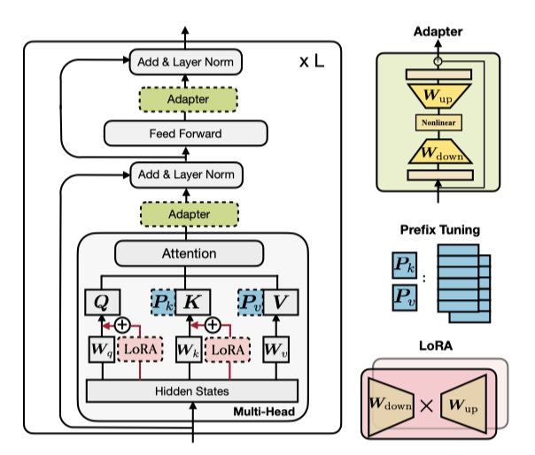
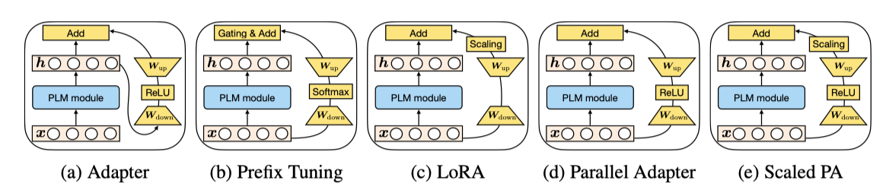
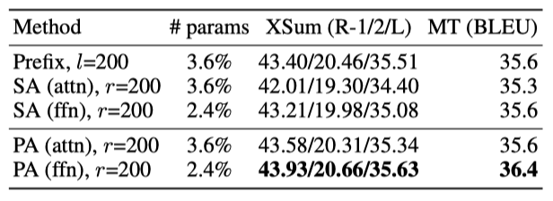

+++
author = "Kurt"
title = "PETL"
date = "2024-04-01"
description = "Towards a Unified View of Parameter-Efficient Transfer Learning"
categories = [
    "Paper Review"
]
tags = [
    "NLP",
    "PEFT",
]
+++

## Abstract

이 논문은 사전 학습된 언어 모델의 parameter-efficient 전이 학습 방법을 분석하고, 이들 간의 연결을 확립하는 통합 프레임워크를 제시한다. 특정 숨겨진 상태를 수정하는 방식으로 다양한 방법을 재정의하고, 중요한 설계 차원을 정의한다. 종합적인 경험적 연구를 통해 중요한 설계 선택을 식별하고, 이를 통해 이전 방법보다 더 적은 parameter를 사용하면서도 더 효과적인 새로운 미세 조정 방법을 개발했으며, 이는 모든 parameter를 미세 조정한 결과와 비교할 수 있는 성능을 보여준다.

---

## Introduction

사전 학습된 언어 모델(PLMs)을 이용한 전이 학습은 자연어 처리 분야에서 주류가 되었으며, 다양한 작업에서 뛰어난 성능을 보여준다. 가장 일반적인 접근 방식은 모델의 전체 parameter를 미세 조정하는 것이지만, 이는 각 작업마다 별도의 모델 parameter 사본을 생성해야 하므로, 많은 작업을 수행하는 데에 많은 비용이 들게 된다. 특히, PLMs의 parameter 수가 수백만에서 수조에 이르기까지 증가함에 따라 이 문제는 더욱 심각해지고 있다.

사전 학습된 언어 모델의 parameter를 대부분 동결하고 소수의 추가 parameter만 업데이트하는 가벼운 튜닝 방법들이 제안되었다. 이러한 방법으로는 adapter tuning, prefix 및 prompt tuning, 그리고 ow-rank matrice 학습 등이 있으며, 이들은 모델 매개변수의 1% 미만을 업데이트하면서도 전체 미세 조정과 비슷한 성능을 보여주었다. 이런 접근법은 parameter를 절약하고, 빠르게 새로운 작업에 적응할 수 있게 하며, 분포 외 평가에서의 견고성을 높인다.

이 논문은 parameter-efficient tuning 방법들의 성공 요인과 이들 간의 연결성이 명확히 이해되지 않음을 지적하며, 세 가지 주요 질문을 탐구한다: (1) 이 방법들은 어떻게 연결되어 있는가, (2) 공유하는 핵심 설계 요소는 무엇인가, (3) 효과적인 요소들을 다른 방법으로 전달해 더 나은 변형을 만들 수 있는가?

이 연구에서는 adapter와 밀접하게 연결된 프리픽스 튜닝의 대안 형태를 제시하고, 동결된 PLMs의 숨겨진 표현을 수정하는 방식으로 구성된 통합 프레임워크를 개발하였다. 이 프레임워크는 수정 기능, 적용 위치, 통합 방법 등의 설계 차원을 따라 기존 방법들을 분해하고, 새로운 변형을 제안한다. 실험을 통해, 이 접근법은 기존의 parameter-efficient tuning 방법보다 적은 parameter를 사용하면서, 네 가지 NLP 작업에서 전체 미세 조정과 동등한 성능을 달성함을 입증한다.

---

## Peliminaries

### Recap Of The Transformer Arch Tecture

Transformer 모델은 최신 NLP 사전 학습된 모델의 기반이며, 여러 층(L개 블록)으로 구성되어 있다. 각 블록은 multi-head self-attention와 fully connected feed-forward network (FFN) 두 가지 sub-layer를 포함한다. 이 모델은 질의(Q), 키(K), 값(V)을 매핑하는 attention 함수를 사용한다.

$$ Attn(Q, K, V) = softmax( {{QK^T}\over{\sqrt{d_k}}}} ) V $$

n과 m은 각각 질의와 key-value 쌍의 수이다. multi-head attention은 병렬로 작동하는 $N_h$개의 헤드를 통해 질의, 키, 값으로 입력을 투영한다. 이는 주어진 벡터 시퀀스 $C$와 질의 벡터 $x$에 대해 각 헤드의 출력을 계산하고 이를 합친다.

$$ MHA(C, x) = Concat(head_1, ..., head_h)W_o, head_i = Attn(xW_q^{(i)}, CW_k^{(i)}, CW_v^{(i)}), $$

$W_o \in R^{d×d}$ 이며, MHA에서는 모델 차원 d를 $N_h$로 나눈 $d_h$를 사용해 차원을 낮추어 parameter를 절약한다. 또한, 두 선형 변환과 ReLU 활성화 함수를 포함한 완전 연결 feed-forward network(FFN)가 중요한 구성 요소이다.

$$ FFN(x) = ReLU(xW_1 + b_1)W_2 + b_2 $$

$W_1 \in R^{d×d_m}, W_2 \in R^{d_m×d}$이며, Transformer는 보통 $d_m$으로 $d$의 4배를 사용한다. 이후 residual 연결과 layer normalization가 적용된다.

### Overview Of Pevious Parameter - Efficient Tuning Methods

아래에서는 최신 parameter-efficient tuning 방법들을 소개하며, 이들은 추가된 parameter만 조정하고 PLM은 변경하지 않는다.

**Adapters (Houlsby et al., 2019):** adapter 접근법은 transformer layer 사이에 adapter 모듈을 넣어, 입력을 낮은 차원으로 down-projection한 후 nonlinear 활성화를 거치고 다시 up-projection 한다. 이 과정은 residual 연결로 완성된다.

$$ h ← h + f(hW_{down})W_{up} $$

Houlsby et al. (2019)은 transformer의 한 층에 multi-head attention과 FFN 뒤에 adapter를 두 개 배치한다. Pfeiffer et al. (2021)은 FFN 뒤에만 삽입되는 더 효율적인 adapter를 제안하였다.

**Prefix Tuning (Li & Liang, 2021):** 텍스트 프롬프팅 방법에 기반해, prefix tuning은 모든 층의 multi-head attention에 $l$개의 조정 가능한 prefix 벡터를 키와 값에 추가한다. 이 벡터들은 원래 키와 값에 연결되어 multi-head attention에서 사용된다.

$$ head_i = Attn(xW_q^{(i)}, concat(P_k^{(i)}, CW_k^{(i)}), concat(P_v^{(i)}, CW_v^{(i)})) $$

$P_k$와 $P_v$는 $N_h$개의 헤드 벡터로 나뉘며, 프롬프트 튜닝은 첫 층의 입력 단어 임베딩에만 추가함으로써 prefix tuning을 단순화한다. 이와 유사한 방법으로 P-tuning도 있다.

**LoRA (Hu et al., 2021):** LoRA는 transformer layer에 low-rank matrice을 주입하여 사전 학습된 가중치의 업데이트를 근사한다. 이는 $W + ∆W = W + W_{down} W_up$ 형태의 low-rank 분해로 표현되며, multi-head attention의 쿼리와 값 투영 행렬에 적용된다.

$$ h ← h + s · xW_{down} W_{up} $$

$s ≥ 1$은 조절 가능한 스칼라 hyperparameter이다.

**Others:** 다른 parameter-efficient tuning 방법으로 BITFIT은 bias vector 미세 조정, diff-pruning은 sparse parameter 업데이트 벡터 학습을 포함한다.

---

## Bridging The Gap - A Unified View

접두사 통합의 동등 형태를 정의하고 adapter 연결을 없앤 후, 최신 방법을 포함하는 효율적인 통합 프레임워크를 제안한다.

### A Closer Look At Prefix Tuning

학습 가능한 벡터를 추가해 주의 모듈을 변화시키는 접두사 통합 방식을 설명하며, 여기서 그 동등 형태를 유도하고 대안적 관점을 제시한다.

$$ head = Attn(xW_q concat(P_k CW_k) concat(P_v CW_v)) $$

$$ = softmax(xW_q concat(P_k CW_k)^T) \left[\begin{array} PP_v \\\ CW_v \end{array}\right] $$

$$ = (1 − λ(x)) softmax(xW_q W_k^T C^T)CW_v + λ(x)softmax(xW_q P_k^T)P_v $$

$$ = (1 − λ(x)) Attn(xW_q CW_k CW_v) + λ(x) Attn(xW_q P_k P_v) $$

$λ(x)$는 접두사들의 정규화된 attention 가중치 합을 나타내는 스칼라이다.

$$ λ(x) = {{\sum_i exp(xW_q)_i }\over{ \sum_i exp(xW_q P_k^T)_i + \sum_j exp(xW_q W_k^T C^T)_j}} $$

attention과 position-wise modification을 통한 prefix 통합의 대안적 관점을 제시하며, 이는 선형 보간을 통해 원래 헤드 attention 출력에 적용된다.

$$ h ← (1 − λ(x))h + λ(x)∆h $$

$$ ∆h = softmax(xW_q P_k^T)P_v $$

**The Connection with Adapters:** $W_1 = W_q + P_k^T, W_2 = P_v, f = softmax$를 정의하고 식을 다시 쓴다.

$$ h ← (1 − λ(x))h + λ(x)f(xW_1)W_2 $$

prefix tuning은 adapter와 유사한 형태로 가중 추가를 통해 작동하며, 플러그인 모듈로 추상화된다. $l$이 작을 때, $W_1$과 $W_2$는 low-rank 행렬로서 adapter의 $W_{down}$과 $W_{up}$과 유사하게 작동한다. prefix 벡터의 수 $l$은 adapter의 병목 차원 $r$과 유사한 역할을 하며, 둘 다 수정 벡터 $∆h$의 랭크 제한을 나타낸다. 이는 $∆h$가 동일한 $l$(or $≤ l$) 기저 벡터의 선형 조합임을 의미한다.

**The Difference from Adapters:** prefix tuning과 adapter 사이에 세 가지 주요 차이가 있다. 첫째, prefix tuning은 PLM의 입력을 사용해 계산하는 반면, adapter는 출력을 사용한다, 이로 인해 prefix tuning은 병렬 계산, adapter는 순차적 계산으로 볼 수 있다. 둘째, adapter는 삽입 위치가 더 유연하며, prefix tuning은 주의 출력만을 수정한다. 셋째, prefix tuning은 각 주의 헤드에 적용되어 더 표현력이 있으며, $l = r$일 때 adapter보다 많은 parameter를 추가하지 않는다. 이러한 차이는 multi-head 영향에 대한 경험적 검증을 통해 확인된다.

### The Unified Framework

prefix tuning과 adapter의 연결에서 영감을 얻어, 다양한 state-of-the-art parameter-efficient tuning 방법을 하나로 통합하는 일반 프레임워크를 제안한다. 이를 위해, 다양한 숨겨진 표현에 적용되는 수정 벡터 $∆h$를 학습하는 방식으로 접근한다. 숨겨진 표현과 이를 계산하는 입력을 각각 $h$와 $x$로 정의하고, 수정 과정을 설명하기 위한 설계 차원을 도입한다. adapter, prefix tuning, LoRA 등 다양한 방법들이 이 차원에 따라 어떻게 구현될 수 있는지를 설명한다.

**Functional Form** $∆h$ 계산을 위한 구체적인 함수는 adapter, prefix tuning, LoRA에 대해 위 식들에서 설명되어 있다. 이들 모두는 *proj down* → *nonlinear* → *proj up*의 구조를 가지며, LoRA에서는 "nonlinear" 부분이 항등 함수로 간소화된다.

**Modified Representation** 어떤 숨겨진 표현이 직접 수정되는지를 나타낸다.

**Insertion Form** 추가된 모듈의 네트워크 삽입 방식에 관한 설명이다. adapter는 전통적으로 순차적 위치에 삽입되며, prefix tuning과 LoRA는 병렬 삽입 방식이며 입력은 $x$로, 이 방식은 원래 다르게 설명되지 않았다.

**Composition Function** 수정된 벡터 $∆h$와 원래 숨겨진 표현 $h$의 조합 방식에 대한 설명이다. adapter는 단순 덧셈으로 조합하고, prefix tuning은 게이트가 추가된 덧셈을 사용하며, LoRA는 $∆h$를 상수로 스케일링 후 원래 표현에 더한다.

위에 없는 여러 방법도 이 프레임워크에 해당된다. 예를 들어, 프롬프트 튜닝과 adapter 변형들은 각각 prefix tuning과 유사한 방식으로 구현된다. 이 통합 프레임워크는 설계 차원을 따라 parameter-efficient tuning 방법을 연구하고, 주요 설계 결정을 식별하며, 설계 요소를 방법 간에 전달하는 가능성을 제공한다.

### Transferring Design Elements

이 연구에서는 방법 간의 설계 요소 전달을 통해 도출된 새로운 방법들을 소개한다: (1) prefix tuning의 병렬 삽입 기법을 adapter에 적용한 병렬 adapter, (2) adapter를 통해 헤드 주의 출력을 prefix tuning처럼 수정하는 multi-head 병렬 adapter, (3) LoRA의 조합 및 삽입 형태를 adapter에 적용한 스케일된 병렬 adapter이다.

지금까지의 토론은 몇 가지 중요한 질문을 남긴다: 다양한 설계 요소를 적용한 방법들은 독특한 특성을 가지는가? 어떤 설계 요소가 가장 중요한가? 새로운 방법들이 성능 향상을 가져오는가? 이러한 질문에 대한 답변을 이어서 다룬다.

---

## Experiments

### General Setup

**Datasets:** 네 가지 주요 작업을 연구한다: (1) 뉴스 기사 요약 (XSum), (2) 영어-루마니아어 번역 (WMT 2016 en-ro), (3) 자연어 추론 (MNLI), 그리고 (4) 감정 분류 (SST2).

**Setup:** XSum과 en-ro 번역 작업에 $BART_{LARGE}$와 $mBART_{LARGE}$를, MNLI와 SST2에는 $RoBERTa_{BASE}$를 사용한다. 연구는 adapter, prefix tuning, LoRA에 집중되며, 이 기법들은 bitfit과 prefix tuning보다 뛰어난 성능을 보여준다. adapter는 분석을 위해 주의력 또는 FFN 계층에 적용되고, 최종적으로는 두 위치 모두에 적용된 결과를 비교한다. 

**Evaluation:** XSum 테스트 세트에 대한 ROUGE 1/2/L 점수, en-ro 테스트 세트에 대한 BLEU 점수, 그리고 MNLI와 SST2 개발 세트에 대한 정확도를 보고한다. MNLI와 SST2는 다섯 번의 실행 중앙값을 사용하며, 전체 미세 조정 대비 조정된 parameter 수(#params)도 제공된다.

**Number of Tunable Parameters:** BART와 mBART는 세 종류의 attention 구조를, RoBERTa는 encoder self-attention을 가진다. prefix tuning과 adapter는 각각 $2 × l × d$, $2 × r × d$ parameter를 사용하고, LoRA는 $4 × r × d$ parameter를 사용하여 더 많은 parameter를 필요로 한다. ffn에서의 adapter 수정도 attention 에서의 adapter와 같은 parameter를 사용한다. 따라서 $r$ 또는 $l$에 대해, prefix tuning과 adapter는 같은 수의 parameter를 사용하지만, LoRA는 더 많다.

### The Results Of Existing Methods

기존 방법들은 MNLI와 SST2에서 1% 미만의 parameter 조정으로 경쟁력 있는 성능을 보이지만, XSum과 en-ro에서는 5% 추가 parameter에도 불구하고 큰 격차가 남아 있다. 이 격차는 parameter를 10% 이상 증가시켜도 유의미하게 지속된다. 이는 많은 방법들이 GLUE 벤치마크나 E2E 같은 간단한 생성 벤치마크에서는 좋은 결과를 보이지만 다른 표준 벤치마크로 잘 일반화되지 않음을 시사한다. 향후 연구는 다양한 벤치마크에서의 결과를 보고하여 성능 프로필을 더 완전히 이해할 필요가 있다. 이 연구의 분석은 주로 고자원 벤치마크인 XSum과 en-ro에 집중되며, MNLI와 SST2의 분석은 encoder만 있는 모델인 RoBERTa로 진행한다.

### Which Insertion Form - Sequential Or Parallel?

삽입 형식 설계를 비교한 결과, parallel adapter(PA)는 전통적인 sequential adapter(SA)와 prefix tuning을 포함한 모든 경우에서 우수한 성능을 보였다. 특히, PA는 XSum에서 SA보다 1.7 R-2 점, en-ro에서는 0.8 BLEU 점 더 높은 성능을 나타냈다. 이러한 결과에 따라, 이 연구에서는 parallel adapter의 결과에 더 집중한다.

### Which Modified Representation - Attention Or FFN?

**Setup:** 다양한 표현 수정의 효과를 분석하기 위해, attention과 FFN 수정을 주로 비교하며, parallel adapter와 prefix tuning, 그리고 LoRA (ffn) 변형을 포함한 전체 비교를 진행한다. 특히, LoRA를 사용하여 FFN 가중치의 parameter 업데이트를 근사하며, 실험에서 전체 parameter 크기를 일치시키기 위해 LoRA (ffn)에는 더 작은 $r$을 사용한다.

**Results:** 모든 경우에서 FFN 수정 방법이 attention 수정 방법보다 우수한 성능을 보여준다. 특히, 더 적은 parameter를 사용하면서도 이러한 성과를 달성한다. FFN에 적용된 같은 방법은 그 attention 버전보다 항상 성능이 향상되며, 예를 들어 LoRA (ffn)은 XSum에서 LoRA (attn)보다 성능이 더 좋다. 또한 용량을 늘려도 prefix tuning의 개선이 멈추는 현상이 관찰되며, 이는 FFN 수정이 attention보다 추가 parameter를 더 효과적으로 활용할 수 있음을 시사한다. 이는 FFN이 과제 특정 텍스트 패턴을, attention이 쌍방향 위치 상호작용을 학습하기 때문일 것으로 추정된다.

**Is the story different when we use 0.1% parameters?** prefix tuning이 adapter보다 높은 표현력을 가진다고 주장했지만, 이는 실제 결과에서 명확하게 나타나지 않았다. 이는 parameter가 적을 때 multi-head attention이 더 우수하기 때문으로 추정된다. 사전 학습된 parameter의 0.1%를 추가할 때, prefix tuning과 multi-head parallel adapter는 다른 방법들보다 최소 1.6 BLEU 점수 높았다. prefix tuning은 parameter 수를 줄여도 성능 손실이 적었고, 게이팅 기능이 성능을 약간 개선하였다. multi-head parallel adapter는 single-head 버전보다 1.6점 더 나은 성능을 보여 multi-head 구성의 유효성을 재확인하였다.

parameter 예산이 적을 때는 head attention 수정이, 큰 용량에서는 FFN 수정이 더 효과적임을 알 수 있다. 이는 attention과 FFN에 동등한 예산을 배분하는 대신, FFN 수정에 더 많은 예산을 투자하는 것이 좋을 수 있음을 시사한다.

### Which Compossition Function?

세 가지 구성 함수 중, LoRA와 scaled parallel adapter(Scaled PA) 비교 연구를 통해 FFN 수정이 더 효과적임을 확인하였다. XSum 결과에 따르면, LoRA(s = 4)는 parallel adapter보다 우수하지만, 스케일링을 제거하면 이점이 사라진다. scaled PA는 기본 parallel adapter를 0.56 ROUGE-2 점 개선시켰으며, 스케일링 구성 함수가 기본 덧셈 함수보다 나음을 보여준다.

### An Effective Integration By Transferring Favorable Design Elements

이전 연구에서는 (1) scaled parallel adapter가 FFN 수정에 가장 효과적, (2) FFN이 더 큰 용량에서 수정을 더 잘 활용, (3) prefix tuning 같은 head attention 수정이 매우 적은 parameter로 강력한 성능을 달성할 수 있음을 발견하였다. 이 발견에 기반하여, prefix tuning과 scaled parallel adapter를 결합한 새로운 Mix-And-Match adapter(MAM adapter)를 제안한다. MAM adapter는 다양한 parameter-efficient tuning 방법과 비교하여 두 작업 모두에서 최고의 성능을 보이며, 사전 학습된 parameter의 단 6.7%만으로 전체 미세 조정 결과와 동등한 성능을, 단 0.5%의 추가 parameter로는 MNLI와 SST2에서 전체 미세 조정과 비슷한 결과를 달성한다.

---

## Discussion

다양한 parameter tuning 방법을 위한 통합 프레임워크를 제공하여, 기술 전달을 통해 전체 미세 조정의 성능에 맞는 효과적인 모델을 만들 수 있다. 이 연구가 parameter-efficient tuning 분야의 미래 연구에 도움이 되길 바란다.

### Ethics Statement

이 연구는 사전 학습된 언어 모델을 효율적으로 미세 조정하는 방법을 제안한다. 이 모델들은 요약, 번역, 언어 이해 등 다양한 긍정적 응용 가능성을 가지고 있지만, 편향 생성, 개인 정보 유출, 환경적 영향 등 여러 윤리적 문제도 동반한다.

이 방법은 사전 학습된 언어 모델의 parameter를 최소한으로 변경하며 학습시킨다. 이 방법이 편향이나 정보 유출 문제에 어떤 영향을 미치는지는 아직 연구되지 않았으며, 향후 연구의 중요한 주제이다.

이 논문에서 제안된 방법은 기존 모델에 소수의 parameter를 추가함으로써 학습 및 추론 시간에 약간의 부정적 영향을 미치지만, 전체 미세 조정의 필요성을 줄여 모델 제공 비용을 상당히 절감할 수 있다. 또한, 연구는 전적으로 재생 가능 에너지를 사용하는 데이터 센터에서 수행되었다.

---

## Reference

* [Paper](https://arxiv.org/pdf/2110.04366.pdf)
* [GitHub](https://github.com/jxhe/unify-parameter-efficient-tuning)