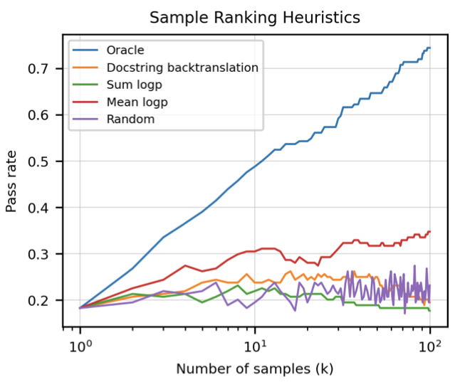

+++
author = "Kurt"
title = "Codex"
date = "2023-12-30"
description = "Evaluating Large Language Models Trained on Code"
categories = [
    "Paper Review"
]
tags = [
    "NLP",
    "LLM",
]
draft = true
+++

## Abstract

GitHub에서 공개적으로 사용 가능한 코드에 미세 조정된 GPT 언어 모델인 Codex를 소개하고 그 Python 코드 작성 능력을 연구한다. 이 모델은 GitHub Copilot를 구동하며, 새로운 평가 세트인 HumanEval에서 문제의 28.8%를 해결합니다. 또한, 모델에서 반복 샘플링은 어려운 프롬프트에 대한 해결책을 만드는 데 효과적인 전략이라는 것을 발견하였다. 모델의 한계를 조사하였고, 강력한 코드 생성 기술의 배포가 안전, 보안, 경제 등에 미치는 잠재적인 영향을 논의한다.

---

## Introduction

스케일러블한 시퀀스 예측 모델들은 자연어 처리, 컴퓨터 비전, 오디오 및 음성 처리, 생물학, 다중 모달리티 등 다양한 분야에서 생성 및 표현 학습의 일반적인 방법으로 사용되고 있다. 최근에는 언어 모델들이 대규모 데이터셋에서 코드를 활용하고 이를 통해 학습된 프로그래밍 능력을 바탕으로 프로그램 합성이라는 도전적인 문제를 해결하는데 기여하고 있다. 또한, masked language modeling과 span prediction과 같은 인기 있는 언어 모델링 방법들이 프로그래밍 학습을 위해 적용되고 있다.

초기 GPT-3 연구에서는 Python docstrings로부터 간단한 프로그램을 생성할 수 있다는 사실을 발견하였다. 이는 GPT-3가 명시적으로 코드 생성을 위해 학습되지 않았음에도 불구하고 가능했다. 이러한 성공과 공개적으로 사용 가능한 코드의 풍부함을 바탕으로, Codex라는 특화된 GPT 모델이 다양한 코딩 작업에서 탁월하게 수행될 수 있을 것이라고 가정하였다. 이 논문은 GitHub Copilot과 OpenAI API에 사용된 초기 Codex 모델들에 대해 설명하고 있다.

이 연구에서는 docstrings에서 Python 함수를 생성하는 작업에 집중하고, 이를 유닛 테스트를 통해 자동으로 평가한다. 이를 위해 언어 이해, 알고리즘, 간단한 수학을 평가하는 164개의 프로그래밍 문제 데이터셋을 만들었다.

모델로부터 여러 샘플을 생성해 유닛 테스트를 통과하는지 확인한다. 12B parameter의 Codex는 단일 샘플로 28.8%의 문제를 해결하며, 300M parameter의 Codex는 13.2%를 해결한다. 반면, 6B parameter의 GPT-J는 동일한 데이터셋에서 11.4%를 달성하며, 모든 GPT 모델은 거의 0%에 가깝다. docstrings에서 함수를 합성하는 작업을 개선하기 위해, 이 연구에서는 Codex를 독립적으로, 올바르게 구현된 함수들에 대해 미세조정하였고, 결과적으로 생성된 Codex-S 모델은 문제들 중 37.7%를 단일 샘플로 해결한다.

실제 프로그래밍 작업은 접근 방식의 반복과 버그 수정을 포함하는데, 이는 모델로부터 여러 샘플을 생성하고 모든 유닛 테스트를 통과하는 샘플을 선택하는 것으로 모사할 수 있다. 100개의 샘플 내에서, Codex-S는 문제들 중 77.5%에 대해 적어도 하나의 올바른 함수를 생성할 수 있다. 실제로, mean log-probability가 가장 높은 샘플이 문제들 중 44.5%에서 유닛 테스트를 통과하였다.

---

## Evaluation Framework

pass@k 메트릭을 정의하고 그 장점을 설명하며, 모델 평가를 위해 만든 "HumanEval"이라는 수기로 작성된 문제 데이터셋에 대해 설명한다. 마지막으로, 모델이 생성한 코드를 안전하게 실행하기 위해 사용한 샌드박스 환경에 대해 이야기한다.

### Functional Correctness

코드 생성 모델은 보통 샘플을 reference 솔루션과 비교하여 평가되지만, 이런 match-based metric에는 결점이 있다. 특히, Ren et al. (2020)은 BLEU 점수가 코드의 의미적 특징을 정확히 포착하지 못한다는 문제를 지적하고, 점수를 수정하는 여러 방안을 제안하였다.

match-based metric은 reference 솔루션과 기능적으로 동일한 프로그램의 복잡한 공간을 설명하지 못한다. 이에 따라, 최근 연구들은 샘플이 단위 테스트를 통과하면 정확하다고 판단하는 기능적 정확성을 사용하였다. 이 지표는 문서 문자열에 따른 코드 생성에도 적용되어야 한다고 주장한다.

기능적 정확성 평가의 중요성은 인간 개발자들이 코드를 판단하는 기준으로 사용하기 때문이다. 테스트 주도 개발 프레임워크는 성공을 테스트를 통과하는 프로그램으로 정의하며, 대부분의 조직에서는 새로운 코드 통합이 단위 테스트의 생성 및 통과에 의존한다.

Kulal et al. (2019)은 pass@k 지표를 사용해 기능적 정확성을 평가하였다. 이는 문제마다 $k$개의 코드 샘플을 생성하고, 그 중 하나라도 단위 테스트를 통과하면 문제가 해결된 것으로 간주한다. 하지만 이 방식은 변동성이 높을 수 있다. 따라서 각 작업마다 $n$개의 샘플을 생성하고, 단위 테스트를 통과한 샘플의 수를 세어, 편향되지 않은 추정치를 계산한다. 이 논문에서는 $n = 200, k ≤ 100$을 사용하였다.

$$ pass@k := \underset{Problem}{\mathbb{E}} \big[ 1 - \begin{pmatrix} n-c  \\\ k \end{pmatrix} / \begin{pmatrix} n  \\\ k \end{pmatrix} \big]  $$

이 추정치를 직접 계산하면 큰 수와 수치적 불안정성이 발생한다. pass@k를 $1 − (1 − \hat{p})$로 추정하려는 유혹이 있을 수 있지만, 이 방법은 편향되다. 여기서 $\hat{p}$는 pass@1의 경험적 추정치이다.

BLEU 점수가 기능적 정확성의 신뢰할 수 있는 지표가 아님을 증명한다. 참조 솔루션과 일치하지 않는 프로그램이 종종 기능적으로 동등한 프로그램보다 더 높은 BLEU 점수를 얻는 것을 통해 이를 보여준다.

### HumanEval: Hand-Written Evaluation Set

HumanEval 데이터셋이라 불리는 164개의 수기로 작성된 프로그래밍 문제에서 기능적 정확성을 평가한다. 각 문제에는 테스트가 평균 7.7개 포함되어 있다. 이러한 작업이 수기로 작성되어야 하는 이유는, 이 모델이 GitHub의 큰 부분에서 학습되며, 이미 다양한 출처의 문제 해결책이 포함되어 있기 때문이다.

HumanEval 데이터셋의 프로그래밍 작업은 언어 이해, 추론, 알고리즘, 그리고 간단한 수학을 평가한다.

### Sandbox for Executing Generated Programs

공개 프로그램의 의도가 불분명하고 생성된 프로그램이 잘못될 수 있어, 이들을 실행하면 보안 위험이 생긴다. 실제로, GitHub에는 환경을 변조하는 악성 프로그램들이 포함되어 있다.

신뢰할 수 없는 프로그램을 안전하게 실행할 수 있는 샌드박스 환경을 개발하여, 이 프로그램들이 호스트나 네트워크를 수정하거나, 데이터를 유출하는 것을 방지하였다. OpenAI의 학습 인프라가 Kubernetes와 클라우드 서비스에 기반하므로, 샌드박스는 이들 환경의 제한 사항을 해결하면서도 그들의 사용 패턴에 따라 설계되었다.

주 호스트 보호를 위해 gVisor 컨테이너 런타임을 선택하였다. Docker와 같은 컨테이너 런타임은 호스트 리소스를 공유할 수 있어, 악성 컨테이너가 호스트를 손상시킬 수 있다. gVisor는 호스트의 리소스를 에뮬레이션하여 보안 경계를 설정하고, eBPF 기반의 방화벽 규칙을 통해 네트워크 인접 호스트와 서비스를 보호한다.

---

## Code Fine-Tuning

Codex는 parameter가 최대 12B개인 GPT 모델을 기반으로 하며, 코드 작성에 특화되어 있다. GPT와는 달리 Codex는 HumanEval 데이터셋에서 높은 성능을 보이며, 문제마다 100개의 샘플을 생성하여 가장 적합한 샘플을 선택함으로써 대부분의 문제를 해결할 수 있다. 이는 문제당 한 번의 평가로 제한될 때 특히 중요한 이점을 제공한다.

### Data Collection

2020년 5월, GitHub의 54M 개 공개 소프트웨어 저장소로부터 파이썬 파일 179GB를 수집하여 학습 데이터셋을 구축하였다. 자동 생성 파일, 긴 줄 길이 파일 등을 제외한 최종 데이터셋의 크기는 159GB였다.

### Methods

Codex는 자연어 프롬프트에 대해 평가되며, 이미 강력한 자연어 표현을 가진 GPT-3에서 미세 조정하는 것이 유익할 것으로 가정하였다. 그러나 미세 조정 데이터셋이 크기 때문에 사전 학습된 언어 모델에서 개선 사항을 찾지 못했다. 그럼에도 GPT에서 미세 조정된 모델은 더 빠르게 수렴하므로, 이 방법을 모든 후속 실험에 적용하였다.

Codex 모델 학습에는 GPT 모델과 동일한 learning rate, 175 step의 linear warmup, cosine learning rate decay가 사용되었다. 학습은 총 100B 토큰에 대해 진행되었으며, Adam optimizer와 weight decay coefficient 0.1이 적용되었다.

GPT-3 텍스트 토크나이저를 기반으로 한 code lexer를 사용하여 GPT의 텍스트 표현을 최대한 활용하고 있다. 하지만 GitHub 코드의 단어 분포 차이로 인해 효과적이지 못했고, 특히 공백 인코딩에서 비효율성이 발생하였다. 그래서 다양한 길이의 공백을 표현할 수 있는 추가 토큰을 도입함으로써 코드 표현에 필요한 토큰 수를 약 30% 줄였다.

HumanEval 문제를 해결하기 위해, header, signature, docstring으로 구성된 프롬프트를 만들고, 추가 함수나 구문 생성을 방지하기 위해 특정 정지 시퀀스('\nclass', '\ndef', '\n#', '\nif', '\nprint')를 만날 때까지 Codex에서 토큰을 샘플링한다. 모든 샘플링 평가는 top $p = 0.95$로 nucleus 샘플링을 사용한다.

### Results

검증 세트에 대한 테스트 손실을 Codex 모델 크기에 따라 그래프로 표현하였. 언어 모델 테스트 손실이 모델 크기에 따른 power law를 따르듯이, 코드 미세 조정 후의 테스트 손실도 비슷한 패턴을 보였다. 함수 형태는 $\big( {{N}\over{5.92 \times 10^7}} \big)^{-0.13}$ 이며, 이때 $N$은 임베딩이 아닌 모델 parameter의 수를 나타낸다.

pass@k 평가 시, 샘플링 temperature를 $k$ 값에 맞게 최적화하는 것이 중요하다. 더 큰 $k$ 값에 대해서는 더 높은 temperature가 최적이며, 이는 샘플 집합의 다양성을 증가시키고, 모델이 정확한 해결책을 생성하는지 여부만을 보상하기 때문이다.

679M parameter 모델에서는 pass@1의 최적 temperature가 $T^* = 0.2$, pass@100의 최적 temperature가 $T^* = 0.8$로 확인되었다. 이 temperature를 사용하면, 모델 크기에 따라 pass@1과 pass@100이 부드럽게 확장되는 것을 볼 수 있다.

Pass@k는 유닛 테스트를 알고 있는 오라클이 $k$개의 샘플 중 최상의 샘플을 선택하는 것으로 해석할 수 있다. 하지만 실제 상황에서는 오라클 없이 $k$개의 샘플 중 하나를 선택해야 하는 경우도 있다. 예를 들어, 유닛 테스트가 없는 상황에서 사용자에게 하나의 완성만 제공하고 싶은 자동완성 도구로 모델을 사용하는 경우 등이 있다.

언어 모델링에서 배운 바에 따라, mean token log probability이 가장 높은 샘플을 선택하는 것이 무작위 샘플 평가보다 더 우수한 결과를 보였다. 그러나 sum log probability에 기반해 샘플을 선택하면 무작위 선택보다 약간 성능이 떨어질 수 있다.

모든 Codex-12B HumanEval 샘플에 대해 참조 솔루션과의 BLEU 점수를 계산하였다. 올바른 솔루션과 잘못된 솔루션의 BLEU 점수 분포를 비교하면 상당한 중첩이 보여진. 잘못된 솔루션은 참조 솔루션과 기능적으로 동일하지 않기 때문에, BLEU 점수의 향상이 실제 기능적 정확성의 향상을 반영하지 않을 수 있음을 확인하였다.

### Comparative Analysis of Related Models and Systems

GPT-Neo와 GPT-J는 Codex와 유사한 방식으로 다양한 텍스트 소스와 GitHub 코드 8%를 포함하는 The Pile 데이터셋에서 학습되었다. 연구 커뮤니티는 이 두 모델이 정성적 프로그래밍 평가에서 기존 GPT 시스템을 능가하는 것을 발견하였다.

HumanEval 데이터셋을 사용한 결과, GPT-Neo는 pass@1에서 6.4%, pass@100에서 21.3%를, GPT-J-6B는 pass@1에서 11.6%, pass@100에서 27.7%를 달성하였다. 이는 각각 Codex-85M과 Codex-300M와 유사한 성능을 보여준다. 이 결과는 특정 temperatures에서 평가한 최상의 결과를 기반으로 한다.

코드 자동완성 시스템인 Tabnine의 가장 큰 무료 모델과 Codex를 비교하였다. Tabnine 모델은 $T = 0.4$에서 pass@1에서 2.6%, $T = 0.8$에서 pass@100에서 7.6%를 달성하며, 이는 Codex 모델 중 가장 작은 Codex-12M와 대략적으로 동등하다.

### Results on the APPS Dataset

최근 Hendrycks et al. (2021)은 언어 모델의 코딩 역량을 측정하기 위해 APPS 데이터셋을 소개하였다. 이 데이터셋은 각각 유닛 테스트와 정확한 솔루션 집합을 포함하는 5000개의 학습 예제와 테스트 예제로 구성되어 있다. APPS의 대부분의 문제는 단일 함수 합성이 아니라 전체 프로그램 합성으로, stdin에서 입력을 받고 stdout에 출력하는 형태로 구성되어 있어, 이는 Codex 학습 데이터와는 다르다.

APPS를 소개하는 논문에서는 언어 모델을 벤치마킹하고 모델이 정확한 해결책을 찾는 문제의 비율("strict accuracy")과 잘못된 해결책도 통과하는 유닛 테스트의 비율을 보고한다. 첫 번째 지표의 결과가 낮아서 측정 변동성을 줄이기 위해 후자를 사용하였다. 하지만 이 논문에서는 후자를 피하고 "strict accuracy"에만 초점을 맞추며, 다양한 $k$에 대한 pass@k 수치를 보고한다. 이때 코딩 경쟁에서 알려진 두 가지 추가 요소를 고려한다.

* 코딩 경쟁과 APPS 데이터셋에서, 작업 설명에 포함된 3개의 입력/출력 예제를 사용한다. 이를 활용해 모델에서 1000개의 솔루션을 샘플링하고, 이 3개의 유닛 테스트를 통과하는 솔루션만 필터링한다. 이 필터링된 세트에서의 통과율을 계산하며, 이를 필터링된 pass@k라고 부른다. 필터링을 하지 않은 결과는 raw pass@k로 표시된다.

* 코딩 경쟁이나 Codex의 결과에서 올바른 해결책이 찾아졌지만 알고리즘적으로 충분히 효율적이지 않아 통과되지 않는 경우가 많다. 이런 상황이 경쟁에서는 허용되지 않지만, Codex가 생성하는 솔루션 중 어떤 유닛 테스트에서도 실패하지 않지만 일부에서 시간 초과가 발생하는 경우도 보고하고 있다. 이때, 평가에서는 3초의 시간 초과를 사용한다.

Codex가 APPS에서 미세 조정되지 않았기 때문에, 작업 설명의 입력/출력 예제를 docstring에 포맷팅 힌트로 추가하였다. 이런 방식을 "1-shot"이라고 부르며, 1-shot으로 평가 Codex12B는 APPS에서 미세조정된 GPT-Neo 모델 비슷한 성능을 보여준다. 작업당 최대 1000개의 샘플을 생성하고 평가하는 것이 유익하다는 이전 결과와 일관성을 보이지만, 더 어려운 문제에서는 솔루션이 시간 제한을 넘기기에 충분히 효율적이지 않다. 또한, 각 문제의 3개의 공개 유닛 테스트를 통과하는 첫 샘플을 평가하는 것이 raw pass@100 샘플보다 높은 성능을 보여준다.

---

## Supervised Fine-Tuning

---

## Reference

* [Paper](https://arxiv.org/pdf/2107.03374.pdf)
* [Github](https://github.com/openai/human-eval)