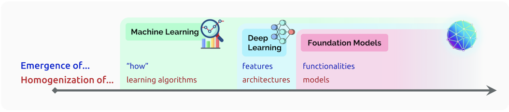

+++
author = "Kurt"
title = "Foundation Models"
date = "2024-01-01"
description = "On the Opportunities and Risks of Foundation Models"
categories = [
    "Paper Review"
]
tags = [
    "NLP",
    "LLM",
]
draft = true
+++

## Abstract

AI는 넓은 범위의 데이터에서 학습된 다양한 모델(BERT, DALL-E, GPT-3 등)이 등장하며 패러다임 변화를 겪고 있다. 이런 모델들을 "foundation model"이라 부르며, 그들의 중요성과 불완전성을 강조한다. 이 모델들은 많은 작업에 효과적이어서 동질화를 촉진하지만, 그 결함은 모든 하위 모델에 상속되므로 주의가 필요하다. foundation model의 작동 방식, 실패 시점, 그리고 가능성에 대한 명확한 이해는 아직 부족하며, 이에 대한 연구는 그들의 사회기술적 성질에 맞게 깊은 학제간 협력을 필요로 한다.

---

## Introduction

이 보고서는 "foundation model"이라는 일반적인 AI 모델 클래스를 기반으로 하는 시스템 구축에 대한 새로운 패러다임을 조사한다. foundation model은 광범위한 데이터에서 학습되어 다양한 downstream task에 적용될 수 있다. 이는 기존의 deep neural network와 self-supervised 학습에 기반하지만, 그 규모와 범위는 우리의 상상력을 넘어섰다. 예를 들어, GPT-3 같은 모델은 막대한 parameter를 가지고 있고, 특정 작업에 대한 명확한 학습 없이도 다양한 작업을 수행할 수 있다. 그러나, 이런 모델들의 특성은 잘 이해되지 않았고, 잠재적인 해를 악화시킬 수 있다. 이러한 모델들이 널리 배포될 예정이므로, 심도 있는 조사가 필요하다.

### Emergence and homogenization

foundation model의 중요성은 "emergence"과 "homogenization" 두 가지 개념으로 요약된다. "emergence"는 시스템 행동이 명시적으로 구축되지 않고 암시적으로 유도되는 것을 의미하며, 이는 흥분과 예상치 못한 결과에 대한 불안을 가져온다. "homogenization"는 다양한 응용 분야에서 기계 학습 시스템 구축 방법론을 통합하는 것을 가리키며, 많은 작업에 대한 leverage를 제공하지만 단일 실패 지점을 만들 수 있다. 이 두 개념은 최근 30년 동안 AI 연구에서 점점 중요해지고 있다.

**Machine learning.** 오늘날 대부분의 AI 시스템은 과거 데이터를 학습하여 미래를 예측하는 기계 학습에 의해 구동된다. 1990년대부터 시작된 AI에서의 기계 학습의 부상은 작업 해결 방법을 명시하는 대신 데이터를 바탕으로 학습 알고리즘이 이를 유도하는 새로운 방식을 나타냈다. 이는 "how"가 학습 과정에서 발생하는 것을 의미한다. 또한, 기계 학습은 로지스틱 회귀와 같은 일반적인 학습 알고리즘을 통해 다양한 응용 분야를 통합하는 동질화로 나아가는 한 걸음을 나타냈다.

AI에서 기계 학습이 널리 사용되지만, 자연어 처리나 컴퓨터 비전 등의 복잡한 작업에서는 도메인 전문가가 "feature engineering"을 수행해야 했다. 이는 raw 데이터를 더 고수준의 특징으로 변환하는 과정으로, 기계 학습 방법에 더 적합하게 만드는 역할을 한다.

**Deep learning.** 2010년경, 딥러닝이라는 이름 아래에 deep neural network의 부활이 이루어졌다. 이는 더 큰 데이터셋, 더 많은 계산 능력, 그리고 대담함에 의해 추진되었다. raq 입력에 대한 학습을 통해 고수준의 특징이 발생하였고, 이는 성능 향상을 가져왔다. 딥러닝은 homogenization를 향한 또 다른 전환을 나타냈는데, 맞춤형 feature engineering 대신 동일한 deep neural network 아키텍처가 다양한 응용 프로그램에 사용될 수 있게 되었다.

**Foundation models.** foundation model은 주로 자연어 처리(NLP)에 초점을 맞추지만, 일반적인 AI 패러다임으로 볼 수 있다. 이러한 모델은 전이 학습과 규모의 확장을 통해 가능하게 되었으며, 한 작업에서 배운 지식을 다른 작업에 적용하는 것을 목표로 한다. 주로, 모델은 대리 작업에서 사전 학습을 받고, 그 후에는 미세조정을 통해 특정 작업에 적용된다.

foundation model의 강력함은 전이 학습의 가능성과 규모의 확장성에서 비롯된다. 규모 확장에는 컴퓨터 하드웨어의 개선, 표현력 높은 모델을 훈련시키는 Transformer 아키텍처의 개발, 그리고 대량의 학습 데이터의 활용이 필요하다.

데이터의 가용성과 활용 능력은 매우 중요하며, 주석이 달린 데이터셋을 사용한 전이 학습은 이미 10년 동안 일반적으로 이루어지고 있다. 그러나 주석 작성의 비용은 사전학습의 이점에 제한을 두게 된다.

self-supervised 학습에서는 주석이 없는 데이터에서 사전학습 작업이 자동으로 이루어진다. 이 방식은 레이블이 없는 데이터에 의존하므로 확장성이 뛰어나며, 모델이 입력의 일부를 예측하게 함으로써 한정된 레이블 공간에서 학습된 모델보다 더 풍부하고 유용할 수 있다.

단어 임베딩 이후로, self-supervised 학습은 크게 발전했다. 이는 각 단어를 문맥에 독립적인 벡터로 표현하며, 다양한 NLP 모델의 기반이 되었다. 또한, autoregressive 언어 모델링을 기반으로 한 self-supervised 학습이 인기를 끌었으며, 이를 통해 문맥 속 단어를 표현하는 GPT, ELMo, ULMFiT와 같은 모델들이 생성되었다.

self-supervised 학습의 다음 단계는 BERT, GPT-2, RoBERTa, T5, BART 등이 빠르게 따라왔으며, 이들은 Transformer 아키텍처를 채택하고, 문장의 강력한 bidirectional encoder를 통합하며, 더 큰 모델과 데이터셋으로 확장하였다.

BERT의 등장은 self-supervised 학습에 대한 사회학적 변곡점이었다. 2019년 이전에는 NLP의 하위 분야였지만, 2019년 이후로는 NLP의 핵심 부분이 되었다. 단일 모델이 넓은 범위의 작업에 유용하다는 인식은 foundation model의 시대의 시작을 의미한다.

foundation model들은 NLP 모델의 homogenization를 가져왔고, 이는 높은 지렛대 효과를 제공하지만 동시에 위험성도 내포하고 있다. 모든 AI 시스템이 foundation model의 문제적인 편향을 상속받을 수 있기 때문이다.

연구 커뮤니티 간에 homogenization가 점차 진행되고 있다. Transformer-based sequence 모델링 방법론이 텍스트, 이미지, 음성, 표 데이터, 단백질 시퀀스, 유기 분자, 강화 학습 등 다양한 분야에 적용되고 있다. 이러한 예시들은 다양한 형태의 foundation model을 개발할 수 있는 통합 도구 세트를 가질 미래를 예상하게 한다.

접근법뿐만 아니라 실제 모델 역시 여러 연구 커뮤니티에서 통일되고 있다. 이는 언어와 시각 데이터를 학습하는 multimodal 모델의 형태로 나타난다. 일부 영역에서는 데이터가 자연스럽게 multimodal이며, 이는 의료 이미지, 구조화된 데이터, 의료 텍스트 등에서 볼 수 있다. 따라서, multimodal foundation model은 도메인에 대한 모든 관련 정보를 통합하고 다양한 모드를 아우르는 업무에 적응하는 자연스러운 방법이다.

규모의 증가로 인해 foundation model들은 놀라운 발전을 이끌어냈다. GPT-3는 175B 개의 parameter를 가지고 있어, 프롬프트(업무의 자연어 설명)만 제공하면 하위 업무에 쉽게 적응할 수 있는 문맥 내 학습이 가능하다. 이는 특별히 학습되지 않았지만 예상치 못하게 발생한 특성이다.

homogenization와 emergence은 잠재적으로 불안정한 방식으로 상호 작용한다. homogenization는 특정 과제 데이터가 제한된 많은 분야에서 큰 이익을 가져올 수 있지만, 모델의 결함은 모든 적응된 모델에게 그대로 상속된다. foundation model의 힘은 그들의 명시적인 구성보다는 출현적 특성에서 나오므로, 이해하기 어렵고 예측하지 못한 실패 모드를 가진다. 이런 emergence이 foundation model의 능력과 결함에 대한 불확실성을 증가시키므로, 이러한 모델을 통한 공격적인 homogenization는 위험하다. 윤리적 및 AI 안전성 관점에서 볼 때, 위험을 줄이는 것이 foundation model의 추가 개발에서 중요한 도전 과제이다.

#### Naming.

"foundation model"이라는 용어는 지금 목격하고 있는 패러다임의 변화를 설명하는 데 필요한 용어이다. 기존의 용어들은 이러한 모델들의 기술적 면을 부분적으로 포착하지만, 기계 학습을 넘어서는 사람들에게 패러다임 변화의 중요성을 적절하게 전달하지 못한다. foundation model은 그들의 사회적 영향과 AI 연구와 배포에 있어서의 광범위한 변화를 특징으로 하는 독특한 모델 클래스를 지칭한다. 반면에, 사전 학습과 자기 감독 같은 방식은 foundation model이 예고한 기술적 변화를 명확하게 설명하지 못한다.

현재 대표적인 foundation model들 대부분이 언어 모델이지만, "language model"이라는 용어는 이 목적에는 너무 좁다. foundation model의 범위는 언어를 훨씬 넘어선다. "general-purpose model"이나 "multi-purpose model" 같은 용어는 여러 하위 과제에 적용될 수 있다는 점을 포착하지만, 그들이 미완성된 특성을 가지고 있고 적응이 필요하다는 점을 포착하지 못한다. "task-agnostic model"은 학습 방식을 포착하지만, downstream 응용에 대한 중요한 영향을 포착하지 못한다.

"foundation model"이라는 새로운 용어를 도입하여 현재 등장하고 있는 모델과 패러다임을 식별하였다. foundation model은 자체적으로는 불완전하지만, 다양한 과제에 적응하여 공통의 기반을 제공한다. "foundation"이라는 용어는 architectural stability, safety, security의 중요성을 강조한다. 현재로서는, foundation model의 본질이나 품질을 완전히 이해하지 못하고 있으며, 이는 연구자, 모델 제공자, 응용 프로그램 개발자, 정책 입안자, 그리고 사회 전체가 고민해야 할 중요한 문제이다.

### Social impact and the foundation models ecosystem

기초 모델들은 높은 성능 때문에 과학적으로 중요하며, 실제 AI 시스템에 빠르게 통합되어 사람들에게 큰 영향을 미치기 때문에 연구가 필요하다. 예를 들어, 40억 명의 사용자를 가진 구글 검색은 BERT와 같은 기초 모델을 사용하고 있다.

기초 모델의 사회적 영향에 대해 깊이 생각해봐야 한다. 이 보고서에서는 사회 불평등, 경제적 영향, 환경 영향, 오용 가능성, 법적 문제, 윤리적 문제 다양한 측면을 다룬다. 특정 시스템의 사회적 영향을 추론하는 것이 기초 모델의 사회적 영향을 추론하는 것보다 더 쉽다는 점이 반복적으로 나타난다. 기초 모델의 변화무쌍한 성질로 인해, 그들이 제기하는 윤리적, 사회적 고려사항을 책임감 있게 예측하고 다루는 것이 중요하다.

기초 모델에 대한 연구와 배포는 구분되어야 한다. 대부분의 공개적인 정보는 학술 논문이나 데모를 통한 연구에 관한 것이다. 이런 지식의 생산은 중요하지만, 실제로 사회에 영향을 미치는 것은 모델의 배포이다. 배포는 새 제품, 예를 들어 GitHub의 Copilot 같은 것을 통해 이루어지거나 기존 제품을 업그레이드하는 형태로 일어난다. 연구 모델은 광범위한 테스트 없이 알려지지 않은 실패를 가질 수 있어, 배포에 적합하지 않다는 경고를 요구하며, 실제로 사람들에게 영향을 주는 모델은 엄격한 테스트와 감사가 필요하다.

기초 모델의 연구와 배포를 이해하려면 데이터 생성부터 실제 배포에 이르는 전체 생태계를 고려해야 한다. 기초 모델은 AI 시스템의 한 부분이며, 사회적 영향을 고려할 때 사람들이 파이프라인의 양 끝에 위치해 있다는 것은 중요하다. 이러한 관점을 통해, 기초 모델에 대한 다양한 질문들이 실제로는 다른 단계에 대해 답변되어야 함을 알 수 있다.

1. **Data creation:** 데이터 생성은 사람 중심의 과정으로, 모든 데이터는 사람에 의해 만들어지고 대부분 사람에 대한 정보를 담고 있다. 이는 이메일, 기사, 사진 등을 통한 정보 제공이거나, 사람이나 그들의 환경에 대한 측정일 수 있다. 모든 데이터는 소유자가 있으며 특정 목적을 위해 생성되며, 이 목적은 기초 모델 학습을 포함할 수도, 포함하지 않을 수도 있다.
2. **Data curation:** 데이터는 데이터세트로 정리되는데, 이 과정은 선택과 후처리 필터링이 필요하다. 데이터의 관련성과 품질을 보장하면서 법적, 윤리적 제약을 준수하는 것은 중요하지만 어렵다. 이 점은 산업에서는 인식되고 있지만, AI 연구에서는 충분히 인식되지 않고 있다.
3. **Training:** 정리된 데이터셋에서 기초 모델을 학습시키는 것은 AI 연구의 중요한 단계이지만, 이는 전체 과정 중 일부일 뿐이다.
4. **Adaptation:** 기계 학습 연구에서의 적응은 특정 작업을 수행하는 새 모델을 생성하는 것이다. 배포를 위한 적응은 다양한 모듈, 사용자 정의 규칙, 분류기 등을 필요로 하는 시스템을 만드는 것이다. 예를 들어, 유해한 콘텐츠를 생성할 수 있는 모델도 적절한 예방 조치가 취해진다면 문제가 되지 않는다. 이러한 추가적인 응용 특화 로직은 해를 줄이는 데 중요하다.
5. **Deployment:** AI 시스템이 사람들에게 배포될 때 직접적인 사회적 영향이 발생한다. 논란의 여지가 있는 데이터를 기반으로 한 잠재적으로 해로운 기초 모델을 배포하길 원치 않지만, 이를 연구에 사용하여 과학적 이해를 향상시키는 것에는 가치가 있을 수 있다. 대규모 배포에서는 점진적으로 릴리스를 실시하는 것이 표준적인 관행이며, 이는 잠재적인 해를 부분적으로 완화할 수 있다.

이 보고서는 기초 모델에 대한 것이지만, 파이프라인의 다른 단계에서의 결정으로 인한 영향을 간과할 수 없다. 모든 단계에서 주의 깊은 모니터링과 개입이 필요하다. 대형 조직이 전체 파이프라인을 소유할 수 있지만, 각 단계는 다른 조직이 수행할 수 있다. 예를 들어, 응용 프로그램 개발자가 사용할 수 있는 맞춤형 기초 모델을 만드는 전문 회사가 될 수 있다.

**Think ecosystem, act model.** 사회적 영향은 전체 생태계에 따라 달라지지만, 많은 연구자와 실무자가 학습 단계에 집중하고 있기 때문에 기초 모델의 사회적 함의를 이해하는 것이 중요하다. 이는 기초 모델이 완성되지 않은 중간 단계이며, 예측하지 못한 목적으로 다른 엔티티에 의해 다양하게 적용될 수 있기 때문에 어렵다. 이를 위해 필요한 것은 잠재적인 downstream 평가를 대표하는 대리 메트릭과 이러한 메트릭을 문서화하는 데의 헌신이다. 이는 다양한 downstream 사용 사례에 적응할 수 있는 금속이나 플라스틱 같은 재료의 데이터 시트와 유사하다.

기초 모델의 잠재적인 사회적 영향을 파악하는 것은 기술 생태계와 사회에 대한 깊은 이해를 필요로 하며, 도전적이다. 모델의 배포 방식을 이해하지 않고서는 그 해를 완전히 평가할 수 없으며, 사회적, 역사적 맥락을 고려하지 않고서는 자동 메트릭을 정의할 수 없다.

### The future of foundation models

foundation model들은 많은 잠재력을 가지고 있지만, 아직 초기 단계이고 완전히 이해되지 않고 있다. 모델이 안전하게 배포될 수 있는 시점이나, 방법론적 위반에 대한 대응 등에 대한 합의가 부족한 상태이다. 그래서 foundation model의 미래는 불확실하며, 이를 결정할 주체가 누구인지는 아직 미지수이다.

**Disciplinary diversity.** foundation model의 기술은 여러 분야에서 수십 년 동안의 연구를 기반으로 하며, 이러한 기여는 학계와 산업 연구소 모두에서 이루어졌다. 그러나 foundation model을 직접 구축하는 연구는 주로 Google, Facebook, Microsoft, Huawei와 같은 대형 기술 회사와 OpenAI, AI21 Labs와 같은 스타트업에서 이루어졌다. AI2는 이러한 흐름에서 예외적인 경우이다.

기술의 빠른 발전과 중앙집중화로 인한 문제는 기술자뿐만 아니라 인문학자와 사회 과학자의 주목을 필요로 한다. 기술 개발 초기 단계부터 사회적 고려사항과 윤리적 디자인을 반영해야 한다. 학문적 다양성이 문제 해결에 중요하므로, 학계는 foundation model의 개발과 그 생태계에 대한 결정 과정에서 핵심적인 역할을 할 것으로 보인다. 이는 사회적 이익을 증진하고 해를 완화하는 데 필요한 과정이다.

**Incentives.** foundation model의 설계, 개발, 배포는 모든 단계에서 결정을 내리는 데 인센티브 구조를 제공한다. 상업적 인센티브는 사회적 이익과 일치할 수 있지만, 시장 실패와 혁신 가치를 확보할 수 없는 영역에서의 투자 부족을 초래할 수도 있다. 특히, 빈곤하고 소외된 사람들을 위한 기술에 대한 투자 인센티브는 부족하며, 사회적 외부성을 무시하는 경향이 있다. 또한, 넓은 참여를 장려하는 foundation model의 개방적이고 분산화된 생태계를 만드는 것에 대한 인센티브는 거의 없다.

대학의 깊이 뿌리내린 연구 사명은 지식의 생산과 전파, 그리고 글로벌 공공재의 창출이다. 이러한 사명으로 인해 학계는 산업계에서는 우선순위를 두지 않을 수 있는, 사회적 이익을 가져올 수 있는 방향의 foundation model 개발을 주도할 수 있는 독특한 위치에 있다고 봅니다.

**Loss in accessibility.** 접근성의 감소로 인해 학계는 완전히 참여하지 못하였다. 딥러닝 혁명의 한 결과는 재현성과 공개 과학의 증가였다. 코드와 데이터셋 공개가 표준화되었으며, TensorFlow와 PyTorch 같은 패키지는 협업을 용이하게 했다. ML Reproducibility Challenge 등의 이니셔티브와 재현성 체크리스트, CodaLab Worksheets 같은 플랫폼은 재현성 표준을 향상시켰고, 이로 인해 기술 혁신과 진보가 크게 증가하였다.

foundation model은 긍정적인 과학 공개 추세를 되돌리고 있다. 일부 모델(GPT-3 등)은 전혀 공개되지 않으며, 심지어 데이터셋도 공개되지 않는다. 학습 모델은 사용할 수 있지만, 높은 계산 비용과 복잡한 엔지니어링 요구사항으로 인해 대다수 AI 연구자들은 실제 foundation model 학습을 수행할 수 없다.

학계 예산 내에서 작은 모델을 학습시키면서도 의미 있는 연구를 할 수 있다. 스케일링 법칙에 따라 양적인 차이(예: 정확도 상승)를 보이는 경우에는 이런 방식이 실행 가능하다. 그러나 foundation model의 특성상, 문맥 내 학습 같은 기능은 충분한 크기의 모델에서만 나타나므로, 올바른 질문을 하려면 모델의 스케일이 필요하다.

공개된 모델을 연구하는 것은 유용하며, 이는 NLP 내에서 큰 부분집단을 만들어냈다. 기존 모델에 접근하는 것은 downstream 응용 프로그램을 지원하거나 결함을 찾는 데 도움이 되지만, 이것만으로는 결함을 수정하는 더 나은 구조나 학습 목표를 가진 foundation model을 만드는 데는 부족하다. 사회적 인식과 윤리적 설계를 모델에 불어넣는 필요성을 감안하면, 필요로 하는 foundation model은 현재와 매우 다를 수 있으며, 이는 대규모 실험을 요구한다.

EleutherAI와 Hugging Face의 BigScience 프로젝트 같은 커뮤니티 노력들이 큰 foundation model을 학습하려 하지만, 산업과 공개 커뮤니티 사이의 모델 학습 능력 격차는 계속 커질 것이다. 스타트업들이 더 많은 자원을 활용해 큰 모델을 학습할 수 있지만, 대형 기술 회사들은 시장 위치로 인한 인프라, 사용자, 데이터 등의 자원이 훨씬 많다. 이로 인해 foundation model 개발에 대한 진입 장벽은 더욱 높아져, 심지어 빠르게 대응하는 스타트업들조차 경쟁하기 어려워질 것이다. 이는 검색 엔진 개발 추세에도 반영되어 있다.

자원 격차를 줄이기 위해, 정부가 공공 인프라에 투자하는 방법을 고려할 수 있다. 허블 우주 망원경과 대형 하드론 충돌기 같은 빅 사이언스 프로젝트를 본받아, 컴퓨팅 인프라를 구축하면 foundation model에 대한 학계 연구에 큰 도움이 될 것이다. 미국에서는 이런 방향으로 National Research Cloud 이니셔티브를 시작하였다.

volunteer 컴퓨팅을 활용하는 것은 또 다른 접근법이다. 이 방법은 수십억 개의 컴퓨팅 장치가 중앙 서버에 연결하여 계산을 제공한다. Folding@home 프로젝트는 이 방법을 단백질 동역학 시뮬레이션에 성공적으로 적용했고, 최근에는 Learning@home 프로젝트가 foundation model 학습에 이를 활용하려고 하고 있다. 그러나 노드 간의 고지연 연결과 고대역폭 요구 사항은 이를 어렵게 만드는 기술적인 도전 과제이다.

**Summary.** foundation model의 능력과 규모를 확장하는 것에 대한 경제적 동기로 인해 다음 몇 년 동안 기술적 발전이 계속될 것으로 예상된다. 그러나 대부분의 행동이 신흥적인 행동에 의존하는 이러한 기술이 널리 배포될 적합성은 불확실하다. 신중해야 하며, 지금이 foundation model의 책임 있는 연구와 배포를 가능하게 하는 전문적인 규범을 세우는 시기이다. 이를 위해 학계와 산업계가 협력해야 하며, foundation model의 개발과 배포에 대한 기술적이고 윤리적인 지침을 제공해야 한다.

### Overview of this report

2021년 3월, 스탠포드 대학에서는 foundation model에 대한 다양한 관심을 가진 학생, 교수, 연구자들의 커뮤니티를 만들었다. 이 커뮤니티는 AI 연구, 의료와 법률 등의 분야에서의 적용, 그리고 윤리와 경제와 같은 사회적 이슈에 대한 관심을 포괄하였다. 하지만 기술 이해와 윤리적 문제 등에 대한 상호 이해의 차이가 있었고, 이를 해소하기 위해 foundation model에 대한 전체적인 그림을 제공하며, 기회와 위험을 파악하고, 미래의 책임 있는 개발에 대한 비전을 설정하려는 노력을 하였다.

이 보고서는 100명 이상의 다양한 배경의 사람들이 모여 foundation model의 여러 측면을 다루는 실험적인 작업이다. 대부분 기존 연구를 조사하지만, 여러 논의를 통해 한 보고서로 통합하고 모든 학문 간 연결성을 강조하였다.

**Structure.** 이 보고서는 foundation model의 다양한 측면을 논의하는 26개의 섹션으로 구성되어 있다. 이들은 기능, 응용, 기술, 사회의 네 부분으로 나뉘어 있으며, 섹션 간 많은 연결성을 보여준다. 이 연결성은 기술과 기능이 실제 사회적 고려사항에 민감하게 반응하고 응용에서 영감을 얻는 통합적 접근법을 강조한다.

이 보고서는 foundation model에 대한 중요한 주제들을 대부분 다루려고 노력했지만, 이 분야가 빠르게 발전하므로 불가피하게 불완전하게 남을 것이다. 일부 응용 분야(예: 자연 과학, 음악, 금융, 농업)는 포함되지 않았지만, 논의된 분야만큼 영향을 받을 가능성이 있다. 또한, foundation model이 신경과학, 인지과학, 심리학 등과 어떻게 연관되는지 연구하는 것도 흥미롭다.

#### Overview of capabilities.

foundation model들은 다양한 능력을 키워 응용 프로그램을 지원한다. 다양한 모달리티 처리, 물리적 세계에의 영향, 추론 수행, 사람과의 상호작용 등 다섯 가지 잠재 능력을 논의하였다. 마지막으로, 이들 능력의 잠재적 한계에 대한 철학적 논의로 마무리하였다.

**§2.1: Language.** 자연어 처리 분야는 foundation model의 선구자 역할을 하였다. 이 모델들이 표준 벤치마크에서 선도적이지만, 현재 모델의 능력과 언어가 인간 커뮤니케이션과 사고의 복잡한 시스템을 대표하는 능력 사이에는 차이가 있다. 이에 대응해, 언어의 다양성을 강조하였고, 아동의 언어 습득이 foundation model 학습보다 효율적임을 지적하며, 텍스트 외의 신호와 그라운딩이 이 차이를 줄일 수 있음을 검토하였다. 이러한 언어의 특성은 미래의 foundation model 연구 방향을 제시한다.

**§2.2: Vision.** 컴퓨터 비전 분야는 AI에서 딥러닝 적용을 선도하였고, 대규모 주석 데이터셋에 사전 학습된 모델이 다양한 환경에 적용될 수 있다는 것을 보여주었다. 지금은 웹 규모의 raw 데이터에 사전 학습하는 것이 컴퓨터 비전에서 foundation model의 성장을 이끌고 있다. 이 모델들은 표준 작업에 대해 유망한 결과를 보여주며, multimodal과 실제 데이터에 대한 학습은 중요한 도전 과제에 대한 진전을 가능하게 한다. 또한 모델링과 평가의 주요 도전과제, 응용 사례, 사회적 고려사항을 논의하며, 이들이 앞으로 컴퓨터 비전을 위한 foundation model의 영향을 결정하는 데 중요한 역할을 할 것이다.

**§2.3: Robotics.** 로보틱스 연구의 목표는 다양한 환경에서 다양한 작업을 수행할 수 있는 "generalist" 로봇 개발이다. 언어와 비전 분야에서는 풍부한 원시 데이터를 활용한 foundation model이 주도적인 역할을 하고 있지만, 물리적 세계에 연결된 로보틱스는 특별한 도전과제에 직면하고 있다. 로보틱스를 위한 새로운 유형의 foundation model 개발의 핵심 도전은 학습에 적합한 충분한 데이터를 확보하는 것이다. 이를 위해 특정 환경에 한정되지 않는 다양한 데이터와 모달리티를 활용하는 방안을 탐구하고 있다. 이러한 새로운 로봇 foundation model은 작업 지정과 학습을 용이하게 하며, 새로운 응용 분야를 도입하고, 안전성의 중요성을 높일 것으로 기대된다.

**§2.4: Reasoning and search.** AI의 오랜 과제인 정리 증명이나 프로그램 합성같은 추론 및 검색 문제는 전통적인 검색 방법으로는 해결이 어렵다. 하지만 사람들은 직관적으로 작동하며, 작업 간 지식을 전달하여 효율적인 적응과 추상적인 추론을 가능하게 한다. 이러한 점에서 foundation model은 이 차이를 줄일 수 있는 가능성을 제시하며, 다목적성과 강력한 생성 및 multimodal 능력을 통해 복잡한 검색을 제어하는 새로운 방법을 제공한다.

**§2.5: Interaction.** foundation model은 AI 시스템의 개발 및 사용 경험을 혁신적으로 변화시킬 수 있는 잠재력을 가지고 있다. 이 모델들은 적응에 있어서의 효율성으로 AI 응용 프로그램 개발의 난이도를 낮추고, multimodal 및 생성 능력으로 새로운 사용자 상호작용의 가능성을 높인다. 이러한 특성은 개발자들이 사용자의 필요와 가치에 더욱 부합하는 응용 프로그램을 제공하고, 동적인 상호작용과 피드백 기회를 확장하는 데 도움이 될 것이다.

**§2.6: Philosophy of understanding.** foundation model이 학습 데이터에 대해 어떤 이해를 가질 수 있는지에 대해, 자연어를 중심으로 다양한 입장을 탐색하였다. 특히 multimodal 데이터에 학습된 모델의 경우, 미래의 foundation model이 자연어를 이해할 수 있다는 점에 대한 회의론은 성급할 수 있다는 결론을 내렸다.

#### Overview of applications.

---

## Reference

* [Paper](https://arxiv.org/pdf/2108.07258.pdf)