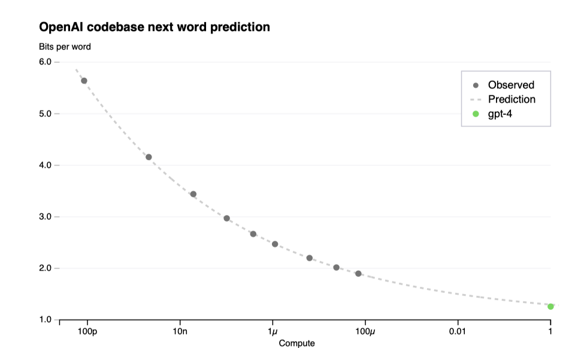
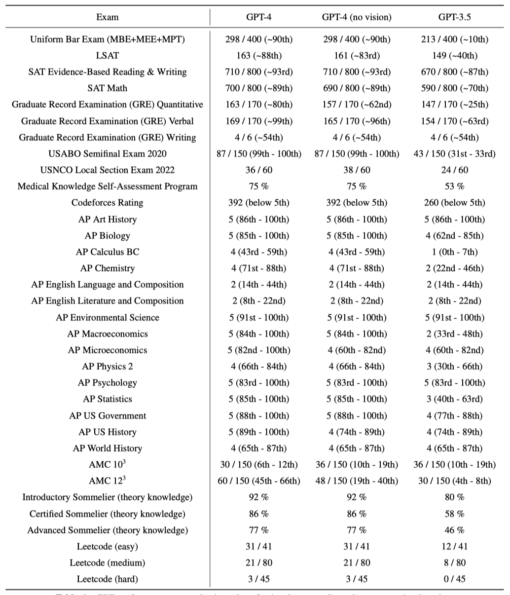
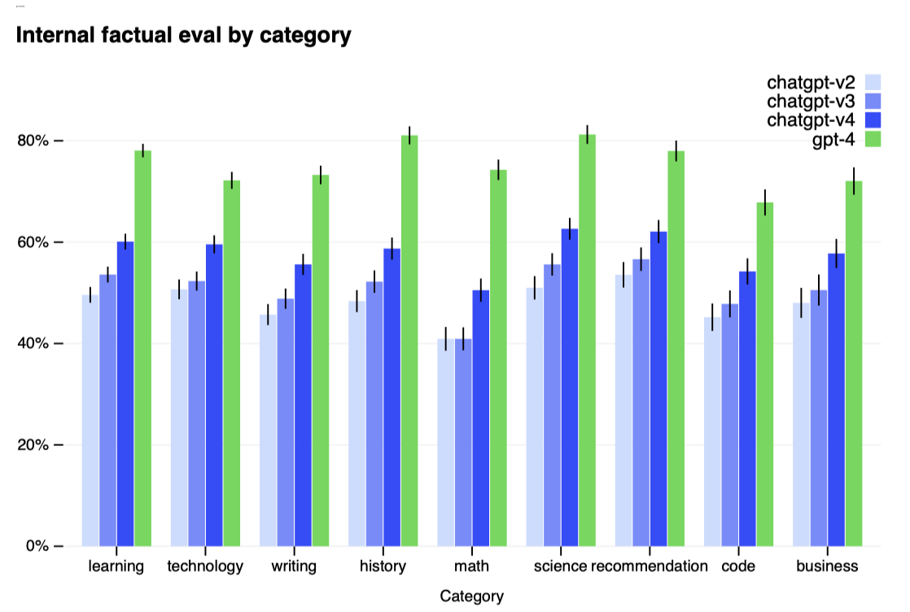

+++
author = "Kurt"
title = "GPT-4"
date = "2024-03-14"
description = "GPT-4 Technical Report"
categories = [
    "Paper Review"
]
tags = [
    "NLP",
    "LLM",
]
+++

## Abstract

GPT-4는 이미지와 텍스트 입력을 받아 텍스트를 생성하는 대규모 다중 모달 모델이다. 이 모델은 많은 분야에서 인간 수준의 성능을 보여주었으며, 특히 법학 시험에서 상위 10% 안에 드는 성과를 달성하였다. Transformer 기반으로 사전 학습된 GPT-4는 사후 학습을 통해 사실성과 원하는 행동 준수도를 향상시켰다. 프로젝트의 주요 목표 중 하나는 다양한 규모에서 예측 가능한 성능을 내는 인프라와 최적화 방법을 개발하는 것이었으며, 이를 통해 GPT-4의 성능 예측이 가능해졌다.

---

## Introduction

이 보고서는 텍스트와 이미지를 처리할 수 있는 GPT-4, 다양한 응용 분야에 적용 가능한 대규모 다모드 모델을 소개한다. 이 모델은 대화 시스템, 요약, 번역 등에 사용될 잠재력이 있어 최근 큰 관심을 받고 있다.

이 모델 개발의 핵심 목표는 복잡한 상황에서 자연어 이해와 생성 능력을 강화하는 것이다. GPT-4는 인간 대상 시험에서 뛰어난 성과를 보여, 대다수 인간보다 높은 점수를 획득하였다. 예를 들어, 모의 변호사 시험에서는 상위 10%에 도달한 반면, GPT-3.5는 하위 10%에 그쳤다.

전통적인 NLP 벤치마크에서 GPT-4는 이전 모델들과 최신 시스템들을 넘어선다. 57개 주제의 영어 다지선다형 문제인 MMLU 벤치마크에서 영어뿐 아니라 다른 언어에서도 우수한 성능을 보였으며, 26개 언어 중 24개에서 최고 성능을 기록하였다. 모델의 능력과 안전성 개선에 대해 뒤에서 더 자세히 설명한다.

이 보고서는 다양한 규모에서 예측 가능한 딥러닝 인프라와 최적화 방법 개발이라는 주요 도전을 다룬다. 이를 통해 소규모 테스트를 기반으로 GPT-4의 성능 예측이 가능해졌고, 최종 실행과 비교하여 훈련 방법에 대한 확신을 강화하였다.

GPT-4는 뛰어난 기능에도 불구하고 신뢰성이 완벽하지 않고, 제한된 컨텍스트 이해와 경험 학습 능력이 부족한 이전 GPT 모델들의 한계를 그대로 가지고 있다. 따라서 신뢰성이 중요한 상황에서는 GPT-4 사용에 주의가 필요하다.

GPT-4의 능력과 한계가 새로운 안전 도전 과제를 만들어내며, 이는 사회적 영향을 고려한 중요한 연구 분야이다. 이 보고서는 편향, 잘못된 정보 등 다양한 위험과 GPT-4 배포로 인한 피해를 줄이기 위한 조치들, 예를 들어 도메인 전문가와의 적대적 테스트와 안전 파이프라인 구축을 포함한 시스템 카드를 제공한다.

---

## Scope and Limitations of this Technical Report

이 보고서는 GPT-4의 능력, 한계, 안전성을 다루며, GPT-4는 공개 데이터와 제3자 데이터를 사용해 사전 학습된 Transformer-style 모델이다. 이 모델은 Reinforcement Learning from Human Feedback(RLHF)으로 미세 조정되었다. 대규모 모델의 경쟁 환경과 안전성 문제를 고려해, 아키텍처, 하드웨어, 학습 과정 등 구체적인 세부 사항은 보고서에 포함되지 않았다.

독립적인 기술 감사에 헌신하고 있으며, 이번 출시에서 관련 초기 아이디어를 공유하였다. 추가적인 제3자에게 기술 세부 정보를 제공하고, 이들로부터 경쟁과 안전, 과학적 투명성 사이의 균형에 대한 조언을 받을 계획이다.

---

## Predictable Scaling

GPT-4 프로젝트는 예측 가능한 확장성을 갖는 딥러닝 스택 구축에 중점을 두었다. 매우 큰 규모의 학습에서 모델별 상세 튜닝이 어려움을 극복하기 위해, 다양한 규모에서 예측 가능한 인프라와 최적화 방법을 개발하였다. 이를 통해, 훨씬 적은 컴퓨팅 파워로 학습된 작은 모델들을 바탕으로 GPT-4의 성능 일부를 신뢰성 있게 예측할 수 있었다.

### Loss Prediction

대규모 언어 모델의 최종 손실은 학습에 쓰인 계산량의 power law로 잘 예측된다.

최적화 인프라의 확장성을 검증하기 위해, GPT-4보다 최대 10,000배 적은 컴퓨팅 파워를 사용한 모델들을 기반으로 한 스케일링 법칙을 통해 GPT-4의 최종 손실을 정확하게 예측하였다. 이 과정은 실행 초기에, 어떠한 부분 결과도 없이 이루어졌다.

### Scaling of Capabilities on HumanEval

학습 전 모델 능력을 이해하는 것이 중요하며, 최종 손실 외에 해석 가능한 능력 지표를 예측하는 방법론을 개발하였다. 이를 통해 최대 1,000배 적은 컴퓨트로 학습된 모델을 기반으로 HumanEval 데이터셋에서의 합격률을 정확하게 예측할 수 있었다.

HumanEval 데이터셋에서, 개별 문제의 성능은 규모가 커짐에 따라 감소할 수 있다. 그럼에도 불구하고, 데이터셋 내 특정 문제들의 합격률과 컴퓨팅 규모 사이에 대략적인 멱함수 관계가 존재한다는 것을 발견하였다. 이 관계식에서 k와 α는 양의 상수이다. 매우 낮은 합격률의 추정이 어렵기 때문에, 큰 샘플 예산을 가진 경우에만 각 모델이 모든 문제를 최소 한 번 해결하는 문제와 모델에 초점을 맞춘다.

GPT-4의 HumanEval 성능 예측은 학습 전 정보를 바탕으로 학습이 완료되기 전에 이루어졌다. HumanEval 문제는 작은 모델들의 성능에 따라 6개의 난이도 버킷으로 구분되었으며, 세 번째로 쉬운 버킷에 대한 예측은 매우 정확하였다. 다른 버킷에 대한 예측도 대체로 잘 맞았으나, GPT-4는 가장 쉬운 버킷에서 예측보다 낮은 성능을 보여주었다.

모델 성능이 규모에 따라 감소하는 것으로 예상되는 작업들에 대해, GPT-4는 이러한 추세를 뒤집는 것으로 나타났다. 이는 "Hindsight Neglect"라는 작업에서 확인된다.

미래 능력의 정확한 예측은 안전에 중요하다. 대규모 모델 학습 전 다양한 능력의 성능을 예측하고 이 분야의 공통 목표로 삼을 계획이다.

---

## Capabilities

다양한 벤치마크에서 GPT-4를 테스트했으며, 이 중에는 인간용으로 설계된 시험 시뮬레이션이 포함된다. 특별 학습 없이 진행된 이 테스트에서, 일부 이미 알려진 문제를 제외한 후 낮은 점수를 보고하였다.

공개 자료에서 가져온 시험 문제로, 객관식과 서술형을 포함하며 필요시 이미지도 사용하였다. 검증 세트 성능 기반으로 평가 설정을 하고, 보류된 테스트 시험 결과를 보고하였다. 공개 방법론으로 각 시험의 객관식과 서술형 점수를 결합해 전체 점수를 도출하고, 해당 백분위수를 추정해 보고한다.

GPT-4는 대다수 전문 및 학술 시험에서 인간처럼 성과를 내며, 특히 변호사 자격 시험에서는 상위 10% 안에 드는 점수로 합격하였다.

모델의 시험 성능은 사전 학습에 주로 기반하며, RLHF의 영향은 크지 않다. 객관식에서 기본 GPT-4와 RLHF 모델이 시험 전반에 걸쳐 평균적으로 같은 수준으로 잘 해냈다.

언어 모델 평가를 위한 전통적인 벤치마크에서 사전 학습된 GPT-4를 평가하였다. 각 벤치마크별 테스트 데이터의 학습 세트 오염을 검사했으며, GPT-4 평가 시 모든 벤치마크에 few-shot 프롬프팅을 적용하였다.

GPT-4는 기존 언어 모델과 이전 state-of-the-art 시스템들을 크게 초월한다.

대부분의 ML 벤치마크가 영어로 되어 있음에도, MMLU 벤치마크를 다양한 언어로 번역해 GPT-4의 다언어 능력을 평가하였다. 결과적으로, GPT-4는 영어뿐만 아니라 라트비아어, 웨일스어, 스와힐리어 같은 저자원 언어를 포함한 대부분의 언어에서 GPT 3.5와 기존 언어 모델들을 초과하는 성능을 보여주었다.

GPT-4는 사용자 의도 이해에서 이전 모델들을 크게 넘어섰으며, 테스트된 프롬프트의 70.2%에서 GPT-3.5보다 더 선호된 응답을 생성하였다.

GPT-4 같은 모델을 평가하기 위해 OpenAI Evals, 벤치마크 생성 및 실행 프레임워크를 오픈 소스화하고 있다. 이는 기존 벤치마크와 호환되며, 모델 성능을 추적하는 데 사용된다. 앞으로 벤치마크의 다양성을 늘려 더 많은 실패 유형과 어려운 과제를 포함시킬 계획이다.

### Visual Inputs

GPT-4는 이미지와 텍스트를 포함한 입력을 받아들여, 사용자가 지정한 다양한 시각 및 언어 작업에 대한 텍스트 출력을 생성한다. 이 모델은 문서, 사진, 다이어그램, 스크린샷 등 여러 영역에서 텍스트만을 입력으로 할 때와 유사한 성능을 보여준다. 또한, 이미지와 텍스트 모두를 사용할 때 few-shot 프롬프팅, chain-ofthought와 같은 언어 모델용 표준 기술이 효과적이다.

GPT-4의 초기 시각 벤치마크 결과는 블로그 포스트에서 확인할 수 있으며, 시각적 능력에 대한 추가 정보는 추후 공개될 예정이다.

---

## Limitations

GPT-4는 이전 모델들과 같은 한계를 지니며 완전히 신뢰할 수 없다. 특히 고위험 상황에서는 언어 모델의 출력을 사용할 때 큰 주의가 필요하며, 특정 애플리케이션에 맞는 적절한 조치(인간 검토, 추가 맥락 제공, 고위험 사용 회피 등)를 취해야 한다.

GPT-4는 이전 GPT-3.5 모델 대비 잘못된 정보 생성을 현저히 줄이며, 사실성 평가에서 GPT-3.5보다 19%포인트 더 높은 점수를 얻었다.

GPT-4는 TruthfulQA와 같은 벤치마크에서 진보를 보였으며, 잘못된 진술로부터 사실을 구별하는 능력이 GPT-3.5 대비 개선되었다. 기본 모델은 소폭 개선되었지만, RLHF 추가 학습 후에는 큰 향상을 보여주었다. GPT-4는 흔한 속담을 피하는 등 진보를 보였으나, 여전히 일부 세부 사항을 놓칠 수 있다.

GPT-4는 2021년 9월 이후의 사건에 대한 지식이 부족하고, 경험에서 배우지 않는다. 간단한 추론 오류를 범하거나 거짓 진술을 쉽게 믿을 수 있으며, 사람처럼 어려운 문제를 해결하다가 보안 취약점 같은 문제를 초래할 수도 있다.

GPT-4는 자신감 있게 틀릴 수 있으며, 실수 가능성이 있을 때 주의 깊게 확인하지 않는다. 사전 학습 모델은 예측의 정확성에 잘 맞춰져 있지만, 추가 학습 과정을 거친 후 정확도 조정이 감소한다.

GPT-4 출력의 편향을 수정하는 데 시간이 필요하지만, 이를 관리하기 위해 노력 중이다. 목표는 GPT-4와 다른 시스템이 다양한 사용자 가치를 반영하고, 넓은 범위 내에서 맞춤화될 수 있도록 하며, 이 범위 설정에 대한 공공의 의견을 수렴하는 것이다.

---

## Risks & mitigations

GPT-4의 안전성과 정렬 향상을 위해 많은 노력을 기울였으며, 도메인 전문가의 적대적 테스팅, 레드팀 활동, 모델 지원 안전 파이프라인을 통해 이전 모델들보다 안전 지표가 개선되었다.

**Adversarial Testing via Domain Experts:** GPT-4는 작은 언어 모델과 비슷한 위험을 가지지만, 추가 기능으로 인해 새로운 위험 영역이 생겼다. 이를 파악하기 위해, 50명 이상의 전문가들이 사이버보안, 생물 위험 등 다양한 분야에서 모델을 적대적으로 테스트하였다. 이들의 분석을 통해 고위험 영역에서의 모델 행동을 테스트하고, 진보된 AI에게 중요할 수 있는 위험들을 평가하였다. 전문가들의 권장사항과 데이터는 모델 개선과 위험 완화에 활용되었으며, 예를 들어 위험한 화학물질 합성 거부 능력을 향상시키기 위한 데이터가 추가되었다.

**Model-Assisted Safety Pipeline:** 이전 GPT 모델들처럼, 사용자 의도에 맞는 응답을 위해 reinforcement learning with human feedback(RLHF)으로 모델을 미세 조정한다. 그럼에도 불구하고, 모델은 안전하지 않은 입력에 취약하고 때로는 원치 않는 행동을 보일 수 있다. 이는 라벨러 지시사항이 명확하지 않을 때 발생할 수 있다. 모델이 부적절한 내용을 생성하거나 안전한 요청에 지나치게 조심스러워 할 수 있다. 모델을 적절하게 유도하기 위해, 추가적인 안전 관련 RLHF 학습 프롬프트와 rule-based reward models(RBRMs)을 사용한다.

rule-based reward models(RBRMs)는 GPT-4의 zero-shot 분류기 세트로, 올바른 행동을 목표로 RLHF 미세 조정 중 추가 보상 신호를 제공한다. 이 모델은 프롬프트, 정책 모델 출력, 인간이 작성한 평가 체크리스트를 입력으로 받아 출력을 분류한다. 해로운 콘텐츠 요청을 거부하거나 안전한 요청을 수용하는 행동에 대해 GPT-4에게 보상을 준ㄴ다. 이 방법은 모델을 더 바람직한 행동으로 유도하기 위해 최적의 RBRM 가중치 계산과 특정 영역 개선을 위한 추가 데이터 제공과 같은 기타 개선 사항과 결합된다.

**Improvements on Safety Metrics:** GPT-4의 안전성이 크게 향상되었다. GPT-3.5에 비해 허용되지 않는 콘텐츠에 대한 응답을 82% 줄였고, 민감한 요청에 대한 정책 준수율은 29% 증가하였다. 또한, GPT-4는 RealToxicityPrompts 데이터셋에서 유해 콘텐츠를 생성할 확률이 0.73%에 불과하며, 이는 GPT-3.5의 6.48%와 비교해 크게 낮다.

모델을 개선하여 나쁜 행동 유도를 어렵게 만들었지만, 여전히 가능한 방법들이 존재한다. 예를 들어, 사용 지침을 위반하는 콘텐츠를 만드는 탈옥 현상이 있다. 따라서, 이런 제한점을 보완하기 위해 남용 감시와 빠른 모델 개선 작업이 중요하다.

GPT-4와 그 후속 모델들이 사회에 긍정적이거나 부정적인 큰 영향을 줄 수 있다. 이를 대비해, 외부 연구자들과 협력하여 잠재적 영향을 더 잘 이해하고 평가하며, 미래 시스템의 위험을 평가하기 위한 작업을 하고 있다. 곧 AI의 사회적 대응과 경제적 영향에 대한 권장사항과 아이디어를 발표할 계획이다.

---

## Conclusion

GPT-4는 특정 전문적 및 학술적 분야에서 인간 수준의 성능을 내는 대규모 다중 모드 모델이다. 이 모델은 다양한 NLP 작업에서 기존 언어 모델들을 뛰어넘고, 많은 언어에서 개선된 능력을 보여주며, 예측 가능한 스케일링으로 성능과 손실을 정확히 예측할 수 있다.

GPT-4는 증가된 능력으로 새로운 위험을 가지고 있으며, 이를 안전하게 만들기 위한 방법과 결과를 논의하였다. 아직 해야 할 일이 많지만, GPT-4는 안전한 AI 시스템으로 가는 중요한 진전을 보여준다.

---

## Reference

* [Paper](https://arxiv.org/pdf/2303.08774.pdf)