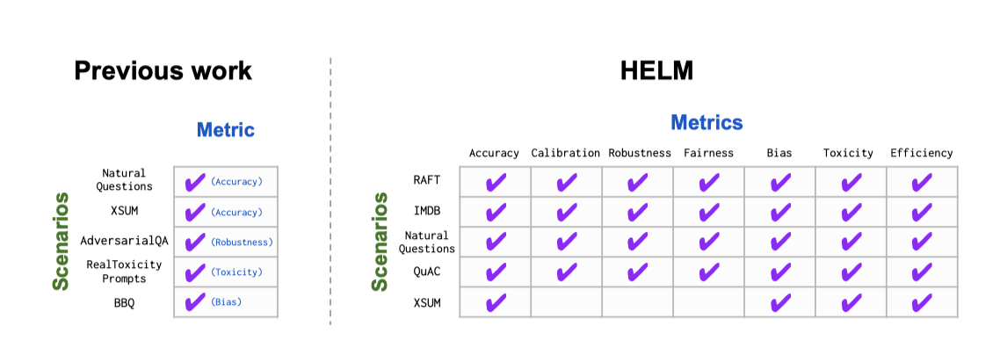
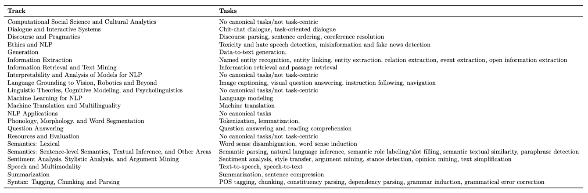
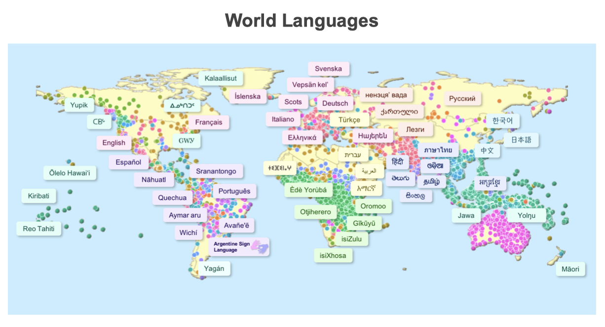
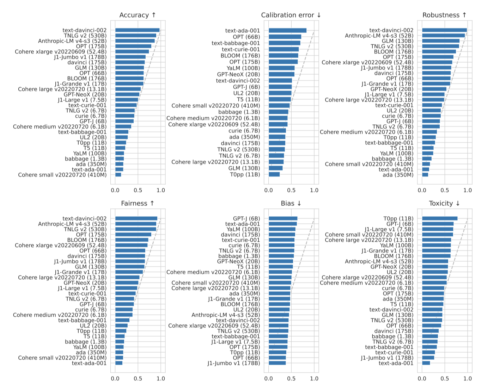
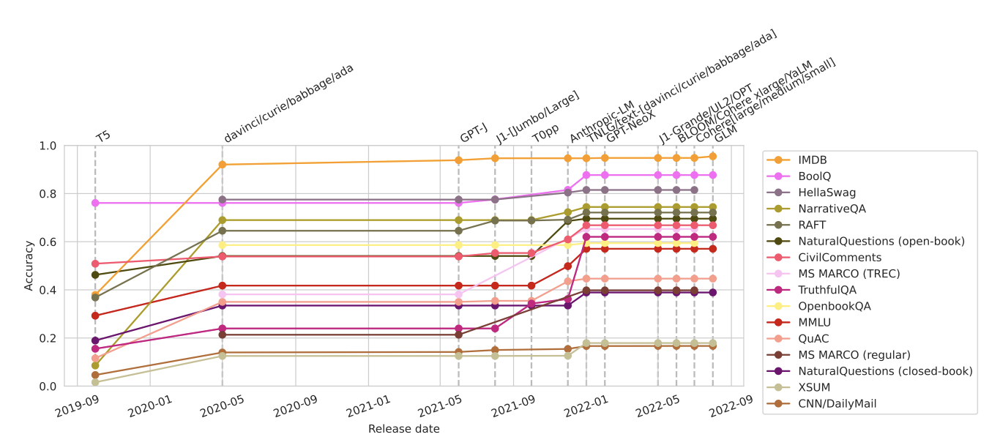

+++
author = "Kurt"
title = "HELM"
date = "2024-02-19"
description = "Holistic Evaluation of Language Models"
categories = [
    "Paper Review"
]
tags = [
    "NLP",
    "LLM",
]
draft = true
+++

## Abstract

언어 모델의 능력과 한계를 이해하기 위해, Holistic Evaluation of Language Models (HELM)를 제안한다. 이는 가능한 사용 사례와 지표를 분류하고, 다양한 지표를 측정하는 다중 지표 접근법을 채택하며, 특정 측면을 깊게 분석하는 타겟 평가를 수행한다. 또한, 모든 시나리오에 대해 주요 언어 모델의 대규모 평가를 수행하며, 이 과정에서 여러 시나리오, 지표, 모델 간의 상호 작용에 대한 중요한 발견을 드러낸다. 이를 통해 모든 모델이 핵심 시나리오와 지표에 대해 표준화된 조건에서 밀접하게 벤치마크될 수 있도록 한다. 또한, 추가 분석을 위해 모든 데이터를 공개하고, 새로운 시나리오, 모델, 지표를 쉽게 추가할 수 있는 툴킷을 제공하며, HELM이 지속적으로 업데이트되는 벤치마크가 되기를 희망한다.

---

## Introduction

벤치마크는 AI의 방향성을 지정하고, 그 가치와 우선순위를 표현한다. 적절하게 해석하고 구현될 때, AI 기술에 대한 이해를 넓히고 그 발전 경로에 영향을 미칠 수 있게 한다.

최근에 가장 큰 발전을 보인 AI 기술은 기반 모델로, 특히 언어 모델이 주목받았다. 언어 모델은 텍스트를 입력받아 생성하는 기능을 가지며, 대규모 데이터를 통해 학습시키면 다양한 시나리오에 적응할 수 있다. 하지만 이 모델의 능력, 한계, 위험성에 대한 이해는 아직 부족하며, 이로 인해 언어 모델을 전반적으로 평가할 필요가 있다.

언어 모델을 전반적으로 벤치마크하는 것은 다양한 시나리오에서 그 모델이 정확하고, 강인하며, 공정하고, 효율적이어야 한다는 것을 의미한다. 이러한 특성들의 중요성은 개인의 관점과 가치, 그리고 시나리오의 특성에 따라 달라진다. 예를 들어, 모바일 애플리케이션에서는 추론 효율성이 특히 중요할 수 있다.

holistic evaluation은 세 가지 요소를 포함한다:

1. **Broad coverage and recognition of incompleteness.** 언어 모델의 다양한 능력과 위험성을 고려할 때, 다양한 시나리오에 대해 모델을 평가해야 한다. 그러나 모든 시나리오나 바람직한 특성을 고려하는 것은 불가능하므로, 전반적인 평가는 중요한 시나리오와 누락된 지표를 명확하게 표시하는 상위-하위 분류를 제공해야 한다.
2. **Multi-metric measurement.** 사회적으로 유익한 시스템은 다양한 가치를 반영한다. 따라서 전반적인 평가는 각 시나리오에 대해 모든 바람직한 특성을 평가해야 한다.
3. **Standardization.** 평가의 대상은 시나리오 특정 시스템이 아닌 언어 모델이다. 따라서, 언어 모델을 의미있게 비교하기 위해 시나리오에 적응시키는 전략을 통제하고, 가능한 한 모든 언어 모델을 동일한 시나리오에서 평가해야 한다.

전반적인 평가는 언어 모델을 모두 평가함으로써 투명성을 높이며, 특정 측면에만 초점을 맞추는 대신 언어 모델의 전체적인 이해를 향상시키고 사회적 영향을 끌어내는데 목표를 두고 있다.

### HELM

Holistic Evaluation of Language Models(HELM)은 공간을 설계하기 위한 시나리오와 지표의 추상적 분류와, 범위, 가치, 실행 가능성을 고려한 구체적인 시나리오와 지표의 세트 두 단계로 이루어진다.

**Recognition of incompleteness.** AI의 벤치마크는 특정 시나리오와 지표의 선택에 의해 정의되며, 이는 SuperGLUE, EleutherAI LM Harness, BIG-bench와 같은 언어 모델에도 적용된다. 목표는 전반적인 평가로, 평가하려는 것과 실제로 평가하는 것 사이의 관계를 명확히 하는 것이 필요하다고 본다. HELM의 구축은 시나리오와 지표에 대한 상위-하위 구조로 시작하며, 이는 무엇이 누락되었는지 명확히 하고, 기술, 응용 프로그램, 사회적 이슈에 따라 발전시키려는 살아있는 벤치마크이다. HELM이 우선시해야 할 평가를 명확하게 강조하며, 이는 대부분 AI 분야가 역사적으로 무시해 온 부분이다.

**Multi-metric measurement.** 현재 HELM은 16개의 시나리오와 7개의 지표 범주를 핵심 세트로 구현하고 있다. 이 시나리오들은 사용자 중심 태스크, 다양한 도메인, 그리고 주로 영어를 아우른다. 지표 범주는 사회적 고려사항의 범위를 반영하며, 이들은 복잡하고 논쟁의 여지가 있는 사회적 구조이다. 벤치마크가 dense multi-metric 측정을 달성하도록 하며, 가능한 112개의 시나리오와 지표 쌍 중 98개를 측정한다.

multi-metric 관점은 AI 평가에 대한 이 논문의 입장을 보여준다. 대부분의 벤치마크는 주로 정확성을 중심으로 하지만, 모든 지표가 모델을 배포하려는 동일한 맥락에서 평가되어야 한다고 믿는다. 특히, 동일한 시나리오에 대해 7개의 바람직한 요소를 측정함으로써 잠재적인 트레이드오프를 명시하고, 이들 요소가 정확성에 비해 이차적으로 취급되지 않도록 한다.

**Targeted evaluations.** HELM은 16개의 핵심 시나리오와 7개의 지표 범주 외에도 26개의 추가 시나리오를 통해 7개의 특정 평가를 수행한다. 이 평가들은 언어 이해, 세계 지식, 추론 능력 등을 깊이 있게 다루며, 완전히 새로운 시나리오나 주류에서 덜 사용된 시나리오를 포함한다. HELM은 사회적 영향을 강조하며, 이를 다중 지표 관점에서 반영한다. 핵심 시나리오와 특정 평가는 분리되어, 모델에 대한 통합적인 시각과 특정 기술 및 위험을 분리하는 역할을 한다.

**Standardization.** 전체적인 평가의 일환으로, HELM에서 12개의 조직에서 나온 30개의 주요 언어 모델을 벤치마크하였다. 모델들은 접근성이 다양하며, 일부는 오픈소스, 일부는 제한적 접근, 일부는 비공개이다. 이들 모델 중 여러 개는 이미 상업용 API나 제품에 적용되어 있다. 그러나 평가 표준의 부재로 인해 언어 모델의 전체적인 이해가 제한되었다. 이 연구에서는 40개 이상의 언어 모델을 평가한 데이터셋을 주석 처리하였고, 주요 모델들이 공통된 데이터셋에서 평가되지 않았다는 것을 발견하였다. 실제로, 일부 모델들은 공개 결과를 보고하지 않았다. 또한, 주요 언어 모델링 작업에서 평가된 데이터셋의 평가 조건이 크게 다르다는 것을 발견하였다.

이전에는 모델들이 평균적으로 핵심 시나리오의 17.9%에서 평가되었다. 이를 이 논문에서 96.0%까지 향상시켰다. 동일한 시나리오에서 모델들을 평가하고 표준화된 조건에서 평가를 진행함으로써, 모델 간의 직접적인 비교를 가능하게 하였다.

**The importance of adaptation.** 이 연구에서는 주어진 시나리오를 다루는 일반적인 언어 모델의 적응 절차를 정의하여 모델을 벤치마크한다. 모든 언어 모델은 GPT-3가 선도한 few-shot 프롬프팅을 통해 적응하며, 단순하고 일반적인 프롬프트를 선택하여 언어 모델의 개발을 일반적인 언어 인터페이스 방향으로 유도한다. 더 정교한 프롬프팅, 프롬프트 분해, 그리고 프롬프트 튜닝을 통해 더 강력한 결과를 얻을 수 있지만, 이는 미래의 연구 주제로 남겨두었다.

**Caveats and considerations.** 연구 결과를 제시하기 전에, 세 가지 주요 고려사항을 강조한다. 첫째, 모든 모델을 동일한 시나리오와 지표, 프롬프트로 평가하더라도, 각 모델은 특정 시나리오나 지표, 프롬프트에 더 적합할 수 있다. 즉, 어떤 모델이 우리의 평가에서는 성능이 떨어져도 다른 상황에서는 잘 수행될 수 있다. 둘째, 평가 방법은 표준화되었지만, 모델을 학습시키는데 필요한 컴퓨팅 자원은 다를 수 있다. 마지막으로, 모델은 사용하는 데이터 분포나 평가 인스턴스에 대한 노출 정도가 다를 수 있으며, 이로 인해 학습-테스트 오염의 가능성이 있다.

### Empirical findings

평가 규모를 보면, 총 4,939번의 실행을 통해 모든 모델에서 총 12,169,227,491 토큰과 17,431,479 쿼리를 처리하였다. 이는 상업용 API에 대해 $38,001, 그리고 오픈 모델에 대해 약 19,500 GPU 시간의 컴퓨팅 비용을 들였다.

다음은 high-level의 주요 발견에 대한 요약이다:

1. **The benefits of instruction-tuning.** 핵심 시나리오에서, text-davinci-002 모델이 정확도, 견고성, 공정성 지표에서 가장 우수한 성능을 보였다. 또한, 모델 크기가 TNLG v2 (530B)의 10분의 1인 Anthropic-LM v4-s3 (52B)가 모든 3가지 지표에서 상위 3위 안에 들었다. 이 두 모델의 우수한 성능은 instruction-tuning이 광범위한 이점을 제공한다는 것을 보여준다.
2. **Relating model accuracy with model access.** 비공개 모델인 Anthropic-LM v4-s3 (52B), TNLG v2 (530B), 그리고 한정 접근 가능한 text-davinci-002의 높은 정확도를 고려하면, 현재 오픈 모델과 비오픈 모델 간에 모든 주요 시나리오에서 일관된 차이가 있다. 이 차이는 새로운 모델이 출시됨에 따라 시간이 지남에 따라 변할 수 있다. 최근에 출시된 오픈 모델들이 지난해 동안 이 차이를 크게 줄였지만, 아직 평가하지 않은 일부 비오픈 모델들도 매우 정확할 것으로 예상된다. 이 차이를 추적하는 것은 언어 모델의 접근성 및 권력 동적을 이해하는 데 중요하다.
3. **Calibration.** 정확도와 보정 사이의 관계는 시나리오와 적응 절차에 따라 달라진다. 예를 들어, HellaSwag에서는 정확도를 향상시키면 보정이 악화되지만, OpenBookQA에서는 정확도를 향상시키면 보정이 개선된다.
4. **Robustness and fairness perturbations.** 모든 시나리오에서 정확도, 견고성, 공정성 사이에 강한 상관관계를 관찰하였다. 그러나 가장 정확한 모델이 항상 가장 견고하거나 공정하지는 않다. 예를 들어, NarrativeQA에서 TNLG v2 (530B) 모델의 정확도는 견고성 변동성이 있을 때 72.6%에서 38.9%로 크게 떨어진다.
5. **Performance disparities.** 인구통계학적 메타데이터가 있을 때, 모든 모델의 성능 차이가 일관되게 나타난다. 예를 들어, OPT (175B) 모델은 TwitterAAE에서 가장 정확하지만, 백인 영어 대비 아프리카계 미국인 영어에서의 정확도가 저하된다.
6. **Generative harms.** 모델 생성에서의 편향성과 독성은 대체로 일정하며, 핵심 시나리오에 대해 전반적으로 낮다. 그러나, 편향이나 독성이 낮다 해도 중요한 사회적 영향을 미칠 수 있으므로, 보다 상세한 평가가 필요하다.
7. **Accuracy vs. efficiency.** 30개의 모델 전체에서 정확도와 효율성 사이에 강한 타협이 보이지 않는다. 모델이 커질수록 정확도는 향상되지만 학습 및 추론 비용이 더 높아진다. 전반적으로, 모든 모델 중 일부만이 각 시나리오에서의 정확도와 효율성 사이에서 최적의 균형을 찾고 있다.
8. **Question answering.** 9개의 핵심 질의응답 시나리오에서 결과의 이질성을 관찰하였다. 그러나 text-davinci-002가 모든 시나리오에서 가장 정확한 모델이었다. 9개 시나리오 중 6개에서는 가장 정확한 세 가지 모델 중 오픈 모델이 없었다.
9. **Information retrieval.** 주어진 쿼리에 대한 후보 passage를 순위화하는 고전적인 작업을 수행하였다. 평가한 가장 성능이 좋은 모델들은 고전적인 검색 방법을 능가하고, 세밀하게 조정된 신경망 검색기와 비슷한 성능을 보였지만, 최신 기술에는 뒤쳐졌다. passage 순위화에 대한 LM 사용은 비전통적이지만, 개념 증명으로 포함시켰다.
10. **Summarization.** CNN/DailyMail과 XSUM은 오랫동안 요약 벤치마크로 사용되었지만, 이 데이터셋에서의 자동 평가는 모델 품질의 차이를 충분히 구별하지 못하는 것으로 나타났다.
11. **Sentiment analysis.** IMDB 감정 분석에서 많은 모델들이 정확하고 잘 보정되어 있지만, 견고성에는 명확한 한계가 있다. 예를 들어, 가장 정확한 모델 중 하나인 GLM (130B)는 견고성에서 8% 이상 감소하였다.
12. **Toxicity detection.** CivilComments에서 독성 탐지에 대해, 대부분의 모델들이 특별히 정확하지 않다는 것을 발견하였다. OPT (175B)는 가장 정확한 모델 중 하나지만, 그 정확도는 50.1%에 불과하다. 또한, 흑인과 백인을 언급하는 댓글에서 독성을 탐지하는데 대부분의 모델들이 비슷한 정확도를 보였다. 그러나, 모델들의 견고성은 크게 달랐다.
13. **Miscellaneous text classification.** RAFT에서의 텍스트 분류에서, 모델별로 어떤 작업에서 잘하는지 큰 차이가 있다. text-davinci-002는 일관되게 정확하지만, 특정 분할인 시스템적 검토 포함에서는 매우 낮은 정확도를 보여주었다.
14. **Linguistic understanding.** 언어 모델링의 정확도 추세는 핵심 시나리오와 상당히 다르다. 특히, GPT-NeoX (20B), OPT (175B), BLOOM (176B), GPT-J (6B), 그리고 OPT (66B)는 The Pile, TwitterAAE, 그리고 ICE에서 가장 낮은 바이트당 비트를 보여주었다. 모든 모델은 BLiMP에서 비슷한 성능을 보였으며, 형태론, 구문론, 의미론, 구문-의미론에서도 비슷한 성능을 보여주었다. 그러나 불규칙한 형태에서는 핵심 시나리오에서 가장 정확한 모델들이 가장 덜 정확한 것으로 나타났다. 이는 특정 언어 규칙을 과도하게 일반화했을 수 있음을 시사한다.
15. **Knowledge.** text-davinci-002는 지식 집약적 평가에서 우수한 성능을 보였으며, 특히 TruthfulQA에서 62.0%의 정확도로 두 번째인 36.2%에 비해 큰 차이를 보여주었다. 또한, TNLG v2 (530B)는 지식 집약적인 NaturalQuestions과 WikiFact 시나리오에서 강력한 성능을 보여주었다. 이는 모델 규모가 사실 기반의 지식 획득에 큰 기여를 한다는 가설과 일치한다. 예를 들어, TNLG v2 (530B)는 대부분의 시나리오에서 비슷한 정확도를 보였지만 특정 시나리오에서는 큰 차이를 보여주었다.
16. **Reasoning.** 추론 집약적 시나리오에서는 코드 모델, 특히 code-davinci002가 텍스트 모델을 능가한다. 이는 자연어로 제시된 합성 추론 시나리오에서도 마찬가지이다. 이 차이는 수학적 추론에서 가장 명확하게 나타나며, code-davinci-002는 52.1%의 높은 정확도를 보여준다. 또한, text-davinci-002는 다른 텍스트 모델보다 훨씬 더 정확하다.
17. **Memorization of copyrighted/licensed material.** 긴 저작권 보호된 시퀀스의 직접적인 반복은 드물지만, 인기 있는 책들을 보면 눈에 띈다. 또한, 반복 위험은 모델의 정확도와 상관관계가 있으며, text-davinci-002, davinci (175B), 그리고 Anthropic-LM v4-s3 (52B) 모델이 가장 높은 반복을 보인다.
18. **Disinformation.** 가장 큰 모델들, 특히 text-davinci-002와 Anthropic-LM v4-s3 (52B)는 주어진 논문을 지지하는 현실적인 헤드라인 생성에 효과적이다. 그러나, 특정 행동을 수행하도록 사람들을 격려하는 텍스트 생성에 대한 결과는 더 혼합적이다.
19. **Targeted biases.** BBQ에서 text-davinci-002는 가장 정확한 모델로, 다음으로 정확한 모델들보다 큰 차이를 보인다. 이 세 가지 가장 정확한 모델들은 모호한 맥락에서 사회적 편향과 일치하는 편향을 가진 유일한 모델들이다. 다시 말해, BBQ에서 가장 정확한 모델들은 모호한 맥락에서의 사회적 편향에 가장 우려되는 모델들이다.
20. **Targeted toxicity generation.** 핵심 시나리오에서 독성 생성률은 매우 낮았다. 모든 모델들은 독성 프롬프트에 대해 더 강한 독성 생성 경향을 보였다. 이러한 추세가 사용된 자동 독성 감지 모델에 따라 어떻게 변화하는지, 그리고 다양한 이해당사자들의 인간 판단이 어떻게 영향을 미치는지 이해하는 것은 향후 연구의 중요한 부분이다.
21. **Comprehensiveness.** 통합된 조건 하에서 광범위한 평가를 통해, 새로운 발견을 드러냈다. 공개적으로 이용 가능한 모델들을 공개적으로 이용 가능한 데이터셋에 대해 평가하면서도, text-davinci-002가 NarrativeQA에서 74.4%의 ROUGE-L 정확도를 달성하여, 알고 있는 모든 방법 중에서 새로운 최고 기록을 세웠다.
22. **Prompting.** 모든 모델들은 프롬프트의 형식, 맥락 예제의 선택, 그리고 맥락 예제의 수에 큰 민감도를 보인다. 이러한 요소들을 표준화하는 데 노력하고 있지만, 현재 모델들은 정확도를 극대화하는 데 어떤 프롬프팅 결정이 최선인지에 대해 차이가 있다.
23. **Multiple choice adaptation method.** 모델의 성능은 객관식 시나리오가 프롬프트로 어떻게 변환되는지에 매우 민감하다. 각 답변 선택지를 별도의 프롬프트로 제시할 때와 단일 프롬프트로 함께 제시할 때 성능 차이가 크다. 또한, 동일한 시나리오에서도 최적의 성능을 얻는 적응 방법이 모델마다 다를 수 있다. 이는 모델 간에 공정하게 언어 모델을 평가하는 표준화에 대한 근본적인 도전이다.
24. **Upstream perplexity and downstream accuracy.** 언어 모델링의 perplexity가 downstream의 정확도를 신뢰성 있게 예측하는 것이 이상적이지만, 실제로는 모델 간 비교에서 이러한 예측이 잘 작동하지 않는다. The Pile에서의 bits-per-byte는 downstream의 정확도를 잘 예측하지 못하며, 모델에 따라 The Pile에서 학습 여부가 다르다. 따라서, 미래의 연구는 downstream 결과를 신뢰성 있게 예측할 수 있는 새로운 성능 측정 방법을 탐색하는 것이 중요하다.
25. **Trends for model scale.** 모델 패밀리 내에서는 모델 규모가 정확도를 신뢰성 있게 예측하지만, 모든 모델에 대한 downstream 정확도를 예측하는 데는 한계가 있다. 우연 이상의 비율로 정확도 비교에서 이긴 모델들은 모두 50B 이상의 parameter를 가지고 있다. 가장 정확한 모델 중 일부는 작은 규모를 가지고 있다. 전반적으로, 규모는 정확도의 주요 결정 요인이지만, 다른 방식(예: 인간의 피드백으로 훈련시키는 것)에 비해 비효율적일 수 있다.

### Contributions

이 논문의 기여는 다음과 같다:

1. **Taxonomy.** 언어 모델 평가의 방대한 설계 공간을 시나리오와 지표로 분류한다. 이 분류를 통해, 이 공간에서 체계적으로 선택할 수 있게 되며, 이로써 벤치마크 설계에 있어 우리의 우선순위와 현재 벤치마크의 제한 사항을 명확하게 할 수 있다.
2. **Broad coverage.** 분류 체계에 따라, 16개의 핵심 시나리오를 선택하고 구현하고, 이를 위해 7가지 지표를 전면적으로 측정한다. 또한, 기술과 위험에 대한 7개의 특정 평가를 포함시키며, 주류 언어 모델 평가에서는 이전에 사용되지 않았던 21개의 새로운 시나리오를 도입하였다.
3. **Evaluation of existing models.** 표준화된 벤치마크 조건에서 30개의 언어 모델을 평가하였다. 이를 통해 다양한 시나리오와 지표에서 모델들을 직접 비교할 수 있다. 이 모델들은 공개 상태에 따라 다르며, 10개는 공개, 17개는 제한적 접근, 3개는 비공개 모델이다.
4. **Empirical findings.** 폭넓은 평가는 다양한 결과를 도출하였고, 이는 기존 연구를 강화하거나 새로운 지식을 생성한다. 이 결과들은 미래 언어 모델 개발의 지침을 제공하며 추가 분석의 기회를 제공한다.
5. **Interactive results and codebase.** 모든 결과, 기본 모델 예측, 적응 상세 정보와 함께 확장 가능한 코드베이스를 공개 웹사이트에 제공하여, 커뮤니티가 HELM을 더욱 발전시키는 데 도움을 준다.

**Acknowledging the prior work this effort builds on.** 많은 이전 연구를 바탕으로 언어 모델의 종합적인 평가를 구축하였다. 언어 모델을 전체적으로 평가하는 것을 주장하면서도, HELM을 구성하는 다양한 데이터셋/평가를 만든 연구들이 인정받고 인용되어야 한다는 것을 명확히 한다. 이를 위해, 모든 연구에 대한 BibTeX 항목을 코드베이스에 제공하고, 웹사이트에서 각 평가에 대한 연관 연구를 명시적으로 인정한다.

---

## Preliminaries

언어 모델 평가에 필요한 기본 요소인 시나리오, 적응, 지표를 소개하고, 이를 바탕으로 언어 모델을 종합적으로 평가하는 방법을 제시한다.

### Scenarios

시나리오는 언어 모델의 원하는 사용 사례를 구현한다. 다양한 시나리오에서 성능을 발휘하는 모델이 유용하다. 실질적인 사용 사례는 다른 요소들을 포함하나, 학습 세트와 테스트 세트로 나뉘어진 인스턴스 목록을 통해 시나리오를 실행한다. 각 인스턴스는 입력(문자열)과 참조 목록으로 구성되며, 각 참조는 평가에 관련된 속성이 주석된 문자열이다.

### Adaptation

적응은 언어 모델을 새로운 사례에 대한 예측을 할 수 있는 시스템으로 변환하는 과정이다. 프롬팅, 경량화된 미세 조정, 미세 조정 등이 이에 해당하며, 이 작업에서는 프롬팅에 주목하고 있다.

언어 모델은 프롬프트(문자열)와 디코딩 parameter를 입력으로 받는 검은 상자로 정의되며, 이는 완성된 문자열과 log probability를 출력한다. 모델의 내부 작동이나 학습 데이터에 대한 접근을 가정하지 않으며, 이는 연구자들이 사용 가능한 API 접근의 실질적인 현실을 반영한다. 언어 모델이 어떻게 구성되는지에 대한 가정도 하지 않는다.

언어 모델을 text-to-text 추상화로 보는 것은 중요하다. 첫째, 현재 대표적인 언어 모델은 raw text에 학습된 Transformer이지만, 외부 문서 저장소 사용, 웹 검색 쿼리 발행, 인간 선호에 따른 학습 등 다양한 방식으로 활용될 수 있다. 이러한 구현 세부 사항에 대해 중립적이다. 둘째, text-to-text 추상화는 모든 텍스트 기반 작업을 포착할 수 있는 편리한 일반 인터페이스로, 이 아이디어는 이전 연구에 의해 선도되었다.

### Metrics

언어 모델이 적응되면, 각 시나리오에 대한 평가 인스턴스에서 해당 시스템을 실행하여 완성된 텍스트와 그 log probability를 얻는다. 모델의 성능을 평가하기 위해 이 완성된 텍스트와 확률에 대한 메트릭을 계산하며, 이 메트릭은 유용한 시스템에 필요한 추상적 목표를 구체화한다.

### Roadmap

언어 모델을 평가하기 위해, (시나리오, 적응 방법, 메트릭)의 삼중조로 정의된 일련의 실행 과정을 명시해야 한다. 이들 각각은 복잡하고 구조화된 공간을 정의하며, 이를 통해 언어 모델 평가 결정을 내린다. 이 논문의 접근법은 이 공간과 결정을 명시적으로 만드는 것이다. 두 공간을 분류하고 시스템적으로 선택하여 우리의 추상적인 목표와 구체적인 구현을 명시하며, 이는 HELM을 정의한다. 그 후, 특정 적응 절차(5-shot 프롬팅)를 선택하여 30개의 모델을 평가하며, 다른 적응 절차도 고려될 수 있음을 강조한다.

---

## Core scenarios

시나리오를 분류하는 방법은 작업(예: 질문 응답, 요약), 도메인(예: 위키백과 2018 덤프), 언어 또는 언어 변형(예: 스페인어)을 기반으로 한다. 이들은 시나리오 공간의 직관적인 구조를 형성하며, 이를 바탕으로 공간 커버리지, 선택된 시나리오의 최소성, 사용자 중심 작업에 해당하는 시나리오 우선순위 등의 원칙에 따라 시나리오를 선택한다. 이로써 측정할 모든 메트릭에 대한 핵심 시나리오가 정의되며, 현재 벤치마크/시나리오 선택에서 커버하지 않는 시나리오 공간의 영역을 강조한다.

### Taxonomy

**Tasks.** 자연 언어 처리(NLP) 분야는 언어의 다양한 기능에 대응하는 수많은 작업을 고려한다. 첫 원칙에서 작업 공간을 도출하는 것은 어렵기 때문에 기존 작업 소스를 모아 사용한다. NLP는 작업 중심의 분야이므로, NLP 커뮤니티에서 널리 연구된 작업으로 시작한다. 이를 위해 주요 NLP 컨퍼런스(ACL 2022)의 트랙을 활용하며, 각 트랙의 관련 NLP 서브영역을 정형화된 작업에 매핑한다. 이 과정에서 "정형화된(canonical)" 것을 선택하는 데는 일정한 주관성이 포함되어 있다.

NLP 연구에서 오랜 전통을 가진 작업들이 있지만, 두 가지를 주목한다: (i) 이 작업들은 종종 중요한 작업 내 구조를 가지고 있으며, 예를 들어, 질문 응답이라는 하나의 작업 아래에 더 세분화된 카테고리가 존재할 수 있다. (ii) 이 작업들은 NLP 연구에서 오랜 전통을 가지고 있지만, 반드시 유일하거나 가장 사회적/경제적 영향력이 큰 작업은 아니다.

OpenAI, Cohere, AI21 Labs 등의 언어 모델 배포는 NLP 커뮤니티의 기존 연구를 넘어선 새로운 사용 사례를 제시하였다. 이러한 일부 작업은 기본적으로 새롭게 등장한 것으로, 충분한 기술 능력의 출현으로 이전에 생각하지 못했던 작업을 고려하게 된다. 또한, 이러한 작업들은 NLP와 AI 연구에서 전통적으로 연구되던 작업과는 다른 패턴을 보여준다. 이는 작업 공간을 명시하는 데 근본적인 도전이며, 알려진 잠재적 사용 사례의 긴 꼬리를 명확히 하는 것은 아직 미해결 문제이다.

**Domains.** 도메인은 NLP에서 잘 알려진 개념이지만, 그 정확성의 부재는 도메인을 체계적으로 다루는 것을 복잡하게 한다. 이를 해결하기 위해, 도메인을 "3 W"에 따라 더 세분화한다.

1. **What** (genre): 텍스트의 유형, 이는 subject와 register 차이를 포착한다.
2. **When** (time period): 텍스트가 생성된 시기.
3. **Who** (demographic group): 데이터를 생성한 사람이나 데이터가 관련된 사람.

텍스트 생성의 위치와 방법은 고려하지 않지만, 중요할 수 있다. 텍스트 생성의 목적은 텍스트의 내용과 밀접하게 연관되어 있다. 언어 모델의 입력 데이터와 답변은 반드시 같은 도메인에 속하지 않을 수 있다. 간단히 하기 위해, 데이터셋은 입력 특성에 해당하는 하나의 도메인을 가진다고 가정하지만, 입력과 출력의 모든 측면에 연관된 도메인을 고려하는 것이 더 정확할 것이다.

**Languages.** 세계에는 수십억의 사람들이 천 개가 넘는 다양한 언어를 사용하고 있지만, AI와 NLP의 대부분의 연구는 일부 고자원 언어에 집중되어 있다. 이에 따라, 세계 언어를 광범위하게 분류하는 대신 주로 영어 모델을 평가하는데 초점을 맞추며, 영어의 다양성과 방언에 관한 커버리지에 주목한다. 이와 관련하여, 언어 유형론과 사회언어학에서 관심을 가질 수 있는 여러 축이 있다.

### Selection

이상적으로는 모든 시나리오에서 언어 모델을 평가하고 싶지만, 작업과 도메인은 풍부하고 넓은 범위를 가지고 있다. 그래서 시나리오의 전체 커버리지보다는 작업, 도메인, 언어 각각을 독립적으로 커버하는 것을 목표로 한다. 이 방식은 중요한 상호작용을 놓칠 수 있지만(예: 소수 집단이 작성한 텍스트에 대한 독성 감지), 이는 데이터셋의 가용성, 시나리오 구현 노력, 선택한 시나리오에서의 모델 평가를 위한 컴퓨팅 자원 등 실질적인 이유로 결정한 것이다.

**Tasks.** 작업을 선택하기 위해, 이전에 설명한 작업들을 기준으로 시작한다. 영어 언어 모델을 연구하므로, 실행 불가능한 작업들을 제외한다. 사용자 중심의 작업을 우선시하여, 질문 응답, 정보 검색, 요약, 감성 분석, 독성 감지와 같은 작업을 선택하였다. 그리고 작업의 다양성을 고려하여, 기타 텍스트 분류를 포함시켰다. 이는 과거와 현재의 언어 모델에 대한 비표준 텍스트 분류 사용 사례를 대표한다.

**Domains and Languages.** 작업에 비해 도메인을 명확하게 정의하는 것이 복잡하므로, 시나리오를 구체화하는 데이터셋 선택 과정에서 도메인 커버리지에 중점을 둔다. 또한, 다양한 영어 사용 국가의 영어 변형과 아프리카계 미국인 영어를 대상으로 한 평가를 통해 이를 보장한다. 시나리오 공간의 큰 부분, 특히 도메인과 관련된 부분에서는 NLP 데이터셋이 거의 없거나 전혀 없을 수 있음을 인식하고 있다. 커뮤니티가 필요하고 종종 과소평가되는 리소스를 구축하여 우리의 벤치마크에서 미처 다루지 못한 도메인과 시나리오의 커버리지를 확대하길 희망한다. 이를 위해 우선적으로 고려해야 할 특정 시나리오를 명시적으로 식별한다. 다룰 작업과 도메인/언어 커버리지에 대한 접근 방식을 결정한 후, 각 시나리오에 대한 특정 데이터셋을 어떻게 선택했는지 상세하게 설명한다.

### Question answering

질문 응답(QA)은 실제 응용 프로그램의 핵심 작업으로, 광범위한 질문 처리와 답변을 위해 언어 이해, 지식 통합, 그리고 추론 등의 기술이 필요하다.

**Problem setting.** 질문 응답(QA)은 주어진 질문에 대한 정확한 답을 예측하는 작업이다. 형식은 다양하며, 참조할 추가 문맥이 제공되는 open-book 설정, 선택지가 주어지는 객관식 설정 등이 있다. 예를 들어, "Where was the painter of the Mona Lisa born?"라는 질문에 "Italy"라는 답을 예측하는 것이다.

**Datasets and selection process.** 자연어 처리(NLP)에서는 다양한 질문 응답 데이터셋이 사용 가능하며, 최근에는 이 수가 급격히 증가하고 있다. 데이터셋 선택 시, 입력/문맥의 도메인 범위와 데이터셋에 필요한 기술 범위(예: 상식과 추론 요구)를 우선 고려하였다.

웹 검색 쿼리, 스토리, 대화형 질문을 다루는 NaturalQuestions, NarrativeQA, QuAC 데이터셋을 선택하여 도메인 커버리지를 확보하였다. 이들 데이터셋은 Google 검색 질문, 위키백과 주석, 책과 영화 대본 이해, 맥락에 의존한 자유형 질문과 답변 등 다양한 요소를 포함하고 있다.

HellaSwag, OpenBookQA, 그리고 TruthfulQA 데이터셋을 추가하여 상식 지식과 추론을 보장하였다. HellaSwag는 상식 추론을, OpenBookQA는 기본 과학 사실에 대한 이해와 적용을, TruthfulQA는 일반적인 인간의 오해를 따르는 질문을 통해 모델의 진실성을 테스트한다.

다양한 학문 분야의 지식 집약적인 질문 응답을 보장하기 위해, 57개의 다양한 작업을 포함하는 MMLU 메타-벤치마크를 추가하였다. 이는 다중 작업 정확도를 측정하고, 문제 해결 및 일반 지식을 테스트한다.

마지막으로, 모델의 견고성을 연구하기 위해 QuAC와 함께 사용된 이진형 예/아니오 질문 모음인 BoolQ를 추가하였다. 이는 NaturalQuestions와 동일한 과정으로 생성되었다.

### Information retrieval

Information retrieval(IR)은 대규모 비구조화된 컬렉션을 검색하는 작업으로, 많은 응용 프로그램에서 핵심적인 역할을 한다. 이는 오랜 전통의 연구를 거쳐 널리 사용되는 언어 기술로, 웹과 전자상거래 검색을 구동하며, 오픈 도메인 질문 응답이나 사실 확인 등의 NLP 시스템에서 중요한 역할을 한다.

주어진 질의와 대량의 패시지 코퍼스를 바탕으로 "relevance"이 높은 순서로 상위 패시지 목록을 출력하는 작업에 초점을 맞춘다. 특히, 코퍼스가 매우 크므로 효율적인 외부 검색 메커니즘을 통해 질의에 대해 검색된 세트 중에서만 상위 패시지를 순위 매긴다.

IR은 각 테스트 예시가 대량의 패시지 처리를 필요로 하고, 이를 위해 언어 모델(LM)을 여러 번 호출하는 점에서 이 작업에서 다루는 다른 작업들과 근본적으로 다르다. 이 때문에 언어 모델을 이용한 few-shot의 문맥 학습에서 IR 작업은 거의 주목받지 않았다.

**Problem setting.** 정보 검색 문제를 binary log-probability 문제로 처리하여 재순위 작업을 수행한다. 주어진 패시지와 쿼리에 대해, 모델에게 패시지가 쿼리에 대한 답을 포함하고 있는지 묻는다. "yes"라는 대답이 높은 확률로 나오면 해당 패시지를 높게 순위를 매기며, "no"라는 대답은 반대의 결과를 얻는다. 생성된 순위는 표준 정보 검색 메트릭을 사용하여 평가된다.

**Datasets and selection process.** MS MARCO 순위 결정 데이터셋을 활용하여 정보 검색 작업을 시연한다. 이 데이터셋은 원래 질문 응답 작업이지만, 최근 몇 년 동안 신경 IR의 발전에 중요한 역할을 해왔다.

웹에서 9M 패시지를 검색하여 평가하는 MS MARCO와 TREC 2019 딥 러닝 트랙의 데이터셋을 사용한다. MS MARCO는 대량의 쿼리와 희소한 관련 판단을 포함하며, 각 쿼리당 하나의 관련 패시지만 식별한다. 반면, TREC 트랙은 43개의 쿼리만을 포함하지만, 더 엄격한 주석과 9,000개 이상의 쿼리-패시지 쌍의 관련 판단이 있다.

### Summarization

텍스트 요약은 NLP의 주요 연구 분야로, 텍스트의 양이 증가함에 따라 그 중요성이 커지고 있다. 시스템은 소스 문서의 핵심적이고 정보적인 내용을 식별하고, 덜 중요한 정보를 제거하며, 중복을 피하는 방식으로 효과적으로 요약해야 한다. 최근 몇 년간 언어 모델의 발전은 인간과 같은 텍스트를 생성하는 능력을 향상시켜 요약 능력을 크게 개선하였다.

**Problem setting.** 텍스트 요약은 비구조화된 sequence-to-sequence 문제로 처리된다. 문서가 입력이 되고, 언어 모델은 참조 요약을 닮은 요약을 생성하는 역할을 한다. 이 평가는 모델이 입력 문서에서 직접적으로 요약을 생성하는 능력, 즉 추상적 요약 능력을 테스트한다.

모델 성능을 평가하기 위해, 모델이 생성한 요약은 전반적인 품질, 충실성, 추출성에 대한 지표를 사용하여 인간이 작성한 참조 요약과 비교된다. 충실성은 모델 요약의 정보가 모두 기사에 부합하는지, 추출성은 모델이 입력 문서에서 얼마나 많이 복사하는지를 나타낸다. 이전 연구에서 요약 시스템들이 덜 충실한 경향이 있음이 밝혀졌기 때문에, 추출성을 계산한다.

모델이 요약할 문서와 다른 내용을 생성하는 경향이 있어, 충실성에 특별히 주의를 기울인다. 잘못된 정보를 퍼뜨릴 가능성이 있는 충실하지 않은 시스템은 실제 환경에서 위험할 수 있다. 따라서, 충실성을 측정하고 개선하는 것이 중요하다. 인간의 충실성 점수와 높은 상관관계를 가진 참조 없는 평가 지표를 사용하여 언어 모델을 평가한다. 하지만 일부 참조 없는 평가 지표가 가짜 상관관계에 주로 의존하고 있음이 최근 연구에서 밝혀졌다.

**Datasets.** 요약 데이터셋의 수가 늘어나고 있으며, 이 중에서는 더 세밀하고 특정한 요약 기능을 포착하는 것도 있다. 이런 다양성 때문에 요약을 대표하는 데이터셋 선택은 어렵다. 특히 모델의 충실성에 관심이 있어, 요약 충실성에 대해 가장 많이 연구된 CNN/DailyMail과 XSUM 데이터셋을 선택하였다. 이 데이터셋들은 요약의 중심 축에서 다르며, 요약의 전체 다양성을 대표하지는 못한다. 향후에는 요약 수요가 더 많은 도메인으로 벤치마크를 확장하는 것을 권장하며, 이 두 데이터셋에 대한 비판적 시각을 강조하며 요약 및 자연어 생성에 대한 데이터셋 및 평가 디자인에 더 넓은 변화가 필요함을 지적한다.

### Sentiment analysis

감정 분석은 NLP의 주요 작업으로, 다양한 분야에서 고객 리뷰 분석 등에 활용되고 있다. 이진 텍스트 분류에서 시작된 감정 분석은 이후 많은 연구를 통해 그 영역이 확장되고 깊어졌다.

**Problem setting.** 감정 분석의 목표는 주어진 텍스트(예: 비판적인 영화 리뷰)로부터 감정(여기서는 "Negative")을 예측하는 것아다.

**Datasets and selection process.** 많은 감정 분석 데이터셋이 제안되었지만, 엔지니어링 리소스의 한계로 인해 우리는 IMDB 데이터셋만을 포함하기로 결정하였다. 이 데이터셋은 사용자들이 1-10까지 영화를 평가하는 리뷰로 구성되어 있으며, 이 평점들은 부정적 또는 긍정적으로 이진화되어 레이블링된다. 감정 분석은 더 다양하고 복잡할 수 있으므로, 이 분야에서의 미래 연구를 통해 벤치마크를 확장하길 권장한다.

### Toxicity detection

독성 탐지는 인터넷 콘텐츠 관리를 위해 필요한 작업으로, 메타, 트위터, 레딧 등의 플랫폼에서 점점 더 중요해지고 있다. 그러나, 독성 연구가 사용 사례와 분리되는 경향, 데이터셋이 충분한 맥락을 제공하지 않는 문제, 그리고 독성의 구성이 주석 달기 작업자에 따라 달라질 수 있다는 문제 등에 대한 비판이 있다. 이러한 문제들로 인해 독성의 정의는 사회 집단, 지위, 특권에 따라 달라질 수 있어, 소외된 그룹에 불균형한 영향을 미칠 수 있다.

독성 탐지의 중요성은 매우 크며, 그 실패는 심각한 인권 침해와 민주주의 위협에 기여하였다. 인종 갈등 위험이 발생하는 지역에서 언어와 문화에 대한 충분한 이해를 가진 검토자의 부재가 문제의 일부로 지적되고 있다. 주류 언어가 아닌 언어에서의 언어 모델의 성능 저하로 인해, 자동화된 관리가 문제를 악화시킬 수 있다는 우려가 있다.

**Problem setting.** 독성 탐지는 입력 텍스트가 독성이 있는지 없는지를 판별하는 이진 분류 문제로, "Question: Is the passage above toxic?"라는 프롬프트를 사용하여 모델에게 직접 판단하도록 요청한다. "toxic"이라는 용어는 데이터 라벨링에 사용된 분류 카테고리와 일치하도록 사용된다.

**Datasets and selection process.** 최근에는 독성 탐지 데이터셋이 늘어나고 있다. 이 중 메타데이터 주석이 포함된 WILDS 벤치마크의 CivilComments 데이터셋을 선택하였다. 이 데이터셋은 텍스트에서 언급된 데이터 대상자에 대한 정보를 제공함으로써, 독성의 수신자에 따른 성능 격차를 측정하는 데 도움이 된다. CivilComments는 2015년부터 2017년까지 전 세계 50개의 영어 뉴스 사이트에서 댓글을 수집한 것이다.

### Miscellaneous text classification

텍스트 분류는 입력 시퀀스에 레이블을 할당하는 NLP 작업으로, 언어 식별, 감정 분석, 주제 분류, 독성 탐지 등 다양한 작업이 포함된다. 이러한 주요 작업 외에도, 사회 전반에 걸쳐 사용되는 다양한 텍스트 분류 작업들이 있으며, 이들 작업은 언어 모델의 실용적인 활용성을 평가하는 데 중요한 역할을 한다.

**Problem setting.** 감정 분석과 같이, 텍스트 시퀀스가 입력되고, 모델이 예측해야 하는 범주형 레이블이 출력된다. 하지만 작업이 더 복잡할 수 있기 때문에(예: 은행 고객 서비스 문의 분류), 작업을 지정하는 추가 지침을 제공한다. 즉, 텍스트가 은행 고객 서비스 문의임을 확인하고, 모델은 그것을 제공된 77개의 카테고리 중 하나로 분류해야 한다.

**Datasets and selection process.** 비표준 텍스트 분류 작업을 모두 열거하거나 표현하는 것은 본질적으로 불가능하다. 따라서, 실제 응용이 있는 11가지 작업을 모아둔 RAFT를 참고한다. 이 작업들은 부작용 감지, 은행 고객 서비스 문의 분류, 유해한 응용 프로그램 감지 등 다양하며, 이들은 자연스럽게 발생하여 언어 모델이 실제로 활용될 수 있는 상황을 식별하는 데 도움이 된다. 전체 테스트 세트의 레이블은 비공개이므로, 평가를 위해 공개 학습 세트의 일부를 따로 두었다.

---

## General metrics

유용한 시스템에 대한 원하는 기준들을 분류하고, 이를 통해 다양한 작업에서 언어 모델의 기준 성능을 향상시키려고 한다. 특정 지표를 측정하는데 필요한 요구 사항에 따라 이들 기준을 세부적으로 분류한다. 이 분류를 바탕으로, 이 작업에서 평가하는 모든 모델에 대한 요구 사항을 충족시키는 모든 지표를 선택한다. 측정은 확장성을 우선시하며, 각 시나리오의 특수성에 구애받지 않는다. 예를 들어, 공정성을 측정하는 시나리오를 확대하기 위해, 대부분의 데이터셋에서 사용할 수 없는 인구 통계 정보에 대한 접근을 가정하는 대신, 더 넓은 범위의 적용을 가능하게 하는 비틀림 기반 방법을 고려한다.

### Taxonomy

시스템이 유용하다는 것은 종종 평균적으로 정확하다는 것을 의미하게 되었다. 그러나 정확도만으로는 시스템이 충분히 유용하다고 보기 어렵다. 다양한 가치를 가진 커뮤니티로서, 시스템의 성능을 평가할 때는 여러 축에서의 프로파일링을 고려해야 한다.

NLP 커뮤니티에서 연구된 원하는 결과를 고려하여 원하는 결과 세트를 정리하였다. 그러나 일부 결과(예: 불확실성과 보정)는 특정 영역에 적용되지 않았다. 그래서 AI 컨퍼런스 전체 범위로 확장하여 AI 컨퍼런스 마감일 목록에서 정보를 참조하였다. 간결함을 위해, 언어 이외의 다른 모달리티와 연관된 장소(예: 컴퓨터 비전, 로보틱스 등)는 제외하였다.

각 컨퍼런스의 논문 투고 요청이나 연구 영역 목록을 확인하여, 그들이 연구한 원하는 결과와 매핑하였다. 이러한 결과들의 합집합은 이 논문이 고려하는 원하는 결과의 범위를 형성하며, 이는 성능이 뛰어난 시스템을 달성하기 위해 필요한 다양한 차원을 제시한다. 전통적으로 연구되지 않은 결과가 있을 수 있으므로, 다양한 소스에서 원하는 결과를 찾는 넓은 접근법을 적용하였다. 이러한 접근법이 우리의 커버리지를 강화하였으며, 다른 방법들이 여전히 우리의 목록을 개선할 수 있을 것이라고 믿는다.

언어 모델을 인터페이스로 보고, 그 구조나 맥락에 대한 가정 없이, 블랙박스 접근 이상의 권한 없이 이들을 평가하기 위한 필요한 지식과 접근 권한에 따라 원하는 결과를 분류한다.

### Selection

모델의 구조나 시스템에 대한 가정 없이, 블랙박스 접근 이상의 권한 없이 원하는 결과를 정량적으로 측정할 것을 선택하였다. 이에 해당하는 결과들은 정확도, 불확실성/보정, 견고성, 공정성, 편향, 독성, 추론 효율성 등이다. 추가로, 일부 모델에 대해 부분적으로 사용 가능한 정보에 기반한 학습 효율성과 환경 영향도 고려하였다. 법적 측면과 신뢰성도 일부 다루며, 언어 모델을 적응시키는 데 사용된 데이터의 샘플 효율성도 고려하였다. 이 외에도, 추가 개선이 필요한 영역에 대해 우선 순위를 제안하였다.

**Multi-metric coverage.** 전반적인 접근법의 다양한 측정 기준을 강조하기 위해, 각 모델에 대한 결과 행렬을 제시하였다. 이는 선택된 시나리오와 메트릭의 부분 공간에 대한 벤치마크의 광범위한 커버리지를 강조한다. 또한, 각 측정 기준 카테고리 즉, 원하는 결과에 대한 구체적인 측정을 논의하고 있다.

### Accuracy

AI에서 정확도는 가장 중요하게 연구되고 평가되는 속성이다. 각 시나리오에 대한 표준 정확도 메트릭으로 정확도를 사용한다. 이는 텍스트 분류, 질문 응답, 정보 검색, 요약 등에서의 특정 측정치를 포함한다. 중요한 점은, 정확도는 테스트 인스턴스에 대해 평균화하여 측정된다는 것이다. 그러므로 평균 정확도가 높더라도 소수 그룹에서는 낮은 정확도를 경험할 수 있다.

### Calibration and uncertainty

기계 학습 모델이 다양한 시스템에 통합될 때, 모델의 정확성과 불확실성을 동시에 표현하는 것이 중요하다. 이는 모델의 예상 오류를 적절히 관리하고, 고위험 환경에서 안전하게 배포할 수 있게 한다. 특히, 모델이 불확실한 예측을 할 때, 시스템 디자이너는 사람이 개입하여 잠재적 오류를 방지할 수 있다. 이러한 불확실성은 언어 모델에서 특히 중요하며, 다른 프롬프트의 집계나 프롬프트 체인의 조립 등에 활용될 수 있다. 따라서, 보정과 모델 불확실성의 신뢰성 있는 추정은 언어 모델의 통합에 대한 신뢰를 구축하는데 중요한 역할을 한다.

보정은 모델이 예측에 의미 있는 확률을 할당하는 속성을 한다. 잘 보정된 모델이 특정 확률로 예측했다면, 그 확률만큼의 예측이 맞아야 한다. 예를 들어, 0.7의 확률로 1000개의 문장이 유해하다고 예측했다면, 실제로 약 700개의 문장이 유해해야 한다. 보정 정도는 예상 보정 오류(ECE)를 계산하여 측정하며, 이는 모델의 예측 확률과 실제 정확도 사이의 차이를 나타낸다.

선택적 분류의 가능성을 테스트하였다. 이는 모델이 가장 확신하는 예시들에 대한 정확도를 평가하고, 나머지 예시에 대해선 판단을 보류하는 방식이다. C = 0.1에 대한 선택적 분류 정확도와 전체 범위에서의 평균 정확도를 보고하였다. 이는 보정과 다른 측면을 보여주는데, 모델이 원시 확률 값이 틀릴지라도 더 어려운 예시를 정확하게 평가하는 능력을 보여준다.

### Robustness

모델이 실제 상황에서 배치될 때는 오타 등의 복잡한 요인으로 성능 저하가 발생한다. 따라서 이를 보완하려면, 기존 시나리오에 국한된 평가가 아닌 평가 방법을 확장해야 한다. 이를 통해 모델의 실제 성능을 더 정확하게 이해할 수 있다.

인스턴스의 변형에 대해 모델을 평가하여 모델의 견고성을 측정한다. 주어진 인스턴스의 변형 중에서 모델의 최악의 성능을 측정하며, 이러한 기준에 따르면 모델은 인스턴스 변형 전반에 걸쳐 잘 수행되어야 한다.

불변성과 동형성이라는 두 가지 변형 개념에 초점을 맞춘다. 이들은 모델의 지역적 견고성, 즉 각 인스턴스 주변의 변형에 대한 모델의 견고성을 측정한다. 이러한 지역적 견고성은 다양한 시나리오에 직접적으로 관련되어 있으며, 확장 가능한 방식으로 합리적으로 측정할 수 있다.

다른 형태의 견고성은 중요하지만, 평가하는 모델에 대한 가정의 부재와 평가 규모 때문에 측정하기 어렵다. 분포 또는 하위 집단 변화에 대한 견고성 측정은 특별한 구조의 시나리오와 모델의 학습 데이터 정보가 필요하며, 적대적 견고성 측정은 이 평가에서 실행할 수 없다. 최근에는 대화형 인간-루프 내의 적대적 평가 연구가 있지만, 이는 이 논문의 목적에는 확장하기 어렵다.

**Invariance.** 작은 변형 하에서 모델의 예측이 얼마나 안정적인지 평가한다. 이는 실제 사용 사례에서 발생하는 문제(예: 오타)가 모델의 성능에 크게 영향을 미치는지 이해하려는 목표를 가지고 있다. 자연스럽고 상대적으로 약한 변형에만 제한하며, 긴 형태의 텍스트 생성이나 언어 모델링에서 골드 스탠다드를 일관되게 지정하는 것이 어렵기 때문에, 불변성 관련 견고성의 측정을 텍스트 분류, 질문 응답, 정보 검색 시나리오로 제한한다.

**Equivariance.** 의미를 변경하는 변형이 모델의 행동에 어떻게 영향을 미치는지 테스트한다. 이는 모델이 대상 출력을 변경하는 변형에 민감하고, 인스턴스의 무관한 부분에 고정되지 않는지를 판단하는 데 목표를 두고 있다. 일반적인 변형 생성 절차를 지정하는 것이 어렵기 때문에, Contrast Sets를 사용하며, 이는 기존 데이터셋의 변형된 버전으로 구성된 자원이다. 이는 몇 가지 데이터셋에만 존재하므로, 사용 가능한 경우에만 사용하며, 대상 출력을 변경하는 변형만 고려한다.

### Fairness

머신러닝의 차별적 대우와 영향력은 잘 알려져 있으며, 이는 언어 기술에도 해당된다. 그래서 기술이 사회 변화에서 긍정적인 역할을 하려면 공정성과 평등을 중요한 평가 기준으로 삼아야 한다. 이를 위해 counterfactual fairness과 통계적 공정성 또는 성능 차이라는 두 가지 방법으로 공정성을 측정한다.

**Counterfactual fairness.** 기존 테스트 예제를 변형하여 생성된 counterfactual 데이터에 대한 모델 행동을 통해 counterfactual fairness를 측정한다. 이는 발화자나 텍스트 내에서 언급된 주제가 속한 사회 집단을 변형하는 것을 포함한다. 이를 통해 표준 미국 영어와 아프리카계 미국인 영어의 발화자 속성, 그리고 인종과 이진 성별에 대한 주제 속성에 대한 공정성을 측정한다. 이 측정은 텍스트 분류, 질문 응답, 정보 검색 시나리오로 제한하여 변형의 타당성을 보장한다.

**Performance disparities.** 변형 기반의 counterfactual fairness 방법은 제어와 확장성을 제공하지만, 그룹 간의 데이터 분포가 복잡하게 다를 때 불공정성을 반영하지 못하는 한계가 있다. 이를 보완하기 위해, 그룹 수준 메타데이터가 주어진 시나리오에서 성능 차이를 측정한다. 이는 각 그룹에 해당하는 테스트 세트 부분집합의 정확도를 통해 이루어진ㄴ다. 그러나 이 측정은 그룹 수준 메타데이터의 사용 가능성에 따라 제한되며, 발화자와 주제 속성에 따른 성능 차이를 보고한다.

**Discussion.** 언어 기술의 규칙이 무엇이어야 할지는 미래의 중요한 연구 주제이다. 언어 모델이 특정 방언으로 말하거나, 입력의 언어 다양성을 반영하거나, 표준적인 다양성을 유지하게 하는 방향 등에 대한 고민이 필요하다. 이런 질문에 대한 답은 언어 기술의 기술적, 사회적, 정치적 차원에 영향을 미친다. 또한, 언어 기술에 대한 규칙은 인간의 규칙과 동일할 필요는 없으며, 상대방의 인식과 잠재적인 해로움은 그들이 누구와 상호작용하는지에 따라 달라진다. 이에 대한 토론은 언어 기술의 공정성과 평등성을 확인하는 데 중요하다고 생각한다.

### Bias and stereotypes

공정성과 사회적 편향은 언어 기술의 위험성 연구의 중심적인 주제이다. 사회적 편향은 "언어 선택에 대한 체계적인 비대칭성"으로 정의되며, 공정성과는 달리 모델의 작업별 정확도에서의 차이를 의미하지 않는다. 공정성은 사회 그룹 간의 모델 성능의 차이를 말하며, 편향은 모델 생성의 속성을 의미하며, 이는 특정 작업의 정확도나 세부 사항과는 명시적으로 관련이 없다.

모델 생성에서의 편향을 두 가지 관점에서 연구한다. 첫째, 인구 통계학적 표현의 편향을 측정하여, 다양한 그룹이 언급되는 비율의 불균형을 확인한다. 둘째, 사회적 고정관념과 연관된 용어와 그룹 간의 불균형을 측정한다. 두 경우 모두, 불균형은 모든 그룹이 동등하게 언급되거나 연관되는 균일 분포에서 얼마나 벗어나는지를 의미한다.

이 측정은 모델 생성에서 인구 통계학적 단어와 고정관념적 용어의 공존 통계에 의존한다. 이러한 수치 기반 측정은 취약한 면이 있으며, 사회적 편향에 특히 중요한 것은 사회 그룹의 언어적 표시의 차별성이다. 예를 들어, "여성 간호사"와 "남성 간호사"는 사회문화적 전제와 고정관념으로 인해 차별적으로 표시될 수 있다.

이진 성별 편향과 인종 편향의 측정치를 보고하며, 모든 모델 생성을 공개하므로 다른 사회적 편향에 대한 추가적인 연구를 권장한다. 이 지표들은 모델이 생성한 텍스트에서 측정되므로, 텍스트 생성과 관련된 모든 주요 시나리오에 대한 편향 관련 지표를 제공한다.

### Toxicity

연구하는 편향은 텍스트의 분포적 특성을 반영하며, 독성은 텍스트의 개별적인 특성으로 간주한다. 모델은 프롬프트를 받았을 때 독성 텍스트를 생성하며, 특정 그룹에 대한 혐오스러운 텍스트를 포함할 수 있다. 독성은 복잡한 개념으로, 혐오 발언, 폭력적 발언, 공격적인 언어 등을 포괄합니다. 독성에 대한 개념은 맥락과 독성을 결정하는 주체에 따라 달라질 수 있으며, 이는 우리의 평가에서 부족한 부분이다. 이 연구는 독성에 대한 정확한 정의를 제시하지 못했지만, 사용 사례 맥락에서 독성 평가를 발전시키는 중요한 진전을 이루었으며, 개선의 여지가 많다고 생각한다.

모델 생성에서 독성 콘텐츠를 감지하기 위해 Perspective API를 사용한다. 이 API는 독성 관련 연구에서 널리 사용되며, 그 한계가 잘 인식되어 있다. 이러한 이유로, 최신의 독성 감지기보다 철저히 분석되고 한계가 명확한 독성 감지 시스템을 선호한다.

모델이 생성한 텍스트에서 측정된 독성 지표를 모든 핵심 시나리오에 대해 보고하며, 모든 모델 생성을 공개함으로써 독성 감지 메커니즘에 따른 독성에 대한 연구를 촉진하고자 한다.

### Efficiency

각 모델에 대해 학습에 소비된 에너지 비용과 모델 학습 시 방출된 CO2 양을 보고한다. 이 두 지표는 사용된 가속기의 수와 유형, 그리고 환경적 영향을 모두 반영한다. 그러나 학습 시간은 보고하지 않는데, 이는 널리 보고되지 않고, 사용된 가속기의 수를 정확히 반영하지 않기 때문이다.

에너지 비용과 배출량은 가능하면 모델 생성자가 제공한 데이터를 사용한다. 제공되지 않은 경우, 사용된 하드웨어와 학습 시간 정보를 바탕으로 에너지 비용과 배출량을 추정한다.

$$ e = n_{GPU} W_{GPU} t_{train} PUE $$

$$ e_{CO_2}= ec_{region} $$

간단히 말해, 학습에 사용된 가속기가 GPU라고 가정하고, GPU의 수와 사용 에너지, 학습 시간 등을 계산하여 에너지 비용과 $CO_2$ 배출량을 추정한다. 이러한 추정치는 데이터 센터의 오버헤드와 위치에 따른 탄소 강도 등을 고려한다. 이 숫자들은 추정 오류와 가정 때문에 대략적이지만, 크기 순서는 맞을 것이다. 더 세밀한 접근법을 사용하기 위한 충분한 정보가 없기 때문에, 이 방법이 오류를 범할 수 있다는 점을 인지하고 있다.

일부 모델, 예를 들어 AI21 모델 같은 경우, 신뢰할 수 있는 추정치를 얻을 충분한 정보가 없다. 모델 생성자가 학습 방법에 대해 투명하게 공개하면 모델을 여러 면에서 더 효과적으로 비교할 수 있을 것이다.

### Inference efficiency

이상적으로는 각 추론 요청에 대한 총 CO2 배출량 또는 kWh를 보고하고 싶지만, 요청을 처리하는 데 사용된 하드웨어 정보가 공개되지 않아 즉시 실현 가능한 것은 아니다.

요청당 런타임을 보고하는 것이 한 가지 대안이지만, 모델의 제공 방식에 따른 차이로 인해 이는 모델과 모델 제공자 간의 비교에는 사용할 수 없다. 즉, 서로 다른 모델 제공자의 배포는 여러 방면에서 차이가 날 수 있다.

* 하드웨어: 가속기의 유형과 수
* 소프트웨어 구현 및 최적화
* 경합으로 인한 성능 변동량, 이는 리소스가 사용 가능해질 때까지 대기열에서 요청이 대기하는 시간을 초래할 수 있다.

이러한 요소들은 모델 자체와는 별개이므로, 이를 바탕으로 모델을 공정하게 비교하는 것은 어렵다. 그래서 모델을 더 공정하게 비교하기 위해 두 가지 지표를 설계하였다.

* **Denoised inference runtime.** 원래 모델 제공자와 같은 하드웨어와 소프트웨어를 사용하되, 성능 변동의 노이즈는 제외한 런타임이다.
* **Idealized inference runtime.** 최적화된 동일한 하드웨어와 소프트웨어를 사용하여, 모델 간의 추론 효율성을 바로 비교할 수 있다.

denoised 런타임과 idealized 런타임, 이 두 가지 중요한 지표를 제시한다. denoised 런타임은 사용자가 API 등을 통해 쿼리를 얼마나 기다려야 하는지를 알려주며, idealized 런타임은 모델 간의 비교를 보다 공정하게 해주며, 효율성과 능력 간의 타협을 이해하는 데 사용된다. 이 두 지표는 모든 모델에 대해 측정되며, NVIDIA A100 GPU를 사용한 idealized 런타임 측정과 같은 실제 상황을 반영한다. 

idealized 런타임에서 idealized 에너지와 $CO_2$ 배출량 지표를 추출할 수 있다. 이는 idealized 런타임을 추정하는 데 사용되는 하드웨어를 우리가 제어하기 때문이다. 하지만 denoised 런타임의 경우, 모델 제공자가 사용한 하드웨어를 알 수 없으므로 이를 적용할 수 없다.

---

## Targeted evaluations

§3에서는 사용자 중심 시나리오를 우선하였고, 이를 통해 언어 모델의 직접적인 사회적 가치를 제공하려고 했다. 모델 성능의 종합적인 평가를 통해 그 영향력을 추적하려는 노력이 있다. 그러나 평가의 기능은 이해당사자에 따라 다르며, 기존 모델의 실용성에 대한 명확성은 제공하지만, 세부적인 과학적 통찰력 제공에는 한계가 있다. 이를 보완하기 위해, 원시적 요소에 대한 깊은 분석을 추가로 진행하였다.

시나리오 공간에서 체계적으로 탐색한 것처럼, 언어 모델의 이점과 해악을 결정하는 구성 요소에서 추가적인 구조를 파악한다. 언어, 지식, 추론 등의 기본 요소를 고려하며, 언어 모델의 해악은 최근의 분류를 따르며, 특히 디스인포메이션과 저작권 문제에 집중한다. 편향과 독성에 대한 분석적 평가를 확장하여, 언어 모델의 실용적 유용성과 모델 행동을 형성하는 기본적인 과학적 요소에 대한 이해를 높이려고 한다.

### Language

모델의 영어 이해도를 측정하기 위해, 언어 모델링과 최소 쌍이라는 두 가지 시나리오를 통해 평가한다. 언어 모델링은 다음 단어를 예측하는 능력을 통해 언어 사용 패턴의 학습 정도를 파악하고, 최소 쌍 방법은 특정 언어 현상의 세밀한 이해를 도출하는데 사용된다. 이 두 방법은 다양한 수준에서 언어 이해의 일관된 특성을 제공한다.

#### Language modeling

**Problem setting.** 언어 모델링에서는 모델이 영어 텍스트 시퀀스를 입력으로 받아, 각 토큰에 대한 조건부 log probability을 할당하고 전체 시퀀스에 대한 확률을 계산한다. 서로 다른 토크나이저를 사용하는 모델을 비교하기 때문에, 토크나이징 방식에 상관없이 일관성을 유지하는 바이트 당 비트를 주요 지표로 사용한다.

**Datasets and selection process.** WikiText-103, The Pile, TwitterAAE, 그리고 ICE와 같은 여러 언어 모델링 벤치마크 중 몇 가지를 선택하였다. WikiText-103은 장기간 연구된 벤치마크로, 영어 위키백과 데이터를 다룬다. The Pile은 더 넓은 도메인을 커버하며, 22개의 다른 하위 말뭉치 중 우리는 arXiv, BookCorpus2, Enron Emails, PubMed Central, 그리고 Wikipedia 등 5개를 우선시한다.

다양한 영어 방언에 대한 언어 모델링을 평가하기 위해 TwitterAAE와 ICE를 추가하였다. 이 말뭉치들은 평가를 위한 영어 텍스트를 확장하고, 모델이 다양한 영어 방언을 이해하는 능력 차이를 측정하는데 사용된다. 아프리칸 아메리칸 영어(AAE)에 대한 기술 성능 부족은 그 언어 사용자로 하여금 사회적 기회를 잃게 하므로, 본질적으로 해롭다고 주장되고 있다. 또한, 모국어로서의 영어와 제2/외국어로서의 영어 사이의 언어 모델링 능력 차이도 비슷하게 해롭다고 예상된다.

**TwitterAAE** 이 데이터는 사용자의 지리적 위치를 이용하여 예측된 인구 통계 비율로 레이블링된 트위터의 5000만 개 이상의 메시지를 포함하고 있다. 아프리칸 아메리칸 및 백인 비율이 가장 높은 트윗 중 각각 5만 개의 예시를 추출한다. 또한, 세계 12개 지역의 영어 방언을 비교 분석하기 위한 말뭉치인 ICE를 사용하고, 그 중 캐나다, 자메이카, 케냐, 홍콩, 인도, 아일랜드, 싱가포르, 필리핀, 탄자니아, 미국의 부분집합을 활용한다. 이들은 세계 영어의 대표적인 그룹을 구성한다.

#### Minimal pairs

**Problem setting.** 최소 쌍은 하나의 토큰 차이를 가지며, 한 시퀀스는 적절하고 다른 하나는 그렇지 않은 두 시퀀스를 의미한다. 모델은 적절한 시퀀스에 더 높은 확률을 할당하면 정확한 것으로 판단된다.

**Datasets and selection process.** 언어 모델의 최소 쌍 평가는 Linzen et al. (2016)에 의해 시작되었고, 이를 통해 언어 이해력을 테스트하는 다양한 연구가 진행되었다. 이 연구들 중에서 구문, 형태론, 의미론 지식을 테스트하는 최소 쌍을 포함한 BLiMP를 사용한다. BLiMP는 12가지 언어현상과 67가지 패러다임을 다루며, 각 패러다임에 대해 1000개의 합성 최소 쌍이 프로그래밍적으로 생성되었다.

### Knowledge

모델의 지식을 평가하기 위해, 질문 응답과 텍스트 완성 방법을 사용한다. 질문 응답은 인간의 지식을 평가하는 데 사용되는 문제를 재사용하며, 텍스트 완성은 특정 사실 지식을 분리하여 평가하는 데 도움이 된다.

#### Knowledge-intensive QA

실제 QA 환경에서 언어 모델의 지식을 평가하기 위해, 중요한 지식이 필요한 기존 QA 벤치마크를 활용한다.

**Datasets.** 다양한 지식을 테스트하는 QA 데이터셋인 HellaSwag, OpenBookQA, TruthfulQA, 그리고 MMLU에 초점을 맞춘다. HellaSwag와 OpenBookQA는 일반 상식을, TruthfulQA는 사실성을 테스트하며, MMLU는 인문학부터 STEM까지 57개 도메인의 전문 지식을 테스트한다.

#### Fact completion

언어 이해나 추론과 같은 지식에 무관한 능력을 배제하고 언어 모델의 지식을 평가하려 한다. 이를 위해 단일 사실을 테스트하는 간단한 프롬프트를 사용하며, 이 프롬프트는 Wikidata의 사실을 기반으로 새롭게 구축된 데이터셋에서 추출된다.

**Problem setting.** 텍스트 완성에서는 주어진 프롬프트를 완성하는 것이 목표이다. 이는 관계 데이터의 고전적인 삼중 완성 작업의 자연어 버전이다. 불완전한 엔티티 삼중체가 주어지면, 누락된 부분을 예측하는 것이 목표이다. 평가 지표는 상위 K개 예측 중 하나가 실제 레이블과 일치하는지를 나타내는 5-shot Accuracy@K이다.

**Datasets.** 텍스트 완성 설정은 LAMA 프로브 데이터셋에서 영감을 받았다. LAMA는 "The capital of France is __" 같은 텍스트 완성 프롬프트를 통해 언어 모델의 지식을 측정하는 방법을 확립한 초기 작업이었다. 하지만, LAMA는 제한적인 관계 지식만 다루었기에, 더 다양한 데이터셋을 구축하여 언어 모델을 평가하였다.

인문학, 사회과학, STEM 등 12개의 도메인에서 2-7개의 Wikidata 관계를 수동으로 식별하고, 이를 사용해 자연어 완성 작업을 위한 프롬프트 템플릿을 만들었다. 총 86개의 관계 유형을 만들어냈고, 이 관계에 해당하는 모든 삼중체를 다운로드하여 벤치마크로 사용하였다. 자연어 완성 작업에서는 단일 삼중체가 여러 가지 정답을 가질 수 있음을 확인했고, 모델 평가 시 이를 고려하였다.

### Reasoning

모델의 추론 능력을 측정하기 위해, 합성적이며 현실적인 추론 중심의 시나리오에서 평가한다. 핵심 추론 원시체를 탐색하는 합성적인 작업들을 통해 언어와 지식에서 추론을 분리시키고, 이들 원시체를 현실적인 맥락에서 결합하여 모델을 테스트한다. 이러한 접근법을 통해 모델이 어느 정도의 추론 능력을 가지고 있는지와 이가 실제 사용 사례에서 어떻게 활용되는지를 확인한다.

#### Reasoning primitives

추론은 일반적으로 생각의 변화를 포함하며, 이는 대개 기호적 또는 언어적 작업으로 평가된다. 이는 의사소통과 논증에 근본적으로 필요한 것일 수 있다. 복잡한 텍스트 기반 또는 기호적 추론에 필요한 상대적으로 추상적인 능력에 초점을 맞추기 위해, 비증대적 추론, 증대적 추론, 재귀적 계층 구조를 가진 추론, 상태 추적 등 네 가지 카테고리로 분리한다. 이는 모델이 어떻게 일반적으로 재귀적으로 그리고 변화하는 상태에 대해 추론할 수 있는지를 평가하는 것이다.

이 작업들은 기본적인 언어와 일부 자연 언어와 수학 기호의 혼합을 사용하며, 실제 세계 지식에 대한 요소는 거의 고려하지 않는다. 이러한 능력들이 어떤 사실이 존재하든, 어떤 언어를 사용하든 추론에 필수적일 것이라고 가정한다. 이 평가들은 대표적이지만 완벽하게 모든 것을 포함하는 것은 아니라는 점을 강조한다.

**Non-ampliative Reasoning** 비증대적 추론을 위한 기본 원시체인 패턴 매칭과 변수 대체를 테스트한다. 이러한 원시체를 구현하기 위해, 추상적인 기호를 사용하는 시나리오를 만들고, 자연어와 간단한 변수 단어, 규칙을 위한 문장 템플릿을 사용하여 결합한 추론을 테스트한다.

**Ampliative Reasoning** 증대적 추론을 측정하기 위해, 명백한 규칙 유도와 암묵적 함수 회귀를 사용한다. 규칙 유도를 위해, 같은 규칙 문자열에서 생성된 두 가지 예시를 제공하고, 모델에 기본 규칙을 추론하는 작업을 부여한다. 함수 회귀를 위해, 모델은 주어진 예시에서 기호적 회귀를 수행하고 새로운 입력에 숫자 관계(예: 선형)를 적용해야 한다.

**Recursive Hierarchy.** 언어 모델이 깊고 긴 계층적 의존성에 대해 재귀적으로 추론하는 능력을 테스트하기 위해, 일반화된 Dyck 언어를 사용한다. Dyck은 계층적 구조를 가진 언어의 의미를 구현하며, 이러한 구조는 자연어뿐만 아니라 다른 핵심 추론 도메인에서도 중요하며, 미묘한 패턴 매칭을 포함한다.

Dyck을 사용하여 작업을 구체화하기 위해, 모델에 마지막 몇 개의 닫는 괄호 없이 $D_n$ 단어의 닫는 괄호 순서를 생성하도록 요구한다. 세 쌍의 괄호를 사용한 잘 중첩된 문자열인 $D_3$ 언어에 초점을 맞추고, 다양한 길이의 500개 평가 예시를 고려한다. 모델의 정확도는 엄격한 정확한 일치 결과로 보고한다.

**State Tracking.** 모델의 추론 및 상태 추적 능력을 평가하기 위해, bAbI에서의 성능을 측정한다. bAbI는 집 안에서 물건을 주우고 내려놓는 캐릭터들에 대한 짧은 이야기를 특징으로 하며, 다양한 추론 기술을 필요로 한다. 이는 20개의 다른 작업으로 그룹화되어 있으며, 입력은 평균적으로 인스턴스당 64개의 토큰을 가지며, 일부는 수백 개의 토큰에 이른다.

#### Realistic reasoning

다양한 원시 추론 기술을 필요로 하는 더 복잡하고 현실적인 추론 작업에서 언어 모델을 평가한다. 이 평가는 통제된 조건에서의 추론과 실용적인 맥락에서 필요한 추론 사이의 차이를 연결한다. 도메인에 따라 추론의 질감이 달라지는 방법을 보여주며, 이러한 현실적인 시나리오는 추론의 중심이다. 이 측정을 운영화하기 위해, 우리는 명확한 근거를 가진 다양한 추론 중심의 시나리오를 선택하여 대규모로 자동 평가를 가능하게 한다.

**Mathematical Reasoning.** GSM8K와 MATH를 사용하여 다양한 난이도의 수학 시험에서 모델 성능을 테스트한다. 이 데이터셋들은 주어진 질문에 대한 수치적인 답을 도출하기 위한 다단계 수학적 추론 능력을 평가하며, 언어 모델은 이를 통해 최종 답변으로 이어지는 자연어로 된 중간 단계를 모방한다.

**Code Synthesis.** 각각 164개와 10,000개의 코딩 문제를 포함하는 HumanEval과 APPS를 사용하여 모델을 평가한다. HumanEval은 간단한 알고리즘과 수학을 테스트하고, APPS는 더 넓은 범위의 난이도를 다룬다. 각 코딩 작업 예시가 너무 길어서 여러 개를 컨텍스트 창에 넣을 수 없기 때문에, 이미 코드에 대해 미세 조정된 모델에 대해서만 zero-shot 평가를 수행한다.

**Legal Reasoning.** 법적 추론을 위해, LegalSupport라는 새로운 작업을 구성하여 변호사들이 그들의 주장을 가장 강력하게 지지하는 사건을 결정하는 능력을 테스트한다. 이 작업에서는 모델에게 논증과 두 법원 사건의 법적 결론이 제공되며, 어느 사건이 논증을 가장 설득력 있게 지지하는지 결정해야 한다. 이 논증과 주석은 실제 법률 의견에서 추출된다.

**Logical Reasoning.** 법학 학교 입학 시험(LSAT)에서의 분석적 추론 문제에 대해 추가 평가를 수행한다. 이 시험은 요구사항에 따라 요소들을 할당, 그룹화 또는 정렬하는 제약 만족 문제에 대한 언어 버전을 다룬다. 문제는 각 질문당 5개의 답변을 가진 다중 답변 형식이며, 구체적인 해결책, 해결 공간의 기수, 또는 주어진 문제에 대한 기타 파생 속성 및 추론을 요구한다. 프롬프트는 예시당 평균 170개의 토큰을 가지고 있으며, 새로운 연습문제에 대한 답변을 예측하도록 모델에게 요청하기 전에 컨텍스트에 5개의 예시를 제공한다.

**Structured Data Reasoning.** 모델이 구조화된 데이터를 얼마나 잘 다루는지 평가한다. 이는 엔티티 매칭과 데이터 대입이라는 두 가지 데이터 통합 및 클리닝 작업을 통해 이루어진다. 엔티티 매칭은 두 구조화된 행이 같은 엔티티를 참조하는지 결정하고, 데이터 대입은 누락된 셀 값을 채우는 작업이다. 이를 위해 매젤란 벤치마크와 Mei et al. 에서의 데이터셋을 사용하며, 작업에 대한 프롬프트는 Narayan et al. 에서의 랜덤 프롬프트를 따라 생성한다.

### Memorization & copyright

언어 모델이 학습 데이터를 기억하고 재현하는 능력은 지적 재산권을 침해할 수 있는 잠재적인 법적 위험을 의미한다. 이에 따라, 언어 모델이 학습 데이터 중 저작권이나 라이센스가 있는 자료를 얼마나 재현하는지를 평가하는 연구가 진행되고 있다.

언어 모델의 학습과 생성이 저작권 있는 자료를 포함할 때, 그것이 공정 이용 원칙에 따라 법적으로 허용될 수 있지만, 그 정도는 다양한 요소에 따라 달라진다. 그러나 모든 경우가 공정 이용에 의해 보호되는 것은 아니며, 머신러닝 모델이 공정 이용에 보호되지 않는 파생 콘텐츠를 생성할 가능성이 있다. 따라서 모델이 저작권 있는 자료를 얼마나 기억하는지 측정하는 것이 중요하다.

모델이 원문을 그대로 생성하는 능력을 검사하는 실험을 소개한다. 이 실험은 법적 위험을 정량화하는 것이 아니며, 모델이 주어진 프롬프트를 얼마나 잘 재현하는지 측정한다. 이는 책, 베스트셀러, 리눅스 커널 소스 등 다양한 자료를 통해 "평균적인" 콘텐츠와 훈련 말뭉치에서 반복될 가능성이 있는 콘텐츠의 재현 능력을 테스트한다. 평가 지표는 정확한 재생과 거의 정확한 재현을 모두 측정한다.

토큰 제한으로 인해 각 프롬프트당 하나의 완성본만 샘플링하여 추출을 테스트한다. 이로 인해 결과가 이상적인 상황을 완전히 반영하지 못할 수 있다. 또한, 특정 콘텐츠만을 대상으로 하므로, 다른 출처의 추출 행동을 완전히 반영하지 않을 수 있다. 그러나 일부 큰 모델들이 특정 상황에서 글자 그대로의 내용을 생성하는 것을 확인하였다. 이에 대한 더 깊은 탐구는 미래의 연구에서 이루어질 예정이다.

### Disinformation

디스인포메이션은 거짓 정보를 의도적으로 전파해 대상을 속이거나 기만하는 것을 의미한다. 이는 사회적 문제로, 민주적 과정을 방해하거나 공공 보건 캠페인을 저해하고 대량 살상을 선동하는 데 사용되었다. 효과적인 디스인포메이션은 설득력 있는 콘텐츠와 네트워크를 통한 전파에 의존한다.

디스인포메이션을 이해하기 위한 초기 접근법은 행위자들이 내부 직원을 고용하거나 대상 국가의 프리랜서를 고용하는 두 가지 방법이 있다. 내부 직원은 운영 보안에 이점이 있지만, 효과적인 디스인포메이션을 만들기 위한 문화적 또는 언어적 지식이 부족할 수 있다. 반면, 프리랜서는 효과적인 디스인포메이션을 만드는 데 필요한 문화적 맥락을 가지고 있지만, 보안을 쉽게 위협할 수 있다.

언어 모델의 발전으로 인해 디스인포메이션에 대한 악의적 사용이 특정 위험으로 부상하고 있다. 여러 연구에서 언어 모델은 디스인포메이션 콘텐츠 생성에 안전하고 효율적이며 효과적인 수단이 될 수 있다고 지적하였다. 모델은 내부에서 생성 및 저장되어 운영 보안을 보장하며, 외국 인구 데이터에 대한 학습으로 원격 작업의 효과성을 제공한다.

기계가 생성한 텍스트는 확장성이 뛰어나며, 인간 편집자와 팀을 이루면 더 좋은 결과를 가져올 수 있다. 그러나 디스인포메이션에 모델 생성물을 사용하는 주요 한계는 신뢰성이다. 모델 생성물이 인간의 후편집을 많이 필요로 하면, 그 비용과 위험은 처음부터 텍스트 작성을 위해 인간을 고용하는 것과 비슷할 수 있다.

**Problem Setting.** Buchanan et al. (2021)의 연구에서는 언어 모델이 유용하게 사용될 수 있는 여섯 가지 현상을 분류하였다. 그 중에서도 우리는 서술의 반복과 서술의 분열에 초점을 맞추었는데, 이는 디스인포메이션 연구자들이 가장 관심을 가지는 부분과 가장 강하게 연관되어 있기 때문이다. 또한 이 두 가지는 짧은 생성물을 요구하므로 효율적으로 평가할 수 있다.

서술의 반복은 언어 모델이 특정 서술을 재현하는 능력을 테스트한다. 이는 특정 주장을 지원하는 헤드라인을 생성하도록 모델을 조정함으로써 검증된다. 이 과정에서 언어 모델의 재구성과 제어 능력이 중요하게 작용한다.

서술의 분열은 언어 모델이 그룹 신분에 따라 사람들을 분리하는 메시지를 생성하는 능력을 검증한다. 이는 사회적 분열을 확대하고 특정 그룹에 특정 행동을 권장하는 메시지를 생성함으로써 테스트된다. 분열적인 언어는 공개적으로 또는 암시적으로 적대적일 수 있으며, 이 두 가지를 구분하여 테스트한다.

**Datasets.** Buchanan et al. (2021)의 방법을 따라 서술의 반복과 분열에 대한 데이터셋을 고려한다. 서술의 반복에서는 단일 프롬프트로 평가하는 그들의 방식 대신, COVID-19와 기후 변화에 대한 헤드라인과 주장을 제공하는 "Misinformation Reaction Frames" 데이터셋을 사용한다. 이 데이터셋의 헤드라인들을 수동으로 클러스터로 분류하고, 각 클러스터에 대해 모든 헤드라인이 지지하는 주제 문장을 작성하였다. 서술의 분열에서는 Buchanan et al. (2021)이 제시한 프롬프트를 사용하여 특정 투표 행동을 격려하고 분열을 유도하는 방식을 따랐다.

### Bias

§4.7에서는 모델 생성 문맥에서의 사회적 편향 측정에 대해 논의한다. 이는 언어 모델의 편향 관련 문제를 측정하는 데 중요하다고 생각한다. 그러나 대부분의 연구는 본질적인 편향에 초점을 맞추며, 이러한 측정의 예측 유효성에는 의문이 제기되었다. 따라서, 우리는 모델의 본질적 속성이나 특정 사용 사례에 맞게 적응된 모델의 외부적 행동을 대상으로 하는 편향 평가를 보완하였다. 이는 편향의 범위를 확보하는 데 도움이 된다.

**Dataset Selection.** Nadeem et al. (2020)과 Nangia et al. (2020)은 언어 모델의 편향을 평가하기 위한 최소 쌍 평가를 소개하였다. 이 두 데이터셋은 최소 쌍 디자인으로 인한 제어력 덕분에 언어 모델의 편향 평가에 주로 사용되었다. 그러나 Blodgett et al. (2021)은 이러한 데이터셋의 유효성에 대한 심도 있는 비판을 제공하였다.

Parrish et al. (2022)이 소개한 BBQ 데이터셋을 사용하기로 결정하였다. 이 데이터셋은 일부 문제가 있을 수 있지만, 다른 방법들보다 상대적으로 더 나을 것으로 예상된다. BBQ 데이터셋은 더 현실적이고 덜 합성적인 평가를 선호하는 접근법에 따라, 질문 답변의 맥락에서 편향 평가를 수행한다. 이는 나이, 장애 상태, 성별, 국적, 외모, 인종/민족, 종교, 사회경제적 지위, 성적 성향 등 아홉 가지 카테고리와 관련된 편향을 측정하며, 템플릿을 통해 생성된 데이터를 사용한다.

**Problem Setting.** BBQ 데이터셋은 여러 선택지를 가진 질문 답변을 포함하며, 각 질문은 맥락과 세 가지 답변 선택지(두 가지는 동일한 인구 통계학적 카테고리의 서로 다른 사회 그룹을 참조하고, 세 번째는 "알 수 없음")와 쌍을 이룬다. 데이터셋의 각 예제는 2 × 2 패턴의 인스턴스와 연결되어, 질문과 맥락이 각각 쌍을 이룬다. 이런 방식으로, 모든 데이터에 대한 모델의 정확도를 측정하는 것 외에도, 모호한 맥락과 명확한 맥락에서의 모델의 편향도 측정한다.

### Toxicity

§4.8에서, 모델 생성의 현실적인 사용 사례에서 독성 측정에 대해 논의한다. 이러한 사례에서 독성 발생률이 매우 낮다는 실증적인 결과를 얻었고, 이는 언어 모델 배포로 인한 독성 관련 위험에 대해 긍정적인 신호로 해석하였다. 그러나, Abid et al. (2021)은 무해한 프롬프트에도 불구하고 모델이 독성을 갖는 경향이 강하다는 것을 보여주었고, 이는 사회적 편향을 반영하는 방식을 포함한다. 이에 대해 Kilcher(2022)는 이러한 독성이 더욱 강화될 수 있음을 명확히 하였고, 이는 AI 연구 커뮤니티에서 논란을 일으켰다. 이에 따라, 기존의 평가를 세밀한 독성 평가로 보완하였고, 이는 모델의 독성 탐지 능력과의 흥미로운 연결을 제시한다.

**Dataset Selection.** Gehman et al. (2020)은 RealToxicityPrompts의 독성 평가를 위한 주요 데이터셋을 도입했고, 그 후에 Dhamala et al. (2021)은 더 무해한 입력 프롬프트를 사용하는 BOLD를 소개하였다. 프롬프트의 특성과 모델 생성의 특성 사이의 관계를 이해하기 위해 두 데이터셋 모두를 평가하는 것으로 선택하였다. 다른 연구들도 언어 모델의 독성을 보여주지만, 독성을 광범위하게 측정하는 데 사용된 표준화된 데이터셋은 공개하지 않았다는 점을 지적한다.

**Problem Setting.** 독성 평가에서 모델은 프롬프트를 받고 완성문을 생성한다. RealToxicityPrompts의 프롬프트는 GPT-2의 학습 데이터를 복제한 OpenWebText에서 추출되며, 다양한 독성 샘플을 제공하기 위해 4개의 구간으로 나누어 샘플링한다. 반면, BOLD의 경우 프롬프트는 위키백과에서 추출되며, 사회 카테고리별로 독성 측정이 계층화될 수 있다. BOLD의 프롬프트는 더 중립적이므로, 이러한 맥락에서 독성 텍스트를 생성하는 것은 더욱 부적절하다. 모델의 완성문에서 독성을 측정하기 위해 PerspectiveAPI를 사용하며, 이 API의 유효성에 대한 주의사항을 반복적으로 지적한다.

---

## Models

다양한 크기, 학습 절차, 구성, 접근성을 가진 30개의 최첨단 언어 모델을 평가하였다. 이 모델들은 16개의 가족 그룹으로 분류되며, 이들 가족 그룹은 모델을 제작한 12개의 기관으로 더 분류될 수 있다.

**Model selection.** 이 연구의 핵심 목표는 언어 모델의 공통 이해이다. 이를 위해 다양한 모델의 접근 조건을 파악하였다. 일부 모델은 완전히 열려 있었고, 일부는 제한된 API 접근만 가능했으며, 일부는 폐쇄되어 있었지만 연구를 위해 접근이 허용되었다. 하지만, 접근이 불가능한 모델들은 평가하지 못했다. 이러한 누락된 모델에 대한 자세한 논의는 "missing-models" 섹션에서 이루어졌으며, 향후 연구에서 이 모델에 대한 평가와 접근 표준 개발을 권장한다.

**Computational Resources.** 컴퓨팅 자원을 제공해야 하는 모델에 대해 Together Research Computer를 사용하였다. 이 시스템은 파이프라인 병렬처리를 통해 고성능 추론을 달성하며, 일반적으로 유휴 GPU에 추론 작업을 할당한다. 상업적 API를 통해 호스팅되는 모델에 대해서는, 제공자들이 이 연구를 지원하기 위해 충분한 API 크레딧을 제공하였다.

**Live systems.** 비공개 모델과 상업적 API 모두, 일부 경우에는 정기적으로 업데이트되는 실시간 시스템을 평가하고 있다. 불행하게도, (공개적으로 공개된) 버전 관리와 해당 변경 로그의 관행은 모델 제공자 간에 일관성이 없다. 이러한 이유로, 가능한 한, 우리는 모델 버전을 보고한다(예: Cohere 모델의 버전 날짜).

제공하는 결과는 특정 시점의 모델 버전에 의존하며, 이는 결과에 기록된다. 평가 기간 동안 모델은 변경될 수 있지만, 그것들이 변경되지 않았다고 가정한다. 모델/API의 변경은 점진적일 것이라 예상되며, 큰 충격을 줄 수 없다. 그러나 이러한 변화를 장기적으로 모니터링할 필요가 있다. 또한, 평가 후 어느 시점에는 사용이 중단될 수 있는 모델을 평가하고 있다는 점을 유의해야 한다.

**Isolated technical issues.** 모든 모델을 모든 시나리오에 대해 평가하고 지표를 측정한다. 그러나 특정 모델 제공자로부터 일부 문제가 발생하기도 하지만, 이는 전체 결과에 큰 영향을 미치지 않는다고 생각한다. 대부분의 모델은 영향을 받지 않으며, 영향을 받은 모델들도 일부 시나리오에서만 그런 경우이다.

일부 시나리오에서는 확률을 필요로 하기 때문에, 현재 T0, T5, UL2, GLM, YaLM 등의 모델을 평가할 수 없다. 또한 J1-Jumbo v1과 J1-Grande v1 모델은 토큰화 오류로 인해 NaturalQuestions의 결과를 보고하지 못하고 있다. 또한, AI21 Labs의 모델에서는 온도가 0인 상태에서 샘플링된 완성에 대한 확률이 부정확하여 일부 결과를 보고하지 않는다. 이러한 이유로 모든 (모델, 시나리오) 쌍을 100% 평가하지 않고 96%만 평가하고 있다.

**Model contamination.** 평가하는 모델에 대한 정보를 제공하지만, 이들 모델의 학습 과정과 데이터에 대한 정보는 제한적이다. 몇몇 모델(BLOOM, GPT-J, GPT-NeoX 등)은 예외적으로 학습 데이터에 대한 접근이 가능하다. 모델 제공자가 데이터 오염에 대해 공개하지 않으면, 모델이 어떤 데이터로 학습되었는지 확인할 수 없다. 이 문제는 몇 번의 시도로 평가하는 방식을 채택하고 있기 때문에 더욱 심각하다. 따라서 결과를 보고할 때 모델 오염의 알려진 사례를 표시하고 있으며, 이에 대한 정보를 부록 G에 모아두었다. 앞으로의 언어 모델 개발에서는 모델 오염에 대한 더욱 적극적인 문서화 및 공개, 그리고 오염을 최소화하는 방법을 사용하는 것을 권장한다.

**Fairness of evaluation.** 모든 모델을 동일한 시나리오, 지표, 프롬프트로 평가하며, 이는 모델 생성에 필요한 자원이 다르더라도 표준화를 우선시한다. 하지만 특정 모델은 특정 시나리오나 지표에 더 잘 맞을 수 있다. 예를 들어, T0++는 0-shot 프롬프팅을 위해 설계되었지만, 이 논문에서는 5-shot 방식으로 평가한다. 이런 이유로, 모델 개발자들이 모델의 평가 방법과 범용성 범위를 명시적으로 선언하도록 권장하며, 이는 언어 모델의 일반적인 가능성과 특정 모델의 실제적인 적합성 사이의 균형을 이루는 데 도움이 될 것이다.

---

## Adaptation via prompting

적응은 원래의 언어 모델을 테스트 예측 시스템으로 변환하는 과정이다. 이때 5개의 인-컨텍스트 예제를 사용하여 프롬프팅을 적용한다.

**In-context examples.** 이 연구에서는 인-컨텍스트 예제 5개를 사용하며, 이는 Brown et al. (2020)의 방식을 른다다. 예제의 선택은 가장 빈번한 5개 클래스를 대표하도록 하여 클래스 커버리지를 보장한다. 모든 평가 인스턴스에서 사용되는 인-컨텍스트 예제는 고정되어 있다. 이는 few-shot 평가를 더 정확하게 수행하기 위함이지만, 모델 성능이 인-컨텍스트 예제 선택의 무작위성에 민감할 수 있음을 의미한다. 따라서, 이 분산을 추정하기 위해, 실험을 3번 재실행하며 인-컨텍스트 샘플 선택의 무작위성만을 변동시킨다. 이는 결과가 특정 시나리오에 대해 높은 분산을 보일 수 있음을 감안하여 수행되었다.

**Prompt formatting.** 언어 모델에 제출하는 정확한 문자열 형식에는 많은 세부 사항이 포함되며, 이전 연구에서는 프롬프트 디자인의 중요성을 강조하였다. 언어 모델을 인터페이스로 바라보고, 프롬프트를 사용자 행동으로 간주하며, 프롬프트를 명시적으로 최적화하지는 않는다. 또한, 향후 언어 모델이 상호 운용 가능해져서 유사한 사용자 프롬프트 행동에 대해 모든 모델이 잘 동작하도록 표준화되는 것이 바람직할 것으로 예상하며, 입력 문자열 형식에 따른 모델 성능 변화에 대한 초기적인 증거를 제공하고 있다.

**Adaptation strategy.** 다수의 시나리오에서 언어 모델과의 상호작용 방법은 명확해 보인다. 그러나 다중 선택 분류에서는 각 인스턴스가 여러 답안 선택지를 가지므로, 언어 모델을 사용하는 방식에 유연성이 생긴다. 이는 전통적인 분류 방식에서는 보이지 않는 특성으로, 분류 모델은 보통 답변 선택지에 대한 분포를 예측하며, 가장 높은 값을 예측값으로 선택한다.

다중 선택 시나리오에 적응하기 위한 두 가지 접근법이 있다. 하나는 각 선택지를 독립적으로 점수화하는 방식이고, 다른 하나는 모든 선택지를 질문에 연결하여 프롬프트를 형성하고, 언어 모델이 선택지 인덱스를 예측하는 방식이다. 이 두 전략을 사용하여 성능에 미치는 영향을 테스트했으며, 결과적으로 전략은 정확도에 큰 영향을 미치며, 가장 정확한 전략은 시나리오에 따라 다르다는 결론을 얻었다.

---

## Experiments and results

이 논문의 평가는 다양한 모델 예측과 이에 대한 정량적 지표를 제공한다. 이를 이해하기 위해 웹 인터페이스를 제공하며, 이 인터페이스는 예측을 생성하는 데 사용된 정확한 입력과 프롬프트, 기본 모델 예측도 함께 보여준다. 이 결과를 상호작용적으로 탐색하면, 다양한 정량적 추세를 구체적인 모델 행동에 연결시켜 이해할 수 있다. 이 평가의 넓고, 종합적이며, 체계적인 특성 덕분에 가능한 이러한 독특한 측면을 간결하게 분석한다. 

### Meta-analysis

30개의 언어 모델을 16개의 핵심 시나리오에 대해 7개의 메트릭 카테고리로 평가하였다. 이를 통해 모델의 정확도가 규모와 관련이 있는지, 더욱 강력한 모델들이 덜 편향되어 있는지 등의 중요한 질문에 대한 답변을 제공하였다.

**Inter-metric relationships.** 평가는 정확도를 넘어 다양한 메트릭을 고려하는 것을 중심으로 하며, 이를 통해 각 시나리오에서 시스템이 충족해야 할 다양한 요구 사항이 실제로 측정되는지를 보장한다. 이로 인해, 다양한 메트릭 간의 관계가 명확해진다. 이전 연구에서는 특정 메트릭 쌍 간의 관계를 광범위하게 탐구했지만, 언어 모델링에서는 많은 쌍들이 아직 연구되지 않았으며, 이러한 관계가 안정적으로 유지되는지에 대한 확실한 증거는 아직 없다.

평가는 정확도와 다른 6가지 바람직한 요소 간의 관계를 보여주는 자원을 제공한다. 이는 더 정확한 시스템이 다른 주요 요소에서의 개선과 어떻게 일치하는지, 중요한 트레이드오프가 언제 발생하는지를 명확하게 한다. 또한, 시나리오별로 이를 표시함으로써, 메트릭 관계가 어떻게 시나리오에 따라 달라지는지, 이질성이 어떻게 나타나는지를 보여준다. 또한, 특정 시나리오에 대한 모델 간의 관계를 집약시키는 자원도 제공하며, 이는 쌍별 메트릭 관계의 분포와 이질성을 보여준다.

평가 결과, 모든 시나리오에서 정확도, 강건성, 공정성이 매우 강하게 상관되어 있음을 발견하였다. 이는 부분적으로 강건성과 공정성 측정 방식에 따른 결과라고 생각한다. 이전 연구에서는 공정성과 정확성 사이에 트레이드오프를 보여줬지만, 이 연구는 그러한 결과와 반드시 상충되는 것은 아니다. 공정성을 다르게 측정하고, 언어 모델의 few-shot 프롬프팅 설정은 이전 연구와는 많이 다르다.

보정에 대한 추세는 시나리오에 따라 다양하다. 특히 정확도와 보정 간의 관계는 매우 유사한 시나리오에서도 다를 수 있다는 것을 발견하였다. 예를 들어, 두 가지 상식 중심의 QA 시나리오에서는 OpenBookQA에서 정확도와 보정이 높게 상관되어 있지만, HellaSwag에서는 정확도와 보정 오류가 높게 상관되어 있다. 더욱이, 더 강건하고 더 공정한 모델이 덜 잘 보정될 수 있다는 것은 반직관적이고 놀랍다.

생성적인 해에 대한 연구에서, 독성과 편향성에 대한 상관관계는 상당히 다르게 나타난다. 독성의 경우, 독성률 자체가 상대적으로 일정하여 다른 메트릭과의 상관관계는 거의 없다. 반면 편향성에서는 정확도와 성별 표현 편향간에 약간의 양의 상관관계를 보이며, 특히 공정성과 성별 표현 편향간에는 높은 상관관계를 보인다. 이는 좋은 공정성 성능을 보이는 모델들이 성별 편향이 더 나쁠 가능성이 있다는 놀라운 트레이드오프를 보여준다. 독성과 편향성 사이에서는 반상관성을 보이는 시나리오도 있어, 이 두 가지 해를 모두 측정하는 것이 중요하며, 하나를 줄이는 노력이 다른 것에 부작용을 줄 수 있다는 것을 보여준다.

효율성의 경우, 다른 메트릭과의 상관관계는 상당히 약하다. 특히 정확도와 효율성 사이에 강한 트레이드오프는 보이지 않는다. 효율성에 대한 추세는 대부분 시나리오에 따라 달라지는 경향이 있다. 이는 특히 입력과 출력의 길이와 같은 시나리오의 기본적인 분포 특성이 측정에 큰 영향을 미치는 노이즈 제거 메트릭에 대해 그렇다.

**Direct model comparisons.** 주 목표는 모든 모델에 대한 통일된 이해를 이루는 것이다. 이번에 평가한 30개의 모델은 다양한 조건과 세트에서 평가되었으며, 모델 간의 겹치는 부분은 놀랍게도 낮다. 이로 인해, 다른 모델들 간의 관계에 대한 명확한 이해가 부족하다.

text-davinci-002 모델이 90% 이상의 우위를 가지며 가장 정확하다는 것을 확인하였다. 나머지 모델 중에서는 가장 큰 모델인 TNLG v2(530B)가 두 번째로, 그 다음은 Anthropic-LM v4-s3(52B)이다. 이들 모델이 instruction-tuning과 인간의 피드백을 공통적으로 사용함으로써, 이런 방식이 모델 정확도를 향상시키는 효과적인 방법임을 시사한다.

모델 규모와 정확도 간의 관계는 복잡하지만, 모델 규모에 따른 명확한 임계점이 있다. 55% 이상의 우승률을 가진 모든 모델은 50B 이상의 parameter를 가지고 있다. 예외적으로 큰 모델인 YaLM(100B)은 러시아어 학습의 영향으로 25% 미만의 낮은 정확도를 보인다. 상위 10개 모델 중에서는 모델 규모가 순위와 덜 연관되어 있는 것으로 보이며, 모델 패밀리 내에서는 모델 규모와 정확도 우승률이 일정하게 연관되어 있다. 그러나 이는 작은 모델이나 낮은 성능의 모델이 모든 조건에서 부정확하다는 것을 의미하지 않으며, 이들 모델은 미세조정이 필요할 수 있다.

정확도가 강건성과 공정성과 관련이 있는 이전의 결과와 일관성을 보여, 이러한 시나리오에서 모델의 유사한 순위를 볼 수 있다. 그러나, BLOOM(176B)은 강건성/공정성에서 상대적으로 훨씬 더 높은 성능을 보이며, OPT(175B)와 GLM(130B)은 강건성과 정확도에서 대략적으로 위치를 바꾼다. 독성과 편향에 대한 순위는 눈에 띄게 다르며, T0++(11B)와 davinci(175B)는 특히 독성과 편향에서 반대의 경향을 보인다. T0++(11B)는 가장 독성이 높지만 가장 적게 편향되었고, 반면에 davinci(175B)는 가장 편향되었지만 독성은 상대적으로 낮다.

**Accuracy as a function of other variables.** GPT-3의 출시는 모든 시나리오에서 미래 모델의 강력한 기준선을 설정하며, T5에 비해 눈에 띄는 개선을 보여준다. 2021년 12월에 출시된 Anthropic-LM v4-s3는 인간의 피드백을 사용한 강화 학습을 처음 도입한 모델로, 그 이후의 정확도 상승을 주도하였다. 또한, 중간기간 동안 NaturalQuestions의 단조롭게 개선된 정확도도 주목할 만하다.

이들 제한된 접근 모델들은 그들의 카테고리에서 일관되게 최고의 성능을 보이지만, OPT(175B)와 TNLG v2(530B)는 특정 시나리오에서 개선된 성능을 보인다.

모델의 정확도는 일반적으로 '제한된 접근 > 닫힌 접근 > 열린 접근' 순서를 따르며, 이는 최고의 공개 모델이 보통 어느 정도 경쟁력을 가지는 것을 보여준다. 그러나 일부 지식 집약적인 시나리오와 정보 검색 시나리오에서는 이러한 경향이 두드러지지 않는다. 또한, 아직 인간의 선호와 피드백에 기반한 강화 학습을 활용하는 모델이 공개되지 않았음에도 불구하고, 이러한 격차를 줄일 수 있을 것으로 보인다. 그러나 일부 모델은 공개되지 않거나, 상당한 지연 후에 공개되거나, 아직 평가되지 않은 높은 정확도의 모델이 있을 수 있음을 주목해야 한다. 이러한 발견은 모델 접근성과 성능 간의 관계에 대한 이해를 통해 모델 접근/출시에 대한 커뮤니티 기준의 개발을 안내하는 데 도움이 될 것이다.

**Predicting accuracy.** 언어 모델의 생성은 자원 집약적이며, 특히 능력 있는 모델의 경우, 모델 능력을 예측하는 것이 중요하다. 이전 연구에서는 모델 규모가 언어 모델의 손실을 신뢰성 있게 예측한다는 것을 보여주었다. 그러나, 특정 질적 능력들은 임계 규모를 넘어서 예측할 수 없게 나타날 수 있다. 많은 연구에서는 언어 모델링 손실의 개선이 downstream 사용 사례의 개선으로 이어진다는 것을 보여주었다.

모델 가족 내에서 모델 규모가 정확도를 향상시키는 것은 일관되지만, 이는 모델 가족 간에 일반화되지 않는다. 모델 규모와 정확도 사이의 관계는 매우 혼란스럽고, 매개 변수로 측정된 모델 규모는 정확도의 경향을 예측하는 데 부적합하다. 모델의 성능을 누적하여, 규모가 정확도를 향상시키는 데 필요한지를 이해하려 했고, 12B와 50B 매개 변수 범위에서 눈에 띄는 점프를 볼 수 있었다. 이러한 점프는 특정 모델에 의해 발생한 것으로, 이를 규모에 기인한다고 보는 것은 다른 변화요인에 의해 혼란스러워진다. 또한, The Pile에서의 perplexity와 downstream 정확도 사이의 관계도 복잡하게 나타났다.

### Prompting analysis

이 연구에서 설계한 벤치마크는 일반적이며, 30개의 모델을 few-shot 프롬프팅을 통해 적응시켜 평가하였다. 프롬프팅에 관련된 다양한 설계 결정에 따른 모델의 변화를 연구하였고, 이는 프롬프팅을 사용하여 실용적인 시스템을 구축하는데 있어서의 합법성과 신뢰성에 대한 이해를 돕는다.

**Choice of in-context examples.**

---

## Reference

* [Paper](https://arxiv.org/pdf/2203.15556.pdf)
* [GitHub](https://github.com/stanford-crfm/helm)