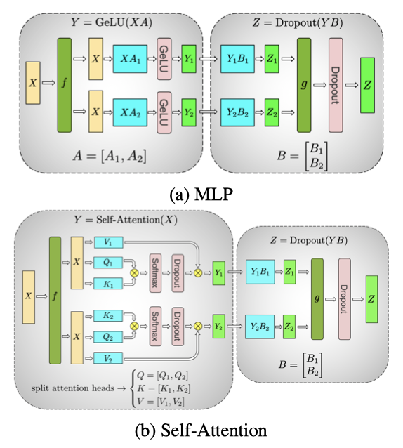
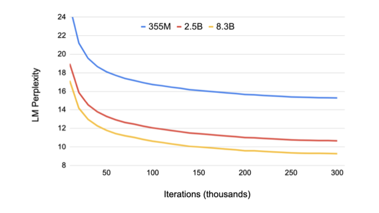

+++
author = "Kurt"
title = "Megatron-LM"
date = "2023-12-16"
description = "Training Multi-Billion Parameter Language Models Using Model Parallelism"
categories = [
    "Paper Review"
]
tags = [
    "NLP",
    "LLM",
]
+++

## Abstract

언어 모델링에서 큰 transformer 모델의 학습은 자연어 처리 분야에서 state-of-the-art를 달성하였다. 하지만, 이런 큰 모델은 메모리 제약으로 학습이 어려울 수 있다. 이 연구에서는 수십억 개의 파라미터를 가진 transformer 모델을 학습시키는 방법을 제시한다. 

이 연구는 512개의 GPU를 사용하여 최대 83억 개의 파라미터를 가진 transformer 모델을 학습시키는 것에 성공하였다. 또한 이 모델을 사용하여 WikiText103, LAMBADA, 그리고 RACE 데이터셋에서 state-of-the-art를 달성하였다. BERT와 같은 모델에서는 layer normalization의 위치에 주의가 필요함을 확인하였다.

--- 

## Introduction

Natural Language Processing (NLP)는 컴퓨팅능력과 데이터셋 크기의 증가로 빠르게 발전하고 있다. 이로 인해 더 큰 언어 모델을 학습시키는 것이 가능해졌고, 이는 기사 완성, 질문 답변, 자연어 추론 등의 NLP 작업에 매우 유용하다. 이런 사전 학습된 언어 모델을 다른 자연어 작업에 미세 조정하면, state-of-the-art를 얻을 수 있다.

모델이 커짐에 따라, 메모리 한계를 초과하여 추가적인 메모리 관리 기법이 필요해진다. ADAM 같은 optimization 알고리즘들은 모멘텀과 다른 최적화 상태를 저장하기 위해 추가 메모리를 요구하며, 이는 효과적으로 학습될 수 있는 모델의 크기를 줄인다. 이를 해결하기 위해, 모델 병렬화 접근법이 사용되며, 이는 가중치와 그들과 관련된 최적화 상태가 동시에 프로세서에 존재할 필요가 없도록 모델을 분할한다. 그러나, 이러한 접근법은 모델을 다시 작성하고, 아직 개발 중인 사용자 정의 컴파일러와 프레임워크에 의존하는 문제가 있다.

이 연구에서는 내부 layer 모델 병렬화를 이용한 단순하고 효율적인 모델 병렬 접근법을 구현하였다. transformer 기반 언어 모델의 내재적 구조를 활용해 PyTorch에서 효율적으로 학습하는 모델 병렬 구현을 만들었으며, 이는 사용자 정의 C++ 코드나 컴파일러를 필요로 하지 않는다. 이 접근법은 GPipe와 같은 파이프라인 기반 모델 병렬화와는 별개이다.

이 접근법의 확장성을 보여주기 위해, 단일 NVIDIA V100 32GB GPU에서 1.2B parameter의 모델을 학습하여 39 TeraFLOPs를 유지하는 강력한 기준선을 설정하였다. 모델을 8.3B parameter로 확장하고 512개의 GPU에서 8-way 모델 병렬화를 사용하면, 전체 애플리케이션에서 초당 최대 15.1 PetaFLOPs를 달성하며, 이는 단일 GPU 사례에 비해 76%의 확장 효율성을 보여준다.

모델 크기가 정확도에 미치는 영향을 분석하기 위해, GPT-2와 BERT를 학습시키고 여러 downstream task에서 평가하였다. 기존의 BERT 구조는 모델 크기가 증가함에 따라 성능이 저하되는 것을 확인하였다. 이를 극복하기 위해, transformer layer의 layer normalization과 residual connection을 rearranging하였고, 이로 인해 모델 크기가 증가함에 따라 downstream task 결과가 단조롭게 향상되는 것을 확인하였다. 또한, 모델이 WikiText103, LAMBADA, 그리고 RACE 데이터셋에서 state-of-the-art를 달성하였다.

요약하면, 이 논문의 기여는 다음과 같다:

* 기존의 PyTorch transformer 구현에 몇 가지 목표적인 수정만을 가함으로써, 단순하고 효율적인 모델 병렬 접근법을 구현했다.
* 모델과 데이터 병렬 기법에 대한 심층적인 경험적 분석을 수행하고, 512개의 GPU를 사용하여 최대 76%의 확장 효율성을 보여준다.
* BERT와 유사한 모델에서 layer normalization의 위치에 신중하게 주의를 기울이는 것이 모델이 커짐에 따라 정확도를 높이는 데 중요하다는 것을 보여준다.
* 모델 크기를 확장하는 것이 GPT-2(최대 8.3B parameter까지 연구)와 BERT(최대 3.9B parameter까지 연구) 모델 모두에 대해 정확도를 향상시키는 것을 보여준다.
* 테스트 세트에서 state-of-the-art를 달성하는 것을 보여준ㄴ다: WikiText103에서의 혼란도(10.8 ppl), LAMBADA에서의 정확도(66.5%), 그리고 RACE에서의 정확도(90.9%).

---

## Background and Challenges

### Neural Language Model Pretraining

사전 학습된 언어 모델은 NLP 연구에 필수적인 도구가 되었다. 큰 규모의 말뭉치 사전 학습을 활용하여 언어의 견고한 신경 표현을 배우는 것은 활발한 연구 분야이다. 초기의 연구는 사전 학습된 단어 임베딩이 downstream task 결과를 향상시키는 것을 보여주었으며, 이후의 연구는 맥락적 단어 표현을 포착하는 신경 모델을 학습하고 전이하는 것을 통해 발전하였다. 최근의 연구는 언어 모델을 end-to-end로 미세 조정함으로써 이 아이디어들을 더욱 발전시켰다. 이런 방법들의 진보는 규모에 맞게 효율적으로 작동하고 늘어나는 계산 요구를 충족시킬 수 있는 도구의 필요성을 촉발하였고, 이 연구는 트렌드에서 한 걸음 더 나아가기 위한 도구를 제공하려고 한다.

### Transformer Language Models and Multi-Head Attention

현재 NLP 연구는 우수한 정확도와 계산 효율성 때문에 transformer 모델을 사용하는 경향이 있다. transformer는 원래 두 부분, encoder와 decoder를 사용하는 기계 번역 아키텍처로 설계되었지만, 최근의 연구는 필요에 따라 encoder나 decoder만 사용한다. 이 연구는 decoder 구조인 GPT-2와 encoder 구조인 BERT를 모두 연구한다.

GPT-2와 BERT는 모두 GeLU nonlinearities와 layer normalization을 multi-head attention과 eed forward layer의 입력에 적용하는 반면, 원래의 transformer는 ReLU nonlinearities를 사용하고 layer normalization를 출력에 적용한다.

### Data and Model Parallelism in Deep Learning

신경망 학습을 여러 하드웨어 가속기로 확장하는 두 가지 주요 방법은 데이터 병렬화와 모델 병렬화이다. 데이터 병렬화는 학습 미니배치를 여러 작업자에게 분할하고, 모델 병렬화는 모델의 메모리 사용량과 계산을 여러 작업자에게 분배한다. 사용 가능한 작업자 수에 비례하여 미니배치 크기를 증가시키면 학습 데이터 처리량에서 거의 선형적인 확장을 볼 수 있다. 하지만 대량 배치 학습은 최적화 과정에 복잡성을 도입하여 정확도를 감소시키거나 수렴 시간을 늘릴 수 있다. 추가로, 데이터 병렬화를 활성화 체크포인팅과 결합하여 메모리 요구사항을 줄이는 방법도 연구되고 있다.

기존 기법들은 모델이 한 작업자에게 완전히 맞아야 하는 제한이 있다. 크기와 복잡성이 증가하는 언어 모델로 인해, 신경망은 하드웨어 가속기의 메모리 용량에 근접하게 되었다. 이 문제를 해결하기 위한 한 가지 방법은 parameter 공유를 사용하는 것이지만, 이는 모델의 전체 용량을 제한한다. 이 연구의 접근법은 모델 병렬화를 사용하여 모델을 여러 가속기에 분할하는 것으로, 이는 메모리 압박을 완화하고 병렬성을 증가시킨다.

모델 병렬화에는 layer-wise pipeline parallelism과 distributed tensor computation이라는 두 가지 패러다임이 있다. pipeline model parallelism에서는 한 장치에서 작업 그룹이 수행된 후 출력이 다음 장치로 전달된다. 일부 접근법은 parameter 서버를 사용하지만 일관성 문제가 있다. TensorFlow의 GPipe 프레임워크는 동기식 경사 하강법을 사용하여 이 문제를 해결한다. 그러나 이 방법은 통신과 계산 작업의 효율적인 파이프라이닝을 위한 추가 로직이 필요하며, pipeline bubble이나 최적화 변경으로 인해 효율성과 정확도에 영향을 미친다.

distributed tensor computation은 텐서 연산을 여러 장치에 분할하여 계산을 가속화하거나 모델 크기를 증가시키는 방법이다. FlexFlow는 이러한 병렬 계산을 효과적으로 수행하는 방법을 제공한다. 최근에는 Mesh-TensorFlow가 TensorFlow에서 분산 텐서 계산을 지정하는 언어를 도입했다. 우리는 이러한 통찰력을 활용하여 transformer의 attention head를 계산하는 병렬성을 활용하여 transformer 모델을 병렬화한다. 하지만, 이 연구는 프레임워크와 컴파일러를 구현하는 대신, 기존의 PyTorch transformer 구현에 몇 가지 특정 수정을 수행한다. 이 방법은 간단하며, 새로운 컴파일러나 코드 재작성이 필요하지 않는다.

---

## Model Parallel Transformers

transformer network의 구조를 활용해, 몇 가지 synchronization primitive를 추가하여 간단한 모델 병렬 구현을 만들었다. transformer layer는 self attention block과 two-layer, multi-layer perceptron (MLP)으로 구성되며, 이 두 부분에 모델 병렬성을 도입하였다.

MLP block의 첫 번째 부분은 GEMM이며, 이어서 GeLU 비선형성을 따른다:

$$ Y = GeLU(XA) $$

GEMM을 병렬화하는 한 가지 방법은 가중치 행렬 $A$를 행 방향으로, 입력 $X$를 열 방향으로 분할하는 것이다:

$$ X = [X_1, X_2], A = \begin{bmatrix} A_1 \\\ A_2 \end{bmatrix} $$

이 분할 방식은 결과로 $Y = GeLU(X_1 A_1 + X_2 A_2)$를 가져오며, GeLU는 비선형 함수이므로, $GeLU(X_1 A_1 + X_2 A_2) \neq GeLU(X_1 A_1) + GeLU(X_2 A_2)$이다. 따라서 이 방식은 GeLU 함수 앞에 동기화 지점이 필요하게 된다. 각 처리 유닛이 독립적으로 계산한 결과를 제대로 합산하기 위해 병렬 처리 유닛 간에 데이터 동기화가 필요하다.

다른 옵션은 $A$를 열을 따라 분할하는 것이다. $A = [A_1, A_2]$. 이 분할 방식은 GeLU 비선형성을 각 분할된 GEMM의 출력에 독립적으로 적용할 수 있게 한다:

$$ [Y_1, Y_2] = [GeLU(XA_1), GeLU(XA_2)] $$

이 방법은 동기화 지점을 제거하므로 유리하다. 첫 번째 GEMM을 열 병렬 방식으로 분할하고, 두 번째 GEMM을 행으로 분할하여 GeLU 계층의 출력을 직접 받을 수 있도록 한다. 이 방식은 추가적인 통신 없이 MLP 블록의 두 GEMM을 GPU 간에 분할하며, forward path와 backward path에 각각 단 한 번의 all-reduce 연산만 필요로 한다. 이 두 연산은 서로 conjugate 관계에 있으며, PyTorch에서 간단하게 구현할 수 있다.

self attention block에서는 multihead attention 연산의 병렬성을 활용하여 key(K), query(Q), value(V)와 관련된 GEMM을 열 병렬 방식으로 분할한다. 이 방식은 각 attention head에 해당하는 행렬 곱셈을 각각의 GPU에서 수행하게 하며, immediate communication이 필요 없다. 이어서, 출력 linear layer에서의 GEMM은 행 병렬 방식으로 수행되며, GPU 간의 통신 없이 병렬 주의 계층의 출력을 직접 받아들인다. 이 접근법은 MLP와 self attention layer에서 두 GEMM의 그룹을 융합하고, 중간의 동기화 지점을 제거하여 더 나은 확장성을 제공한다. 이를 통해 forward path와 backward path에서 각각 두 번의 all-reduce 연산만으로 모든 GEMM을 수행할 수 있다.

transformer 언어 모델은 출력 임베딩을 병렬화하여 처리 속도를 향상시킨다. 이 모델은 입력 임베딩과 가중치를 공유하는 출력 임베딩 계층을 가지며, 이 가중치 행렬을 분할하여 병렬 처리한다. 그러나 이 방식은 큰 어휘 크기 때문에 많은 양의 정보를 전송해야 한다. 이를 해결하기 위해, 병렬 GEMM의 출력을 cross entropy loss와 결합하여 차원을 줄인다. 이렇게 함으로써 스칼라 손실만 전송하게 되어 통신의 양이 크게 감소하고, 모델의 병렬 처리 효율성이 향상된다.

모델 병렬 방법론은 통신을 줄이고 GPU 계산에 초점을 맞추는 기법에 중점을 두고 있다. dropout, layer normalization, residual connection의 계산을 한 GPU에서만 수행하는 대신, 이를 모든 GPU에 복제한다. 각 GPU는 layer normalization parameter의 복제본을 유지하며, 모델 병렬 영역의 출력에서 dropout과 residual connection을 수행한다. 또한, 각 모델 병렬 작업자는 자신의 parameter 집합을 독립적으로 최적화한다. 이러한 접근법은 모든 값이 각 GPU에 로컬로 있거나 복제되므로, 업데이트된 parameter 값을 통신할 필요가 없다.

이 연구의 방법론은 하이브리드 모델과 데이터 병렬성, 그리고 난수 생성 처리와 관련이 있다. 이는 구현이 간단하며, forward와 backward pass에 몇 가지 추가적인 all-reduce 연산만 필요로 한다. 컴파일러는 필요 없으며, 이는 기존의 파이프라인 모델 병렬화 방법과는 별개이며 이를 보완한다.

---

## Setup

자연어 처리와 언어 이해의 핵심은 사전 학습된 언어 이해 모델이다. 이 연구에서는 왼쪽에서 오른쪽으로 텍스트를 생성하는 GPT-2와 언어 모델 마스킹에 기반한 bi-directional transformer 모델인 BERT에 초점을 맞추고 있다. 

### Training Dataset

다양한 대형 언어 모델링 데이터셋을 합쳐서 longterm dependency를 가진 학습 세트를 만들었다. 이에는 Wikipedia, CC-Stories, RealNews, OpenWebtext 등이 포함되어있다. 학습 세트의 유출을 방지하기 위해 일부 Wikipedia 기사와 필요 없는 새 줄을 제거하였다. BERT 모델에는 BooksCorpus를 포함시켰지만, LAMBADA 작업과 겹치는 부분 때문에 GPT-2 학습에서는 제외하였다.

모든 데이터셋을 병합하고, 내용 길이가 128 토큰 미만인 문서를 제외하였다. 유사한 내용의 중복을 제거하기 위해 localitysensitive hashing (LSH)을 사용했고, 그 결과 174GB의 중복 제거된 텍스트를 포함한 말뭉치를 얻었다.

### Training Optimization and Hyperparameters

효율적인 학습을 위해 mixed precision 학습과 dynamic loss scaling을 사용하였다. 가중치는 정규 분포로 초기화하고, residual layer 전에 조정했다. optimizer는 Adam을 사용하고, weight decay를 적용했다. gradient norm clipping을 사용해 학습의 안정성을 개선했고, 모든 경우에 dropout 0.1을 적용했다. 마지막으로, 메모리 관리를 위해 utilize activation checkpointing을 사용했다.

GPT-2 모델은 1024개의 subword 단위로 300k번 반복하며 학습되며, batch size는 512이다. learning rate는 1.5e-4로 설정되어 있고, 3k번의 warmup 이후에 cosine decay를 따른다. 이 감소는 최소 학습률인 1e-5에서 멈춘다.

BERT 모델은 원래의 BERT 사전을 사용하고, 어휘 크기는 30,522이다. next sentence prediction을 sentence order prediction으로 대체하고, 전체 단어 n-그램 마스킹을 사용하였다. batch size는 1024로 설정하고, warmup된 learning rate을 사용하여 2백만 번의 반복 동안 선형적으로 감소시켰다. 나머지 학습 parameter는 기존 BERT 모델과 동일하게 유지하였다.

---

## Experiments

모든 실험은 최대 32대의 DGX-2H 서버(총 512개의 Tesla V100 GPU)를 사용한다. 이 인프라는 서버 내부 GPU 간 300 GB/sec, 서버 간 100 GB/sec의 빠른 연결 대역폭을 제공하여 딥러닝 애플리케이션에 최적화되어 있다.

### Scaling Analysis

구현의 확장성을 테스트하기 위해, 다양한 parameter를 가진 GPT-2 모델을 사용했다. self attention layer에서 일관된 GEMM 크기를 유지하기 위해, attention head 당 hidden size는 96으로 고정하였다. 원래의 어휘 크기는 50,257이었지만, logit layer의 효율적인 GEMM을 위해 어휘를 패딩하여 51,200으로 만들었다.

모델 및 모델 + 데이터 병렬 확장성을 연구했으며, 모든 구성에서 배치 크기는 8로 고정하였다. 또한 모든 실험에서 전역 배치 크기를 512로 고정하여 데이터 병렬 확장성을 연구하였다. 이는 64-way 데이터 병렬성에 해당한다.

#### Model And Data Parallelism

모델 병렬 및 모델 + 데이터 병렬 케이스에 대해 모델 parameter에 대한 약한 스케일링을 보여준다. 약한 스케일링은 배치 크기를 조정하여 수행되지만, 이는 단일 GPU에 맞지 않는 대형 모델을 학습하는 문제를 해결하지 못한다. 따라서 여기서는 그렇지 않으면 불가능했던 더 큰 모델을 학습하기 위해 약한 스케일링을 사용한다. 모든 스케일링 수치의 기준은 단일 GPU에서 실행되는 1.2억 개의 parameter를 가진 첫 번째 구성이다.

8.3B 개의 parameter와 8-way 모델 병렬성을 가진 경우 선형 스케일링의 77%를 달성하였다. 가장 큰 구성(8.3B 개의 parameter)이 512개의 GPU에서 실행되는 경우에도 선형 스케일링 대비 74%의 스케일링을 달성하였다. 

### Language Modeling Results Using GPT-2

거대 언어 모델이 최첨단을 더욱 발전시킬 수 있음을 보여주기 위해, 다양한 크기와 구성의 GPT-2 모델을 학습하였습니다. 355M 모델은 BERT-Large 모델과 동일하며, 2.5B 모델은 이전의 가장 큰 GPT-2 모델보다 크고, 8.3B 모델은 우리가 알고 있는 한까지 학습된 어떤 변환기 언어 모델보다 크다.

각 epoch를 진행하는데 걸리는 시간은 68,507회의 반복과 동일하며, 예를 들어, 512개의 GPU에서의 8.3B 모델에 대해서는 각 epoch이 약 두 일 정도 걸린다. 이들 모델은 이전에 본 것보다 훨씬 작지만 여전히 64개의 GPU로 학습하며, epoch 당 시간이 훨씬 적다.

모델 크기가 증가함에 따라 검증 perpelixity가 감소하는 것을 확인할 수 있다. 특히, 8.3억 개의 parameter를 가진 모델은 검증 perpelixity가 9.27에 이르렀다.

또한, 모델 크기를 증가시키면 WikiText103에서의 perpelixity가 낮아지고, LAMBADA에서의 클로즈 정확도가 높아지는 추세를 관찰한다. 이 중 8.3억 개의 parameter를 가진 모델은 WikiText103 테스트 세트에서 state-of-the-art perpelixity를 달성하고, LAMBADA 작업에서 이전의 클로즈 정확도 결과를 초과하였다.

최근에는 Microsoft와 NVIDIA가 협력하여 170억 개의 parameter를 가진 GPT-2 모델인 Turing-NLG를 학습시켰으며, 이 결과는 더 큰 모델의 가치를 강조하였다.

테스트 데이터가 학습 데이터에 포함되지 않도록 확인하기 위해, 테스트 세트의 8-gram 중 학습 세트에도 나타나는 비율을 계산하였다. WikiText103 테스트 세트는 최대 10.8%의 겹침이 있고, LAMBADA 테스트 세트는 최대 1.4%의 겹침이 있었다. 이는 이전 연구와 일관되어, 테스트 데이터가 우연히 학습 데이터에 포함되지 않았음을 확신하였다.

### Bi-directional Transformer Results Using BERT

BERT 스타일의 transformer 모델에 방법론을 적용하고, 다양한 downstream task에 대한 모델 스케일링 효과를 연구한다. 이전 연구에서는 BERT-large의 336M parameter를 넘어서 모델 크기를 증가시키면 모델 저하가 발생한다는 것을 발견하였다. 이 문제를 해결하기 위해, 연구자들은 parameter 공유를 도입하고, 이를 통해 모델이 원래 BERT 모델에 비해 더 잘 확장되는 것을 보여주었다.

layer normalization과 residual connection의 순서를 재배열하는 것이 BERT-Large를 넘어서 BERT 스타일 모델의 스케일링을 가능하게 하는 것이 중요하다는 것을 경험적으로 입증하였다. (b) 아키텍처는 원래 BERT 아키텍처에서 관찰된 불안정성을 제거하며, 더 낮은 학습 손실을 가진다. 이러한 변화가 더 큰 BERT 모델을 학습시키는 것을 가능하게 하는 것을 처음으로 보고하였다.

336M 모델은 BERT-large와 같은 크기이며, 1.3B는 이전에 더 나쁜 결과를 얻었다고 알려진 BERT-xlarge 구성과 동일하다. 더 큰 hidden size와 더 많은 layer를 사용하여 BERT 모델을 더 확장하여 3.9B parameter 경우에 도달하였다. 모든 경우에서 hidden size는 attention head 당 64로 일정하게 유지되었다. 336M과 1.3B 모델은 200만 번 반복하여 학습되었으며, 3.9B 모델은 150만 번 반복하여 학습되고 아직도 학습 중이다.

3%의 홀드아웃 세트에서, 336M, 1.3B, 3.9B 모델은 각각 1.58, 1.30, 1.16의 검증 세트 perplexity를 달성하였고, 이는 모델 크기와 함께 단조롭게 감소하는 추세를 보여준다. 여러 downstream task에서 학습된 모델을 미세 조정한 결과, 모델 크기가 증가함에 따라 모든 경우에서 성능이 향상되었다. 특히, 3.9B 모델은 다른 BERT 기반 모델에 비해 개발 세트에서 state-of-the-art를 보여주며, RACE 테스트 세트에서 단일 모델과 앙상블 모델 모두에서 최고의 결과를 달성하였다.

---

## Conclusion and Future Work

이 연구에서는 기존 PyTorch transformer에 적은 수정을 통해 모델 병렬성을 구현하고, 이를 통해 전통적인 단일 GPU-모델 학습의 한계를 극복하였다. 512개의 NVIDIA V100 GPU에서 8.3B parameter를 가진 transformer 모델을 효율적으로 학습시켰고, BERT 모델에서는 layer normalization의 위치에 주의를 기울이는 것이 중요하다는 것을 확인하였다. 또한, 모델 크기가 down-tream task의 정확도에 긍정적인 영향을 미침을 확인했고, WikiText103, LAMBADA, RACE 데이터셋에서 state-of-the-art를 달성하였다.

미래의 연구 방향은 사전 학습의 규모 증가, 최적화 도구의 효율성과 메모리 사용량 개선, 더 큰 모델의 학습을 위한 병렬화 방법 개선, 다른 모델 패밀리(XLNet, T5)의 사전 학습, 다양한 downstream task에 대한 거대 모델의 성능 평가, 그리고 대형 사전 학습된 모델로부터 작은 모델을 학습시키는 knowledge distillation 사용 등이 있다.

---

## Reference

* [Paper](https://arxiv.org/pdf/1909.08053.pdf)
* [Github](https://github.com/NVIDIA/Megatron-LM)