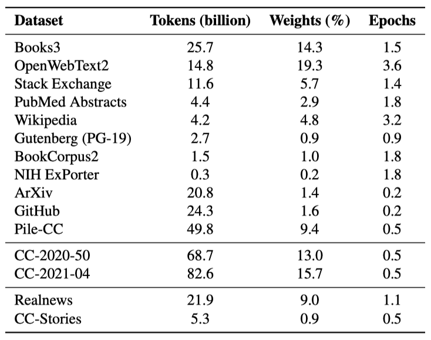
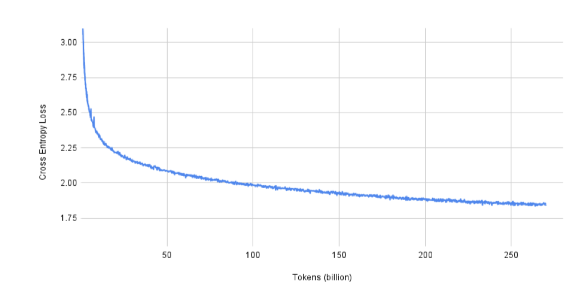

+++
author = "Kurt"
title = "Megatron-Turing NLG"
date = "2024-01-21"
description = "Using Deep and Megatron to Train Megatron-Turing NLG 530B, A Large-Scale Generative Language Model"
categories = [
    "Paper Review"
]
tags = [
    "NLP",
    "LLM",
]
draft = true
+++

## Abstract

사전 학습된 언어 모델은 zero-shot, few-shot, 미세 조정 기법을 통해 다양한 자연어 처리 분야에서 state-of-the-art의 정확도를 달성할 수 있다. 이러한 성공으로 인해 이 모델들의 크기는 빠르게 증가하였고, 이에 따라 고성능 하드웨어와 소프트웨어, 그리고 알고리즘 기법이 필요해졌다. 이 논문에서는 Microsoft와 NVIDIA의 협력을 통해 개발된 530B 개의 parameter를 가진 가장 큰 언어 모델인 Megatron-Turing NLG 530B (MT-NLG)의 학습에 대해 설명하고 있다. 이 모델은 DeepSpeed와 Megatron을 활용한 3D 병렬화 방법론을 통해 학습되었다. 또한, 이 모델은 여러 NLP 벤치마크에서 우수한 성능을 보여주며, 대규모 학습 인프라와 언어 모델, 그리고 자연어 생성의 발전을 도모할 것이라고 기대하고 있다.

---

## Introduction

최근에 출시된 BERT, GPT-2, RoBERTa와 같은 기초 모델들은 AI 시스템을 대규모로 사전 학습시키고, 전이 학습을 통해 다양한 작업에 적용하는 새로운 패러다임을 제시하였다. 이 모델들은 transformer 아키텍처, self-supervised learning, few-shot conditioning, 미세 조정 등을 결합하여 최첨단 자연어 처리 시스템에서 널리 사용되고 있다.

모델을 확장하는 것이 성능을 크게 향상시킨다는 것이 최근 연구들에서 입증되었다. 특히 zero-shot과 few-shot 설정에서 두드러진 성능 향상이 있었다. 예를 들어, GPT-3와 같은 대형 언어 모델은 미세 조정이나 gradient 업데이트 없이도 언어 작업에서 경쟁력 있는 성능을 발휘한다. 이러한 모델은 간단한 지시사항과 몇 가지 예제만으로 새로운 언어 작업을 수행할 수 있게 하며, 일관성 있는 장문의 텍스트 생성, 실세계 지식을 이용한 응답 생성, 기본적인 수학 연산 수행 등의 능력을 보여준다.

거대 언어 모델의 빠른 발전은 계산 자원의 증가, 대규모 데이터셋의 사용 가능성, 그리고 소프트웨어 스택의 발전에 의해 촉진되었다. 이러한 모델 학습을 위해 최첨단 슈퍼컴퓨팅 클러스터가 사용되며, 고품질이고 다양한 대량 데이터셋의 처리는 모델의 성능과 수렴에 기여한다. 그러나 모델 parameter 크기의 지수적인 성장을 지속하기 위해서는 새로운 방법, 인프라, 학습 기능 개발에 상당한 진전이 필요하다.

대형 모델을 학습시키는 것은 어렵다. 이는 가장 큰 GPU의 메모리에도 모델의 parameter를 담을 수 없을 뿐만 아니라, 대량의 계산 작업이 필요하여 알고리즘, 소프트웨어, 하드웨어 스택을 동시에 최적화하지 않으면 학습 시간이 너무 길어질 수 있기 때문이다. 이를 해결하려면 메모리와 계산 모두에서 확장 가능한 효율적인 병렬화 기법이 필요하다.

모델 크기 증가에 따른 성능 향상을 추구하여, 우리는 530B 개의 parameter를 가진 transformer 기반 언어 모델인 Megatron-Turing NLG 530B (MT-NLG)를 구축하였다. 이는 현재까지 알려진 가장 큰 단일 언어 모델로, GPT-3보다 parameter가 3배 더 많다. 하지만, 더 많은 총 parameter를 가진 sparse 모델 구조가 학습된 것에 대해 언급하며, 이러한 접근법을 따르면 비교 가능한 parameter 효율성과 일반화 능력을 가질 수 있을지는 아직 불확실하다.

MT-NLG 학습은 NVIDIA의 Megatron-LM과 Microsoft의 DeepSpeed 간의 협력, 그리고 여러 AI 혁신을 통해 가능해졌다. 데이터, 파이프라인, 텐서 슬라이싱 기반 병렬성을 결합하여 효율적이고 확장 가능한 3D 병렬 시스템을 구축하였다. 또한, 수백 조의 토큰을 가진 고품질 자연어 학습 말뭉치를 구축하고, 최적화 효율성과 안정성을 향상시키는 학습 레시피를 공동 개발하였다.

---

## Large Model Training Infrastructure

최첨단 클러스터들(예: NVIDIA Selene, Microsoft Azure NDv4)은 수조 개의 parameter를 학습할 수 있는 충분한 컴퓨팅 파워를 가지고 있다. 하지만 이러한 슈퍼컴퓨터의 전체 잠재력을 발휘하려면 수천 개의 GPU를 통해 병렬화하는 메모리 및 컴퓨팅 효율 전략이 필요하다. 기존의 병렬화 전략들은 이런 규모의 모델을 학습하는 데 한계가 있다. 이에 대한 도전과제를 해결하기 위해, 우리는 통합적이고 강력한 학습 인프라를 설계하고 성능을 평가하였다.

### Challenges

대규모 언어 모델을 학습하는데 있는 도전 과제인 메모리와 컴퓨팅 효율성, 그리고 다양한 병렬화 전략의 타협점에 대해 논의하고 있다.

#### Memory and Compute Efficiency

**Memory Efficiency** 530B 개의 parameter를 가진 모델을 학습하는 데 필요한 메모리 요구량은 단일 GPU 장치에서 제공할 수 있는 것을 훨씬 초과한다.

mixed precision 학습은 forward와 backward propagation 과정에서 가중치와 기울기를 half precision 형식으로 저장하며, optimizer에서의 수치 안정성을 위해 전체 정밀도 복사본을 유지한다. Adam optimizer를 사용하여 학습할 때, 학습은 parameter 당 20 바이트의 메모리를 사용한다.

따라서 530B 개의 parameter를 가진 모델을 학습하는 데는 모델 가중치, 기울기, 그리고 최적화 상태를 위한 총 10테라바이트 이상의 메모리가 필요하다.

활성화는 학습 배치 크기, 시퀀스 길이, 모델 차원에 따라 크게 메모리를 소비한다. 거대 언어 모델을 학습할 때는 체크포인팅과 각 변환기 블록의 활성화를 다시 계산하여 활성화에 필요한 메모리를 줄이는 것이 일반적이다. 그러나 레이어 간 경계에서의 활성화는 여전히 저장되어야 한다.

$$ \text{batch-size} × \text{number-of-layers} × \text{sequence-length} × \text{hidden-dimension} × 2 \text{bytes} $$

활성화 메모리 요구 사항은 기울기 누적 전략을 통해 완화될 수 있다. 이 전략은 학습 배치를 여러 마이크로 배치로 나누고 이들을 순차적으로 처리한 후 그 결과 기울기를 누적하는 방식이다. 이 방법을 통해 학습 배치 크기를 늘려도 활성화 메모리가 증가하지 않는다. 예를 들어, 1920개의 마이크로 배치로 학습하면 최대 활성화 메모리를 16.9테라바이트에서 8.8기가바이트로 줄일 수 있다.

**Compute Efficiency** 대형 GPU 클러스터에서 높은 계산 효율을 달성하는 것은 어렵다. 대형 배치 크기는 계산 효율성을 높이는데 도움이 될 수 있지만, 너무 큰 배치 크기는 모델 품질에 부정적인 영향을 미칠 수 있다. 특히, 4000개의 GPU를 가진 경우에도 배치 크기가 4000을 넘어서면 GPU 당 배치 크기가 1로 제한되어 계산 효율성이 제한된다.

#### Tradeoffs of Data, Tensor, and Pipeline Parallelism

**Data Parallelism** 데이터 병렬화는 깊은 학습에서 각 입력 배치를 여러 데이터-병렬 작업자들에게 분배하는 기법이다. 이 방법은 계산 효율성과 구현의 용이성을 제공하지만, 배치 크기를 임의로 크게 확장할 수 없으며, 이는 작업자 수에 따라 배치 크기를 확장하는 것에 의존한다. 그러나 이를 과도하게 크게 확장하면 모델 품질에 영향을 줄 수 있다.

*Memory Efficiency:* 데이터 병렬화는 모델과 최적화기를 모든 작업자에게 복제하기 때문에 메모리 효율이 낮다. 이 문제를 개선하기 위해, ZeRO는 복제된 데이터를 작업자들 사이에 분할하여 데이터 병렬화의 메모리 효율성을 향상시키는 최적화 기법들을 제공한다.

*Compute Efficiency:* 병렬화 수준과 배치 크기를 높여도 각 작업자의 계산량은 일정하며, 데이터 병렬화는 규모가 작을 때 거의 완벽한 확장성을 보인다. 그러나 gradient를 집계하는 통신 비용은 모델 크기가 커질수록 증가하고, 이로 인해 대형 모델이나 통신 대역폭이 낮은 시스템의 계산 효율성이 제한될 수 있다. gradient 누적은 이 비용을 분산하는 전략으로, 배치 크기를 더 크게 하고, 미세 배치에서 여러 번의 전파를 수행하면서 gradient를 누적한다. 또한, 다른 텐서의 gradient를 계산하는 것과 병렬로 gradient를 동시에 전송함으로써 성능을 향상시킬 수 있다.

**Tensor Model Parallelism** 텐서 모델 병렬화는 모델의 각 레이어를 작업자들 사이에 분할하는 기법으로, 작업자 수에 비례해 메모리 사용량을 줄인다. Megatron은 이를 이용해 대규모 언어 모델의 transformer block을 효율적으로 분할한다.

*Memory Efficiency:* 텐서 병렬화는 작업자 수에 따라 모델의 메모리 사용량을 줄이며, 모델 구조에 따라 일부 활성화 메모리도 감소시킨다. 그러나 일부 데이터는 여전히 복제될 수 있다.

*Compute Efficiency:* 텐서 병렬화는 각 전파 과정에서 활성화 데이터의 추가 통신을 요구하며, 이로 인해 고대역폭 통신이 가능한 환경에서 효율적으로 작동한다. 모델-병렬 작업자는 각 통신 단계 간의 계산량을 줄이므로, 계산 효율성에 영향을 미친다. 텐서 병렬화는 데이터 병렬화만으로는 도달할 수 없는 메모리와 계산 효율성을 확장하는 데 사용된다.

**Pipeline Model Parallelism** 파이프라인 모델 병렬화는 모델의 레이어를 병렬 처리 가능한 단계로 분할한다. 한 단계가 micro-batch의 전방 전파를 완료하면, 활성화 메모리는 다음 단계로 전송된다. 그리고 다음 단계가 backward propagation를 완료하면 gradient는 backward로 전송된다. 병렬 계산을 유지하기 위해 여러 micro-batch가 동시에 처리되어야 한다.

*Memory Efficiency:* 파이프라인 병렬화는 파이프라인 단계 수에 비례해 메모리를 줄여 작업자 수에 따라 모델 크기를 선형적으로 확장한다. 하지만 각 레이어의 활성화에 대한 메모리는 줄이지 않으며, 각 작업자는 처리 중인 모든 micro-batch의 활성화를 저장해야 한다. forward와 backward propagation를 번갈아 수행하는 1F1B 파이프라인 일정을 사용하며, 이 방식의 장점은 처리 중인 micro-batch 수가 파이프라인 단계 수로 제한되고, 전체 학습 배치의 micro-batch 수로 제한되지 않는다는 것이다.

*Compute Efficiency:* 파이프라인 병렬화는 파이프라인 단계 사이에서만 활성화를 통신하므로 통신 오버헤드가 가장 작다. 하지만 이 방법은 모델의 깊이에 의해 한계가 있으며, 파이프라인 차원을 늘릴수록 계산 효율성이 감소한다. 또한, 각 단계가 로드 밸런싱되어야 높은 효율성을 얻을 수 있다.

파이프라인 병렬화는 학습 배치의 시작과 끝에서 파이프라인을 채우고 비우는 과정에서 버블 오버헤드를 유발한다. 이 오버헤드의 크기는 파이프라인 병렬화로 인한 속도 향상을 제한하며, 이 향상 가능 비율(또는 병렬 효율성)은 파이프라인 단계 수와 총 micro-batch 수에 따라 달라진다.

$$ \text{efficiency} = {{\text{MB}\over{\text{MB} + \text{PP} − 1}}} $$

micro-batch 수가 파이프라인 단계 수의 4배나 8배일 때, 파이프라인은 각각 81%, 90%의 병렬 효율성을 보인다.

기존의 병렬화 기법 중 어느 것도 수백억 개의 parameter를 가진 모델 학습의 모든 도전을 해결할 수 없다. 하지만 각 기법은 자신만의 장점이 있어 상호 보완적으로 사용될 수 있다. 이를 위해, 계산과 메모리 효율성을 동시에 해결하는 데이터, 텐서, 파이프라인 병렬화의 조합인 3D 병렬화를 사용한다.

### Software System — 3D Parallelism with DeepSpeed and Megatron

DeepSpeed의 파이프라인과 데이터 병렬화, 그리고 Megatron의 텐서 슬라이싱을 결합하여 유연한 3D 병렬화를 구현한다. 여기서 데이터, 텐서, 파이프라인 병렬화는 각각 메모리와 계산 효율성 향상에 특별한 역할을 한다.

*Memory Efficiency:* transformer block은 파이프라인 단계로 나눠지고, 각 단계의 블록은 텐서 병렬화를 통해 더 세분화된다. 이 2D 방식은 가중치, 기울기, 최적화 상태, 활성화의 메모리 사용량을 줄인다. 그러나 계산 효율성을 유지하면서 모델을 무한히 분할할 수는 없다.

*Compute Efficiency:* 학습을 가속화하기 위해 데이터 병렬화를 사용하여 GPU 수를 크게 늘린다. 예를 들어, 530B 개 parameter 모델 복제본은 280개의 NVIDIA A100 GPU에 분산되며, 노드 내에서 8-way tensor-slicing, 노드 간에 35-way 파이프라인 병렬화를 사용한다. 그 후 데이터 병렬화로 수천 개의 GPU로 더 확장한다.

3D 병렬화는 토폴로지 인식 매핑을 통해 최적화되어 모든 병렬화의 통신 오버헤드를 최소화하며, 이는 특히 데이터 병렬화에 큰 영향을 미친다. 이 매핑 방법은 대규모에서 뛰어난 계산 효율성을 달성하는데 중요하다.

#### Topology-Aware 3D Mapping

병렬화의 각 축이 작업자들에게 신중하게 할당되어 두 가지 주요 구조적 특성을 활용하여 계산 효율성을 극대화한다.

**Mapping for Bandwidth** 노드 내 통신은 노드 간 통신보다 대역폭이 높다. 따라서 통신 볼륨이 큰 병렬 그룹을 동일 노드에 우선 배치한다. 텐서 병렬화는 가장 큰 통신 오버헤드를 가지므로, 이 작업자들을 노드 내에 배치한다. 가능하면 데이터 병렬 작업자도 노드 내에 배치하여 기울기 통신을 가속화하며, 그렇지 않으면 가까운 노드에 매핑한다. 파이프라인 병렬화는 낮은 통신 볼륨을 가지므로, 통신 대역폭에 제한 없이 노드 간에 단계를 배치할 수 있다.

**Bandwidth Amplification** 파이프라인 및 텐서 병렬화가 증가함에 따라 각 데이터 병렬 그룹의 기울기 통신 볼륨은 선형적으로 줄어든다. 이로 인해 순수 데이터 병렬화의 전 통신 볼륨이 감소하며, 각 데이터 병렬 그룹이 더욱역화된 작업자들 사이에서 독립적이고 병렬적인신을 수행하게 된다. 결과적으로, 통신 볼륨의 감소와 지역성 및 병렬성의 증가가 결합하여 데이터 병렬 통신의 효과적인 대역폭이 증폭된다.

### Hardware System

모델 학습은 NVIDIA의 Selene 슈퍼컴퓨터에서 16비트 bfloat를 사용한 mixed precision으로 진행된다. 각 클러스터 노드는 NVLink와 NVSwitch로 연결된 8개의 NVIDIA 80-GB A100 GPU를 가지고 있다. 노드들은 팻트리 토폴로지로 연결되어 efficient all-reduce 통신을 가능하게 하며, 고성능 데이터 액세스 및 저장을 위한 공유 병렬 파일 시스템을 사용한다. A100 GPU의 피크 처리량은 312 테라FLOP/s로, 피크 16비트 정밀도 성능의 총합은 1.4 엑사FLOP/s이다.

### System Performance Evaluation

530B 개의 parameter 모델에 대해 Selene의 280, 350, 420개의 DGX A100 서버에서 배치 크기 1920을 사용했을 때, 시스템의 종단간 처리량은 각각 60.1초, 50.2초, 44.4초의 반복 시간이었고, 이는 각각 GPU 당 126, 121, 113 테라FLOP/s에 해당한다.

---

## Training Dataset and Model Configuration

이 섹션에서는 실험에서 사용된 학습 데이터셋, 전처리 기법, 그리고 모델과 hyperparameter에 대한 세부 사항을 제시한다.

### Training Dataset and Preprocessing

Common Crawl (CC) 등의 웹 스냅샷 리소스는 언어 데이터의 원천으로 활용된다. 이 데이터는 풍부하지만, 품질이 좋은 데이터를 선택하기 위한 신중한 전처리 과정이 필요하다. 필터링되지 않은 CC 데이터의 품질은 선별된 데이터셋보다 낮기 때문에, 품질을 향상시키는 조치가 필요하다. 다양한 학습 세트를 수집하는 최근 연구를 활용하고, 이전에 대형 언어 모델 학습에 사용된 RealNews와 CC-Stories도 포함하여 학습 데이터셋을 구축하였다.

#### Training Dataset

이 연구는 이전 작업을 기반으로 했으며, 처음에는 The Pile의 고품질 부분집합을 선택하였다. 그 후, 두 개의 전체 CC 스냅샷을 다운로드하고 필터링했다. 이 과정에서는 원시 HTML에서 텍스트를 추출하고, 고품질 데이터에 학습된 분류기를 사용해 문서를 점수 매기는 등의 단계를 거쳤다. 마지막으로, 중복과 거의 중복된 문서를 제거하고, downstream 작업 데이터를 제거하기 위해 n-gram 기반 필터링을 사용하였다.

#### Pre-Processing Details

**Common Crawl:** Common Crawl은 대규모 데이터를 포함하며, 2020-50과 2021-04 두 스냅샷을 처리하여 약 150B 개의 학습 데이터를 획득하려고 했다. 이 과정의 첫 단계는 언어 감지와 원시 HTML에서 텍스트 추출이었고, 이를 위해 pycld2와 jusText 라이브러리를 사용하였다. 이 단계를 거치면서 문서의 수가 크게 줄었으며, 문서 중 약 25%만이 영어로 분류되고 비어 있지 않은 본문을 가지게 되었다.

고품질 문서를 선택하기 위해, 2-gram fastText 분류기를 학습시켰다. 긍정적인 문서는 OpenWebText2, Wikipedia, Books3에서 무작위로 선택하였고, 부정적인 문서는 텍스트 추출 결과에서 무작위로 샘플링하였다. 이 문서들 중 10%를 분류기 평가를 위해 두었고, 학습 후 90.3%의 정확도를 달성하였다. 분류기는 각 문서에 적용되었고, 긍정 레이블의 확률이 문서의 점수로 사용되었다.

위 과정에서 생성된 점수를 이용해, $\alpha = 3$인 Pareto 분포로 문서를 필터링하였다. 이로 인해 텍스트의 약 80%가 필터링되었다. $\alpha$ 선택이 이전 연구보다 낮았지만, 데이터 검사 결과 허용 가능한 품질이었으며, $\alpha = 3$ 사용으로 원래의 토큰 목표를 약간 초과하여 달성하였다.

**Other Datasets:** Common Crawl 데이터 외에도, 우리는 The Pile의 여러 데이터셋과 Megatron 훈련에 사용된 CC-Stories와 RealNews 데이터셋을 활용하였다. 

**Fuzzy Document Deduplication:** 인터넷 콘텐츠는 대부분 문서간에 중복되며, Common Crawl 스냅샷에서 스크랩된 URL도 고유하지 않다. 선택한 스냅샷 중 53%와 34%의 문서는 이전에 보지 못한 새로운 URL에서 가져온 것이었다. 또한, OpenWebText2나 Wikipedia 같은 다른 데이터셋의 콘텐츠도 Common Crawl에 존재할 가능성이 높다.

정확한 일치 중복 제거는 계산 비용이 많이 들어, 우리는 퍼지 중복 제거 방법을 선택하였다. 해싱 벡터화기를 이용해 문서를 벡터화하고, 최소 해시를 계산한 뒤, 지역 민감 해싱을 통해 잠재적 중복을 찾았다. 이 과정에서 Jaccard 유사도가 ≥ 0.8인 문서들이 같은 LSH 버킷에 들어갈 확률을 높였으며, 이를 위해 총 260개의 해시 함수를 가진 20개의 밴드를 사용하였다.

LSH 수행 후, 각 버킷을 처리해 모든 쌍의 Jaccard 유사도를 근사 계산하여 거짓 긍정 중복을 제거하였다. 이 과정은 무작위 문서를 샘플링하고, 그 문서와 버킷 내의 다른 문서들과의 유사도를 계산해 임계값 이상인 문서를 제거하는 것이다. 이후 희소 문서 그래프를 구성해 연결된 구성 요소를 찾았고, 각 구성 요소에서 하나의 대표 문서를 선택하였다. 데이터셋의 품질이 다양하므로, 대표 문서 선택 시 우선 순위를 정의하였고, 가장 높은 우선 순위의 데이터셋에서 처음 만난 문서를 최종적으로 유지하였다.

**Additional Processing:** 학습 데이터셋에서 Ftfy 라이브러리를 사용해 유니코드 텍스트를 정제하고, langdetect 라이브러리로 영어가 아니거나, 글자수가 512 미만인 문서를 제거하였다. 또한 "javascript"라는 단어가 포함되고 256자 미만인 문서도 제거하였다.

**Downstream Task Data Removal:** 학습 데이터셋에서 n-gram을 사용해 downstream 작업에 있는 텍스트를 제거하였다. 작업 문서와 학습 문서 사이에 n-gram 일치가 있으면, n-gram과 양쪽 200자를 제거해 학습 문서를 두 부분으로 나누었다. 200자 미만이거나 10회 이상 분할된 학습 문서는 제거하였다. 이 과정에서 총 319,781,622개의 문서 중 35,988개 문서가 분할되었고, 1,109개 문서가 제거되었다.

**Blending Datasets:** 샘플링 가중치에 따라 데이터셋을 이질적인 배치로 혼합하였다. 그러나 이로 인해 각 배치의 샘플이 균등하게 분할되지 않았다. 이를 해결하기 위해, 각 데이터셋의 과다 샘플링과 부족 샘플링을 추적하여 각 단계에서 배치 구성을 약간 조정하였다. 이렇게 함으로써 샘플 분포를 선택한 혼합 가중치 분포에 가깝게 유지하였다.

### Model and Training Process

왼쪽에서 오른쪽으로 autoregressive, generative transformer-based 언어 모델인 transformer decoder의 아키텍처를 사용하여 이를 530B 개의 parameter로 확장하였다. 시퀀스 길이는 2048, 글로벌 배치 크기는 1920이며, 8-way 텐서와 35-way 파이프라인 병렬성을 사용하였다. learning rate는 5.0e-5로 설정하였고, 선형 학습률 워밍업을 위해 10억 토큰을 사용하였다. Adam 최적화 기법을 사용하였고, 가중치 초기화를 위해 평균 0, 표준 편차 4.0e-3인 정규 분포를 사용하였다. 학습 데이터셋은 339B 토큰으로 구성되어 있으며, 15개의 학습 데이터셋을 혼합하여 270B 토큰에 대해 학습시켰다. 또한, 데이터의 2%를 검증을 위해 분리하였다.

MT-NLG와 같은 대형 모델에서 학습 안정성은 핵심적인 도전 과제이다. learning rate, 가중치 초기화, 그리고 Adam optimizer parameter가 모델 안정성에 크게 영향을 미친다는 것을 발견하였다. 더 높은 learning rate는 모델의 불안정성을 증가시키며, 가중치 초기화에 대해 높은 분산을 사용하면 모델이 수렴하지 못함을 확인하였다. 이를 해결하기 위해, 가중치 초기화는 표준편차로 $\sqrt{1 / (3 * H))}$를 사용하였고, 학습 손실의 급증을 줄이기 위해 β2 값을 0.99에서 줄였다.

---

## Results and Achievements

언어 모델 성능이 학습 도중 어떻게 향상되는지를 이해하기 위해, MT-NLG의 검증 손실 곡선을 제시한다. 검증 데이터셋은 5.5B 토큰으로 구성되어 있으므로, 전체 데이터셋으로 손실을 측정하는 것은 비효율적이다. 그래서 검증 데이터셋의 시퀀스를 섞고, 각 손실 계산 시에는 글로벌 배치 크기가 1920인 네 번의 반복을 실행하여 총 1,600만 토큰을 평가하게 된다.

모델이 처음 10억 토큰에 대해 학습된 후의 검증 손실은 3.15이며, 배치 크기를 처음 12B 토큰 동안 선형적으로 증가시킨 뒤의 손실은 2.31이다. 그리고 모델이 목표 토큰 수인 270B에 도달하면, 검증 손실은 1.85가 된다.

모델의 품질을 평가하기 위해, 이전 연구와 유사한 zero/one/few-shot 평가 방식을 사용하였다. 이 평가는 오픈 소스 프로젝트인 lm-evaluation-harness를 기반으로 하며, 각 작업에 맞게 조정하였습니다. few-shot 실험의 경우, 최적의 shot 수를 찾는 검색 없이 이전 연구에서 제안된 설정을 그대로 사용하였고, 이 설정은 대부분의 경우에 충분히 잘 수행되었다.

평가를 종합적으로 하기 위해, 완성 예측, 독해 이해, 상식 추론, 자연어 추론, 단어 의미 중의성 해소와 같은 다양한 카테고리에서 여덟 가지 작업을 선택하였다. 이 작업들에 대한 사전 학습된 대형 언어 모델의 성능을 이전 연구와 비교하였고, "specialist" 모델과 "generalist" 모델 사이의 차이를 이해하기 위해, 적용 가능한 경우 감독 기준선을 제공하였다.

많은 평가 작업은 모델을 사용하여 후보 완성 문장을 점수화하는 것을 포함한다. 여기서 가능성이라는 용어는, 특별히 언급하지 않는 한, 프롬프트에 따른 후보 답변의 확률을 토큰 수로 정규화한 것을 의미한다.

### Completion Prediction

**LAMBADA** LAMBADA 데이터셋은 전체 문맥이 주어졌을 때 인간이 마지막 단어를 쉽게 추측할 수 있도록 선택된 서술 문단들이다. 하지만 마지막 문장만 주어진다면 답을 할 수 없다. 이 작업은 언어 모델이 단순한 통계 패턴이나 국소적 문맥보다는 더 넓은 담화 문맥을 이해하고 유지하는 능력을 테스트한다.

이 작업을 평가할 때, 각 패시지를 입력으로 제공하고 모델이 탐욕적 생성을 통해 마지막 단어를 정확히 생성할 수 있는지 확인한다. 하지만 one-shot/few-shot 평가에서는 문장의 마지막 단어를 예측하는 것이 목표임을 더 잘 알려주기 위해 클로즈 스타일의 프롬프트 형식을 사용하였다. 이 방법은 few-shot 설정에서 성능을 크게 향상시키지만, one-shot 성능은 약간 저하되었다. LAMBADA 테스트 세트에서 모든 설정에 state-of-the-arts를 달성하였다.

### Reading Comprehension

이 섹션에서는 독해를 위한 MT-NLG의 평가에 대해 논의한다. 우리는 다른 스타일의 질문을 대상으로 하는 두 개의 데이터셋을 선택하였고, 평가 시에 그들에 대한 예시의 수를 늘렸을 때 매우 다른 추세를 발견하였다.

**RACE** RACE는 영어 시험에서 추출한 패시지와 질문들로 구성된 독해력 데이터셋이다. 각 예시는 기사와 질문-답변 쌍으로 이루어져 있다. 프롬프트 생성을 위해 기사, 질문, 답변 텍스트에 각각 "Article: ", "Question: ", "Answer: " 태그를 붙이고, 이들을 연결한다. 마지막 질문의 실제 답변은 제외하고, 모델은 "Answer:" 후의 가능한 모든 답변을 점수화하여 가장 높은 점수를 받은 답변을 선택한다.

이 데이터셋에는 직접적인 질문과 클로즈 스타일의 질문 두 가지 유형이 있다. 두 질문 유형 모두 위에서 설명한 방식으로 동일하게 취급하며, 이는 기본적으로 사용되는 방식과 다르다. 또한, GPT-3를 따라서 특정 점수 기준을 사용하였고, 이를 통해 더 좋은 성능을 관찰하였다.

$$ {P(\text{completion} | \text{context})}\over{P(\text{completion} | \text{answer context})} $$

점수를 매기는 기준으로 사용하며, 이때 context는 전체 프롬프트이고, answer context는 "Answer:" 문자열이다. GPT-3와 비슷하게, length-normalized log-probability를 점수 기준으로 사용하는 것보다 RACE에서 더 좋은 성능을 보였다.

데이터셋은 어려운 문제와 중간 난이도의 문제를 대응하는 RACE-h와 RACE-m 두 하위 집합을 포함한다.  프롬프트에 더 많은 예시를 포함하더라도 성능 향상이 크지 않음을 확인하였다. 그러나 zero-shot 성능은 이미 GPT-3의 few-shot 성능을 +1.14% 초과한다.

RACE 데이터셋에서, ALBERT 앙상블이라는 지도 학습 모델이 91.4%의 높은 정확도를 보여주며, 이는 사전 학습된 언어 모델들의 결과보다 월등히 높다. 최근 연구는 사전 학습된 언어 모델과 지도 학습 모델 간의 차이를 줄였지만, 여전히 큰 차이가 있다.

**BoolQ** BoolQ은 yes/no 질문에 대한 데이터셋이다. 이에 대한 답변은 위키백과 단락을 사용한다. 지원 단락, 질문, 그리고 답변을 연결하여 프롬프트를 만들고, 모델을 사용하여 "yes"와 "no"를 점수화한다. 가장 높은 점수를 얻은 옵션을 선택한다. 많은 예시가 포함된 프롬프트는 성능을 크게 향상시킬 수 있다. 이는 작업 프롬프트 형식이 모델에게 혼란스럽게 느껴질 수 있고, 주어진 예시가 모델을 패시지-질문-답변 형식을 따르도록 충분히 조건화하는 데 도움이 되기 때문이다.

BoolQ 작업에서 T5 + UDG 모델이 91.4%의 정확도를 보여주며 최상의 성능을 보였다. 그러나 RACE-h와 비교해봤을 때, 감독된 모델과 사전 학습된 언어 모델 사이의 성능 차이는 크지 않았다. 특히, MT-NLG 모델은 이 성능 차이를 더욱 줄일 수 있었다.

### Commonsense Reasoning

사전 학습된 언어 모델이 훈련 데이터에서 얼마나 많은 세계 지식을 유지하는지를 파악하기 위해, 상식 추론 관련 작업 두 가지에서 모델을 평가했다. 이를 위해 UNICORN 이라는 감독 기준선과 3개의 데이터셋을 비교했다.

**Winogrande** Winogrande는 Winograd 스키마 챌린지를 더 크고 어렵게 만들려는 데이터셋이다. 이 작업은 통계적 언어 모델링만으로는 해결할 수 없는 대명사 해결 문제로, 이를 해결하기 위해서는 기본적인 사건과 객체에 대한 상식 지식이 필요하다.

이전 연구의 평가 방법을 적용해, 실제 명사를 모호한 대명사로 바꾸고 문장의 가능성을 평가했다. 가장 가능성이 높은 대명사 치환을 모델의 답으로 선택했다. 결과적으로, zero-shot 정확도에서는 GPT-3에 비해 크게 향상되었지만, few-shot에서는 그 차이가 줄어들었다. 한 예시만 있을 때보다 few-shot 설정에서 모델의 성능이 크게 향상되었고, 이는 상식 추론 성능이 shot 수와 잘 맞춰진다는 일반적인 추세를 보여준다. 이는 독해 이해에서 보는 추세와는 다르다.

**HellaSWAG** HellaSWAG은 목표와 후속 행동을 선택하는 상식 추론 데이터셋이다. Wikihow와 Activitynet Captions에서 예시를 추출하였다. 평가는 목표에 따른 각 후보 답변의 가능성을 평가하고 가장 가능성이 높은 답변을 선택하는 방식으로 이루어졌다. 결과적으로, 모든 설정에서 GPT-3에 비해 크게 개선되었고, zero-shot 성능이 GPT-3의 few-shot을 넘어섰다. zero-shot에서 one-shot으로 이동하는 것은 성능을 크게 향상시키지 않았지만, few-shot에서 더 많은 예시를 포함시키면 성능이 크게 향상되었다.

**PiQA** PiQA는 물리적 상호작용 이해를 위한 이진 선택형 질문 응답 데이터셋이다. 이는 일상 활동 완료 방법에 대한 질문을 제시하고, 모델은 두 가지 후보 답변 중 하나를 선택하는 작업을 한다.

PiQA에서는 질문/목표를 모델에 제시하고 두 가지 행동에 대한 후보 문장의 가능성을 평가하여 더 높은 가능성을 가진 옵션을 선택한다. 결과적으로, one-shot 성능은 zero-shot에 비해 떨어지지만, few-shot 성능은 적절하게 향상되는 것을 확인하였다.

### Natural Language Inference

이 섹션에서는 모델이 자연어 추론 (NLI) 작업에서 어떻게 평가되는지에 대해 논의한다.

**ANLI** ANLI는 어려운 NLI 문제 집합을 만들기 위한 데이터셋이다. 질문-답변 형식으로 NLI 문제를 재구성하고, 가장 가능성이 높은 옵션을 모델의 답변으로 선택하였다. 결과적으로, 하나의 예시만으로도 모델의 성능이 향상되었지만, 추가 예시를 포함한 few-shot 설정에서는 성능 향상이 없었다. 이는 추가 예시가 내용적으로 관련이 없어 모델에게 새로운 지식을 제공하지 않기 때문일 수 있다. ANLI에서는 InfoBERT를 기준으로 비교하였다.

**HANS** HANS는 모델이 NLP 데이터의 표면적인 문법적 휴리스틱을 이용하는 경향성을 평가하기 위한 NLI 데이터셋이다. 이는 특정 문법적 및 구문적 구조의 템플릿에서 예시를 생성하는 환경을 제공한다. 작업 형식은 ANLI와 유사하며, NLI 문제를 이진 질문 응답 형식으로 변환한다. 이 작업은 lm-evaluation-harness의 기존 작업들 중에서 평가에 포함시켰다.

HANS 데이터셋을 주로 few-shot 학습에서 모델의 행동을 분석하는 도구로 사용한다. 이전에 이 데이터셋에 대한 프롬프트 기반 생성 기준선은 없어, 비교를 위해 GPT-2를 평가하였다. zero-shot 성능은 모델의 고유한 편향에 의해 주도되며, 충분히 학습된 큰 모델은 컨텍스트 내 예시를 활용해 성능을 크게 향상시킬 수 있다. 반면, 약한 모델은 추가적인 컨텍스트 내 예시에 혼란스러울 수 있으며, GPT-2는 무작위 선택보다 훨씬 더 좋지 않았다.

### Word Sense Disambiguation

**WiC** Word-in-Context 데이터셋은 맥락 속에서 다의어의 의도된 의미를 파악하는 작업을 제시한다. 이 작업은 두 문장에서 동일한 다의어가 같은 의미를 가지고 있는지 아닌지를 식별하는 것이다.

이 작업에서는 문제를 질문 응답 형식으로 변환하여 zero-shot/few-shot 평가를 수행한다. "yes"와 "no"의 가능성을 조사하고, 더 높은 가능성을 가진 답변을 선택한다. 결과는 zero-shot에서는 모델의 성능이 우연보다 약간 낮지만, few-shot으로 전환하면 우연을 초과한다. 반면, 감독된 T5 + UDG 모델은 우연 수준을 크게 초과한다.

---

## Exploring Social Biases

### Introducing the Challenge of Social Bias in NLP Models

---

## Reference

* [Paper](https://arxiv.org/pdf/2201.11990.pdf)
* [GitHub](https://github.com/NVIDIA/Megatron-LM)