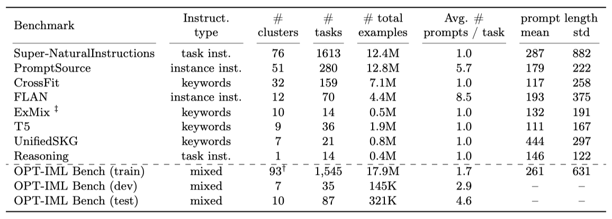
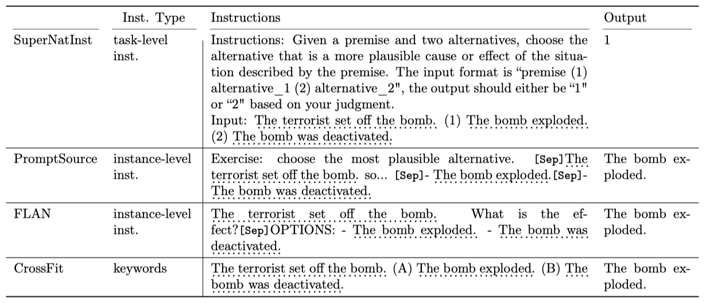

+++
author = "Kurt"
title = "OPT-IML"
date = "2024-03-04"
description = "Scaling Language Model Instruction Meta Learning through the Lens of Generalization"
categories = [
    "Paper Review"
]
tags = [
    "NLP",
    "LLM",
]
draft = true
+++

## Abstract

최근의 연구에서는 대규모 사전 학습된 언어 모델을 instruction-tuning하면 보이지 않는 작업에 대한 일반화 성능이 향상된다는 것이 확인되었다. 하지만, instruction-tuning 과정에서의 다양한 결정들이 성능에 어떤 트레이드오프를 가져오는지에 대한 이해는 아직 제한적이다. 이 논문에서는 각종 결정들이 언어 모델의 성능에 어떤 영향을 미치는지를 분석하고, 이를 바탕으로 OPT-IML 30B와 175B를 학습시켰다. 이 모델들은 다양한 작업과 입력 형식을 가진 네 가지 벤치마크에서 모두 뛰어난 일반화 성능을 보였다. 이 결과는 모든 벤치마크에서 OPT를 크게 능가하며, 특정 벤치마크에서 미세 조정된 기존 모델과도 경쟁력을 가진다. 이 연구의 결과와 평가 프레임워크는 공개되었다.

---

## Introduction

이전 연구에 따르면, instruction-tuning은 큰 사전학습 언어모델의 성능을 크게 향상시킬 수 있다. 이 논문에서는 2000개의 NLP 작업을 대상으로 한 대규모 미세조정 및 평가 프레임워크를 개발하였고, 이를 통해 지시사항 메타학습에 관한 다양한 결정의 장단점을 분석하였다. 그 결과, 지시사항에 따라 미세조정된 OPT-IML 30B와 175B 모델을 학습시킬 수 있었다.

NLP 작업의 대규모 메타 데이터셋이 점점 늘어나고 있으며, 이를 이용한 미세조정 연구가 성공적으로 진행되고 있다. 이러한 연구는 작업 수를 늘리는 것이 유익하다는 일반적인 권장사항을 제시하고 있다.

본 연구에서는 8개의 메타 데이터셋을 통합하여 1,991개의 NLP 작업으로 구성된 대규모 컬렉션을 만들었다. 이 컬렉션은 다양한 프롬프트와 지시사항을 포함하며, 100개 이상의 작업 카테고리로 분류되어 있다. 이 컬렉션은 instruction-tuning 모델을 종합적으로 평가하는 프레임워크로 변환되었으며, 이는 세 가지 일반화 수준에서의 성능을 평가한다. 이 프레임워크는 OPT-IML Bench라고 부르며, 각 카테고리는 다양한 벤치마크와 프롬프트에 연결될 수 있는 데이터셋으로 구성되어 있다.

LLMs의 instruction-tuning 효과는 작업의 다양성, 프롬프트 형식, 미세조정 목표 등에 따라 달라진다. 본 연구에서는 8개의 다른 벤치마크로 확장한 instruction-tuning에 관한 다양한 요소와 관련된 트레이드오프를 종합적으로 분석하였다. 이를 통해, 데이터셋과 벤치마크 샘플링 전략, 작업과 카테고리에 대한 스케일링 법칙, 작업 시연 통합 방법, 특수 데이터셋 사용의 효과 등을 설명하였다. 이 연구 결과는 LLMs의 대규모 instruction-tuning에 대한 모범 사례를 제시하는 데 도움이 될 것이다.

OPT-IML 벤치에서 얻은 통찰을 바탕으로 OPT-IML을 학습시켜, 다양한 instruction-tuning 벤치마크에서 기존 모델을 크게 개선하였다. OPT-IML은 zero-shot과 few-shot 성능에서 경쟁력을 보였으나, 도전적인 벤치마크에서는 여전히 성능이 떨어졌다. 이에 대해 추가 논의가 예정되어 있다. OPT에 이어 OPT-IML 버전을 책임있게 공유하고, OPT-IML Bench 평가 프레임워크를 공개하여 미래 연구를 촉진할 계획이다.

---

## Scaling up Multi-task Benchmarks

극단적인 작업 스케일링이 instruction-tuning에 미치는 영향을 파악하기 위해, Super-NaturalInstructions와 PromptSource 같은 최근의 작업 모음을 기반으로 8개의 컬렉션을 모아 OPT-IML 벤치마크를 만들었다. 이 벤치마크는 다양한 작업 카테고리, 지시사항 유형, 프롬프트 설정에 대한 대규모 instruction-tuning 및 평가를 수행한다.

이 논문에서는 "task"와 "dataset"을 동일한 의미로 사용하며, 각 작업은 여러 프롬프트 템플릿으로 구현될 수 있다. 작업이 생성된 원본 데이터를 "data source"라고 부르며, 이로부터 여러 작업을 생성할 수 있다. 벤치마크는 여러 작업으로 이루어져 있으며, 각 작업은 한 가지 작업 카테고리에 속한다.

### Task Curation

Super-NaturalInstructions 벤치마크를 확장하여 1600개 이상의 작업을 포함하였다. 이는 FLAN, T0, PromptSource, ExMix, T5, CrossFit 등의 기존 작업 모음과 영역별 작업 통합 방법을 통해 이루어졌다.

이 벤치마크들의 데이터셋들은 상당히 중복되어 있다. 예를 들어, SQuAD v1/v2와 같은 인기 데이터셋은 대부분의 벤치마크에 포함되어 있다. 일부 벤치마크는 장문의 인간이 작성한 지시사항이나 추론 체인을 포함하고 있지만, 다른 일부는 다중 작업 학습을 위해 설계되어 짧은 필드나 작업 접두사로만 구성되어 있다. 이 중복을 최소화하기 위해, 다른 벤치마크에 포함되지 않은 CrossFit, ExMix, T5의 작업만 유지하였다. 큰 규모의 작업을 탐색하고 있기 때문에, FLAN을 제외한 모든 벤치마크에서 작업 당 최대 100k 예제를 무작위로 선택하였고, FLAN에서는 작업 당 최대 30k 예제를 선택하였다.

### Benchmark Consolidation

**Instruction schema.** 각 벤치마크는 다른 지시사항과 언어 스타일을 채택한다. 이들 지시사항은 데이터셋 수준과 인스턴스 수준으로 분류된다. 데이터셋 수준 지시사항은 전체 작업을 정의하고, 모델은 이를 통해 작업을 이해하고 적용한다. 인스턴스 수준 지시사항은 각 예제에 대해 개별적으로 적용되는 템플릿이다. 벤치마크의 모든 작업은 "지시사항"과 "출력"으로 구성된 양분 프롬프트 형식으로 변환된다. 일부 벤치마크에서는 원래 자연어 지시사항이 없어, 포함된 각 작업에 대해 간단한 지시문을 수동으로 작성하였다.

**Task categorization.** 작업을 전통적인 NLP 카테고리로 분류하며, 이는 모델의 일반화를 연구하는 데 도움이 된다. Super-NaturalInstructions가 정의한 76개의 카테고리를 주로 따르며, 다른 벤치마크들의 작업 클러스터를 수동으로 통합한다. 일부 벤치마크는 더 세분화된 작업 분류를 사용하지만, Super-NaturalInstructions의 대략적인 분류를 채택한다. 결과적으로 100개 이상의 작업 카테고리를 가진 단일 수준의 분류가 생성된다.

### Creating Benchmark Splits

**Train, validation and test splits.** 모든 작업 집합을 분할하여 대규모 instruction-tuning을 수행하고, 세 가지 일반화 수준에 대한 모델을 평가한다. 새로운 작업 카테고리로의 일반화를 평가하기 위해 몇몇 작업 카테고리를 보류하고, 일부 카테고리를 부분적으로 보류하여 보이는 작업 카테고리에서 새 데이터셋으로의 일반화를 테스트한다. 일부 학습 작업에서 검증 및 테스트 세트를 보류하여, 보이는 작업에서 새로운 예제로의 일반화를 테스트한다. 9개의 작업 카테고리에 걸친 35개의 평가 작업을 검증 세트로 보류하고, 이를 사용하여 다른 instruction-tuning 전략의 트레이드오프를 분석한다.

**Task de-duplication.** 학습과 평가 작업이 데이터 소스에서 겹치지 않도록 하여 정보 유출을 방지한다. 학습과 평가 작업 간에 겹치는 부분이 있으면 수동으로 검토하고 필요한 경우 제거한다. 출력 레이블은 서로 관련이 없지만 넓은 컨텍스트 리소스를 공유하는 작업 쌍은 유지한다.

### Task Prompt Construction

zero-shot 설정에서 각 예제는 지시사항과 출력 사이에 구분자를 삽입하여 형식화된다. 과적합을 방지하기 위해, 각 예제에서 구분자를 무작위로 선택한다. few-shot 프롬프트의 경우, 작업 설명과 대상 예제 사이, 또는 작업 예제 앞에 데모 예제를 배치한다.

FLAN과 PromptSource 벤치마크는 작업 당 여러 개의 수동으로 작성된 템플릿을 포함하고 있다. 이 벤치마크의 일부 템플릿은 원래 작업 의미를 변경했으며, 이러한 템플릿은 수동으로 검토하고 제거하여 작업 카테고리를 정제하였다.

---

## Instruction Fine-tuning

OPT-IML 벤치를 사용하여, 125M에서 175B parameter 규모의 오픈 소스 decoder-only transformer 언어 모델인 OPT를 미세 조정한다. OPT는 표준 NLP 작업에서 GPT-3와 유사한 성능을 보이며, RoBERTa, Pile, 그리고 PushShift.io Reddit의 데이터셋 조합에서 180B의 고유 토큰에 대해 다음 단어 예측 목표를 사용하여 학습된다. 이 섹션에서는 30B와 175B 규모에서 OPT의 instructiontuning 과정을 설명한다.

### Fine-tuning Objective

모든 이전 토큰을 컨텍스트로 사용하는 다음 단어 예측 목표를 통해 OPT를 미세 조정한다. 학습 시퀀스를 소스와 타겟 시퀀스로 분리하며, 타겟 시퀀스의 토큰에서만 손실 항을 계산한다. 작업 지시와 입력을 소스 토큰, 라벨을 타겟 토큰으로 취급한다. 기본적으로, parameter $\theta$인 사전 학습된 모델은 소스 토큰과 이전 타겟 토큰에 따라 조건화된 타겟 토큰의 손실을 최소화하는 방향으로 미세 조정된다.

$$ \mathbf{L} (\mathbf{D}; \theta) = - \sum_i \sum_j log \ p_{\theta}(t_{ij}| s_{i}, t_{i<j}) $$

OPT-IML 벤치의 모든 데이터셋에서 손실을 최소화하기 위해, 각 데이터셋의 크기와 해당 벤치마크에 할당된 비율에 따라 다른 데이터셋의 예제들을 섞는다.

### Packing and Document Attention

계산 효율성을 위해, 여러 예제를 $<$eos$>$ 토큰으로 구분된 2048 토큰의 시퀀스로 패킹한다. 패킹의 결과로, 한 예제의 토큰이 같은 시퀀스의 이전 예제의 토큰에 영향을 받을 수 있다. 이를 완화하기 위해, 같은 예제의 토큰에만 주의를 기울이도록 토큰 attention mask를 수정한다. 이로 인해 attention mask가 triangular에서 block triangular mask 바뀌며, 이는 실험에서 안정성과 성능을 둘 다 개선시킨다.

### Fine-tuning Hyperparameters

64개의 40GB A100에서 30B 모델을, 128개의 40GB A100에서 175B 모델을 미세 조정한다. 완전히 샤딩된 데이터 병렬과 Megatron-LM 텐서 병렬성을 사용하며, 대부분의 모델 hyper-parameter를 OPT에 따라 상속한다. 학습 예제는 길이 2048의 시퀀스로 패킹되며, Adam optimizer를 사용한다. 또한, dropout 0.1과 clip gradient norm 1.0을 적용하며, dynamic loss scaling을 사용하여 underflow를 방지한다. 미세 조정 동안, 이 모델은 약 2B 개의 토큰을 보았는데, 이는 OPT의 사전 학습 예산의 0.6%에 불과하다.

---

## What Matters for Instruction Fine-tuning?

최근 연구들은 특정 하위 작업에서의 모델 성능 최적화와 명령어 스타일, 프롬프트 설정의 변화에 대한 robustness 향상을 위해 다양한 instruction-tuning 기법을 탐구하였다. OPT 30B 모델을 사용하여, 데이터셋 비율, 작업 수 및 다양성, 사전 학습, 대화, 추론 데이터셋의 영향을 테스트하였고, 완전히 보류된, 부분적으로 보류된, 완전히 감독된 세 가지 모델 일반화 수준에 대한 instruction-tuning의 영향을 실험하였다. 이를 통해 클러스터, 벤치마크 등 여러 차원에서의 성능을 집계하여 최적의 설정을 결정하였다.

### Experimental Setup

실험 설정은 미세 조정 과정과 관련된 여러 요소들의 instruction-tuning 성능에 대한 영향을 특성화하고, 이를 바탕으로 OPT 모델을 효과적으로 instruction-tuning하는 것을 목표로 한다. 실험 요소로는 미세 조정 데이터셋의 구성, 사용되는 작업의 수와 다양성, 추가적인 사전 학습 및 대화 데이터셋의 사용, 그리고 데모를 통한 다양한 미세 조정 방법 등이 있다.

**Prompt construction details.** 학습 데이터를 만들기 위해, 각 작업의 모든 프롬프트 데이터를 병합하고, 작업의 분포를 일정하게 유지하기 위해 무작위로 프롬프트를 선택하였다. 검증 세트에서는 비슷한 방식으로 각 작업의 프롬프트를 병합하고, 작업당 최대 250개의 프롬프트를 무작위로 선택하여 검증 결과를 보고한다. 테스트 작업에서는 모든 프롬프트 변형과 예제를 유지한다.

**Generalization levels.** 기본 instruction-tuning 모델을 시작으로, 각 요소의 효과를 독립적으로 평가하였다. 이는 해당 요소의 변형으로 모델을 튜닝하고, 특정 일반화 수준에 대한 작업을 평가함으로써 이루어진다. instruction-tuning 설정은 완전히 보류된 작업과 부분적으로 감독된 작업에서의 성능 향상을 위해 사용되며, 완전히 감독된 작업에서의 성능을 희생하지 않는다. 각 요소에 대한 최적의 설정은 세 가지 일반화 수준에서의 평균 성능을 바탕으로 결정된다.

**Decoding.** 평가 데이터는 정답 후보가 있는 작업과 여러 참조 시퀀스가 있는 작업을 포함한다. 정답 후보가 있는 작업에서는 각 후보의 가능성에 따라 순위를 매기고 가장 높은 점수를 받은 후보를 답으로 출력한다. 이는 작업의 정확도를 계산하는 데 사용된다. 반면, 후보가 없는 작업에서는 $<$eos$>$ 토큰이 예측되거나 최대 256 토큰이 생성될 때까지 디코딩을 수행하고, 생성된 시퀀스와 참조를 기반으로 정확한 일치 또는 Rouge-L F1 점수를 계산한다.

**Model selection.** 모든 실험에서, 먼저 작업 하위 유형별로 zero-shot과 5-shot 결과를 개별적으로 집계한다. 동일한 작업이 여러 벤치마크에 존재하는 경우에는 벤치마크 간의 성능을 평균화한다. 그 후, 범주(또는 실험에 따라 벤치마크) 내의 모든 작업에 대한 zero-shot과 5-shot의 평균을 계산하고, 마지막으로 각 범주(또는 벤치마크)의 모든 zero-shot과 5-shot 점수의 결합 평균을 계산하여 모델 선택에 사용한다.

각 모델을 4000 step 동안 튜닝하고, 각 작업에서 250개의 예제를 사용하여 zero-shot과 5-shot 설정에서 검증 분할을 평가한다. 검증 분할은 FLAN과 PromptSource에 대한 다양한 프롬프트를 포함하며, 대부분의 검증 작업은 생성 스타일의 작업이다. 나머지 작업에 대한 정확도를 계산하고, 이를 Rouge-L과 함께 집계하여 제시한다. 

### Effects of varying task mixing-rate maximum

이전 연구는 예제 비례 샘플링을 사용하여 배치를 구성하였고, 큰 데이터셋이 배치를 압도하는 것을 방지하기 위해 maximum size parameter(EPS)를 적용하였다. 이 maximum mixing rate(EPS)이 성능에 미치는 영향을 파악하기 위해, 다양한 EPS 값을 대상으로 실험을 진행하였다. EPS가 512일 때 97%의 데이터셋이 최대치에 도달하고, EPS가 8192일 때는 16%의 데이터셋이 최대치에 도달하였다. 또한, EPS 없이 실험을 진행한 결과도 포함하였다.

EPS는 instruction-tuning에 중요하며, EPS를 사용하는 모든 모델이 EPS를 사용하지 않는 모델보다 성능이 좋다. 그러나 특정 임계값(이 연구의 경우 4096 미만) 이후에는 모든 일반화 수준에서 성능 변동이 거의 없다. 가장 높은 평균 성능을 기준으로, 4096을 선택했지만 4096 이하의 모든 값도 잘 수행된다. EPS 변경은 각 벤치마크로부터의 미세 조정 데이터 비율을 암시적으로 변경하는데, 이는 다음 섹션에서 명시적으로 조정한다.

### Effects of varying benchmark proportions

instruction-tuning에 사용되는 작업 수를 대폭 확장하기 위해 다양한 작업과 프롬프트 저장소를 통합하였다. 그러나 여러 벤치마크를 학습에 사용하면서 예제 비례 샘플링만 사용하면, 작업이 많은 벤치마크가 배치 구성을 지배하게 된다. 이로 인해 모델이 특정 입력-출력 형식에 편향될 수 있다. 따라서 다양한 벤치마크의 비율을 조절하여 그들이 downstream 작업 성능에 미치는 영향을 평가하였다. 이 실험는 가장 많은 벤치마크에서 잘 수행하는 parameter를 선택려고 벤치마크별 종합 성능에 기반한 모델 비를 수행하였다.

비율이 변경된 동일한 벤치마크에서 성능 향상을 관찰하였다. FLAN의 비율을 5%에서 25%로 늘리면 일부 일반화 수준에서 성능이 크게 향상되지만, 완전히 감독된 작업에서는 개선이 없었다. SuperNatInst는 부분적으로 감독된 작업에서 유사한 추세를 보였지만, 완전히 보류된 작업에서는 그렇지 않았다. 반면에, PromptSource는 비율이 18%일 때 성능 포화에 도달했지만, 완전히 보류된 클러스터에서는 비율이 더 높을 때 이익을 얻었다.

벤치마크들이 서로를 보완하는 것을 관찰하였다. 예를 들어, FLAN의 비율을 늘리면 특정 일반화 수준에서 성능이 향상되지만, PromptSource와 Crossfit의 비율을 향상시키는 것이 더 효과적이었다. 또한, 벤치마크 간의 일부 상충 관계를 관찰하였으며, 다양한 벤치마크를 사용하는 것이 instruction-tuning에 이점을 제공하였다. 벤치마크 간의 평균 성능에 기반하여, "4/2/20/25/45/2/2" 비율을 최종 OPT-IML 모델의 비율로 선택하였다. 추론 데이터셋의 성능을 향상시키는 방법에 대해서도 탐구하였다.

### Effects of Scaling Tasks or Categories

---

## Reference

* [Paper](https://arxiv.org/pdf/2212.12017.pdf)
