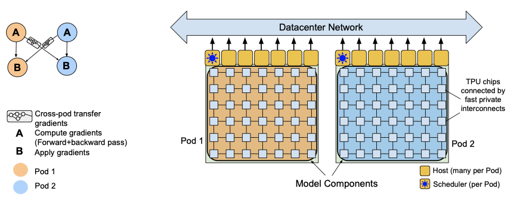

+++
author = "Kurt"
title = "PaLM"
date = "2024-01-25"
description = "Scaling Language Modeling with Pathways"
categories = [
    "Paper Review"
]
tags = [
    "NLP",
    "LLM",
]
draft = true
+++

## Abstract

few-shot learning 예제를 사용하는 대형 언어 모델은 다양한 자연어 작업에서 뛰어난 성능을 보여준다. 이를 더 깊이 이해하기 위해, 540B parameter의 densely activated transformer 언어 모델인 Pathways Language Model(PaLM)을 학습시켰다.

새로운 ML 시스템인 Pathways를 사용해 PaLM을 학습시키고, 수백 개의 언어 이해 및 생성 벤치마크에서 state-of-the-art의 few-shot learning 결과를 달성하였다. PaLM 540B는 다단계 추론 작업과 BIG-bench 벤치마크에서 인간 평균 성능을 능가하는 성과를 보여주었다. 모델 규모가 커짐에 따라 성능이 급격히 향상된 작업도 있었다. 또한 PaLM은 다국어 작업과 소스 코드 생성에서도 강력한 능력을 가지고 있다. bias와 toxicity 대한 분석과 함께, 거대 언어 모델과 관련된 윤리적 고려 사항에 대해 논의하였다.

---

## Introduction

언어 이해와 생성을 위한 대규모 신경망들은 다양한 작업에서 놀라운 결과를 보여주고있다. BERT나 T5 같은 모델들은 대량의 텍스트를 통해 사전 학습되고, 특정 작업에 맞게 미세 조정된다. 이들 모델은 다양한 자연어 작업에서 state-of-the-art를 보여주지만, 모델을 미세 조정하는 데 많은 수의 작업 특정 학습 예제가 필요하고, 일부 모델 parameter를 작업에 맞게 업데이트하는 복잡성이 증가한다는 단점이 있다.

GPT-3는 극도로 큰 autoregressive 언어 모델이 소수의 예측을 위해 사용될 수 있음을 보여주었다. 이 모델은 자연어 작업 설명과 작업 완료 방법을 보여주는 몇 가지 예시만 제공받아 학습된다. 대규모 작업 특정 데이터 수집이나 모델 parameter 업데이트 없이도 매우 강력한 결과를 달성하였다.

GPT-3 이후에도 GLaM, Gopher, Chinchilla, Megatron–Turing NLG, LaMDA와 같은 강력한 대규모 autoregressive 언어 모델들이 개발되어 state-of-the-art를 계속 밀어내고 있다. 이들 모델은 모두 transformer 아키텍처의 변형이며, 모델의 크기 확대, 학습된 토큰 수 증가, 더 깨끗한 데이터셋 사용, 희소 활성화 모듈을 통한 계산 비용 없는 모델 용량 증가 등의 방법으로 개선되었다.

이 연구에서는 780B 개의 고품질 텍스트 토큰에 대해 540B 개의 parameter를 가진 densely activated autoregressive transformer를 학습시키는 언어 모델링 개선을 계속하였다. 이는 새로운 ML 시스템인 Pathways를 사용하여 수천 개의 accelerator chip에서 매우 큰 신경망을 효율적으로 학습시키는 데 성공하였다. 이 새로운 모델인 PaLM은 수백 개의 자연어, 코드, 수학적 추론 작업에서 breakthrough performance를 달성하였다.

이 연구에서 주요 결론은 다음과 같다:

* **Efficient scaling** 이 연구에서는 새로운 ML 시스템인 Pathways를 대규모로 처음 사용하였다. 이를 통해, 6144개의 TPU v4 칩에서 540B parameter 언어 모델을 이전에는 도달할 수 없었던 효율 수준에서 학습시켰다. 이전의 대부분의 대규모 언어 모델들은 단일 TPU 시스템에서 학습되거나 GPU 클러스터 또는 여러 TPU v3 pods에 걸쳐 확장되었다. 두 개의 TPU v4 Pods에 걸쳐 6144개의 칩으로 PaLM 540B의 학습을 확장하면서 매우 높은 효율성을 달성하였다.
* **Continued improvements from scaling** 자연어, 코드, 수학적 추론 작업 등 수백 가지 작업에 대해 PaLM을 평가하고, 대부분의 벤치마크에서 상당한 차이로 state-of-the-art를 달성하였다. 이는 대규모 언어 모델로부터의 scaling 개선이 아직도 정체되지 않았음을 보여준다. 가장 널리 평가된 29개의 영어 언어 이해 벤치마크 중 28개에서 최고 작업별 결과에 비해 state-of-the-art를 보여주었다.
* **Breakthrough capabilities** 이 연구에서는 다양한 어려운 작업에 대해 언어 이해와 생성에서 breakthrough capabilities를 보여준다. 특히, multi-step 수학적 또는 상식적 추론이 필요한 일련의 추론 작업에 대해 평가하였다. 모델 scaling과 사슬 형태의 생각 유도를 결합하면, 간단한 소수 평가가 넓은 범위의 추론 작업에서 state-of-the-art를 능가하거나 매치할 수 있음을 보여주었다. 또한, 최근 출시된 150개 이상의 새로운 언어 이해와 생성 작업을 포함하는 BIG-bench에서 breakthrough performance을 보여주었다. PaLM이 복잡한 추론 체인을 명확하게 해석하고 설명하는 능력을 탐색하였다.
* **Discontinuous improvements** 8B, 62B, 540B의 세 가지 다른 parameter 규모에서의 결과를 제시하여 scaling 행동을 이해한다. 일반적으로, 62B에서 540B로의 scaling은 8B에서 62B로의 scaling과 유사한 성능을 가져온다. 그러나 특정 작업에 대해서는, 62B에서 540B로의 scaling이 정확도에서 drastic jump를 가져오는 것을 관찰하였다. 이는 대규모 언어 모델의 새로운 능력이 충분한 규모를 달성하면 나타날 수 있음을 제안한다.
* **Multilingual understanding** 이 연구에서는 다양한 언어에서의 기계 번역, 요약, 그리고 질문 응답을 포함한 다국어 벤치마크에 대한 철저한 평가를 수행하였다. 비영어 데이터의 비율이 상대적으로 작음에도 불구하고, PaLM 모델은 비영어 요약 작업에서 이전에 미세 조정된 state-of-the-art와의 격차를 메우며, 번역 작업에서 이전의 state-of-the-art를 능가하였다. 다국어 데이터 비율 증가의 영향을 이해하기 위해 추가적인 연구가 필요하다.
* **Bias and toxicity** distributional bias와 toxicity에 대한 모델 성능을 평가하였다. 성별과 직업에 대한 bias에서, 모델 규모가 커짐에 따라 성능이 개선되었다. 인종/종교/성별 프롬프트 연속성에서는 모델이 스테레오타입을 거짓으로 확증하는 가능성을 보여주었다. toxicity 분석에서는 62B와 540B 모델이 8B 모델에 비해 약간 더 높은 toxicity 수준을 보여주었다. 모델이 생성한 연속성의 toxicity은 프롬프트 텍스트의 toxicity과 높게 상관되었다. 향후 연구에서는 이러한 벤치마크를 비영어 언어로 확장하고 잠재적 위험을 더 철저히 고려할 계획이다.

---

## Model Architecture

PaLM은 다음과 같은 수정을 가진 표준 Transformer 모델 아키텍처의 decoder-only setup으로 사용한다:

* **SwiGLU Activation** MLP 중intermediate activation에 SwiGLU activation을 사용한다. 이는 표준 ReLU, GeLU, Swish activation에 비해 품질을 크게 향상시키기 때문이다. 이는 MLP에서 세 개의 행렬 곱셈이 필요하다는 것을 의미하지만, 이는 품질 개선을 보여준다.

* **Parallel Layers** 각 Transformer block에서 표준 "serialized" 형식 대신 "parallel" 형식을 사용한다. 특히, 표준 serialized 형식은 다음과 같이 작성할 수 있다:

$$ y = x + \text{MLP}(\text{LayerNorm}(x + \text{Attention}(\text{LayerNorm}(x)))) $$

반면에, parallel 형식은 다음과 같이 작성할 수 있다:

$$ y = x + \text{MLP}(\text{LayerNorm}(x)) + \text{Attention}(\text{LayerNorm}(x)) $$

parallel 형식은 MLP와 Attention 입력 행렬 곱셈이 융합될 수 있어 대규모 규모에서 학습 속도를 약 15% 더 빠르게 한다. 실험에서는 8B 규모에서는 약간의 품질 저하가 있었지만, 62B 규모에서는 품질 저하가 없었으므로, 540B 규모에서 parallel layer의 효과는 품질에 영향을 주지 않을 것으로 추정하였다.

* **Multi-Query Attention** 표준 Transformer 형식은 $k$개의 attention head를 사용하며, 각 타임스텝의 입력 벡터는 "query", "key", "value" 텐서로 선형적으로 투영된다. 이 방식은 모델 품질과 학습 속도에 중립적인 효과를 가지지만, decoding 시간에 비용 절약을 가져온다. 이는 standard multi-headed attention이 auto-regressive decoding 시에 accelerator 하드웨어에서 낮은 효율성을 보이기 때문이다.

* **RoPE Embeddings** 긴 시퀀스 길이에서 더 나은 성능을 보이는 RoPE 임베딩을 사용한다. 이는 절대적 또는 상대적 포지션 임베딩 대신에 사용되었다.

* **Shared Input-Output Embeddings** 입력과 출력 임베딩 행렬을 공유한다.

* **No Biases** 어떤 dense kernel이나 layer norm에서도 bias를 사용하지 않았다. 이는 큰 모델의 학습 안정성을 증가시키는 것으로 나타났다.

* **Vocabulary** 256k 토큰의 SentencePiece 어휘를 사용하여 학습 말뭉치의 많은 언어를 지원한다. 이 어휘는 학습 데이터에서 생성되었으며, 학습 효율성을 향상시킨다. 어휘는 완전히 손실 없이 되돌릴 수 있으며, 공백을 완전히 보존하고, 어휘 외의 유니코드 문자를 UTF-8 바이트로 분할한다. 숫자는 항상 개별 숫자 토큰으로 분할된다.

### Model Scale Hyperparameters

이 연구에서는 540B, 62B, 8B parameter의 세 가지 다른 모델 규모를 비교한다. 이 모델들은 standard dense transformer이므로, 토큰 당 FLOP 수는 parameter 수와 대략적으로 동일하다. 이 모델들은 같은 데이터와 어휘를 사용하여 동일하게 학습되었다.

---

## Training Dataset

PaLM 사전 학습 데이터셋은 다양한 자연어 사용 사례를 대표하는 7800억 토큰의 말뭉치로 구성되어 있다. 이 데이터셋은 웹페이지, 책, 위키백과, 뉴스 기사, 소스 코드, 소셜 미디어 대화를 섞어 만들었다. 모든 모델을 데이터의 1 epoch 학습시키고, 데이터를 반복하지 않도록 혼합 비율을 선택하였다.

사전 학습 데이터셋은 자연어 데이터뿐만 아니라 코드도 포함한다. 이 코드는 GitHub의 오픈 소스 저장소에서 얻은 것이며, 라이선스에 따라 필터링하였다. 또한 파일 이름 확장자에 따라 24개의 일반적인 프로그래밍 언어 중 하나로 제한하였고, 중복 파일을 제거하였다. 이 결과, 196GB의 소스 코드가 생성되었다.

최종 PaLM 데이터셋 혼합물을 생성하는 데 사용된 다양한 데이터 소스의 비율을 보여주며, 데이터 오염을 확인하고, 학습 데이터셋과 평가 데이터 사이의 중복을 분석한다.

---

## Training Infrastructure

학습 및 평가 코드베이스는 JAX와 T5X를 기반으로 하며, 모든 모델은 TPU v4 Pods에서 학습된다. PaLM 540B는 데이터 센터 네트워크를 통해 연결된 두 개의 TPU v4 Pods에서 학습되며, 이는 모델과 데이터 병렬성의 조합을 사용한다. 이 시스템은 파이프라인 병렬성 없이 학습을 6144개의 칩으로 효율적으로 확장할 수 있게 해준다.

이전의 비슷한 규모에서 모델 학습은 두 가지 접근법을 사용했다. LaMDA와 GLaM은 파이프라인 병렬성이나 DCN을 활용하지 않고 단일 TPU 시스템에서 학습되었고, Megatron-Turing NLG 530B는 여러 가지 병렬성을 사용하여 A100 GPU에서, Gopher는 파이프라이닝을 사용하여 DCN-연결된 TPU v3 Pods에서 학습되었다.

파이프라이닝은 일반적으로 DCN과 함께 사용되며, 추가적인 병렬화를 제공한다. 그러나 이는 학습 배치를 "micro-batches"로 분할하지만, 중요한 단점이 있다. 첫째, 많은 장치가 유휴(idle) 상태인 동안 발생하는 시간 오버헤드가 있다. 둘째, 미니 배치 내의 각 마이크로 배치에 대해 메모리에서 가중치를 다시 로드해야 하므로 높은 메모리 대역폭이 필요하다. 이러한 문제를 해결하기 위한 전략을 통해 PaLM 540B의 학습을 6144 칩으로 효율적으로 확장할 수 있었다.

각 TPU v4 Pod는 모델 parameter의 전체 복사본을 포함하며, 각 가중치 텐서는 모델 병렬성과 완전분할 데이터 병렬성을 사용하여 칩으로 분할된다. forward pass에서 가중치가 모두 모아지고, 각 layer에서 activation 텐서가 저장된다. backward pass에서는 나머지 activation이 rematerialized되며, 이는 더 큰 배치 크기에서 더 높은 학습 처리량을 결과로 내기 때문이다.

Pathways 시스템을 사용하여 단일 TPU v4 Pod를 넘어서 학습을 확장한다. PaLM 540B는 Pathways의 클라이언트-서버 아키텍처를 사용하여 pod 레벨에서 데이터 병렬성을 달성한다. Python 클라이언트는 배치의 절반을 각 pod에 할당하고, 각 pod는 gradient를 계산하기 위해 병렬로 계산을 수행한다. 그 후, pod들은 gradient를 원격 pod에 전송하고, 각 pod는 gradient를 누적하고 parameter를 업데이트하여 다음 타임스텝에 대한 parameter를 얻는다.

Python 클라이언트는 분할된 데이터플로우 프로그램을 구성하고, 이 프로그램은 각 pod에서 계산과 최적화 업데이트를 수행하고, gradient를 다른 pod로 전송한다. Pathways 시스템의 디자인은 프로그램 실행을 수천 개의 accelerator 칩으로 확장할 수 있게 한다. 이는 원격 서버로 작업을 발송하는 데 걸리는 지연 시간을 감추고, 데이터 전송의 관리 비용을 분산시킨다.

two-way pod-level 데이터 병렬성의 도전적인 측면은 cross-pod gradient 전송에 대한 높은 학습 처리량을 달성하는 것이다. 이는 데이터 센터 네트워크를 통해 모든 호스트가 gradient를 동시에 전송하는 매우 폭발적인 작업량을 초래한다. 이로 인한 도전을 극복하기 위해, 데이터를 작은 청크로 분해하고 다양한 DCN 링크를 통해 라우팅하는 등의 최적화를 수행한다. 이러한 최적화를 통해, 학습 중 단일 pod에 비해 약 1.95배의 처리량을 달성하였다. 이론적인 2배 처리량에 비한 성능 차이는 backward pass와 cross-pod gradient 축소 사이의 중첩이 부족하기 때문에 발생하며, 이 문제는 향후 작업에서 해결할 예정이다.

### Training Efficiency

언어 모델의 accelerator 효율성은 대게 하드웨어 FLOPs 이용률로 측정된다. 이는 주어진 장치에서 관찰된 FLOPs와 이론적인 최대 FLOPs 사이의 비율을 나타낸다. 하지만 이 방법에는 문제가 있다. 첫째, 실행된 하드웨어 FLOPs의 수는 시스템과 구현에 따라 달라진다. 둘째, 하드웨어 FLOPs 측정은 그것들을 세거나 추적하는 방법에 의존적이다. 결국, 학습 시스템의 목표는 가능한 많은 하드웨어 FLOPs를 사용하는 것이 아니라 초당 토큰의 높은 처리량을 달성하는 것이다.

## Reference

* [Paper](https://arxiv.org/pdf/2204.02311.pdf)
* [Github](https://github.com/lucidrains/PaLM-pytorch)