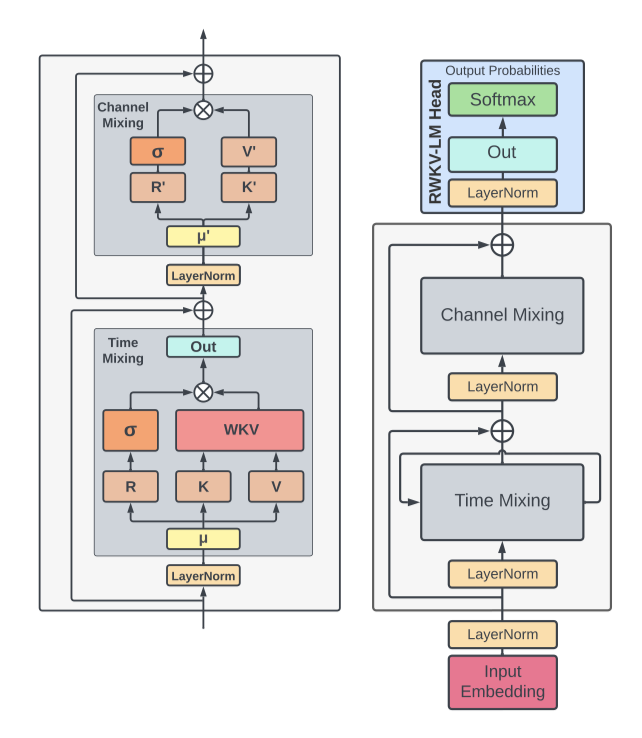
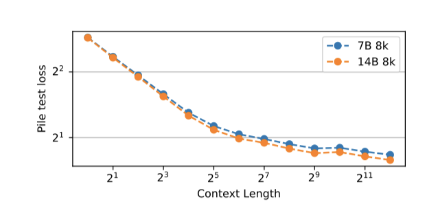

+++
author = "Kurt"
title = "RWKV"
date = "2024-03-26"
description = "Reinventing RNNs for the Transformer Era"
categories = [
    "Paper Review"
]
tags = [
    "NLP",
    "LLM",
]
+++

## Abstract

Transformer는 NLP 작업을 변화시켰으나 시퀀스 길이에 따라 복잡성이 증가하는 문제가 있고, RNN은 선형 확장성은 있으나 transformer만큼의 성능을 내기 어렵다. 이에 transformer의 병렬 학습과 RNN의 효율적 추론을 결합한 새로운 모델, Receptance Weighted Key Value(RWKV)를 제안한다.

이 연구의 방식은 linear attention 메커니즘을 통해 모델을 transformer나 RNN으로 구현할 수 있게 하여, 학습 시 병렬 계산과 추론 시 일정한 복잡성을 유지한다. 14B 개 parameter로 확장된 이 모델은 역대 가장 큰 RNN이며, RWKV는 비슷한 크기의 transformer와 동등한 성능을 보여준다. 이는 계산 효율과 성능 균형을 맞추는데 있어 중요한 진전이다.

---

## Introduction

딥러닝은 자연어 이해, 대화형 AI, 시계열 분석 등 복잡한 순차 데이터 처리에 혁신을 가져왔다. 이 분야에서 RNN과 transformer는 주요 기술로 활용되고 있으며, RNN은 긴 시퀀스 처리에 유리하나 그래디언트 소실 문제와 학습의 비병렬성으로 인한 확장성 제한이 단점이다.

transformer는 NLP에서 병렬화된 학습과 의존성 처리에 탁월함을 보이며, 모델들이 이 기술의 잠재력을 증명하였다. 그러나 self-attention 메커니즘의 복잡도는 긴 시퀀스 처리에 어려움을 주며, 이는 확장성 개선 연구로 이어지고 있다.

RWKV 모델은 RNN과 transformer의 장점을 결합하고 주요 단점을 피하며, 메모리 병목 현상과 transformer의 2차 스케일링 문제를 효율적인 linear 스케일링으로 완화한다. RWKV는 전통적인 dot-product 토큰 상호작용 대신 더 효과적인 channel-directed attention을 사용하는 linear attention의 변형을 통해 attention 메커니즘을 재정의한다. 이 구현은 근사치 없이 최소한의 계산 및 메모리 복잡성을 제공한다.

RWKV는 계산 효율성과 표현력 사이의 균형을 목표로 하며, 대규모 모델을 효과적으로 처리하여 낮은 계산 비용으로 경쟁력 있는 성능을 제공한다. 이는 AI의 확장성과 순차 데이터 처리의 도전을 해결하며, 더 지속 가능하고 효율적인 AI 모델로의 발전을 지향한다.

이 논문에서의 기여는 다음과 같다:

* RNN과 transformer의 장점을 결합하고 한계를 완화하는 새로운 구조인 RWKV의 도입.
* 대규모 모델을 위한 벤치마크 데이터셋에서 RWKV의 성능과 효율성을 입증하는 상세한 실험.
* Pile에서 학습된 169M에서 14B 개의 paramter를 가진 사전 학습된 모델의 공개.

---

## Background

RNN과 transformer의 기본 사항을 간단히 검토한다.

### Recurrent Neural Networks (RNNs)

LSTM과 GRU와 같은 유명한 RNN 구조들은 특정 공식을 기반으로 한다(LSTM 예시, 다른 구조도 비슷하게 적용 가능하다).

$$ f_t= σ_g(W_f x_t + U_f h_{t−1} + b_f) $$
$$ i_t = σ_g(W_i x_t + U_i h_{t−1} + b_i) $$
$$ o_t = σ_g(W_o x_t + U_o h_{t−1} + b_o) $$
$$ \hat{c}_t = σ_c(W_c x_t + U_c h_{t−1} + b_c) $$
$$ c_t = f_t ⊙ c_{t−1} + i_t ⊙ \hat{c}_t $$
$$ h_t = o_t ⊙ σ_h(c_t) $$

Bradbury et al. (2017)에 따르면, RNN은 선형 블록과 특유의 블록으로 구성되지만, 이전 시간 단계에 대한 의존성으로 인해 병렬 처리가 어렵다.

### Transformers and AFT

Vaswani et al. (2017)에 따르면, transformer는 NLP 작업에 주로 사용되는 신경망으로, RNN과 달리 attention 메커니즘을 사용해 입력과 출력 토큰 사이의 관계를 포착한다.

$$ Attn(Q, K, V) = softmax(QK^T)V $$

multi-headness와 scaling factor는 생략되며, $QK^T$ 곱은 시퀀스 내 토큰들 사이의 attention score를 벡터 연산으로 나타낸다.

$$ Attn(Q, K, V)_t = {{\sum_{i=1}^T e^{q_t^{T k_t} ⊙ v_i}\over{\sum_{i=1}^T e^{q_t^{T k_t}}} $$

AFT는 번갈아 가며 공식화한다.

$$ Attn^+ (W, K, V)_t = {{\sum_{i=1}^T e^{q_t^{T k_t} ⊙ v_i}\over{\sum_{i=1}^T e^{q_t^{T k_t}}} $$

$\lbrace w_t, i \rbrace \in R^{T×T}$는 학습된 pair-wise position bias이며, 각각은 스칼라이다.

AFT를 기반으로 RWKV는 interaction weight를 간소화하여 RNN으로 변환할 수 있는 방식을 채택하며, 각 $w_t$, $i$는 시간에 따라 감소하는 벡터이다.

$$ w_t, i = − (t − i)w $$

$w$는 채널 수 $d$의 음수가 아닌 벡터로, 채널별 가중치가 시간에 따라 감소한다.

---

## RWKV

RWKV 모델 아키텍처는 time-mixing 및 channel-mixing block에 내재된 네 가지 기본 요소로 정의된다.

* $R$: Receptance 벡터는 과거 정보의 수신자로 작용한다.
* $W$: Weight는 모델 내에서 학습 가능한 parameter인 위치 weight decay 벡터를 의미한다.
* $K$: Key 벡터는 전통적인 attention 메커니즘에서의 K와 유사한 역할을 수행한다.
* $V$: Value 벡터는 전통적인 attention 과정에서의 V와 유사하게 기능한다.

이러한 핵심 요소들은 각 시간 단계에서 곱셈적으로 상호 작용한다.

### Architecture

RWKV 모델은 residual block을 쌓아 구성되며, 각 block은 과거 정보를 활용하는 time-mixing 및 channel-mixing 구조를 포함한다.

이 모델은 시간에 따른 softmax와 같은 특별한 점수 업데이트 방식으로 수치 안정성을 높이고 vanishing gradient를 줄인다. layer normalization을 통해 gradient 문제를 해결하며, 이러한 설계는 deep neural network 학습을 개선하고 다양한 추상화 수준에서 복잡한 패턴을 포착해 전통적 RNN보다 뛰어난 성능을 제공한다.

#### Token Shift

이 구조에서는 모든 linear projection 벡터(R, K, V 및 R', K')가 현재와 이전 입력 간 linear interpolation을 통해 생성되며, 이는 토큰 이동을 쉽게 한다.

time-mixing 계산을 위한 벡터들은 블록의 현재 입력과 이전 입력의 linear combination의 linear projection 이다.

$$ r_t = W_r \cdot (µ_r ⊙ x_t + (1 − µ_r) ⊙ x_{t−1}) $$
$$ k_t = W_k \cdot (µ_k ⊙ x_t + (1 − µ_k) ⊙ x_{t−1}) $$
$$ v_t = W_v \cdot (µ_v ⊙ x_t + (1 − µ_v) ⊙ x_{t−1}) $$

channel-mixing 입력도 마찬가지이다.

$$ r_t' = W_r' \cdot (µ_r' ⊙ x_t + (1 − µ_r') ⊙ x_{t−1}) $$
$$ k_t' = W_k' \cdot (µ_k' ⊙ x_t + (1 − µ_k') ⊙ x_{t−1}) $$

토큰 이동은 각 블록에서 PyTorch의 nn.ZeroPad2d((0,0,1,-1))를 사용해 시간 차원의 오프셋으로 구현된다.

#### WKV Operator

모델의 WKV Operator 계산은 Attention Free Transformer와 유사하지만, W를 쌍이 아닌 상대 위치에 따라 수정되는 채널 단위 벡터로 처리한다. 이는 WKV 벡터의 시간에 따른 업데이트로 정의되는 반복적 행동을 통해 공식화된다.

$$ wkv_t = {{\sum_{i=1}^{t-1} e^{-(t-1-i)w + k_i} ⊙ v_i + e^{u+k_t}}\over{\sum_{i=1}^{t-1} e^{-(t-1-i)w + k_i} + e^{u+k_t}}} $$

W의 열화를 막기 위해, 현재 토큰에 집중하는 벡터 U를 도입하였다.

#### Output Gating

time-mixing과 channel-mixing 블록에서 출력 게이팅은 $σ(r)$의 시그모이드로 구현되며, WKV 연산 후 출력 벡터 $o_t$가 생성된다.

$$ o_t = W_o \cdot (σ(r_t) ⊙ wkv_t) $$

channel-mixing block에서도 비슷한 작업이 수행된다:

$$ o_t' = σ(r_t') ⊙ (W_v' \cdot max(k_t', 0) 2) $$

squared ReLU 활성화 함수를 채택한다.

### Transformer-like Training

RWKV는 time-parallel mode를 통해 효율적으로 병렬 처리된다. 단일 레이어에서는 주로 $W_λ$ 행렬 곱셈으로 $O(BTd^2)$의 시간 복잡도를 가지며, attention score 업데이트는 순차적 스캔을 포함해 $O(BTd)$의 복잡도를 가진다.

행렬 곱셈은 전통적인 transformer의 $W_λ$와 같이 병렬화 가능하며, 원소별 WKV 계산도 다른 차원에서 병렬 처리할 수 있다.

### RNN-like Inference

Recurrent network와 언어 모델 디코딩처럼, RWKV는 상태 $t$의 출력을 상태 $t+1$의 입력으로 사용하는 시간-순차 모드를 활용한다. 이를 통해 추론 시 디코딩을 재귀적으로 효율적으로 수행할 수 있다.

### Additional Optimizations

**Custom Kernels** 작업의 순차적 특성으로 인한 WKV 계산 비효율성을 해결하기 위해, 학습 가속기에서 사용할 수 있는 맞춤 CUDA 커널을 개발하였다. 이를 통해 모델의 다른 부분들은 이미 병렬화되고 효율적인 상태로 유지된다.

**Small Init Embedding** transformer 모델 학습 초기에 임베딩 행렬이 천천히 변화하는 문제를 해결하기 위해, 작은 값으로 임베딩 행렬을 초기화하고 추가적인 LayerNorm 연산을 적용하는 방식을 제안한다. 이 방법은 학습 과정을 가속화하고 안정화시켜, 깊은 아키텍처의 효과적인 학습을 가능하게 하며, 모델이 초기 임베딩 상태에서 빠르게 벗어나도록 하여 수렴을 개선한다.

**Custom Initialization** 이전 연구를 기반으로, 정보 흐름을 명확히 하기 위해 parameter를 정체성 매핑과 유사하게 초기화하고 대칭성을 깨는 전략을 사용한다. 대부분의 가중치는 0으로 초기화되고 linear layer는 편향을 사용하지 않는다. 초기화 방식이 수렴 속도와 품질에 중요한 영향을 미친다는 것이 확인되었다.

### Implementation

RWKV는 PyTorch를 이용해 구현되었으며, DeepSpeed에서 영감을 받은 최적화 전략을 추가함으로써 효율성과 확장성을 개선하였다.

모델은 임베딩 layer로 시작해 순차적으로 배열된 여러 residual block을 거친다. 마지막 block 이후, LayerNorm과 linear projection을 포함한 output projection head가 다음 토큰 예측과 학습 시 cross-entropy 손실 계산에 사용된다.

---

## Trained Models and Computing Costs

RWKV의 확장성을 보여주기 위해, 169M에서 14B 개의 paramter를 가진 여섯 개의 모델을 Pile에서 330B 토큰에 대해 한 epoch 동안 학습시켰다.

각 모델의 parameter 수는 $# parameters = 2VD + 13D^2L + D(11L + 4)$ 공식으로 계산되며, 여기서 $V$는 어휘 크기, $D$는 모델 차원, $L$은 layer 수이다. 하나의 토큰에 대한 순방향 FLOPs는 linear layer parameter의 두 배로 계산되며, 역방향 FLOPs는 순방향의 두 배이다. 총 FLOP은 토큰 당 $6(2VD + 13D^2L)$이며, 이는 transformer의 표준 FLOP 계산 공식과 일치한다.

### Additional Training Details

학습 시 표준 Adam optimizer를 사용하고 bfloat16 정밀도와 1024 토큰의 컨텍스트 길이를 적용한다. learning rate는 초기에는 일정하게 유지되다가 지수적으로 감소하며, standard cross-entropy 손실 함수 외에도 PaLM에 의해 도입된 보조 손실을 추가로 사용한다. 이 보조 손실은 소프트맥스 정규화기의 근사치를 0에 가깝게 만드는 것을 목표로 한다.

### Scaling Laws

언어 모델의 스케일링 법칙은 모델 크기, 데이터셋 크기, 최적 컴퓨팅 예산 등 다양한 요소가 성능에 미치는 영향을 수학적으로 설명한다. 이 법칙들은 대규모 모델의 비용과 성능을 예측하고, 실패 사례로부터 미래 연구 방향에 대한 통찰력을 얻는 데 중요하다.

이전 연구에서는 LSTMs가 transformer처럼 log-log linear scaling을 따르지 않는다고 주장하였다. 그러나, 45개의 RWKV 모델을 학습시키고 RWKV가 transformer의 스케일링 법칙을 따른다는 것을 확인하였다. 이 연구의 결과는 컴퓨트에 따른 손실을 보여주며, 파레토 최적 점에 대한 선형 적합은 $r^2$ 값이 0.994이고, 곡선을 한 차수 더 크게 외삽할 때도 $r^2$ 값이 0.875로 매우 좋은 적합을 보인다.

---

## Evaluations

이전 섹션에서 RWKV 모델의 확장성을 입증한 후, 이제 전통적인 transformer와의 경쟁력에 대해 주목한며, 두 가지 질문에 초점을 맞춘다:

**Competitiveness** RWKV가 quadratic transformer 구조와 경쟁력이 있을까?

**Long Context** RWKV 모델을 학습할 때 컨텍스트 길이를 늘리면 언어 모델링 손실이 개선될까?

### NLP Evaluations

RWKV 모델이 NLP 태스크에서 전통적인 transformer와 경쟁력이 있음을 보이기 위해, 비슷한 크기와 학습 토큰 수를 가진 모델(Pythia, OPT, BLOOM)과 비교하였다. RWKV는 Pile에서 1 epoch로 학습되었고, 이는 다른 모델들과 유사한 학습 양이다. FLOPmatched 기준으로 비교하며, 가장 공정한 비교를 위해 특정 최적화 체제에서 학습된 모델과는 비교를 피하였다.

다양한 벤치마크(ARC, BoolQ, COPA 등)에 대한 연구 결과를 보고한다.

RWKV와 ChatGPT/GPT-4 비교 연구는 RWKV가 프롬프트 엔지니어링에 매우 민감하다는 것을 보여주었다. 프롬프트를 RWKV에 더 적합하게 조정했을 때 성능이 크게 향상되었으며, 비꼬는 말 탐지에서는 ChatGPT를 능가했지만 최신 기술 솔루션보다는 다소 떨어졌다.

### Extended Context Finetuning

RNN은 생성 시 미리 정의된 시퀀스 길이가 없으나, 계산 효율을 위해 학습 데이터를 동일한 길이로 전처리한다. 시퀀스 길이를 점진적으로 늘려가며 미세조정함으로써, 모델이 더 큰 배치 크기를 효과적으로 처리할 수 있음을 발견하였다. 시퀀스 길이를 1024에서 시작해 최종적으로 8192까지 두 배씩 증가시켜, Pile에서의 테스트 손실 감소를 통해 RWKV가 긴 컨텍스트 정보를 효과적으로 활용할 수 있음을 확인하였다.

### Long Context Benchmarks

이 모델의 긴 시퀀스 처리 능력을 최신 기술과 비교하기 위해 Long-Range Arena (LRA) 벤치마크에서 평가하였다. LRA는 다양한 유형의 데이터를 포함한 긴 컨텍스트 상황의 처리 성능을 측정한다. RWKV를 LRA에 적용한 결과, RWKV는 다섯 데이터셋에서 S4 모델 다음으로 두 번째로 좋은 성능을 보여주었다.

---

## Inference Experiments

크기와 유형에 따라 모델의 추론 요구 사항을 평가한다. 이를 위해 CPU(x86) 및 GPU(NVIDIA A100 80 GB)에서 텍스트 생성 속도와 메모리 요구 사항을 측정한다. 이 과정에서 float32 정밀도와 HuggingFace Transformers를 사용하며, 모든 모델 parameter를 고려한다. 다른 양자화 설정의 성능 평가는 향후 연구 주제이다.

---

## Future Work

RWKV 아키텍처의 미래 연구 방향으로는, 효율성을 유지하며 time-decay 공식 개선과 초기 모델 상태 탐색을 통한 모델 표현력 증대가 있다.

RWKV의 계산 효율성은 병렬 스캔을 통해 계산 비용을 줄임으로써 향상될 수 있다.

RWKV 메커니즘은 encoder-decoder 구조에 적용 가능하며, cross-attention 대체 및 seq2seq 또는 멀티모달 환경에서 학습과 추론의 효율성을 개선할 수 있다.

RWKV의 상태는 해석성, 예측성, 안전성 향상에 기여하고, 숨겨진 상태 조작으로 행동 지도 및 맞춤화를 가능하게 한다.

RWKV 아키텍처는 공식 수정이나 더 큰 내부 상태 구현 등을 통해 개선 가능하며, 이를 통해 이전 컨텍스트 기억력 및 다양한 작업 성능이 향상될 수 있다.

---

## Conclusions

RWKV는 RNN 모델을 위한 새로운 접근법으로, 시간 기반 구성 요소를 활용해 현재 아키텍처의 한계를 극복하고, 지역성 및 장거리 의존성을 포착한다. 이는 (1) QK 어텐션을 선형 비용의 스칼라로 대체, (2) 효율적인 학습 및 추론을 위한 재귀 및 inductive bias 재정의, (3) 맞춤 초기화로 학습 동역학 강화를 통해 달성된다.

제안된 아키텍처는 다양한 NLP 작업에서 SoTA와 비슷한 성능을 더 낮은 비용으로 달성하였다. 추가 실험을 통해 모델의 표현력, 해석 가능성, 확장성을 입증하고, RWKV와 다른 LLM들 간의 행동 유사성을 보여준다.

RWKV는 순차 데이터의 복잡한 관계를 효율적으로 모델링하는 새로운 아키텍처로, 비슷한 주장을 한 많은 대안들 중 수십억 parameter의 사전 학습된 모델로 주장을 입증한 최초의 사례이다.

---

## Limitations

제안된 RWKV 모델은 학습과 추론 시 메모리 효율성에 관해 유망한 결과를 보여주었지만, 일부 한계점을 인정하고 향후 작업에서 해결해야 한다.

RWKV의 linear attention은 효율성을 높이지만, 긴 컨텍스트에서 세부 정보를 회상하는 작업의 성능에 한계가 있다. 이는 모델이 시간에 걸쳐 정보를 단일 벡터로 압축하는 방식과, standard Transformer의 자세한 정보 유지 방식과의 차이 때문이다. 모델의 순환 구조는 전통적인 self-attention과 비교하여 이전 토큰을 살펴보는 능력에 제한을 둔다. 학습된 시간 감쇠는 어느 정도 도움이 되지만, 전체 self-attention에 비해서는 제한적이다.

이 연구에서는 standard Transformer 모델 대비 프롬프트 엔지니어링의 중요성이 더 커진다는 한계가 있다. RWKV의 linear attention은 프롬프트 정보의 전달을 제한하므로, 모델의 성능 향상을 위해서는 잘 설계된 프롬프트가 더욱 중요해진다.

정보 순서 변경을 통해 일부 작업에서 RWKV 성능을 거의 2배 향상시킬 수 있음이 확인되었다.

---

## Ethics Statement

이 논문에서는 공개 사전 훈련 데이터를 기반으로 학습된 새로운 순차 데이터 처리 아키텍처를 소개하고, 이를 공개 지침에 따라 미세 조정함으로써 그 효과를 증명한다.

RWKV는 다양한 분야에서 시퀀스 데이터 모델링을 개선하는 새로운 아키텍처로, 그 학습 코드의 오픈 소스 공개는 AI의 민주화와 대규모 언어 모델의 이해 증진에 기여한다. 이를 통해 연구자들이 비용을 절감하며 더 쉽게 RWKV를 활용할 수 있게 되었다.

RWKV는 다양한 분야에서 시퀀스 데이터 모델링을 개선하는 새로운 아키텍처로, 그 학습 코드의 오픈 소스 공개는 AI의 민주화와 대규모 언어 모델의 이해 증진에 기여한다. 이를 통해 연구자들이 비용을 절감하며 더 쉽게 RWKV를 활용할 수 있게 되었다.

RWKV는 낮은 추론 비용으로 LLM의 대중화와 분배를 촉진하며, 소비자 및 엣지 하드웨어에 적합하다. 이는 프라이버시와 소유권을 강화하고 소규모/소외된 커뮤니티의 접근성을 높인다. 다양한 언어로 학습된 여러 크기의 사전 학습된 모델 가중치가 공개되어, 채택을 용이하게 하고 연구를 지원한다.

자원 장벽 감소로 AI 생성 텍스트 확산 가능성이 커지고, RWKV LLM은 학습 데이터의 편향이나 해로운 내용을 반영할 수 있다. 그러나 다른 transformer 모델에 사용된 완화 및 미세조정 전략이 RWKV에도 적용될 수 있다.

---

## Reference

* [Paper](https://arxiv.org/pdf/2305.13048.pdf)
* [GitHub](https://github.com/BlinkDL/RWKV-LM)