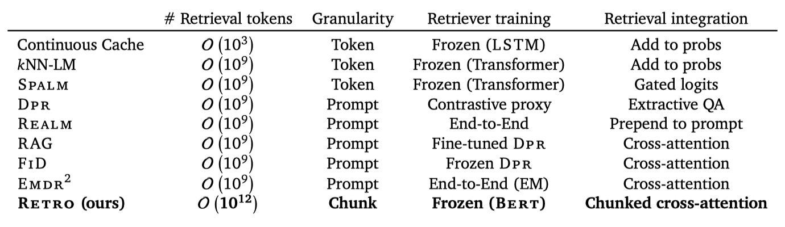

+++
author = "Kurt"
title = "RETRO"
date = "2024-01-11"
description = "Improving language models by retrieving from trillions of tokens"
categories = [
    "Paper Review"
]
tags = [
    "NLP",
    "LLM",
]
draft = true
+++

## Abstract

retrieval된 문서 조각들을 조건으로 사용하여 언어 모델을 향상시키는 새로운 방법을 제시하였다. 이 방법을 사용한 Retrieval-Enhanced Transformer (RETRO)는 적은 parameter로도 GPT-3와 Jurassic-1의 성능에 버금가는 성과를 보여주었다. 미세 조정 후에는 지식 집약적인 작업에도 뛰어난 성능을 보여주었다. 이 연구는 대규모 메모리를 통해 언어 모델을 향상시키는 새로운 방향을 제시한다.

---

## Introduction

언어 모델링은 텍스트의 확률을 모델링하는 비지도 학습 작업이다. neural network이 강력한 언어 모델로 입증되었고, transformer의 형태로 발전하면서 큰 성능 향상을 보여주었다. 이러한 성능 향상은 데이터, 학습 컴퓨팅, 모델 parameter의 양을 늘림으로써 이루어졌다. 특히, transformer는 원래의 작업에서 100M 개의 parameter 모델로 시작해 지난 두 해 동안 수백 억 개의 parameter로 확장되면서 다양한 작업에서 뛰어난 성능을 보였다. parameter 수를 늘리는 것은 학습과 추론 시간에 더 많은 계산을 수행하고, 학습 데이터를 더 많이 기억하는 데 도움이 된다.

이 연구에서는, 계산량을 크게 늘리지 않으면서 대규모 메모리를 언어 모델에 효율적으로 적용하는 방법을 탐구하였다. 이를 위해 대규모 텍스트 데이터베이스에서 retrieval 하는 것을 제안하였고, 이를 통해 모델의 크기를 늘리고 더 많은 데이터에 대해 학습하는 대신, 모델이 큰 데이터베이스에 직접 접근하여 예측을 수행하는 능력을 부여하였다. 이 연구는 큰 parameter 언어 모델에 대해 retrieval 데이터베이스를 수조 개의 토큰으로 확장하는 이점을 처음으로 보여준다.

* retrieval-enhanced autoregressive 언어 모델, RETRO를 소개하였다. 이 모델은 retrieval된 텍스트를 포함시키는 데 청크화된 cross-attention 모듈을 사용하며, retrieval 된 데이터의 양에 비례하는 시간 복잡도를 가진다. 또한, 사전 학습된 고정된 Bert 모델을 기반으로 하는 retrieval 방법이 큰 규모에서도 작동함을 보여주었다. 이로 인해 검색기 네트워크를 별도로 학습하고 업데이트할 필요가 없어졌다.
* 이 논문의 방법은 모델 크기와 데이터베이스 크기에 따라 잘 확장되며, RETRO는 다양한 모델 크기에 대해 일정한 향상을 보여준다. 또한, 데이터베이스 크기와 retrieval 된 neighbour의 수를 늘림으로써 RETRO의 성능을 개선할 수 있다. 가장 큰 모델은 여러 평가 데이터셋에서 state-of-the-art릉 달성하였으며, RETRO는 질문 응답과 같은 다양한 작업에서 경쟁력 있는 성능을 보여주었다.
* 테스트 문서와 학습 세트 간의 근접성을 고려한 평가 방법을 제안하였다. 이는 테스트 세트 유출 문제를 해결하며, 모든 언어 모델, 특히 평가 중에 학습 데이터셋에 직접 접근하는 retrieval-enhanced 모델에 중요하다. 이 방법을 통해, RETRO의 성능이 neighbour 복사와 일반 지식 추출 두 가지 요소로부터 나온다는 것을 보여주었다.

---

## Method

trillion 개의 토큰이 있는 데이터베이스에서 retrieval 할 수 있는 아키텍처를 설계하였다. 이를 위해 개별 토큰 대신 연속적인 토큰 청크를 retrieval 한다. key-value 데이터베이스를 구성하고, 고정된 Bert 임베딩을 키로 사용한다. 각 학습 시퀀스는 청크로 나누어지고, 데이터베이스에서 retrieval된 k-nearest neighbour로 확장된다. encoder-decoder 아키텍처는 retrieval 청크를 모델의 예측에 통합한다. 또한, 평가 세트가 학습 세트에 부분적으로 포함되어 있을 때 언어 모델을 평가하는 새로운 방법론을 소개한다.

### Training dataset

학습과 retrieval 데이터에 대해 다중 언어 MassiveText를 사용하며, 이 데이터셋은 5T 개 이상의 토큰을 포함한다. 데이터셋을 SentencePiece로 토큰화하고, 학습 중에는 학습 데이터에서 600B 개의 토큰을 retrieval 한다. 평가 시에는 데이터셋의 전체 합집합에서 retrieval 하며, 이 retrieval 데이터베이스는 1.75T 개의 토큰을 포함한다. 테스트 세트 유출을 제한하기 위해, 학습과 테스트 문서 사이의 유사성을 계산하고, 높은 유사성을 가진 학습 문서를 제거한다. 또한, 위키피디아 학습 데이터에서 Wikitext103의 검증 및 테스트 기사를 제거한다.

### Retrieval-enhanced autoregressive token models

토큰의 작은 청크 단위로 입력 예제를 확장하는 방법으로 retrieval을 사용한다. 텍스트 토크나이저를 이용해 얻은 정수 토큰 시퀀스를 고려하며, 각 예제를 청크로 나눈다. 이 청크는 데이터베이스에서 retrieval된 neighbour 집합으로 확장된다. 이전 토큰과 retrieval된 neighbour를 입력으로 받는 모델은 토큰의 가능성을 제공하며, 이는 retrieval이 향상된 시퀀스 log-likelihood를 정의한다:

$$ L(X|\theta, \mathbf{D}) \triangleq \sum_{u=1}^l \sum_{i=1}^m \mathsf{l}_{\theta} ( x\_{(u-1)m+i} | (x_j)\_{j<(u-1)m+i}, (\mathbf{RET}\_{\mathbf{D}}(C\_{u'}))\_{u'<u} ) $$

첫 번째 청크의 토큰 가능성은 어떤 retrieval 데이터에도 의존하지 않게 설정한다. 이는 autoregressivity를 보존하며, 특정 청크의 토큰 확률은 이전에 본 토큰과 이전 청크에서 retrieval된 데이터에만 의존한다. logprobability로 직접 샘플링하며, 이는 retrieval-enhanced 모델을 샘플링을 통해 평가되는 가장 큰 언어 모델과 직접 비교할 수 있게 한다.

### Nearest neighbour retrieval

**Retrieval neighbours.** 데이터베이스는 key-value 메모리로 구성되어 있다. 각 값은 연속적인 두 개의 토큰 청크로 이루어져 있으며, 이는 neighbour 청크와 그것의 연속성을 나타낸다. 키는 Bert 임베딩의 평균을 통해 계산되며, 각 청크에서는 BERT 임베딩의 $L2$ 거리를 사용하여 approximate k-nearest neighbour를 retrieval 한다. 모델은 이를 통해 의미있는 개선을 제공하며, 학습 중 인과성을 깨뜨리는 청크를 retrieval 하는 것을 피한다.

$T$ 요소의 데이터베이스에서는 $O(log T)$ 시간 안에 approximate nearest neighbour을 찾을 수 있다. 이를 위해 SCaNN 라이브러리를 사용하며, 이를 통해 2T 토큰의 데이터베이스를 10ms 안에 쿼리할 수 있다. 실시간 retrieval은 학습 계산의 속도를 따라가기 어렵기 때문에, 모든 approximate nearest neighbour을 미리 계산하고 데이터의 일부로 결과를 저장한다. 위키피디아 내에서만 neighbour를 retrieval한 결과, neighbour는 주로 주어진 기사에서 2-3 링크 떨어져 있는 반면, 랜덤한 기사는 5개 이상의 링크가 떨어져 있음을 발견하였다.

### RETRO model architecture

이 모델은 encoder-decoder transformer 아키텍처를 사용하며, cross-attention 메커니즘을 통해 retrieval된 데이터를 통합한다. retrieval된 토큰은 encoder transformer에 입력되어 neighbour 집합을 인코딩하고, 이를 통해 intermediate activation을 계산한다. 그 다음, transformer decoder는 Retro-blocks와 standard Transformer block을 교차하여 사용한다. 이 block들은 fully-connected layer, standard sequence-level self-attention layer, 그리고 retrieval encoder에서 정보를 통합하는 청크화된 cross-attention layer로 구성된다.

$$ RETRO(H, E) \triangleq FFW(CCA(ATTN(H), E)), \ and \ \ LM(H) \triangleq FFW(ATTN(H)) $$

Ffw, Attn 및 Cca는 모두 특정 위치에서의 출력이 해당 위치 이전의 입력에만 의존하는 autoregressive 연산자이다. 이들을 통해 Retro 및 lm 계층의 연속성과 토큰 분류 헤드는autoregressive log-likelihood를 정의한다. 

**Encoding retrieval neighbours.** 각 청크 $C_u$에 대한 $k$개의 retrieval neighbour는 bi-directional transformer encoder를 통해 인코딩되며, 이를 통해 출력 $E_u^j$가 생성된다. retrieval encoder는 non-causal transformer로, cross-attention layer를 통해 청크 $C_u$의 활성화에 조건화된다. 이는 retrieval encoder의 표현이 retrieval 청크에 의해 미분 가능한 방식으로 조절될 수 있음을 의미한다. 모든 청크에 대한 모든 neighbour는 병렬로 인코딩되어, 전체 인코딩 집합 $E$를 생성한다.

**Chunked cross-attention.** CCA 연산을 수행하기 위해, 주어진 중간 활성화 $H$를 $l-1$개의 청크 $H_u^+$로 분할한다. $H_u^+$는 청크 $C_u$의 마지막 토큰과 $C_{u+1}$의 첫번째 $m - 1$ 토큰의 중간 임베딩을 가지고 있다. 이는 청크 $C_u$에서 가져온 인코딩된 retrieval 세트인 $E_u$와의 cross-attention을 계산한다. 이때, time과 neighbour를 동시에 고려하며, 이는 cross-attention 적용 전에 $E_u$의 neighbour와 time dimension을 병합하기 때문이다. 데이터 청크와 retrieval neighbour 사이의 정렬 개념이 있기 때문에, relative positional encoding을 사용한다.

시간에 따라 cross-attention의 출력들을 연결하여 출력 활성화 $CCA(H, E)$를 만든다. 이는 각 청크와 토큰에 대해 설정된다. 이 과정은 결과를 적절히 패딩하여 진행된다.

$$ CCA(H, E)\_{u \ m+i-1} \triangleq C_A(h_{u \ m+i-1}, E_u) $$

$C_A$는 시간에 따라 인코딩된 neighbour를 대상으로 하는 cross-attention residual 연산자이다. 이 연산자는 세 개의 매개 변수 행렬 $K$, $Q$, $V$로 정의되며, 이는 모든 $h$와 $Y$에 대해 적용된다.

$$ C_A(h, Y) \triangleq softmax(YKQ^Th)YV $$

두 번째 차원에서 softmax를 적용하고, 모든 연산은 행렐 곱셈을 사용한다. multi-head cross-attention을 사용하며, positional encoding을 softmax에 추가한다.

첫 번째 $m − 1$ 토큰들은 이전 청크의 neighbour를 참조할 수 없다. 이 위치에서는 CCA를 항등 함수로 정의하며, 마지막 토큰은 마지막 검색 세트를 참조한다. CCA의 간략한 구현이 제공되며, 청크화된 cross-attention은 autoregressive하다. 즉, CCA의 출력은 CCA에 입력된 토큰 시퀀스에 의존한다.

RETRO 모델에서, 각 CCA cross-attention은 이전 청크의 neighbour만을 참조하지만, 이전 neighbour에 대한 의존성은 self-attention 연산을 통해 전달된다. 따라서, $u$ 번째 청크의 $i$ 번째 토큰의 활성화는 모든 이전 neighbour에 의존할 수 있지만, 그 집합에 대한 cross-attention의 제곱 비용은 발생하지 않는다.

**Sampling.** 샘플링 과정에서, 청크 $C_u$의 끝에서 SCaNN을 사용해 이웃을 검색하고, 이를 인코딩하여 다음 청크 $C_{u+1}$의 생성을 조절한다. 샘플링의 총 비용은 샘플링된 시퀀스의 크기에 비례하며, 검색의 추가 비용은 청크 수에 선형적이지만, 실제로는 토큰 샘플링 비용에 비해 무시할 수 있다.

### Baseline Transformer architecture

일반적인 transformer에 몇 가지 최소한의 변경을 가한 모델을 사용하다. 이는 LayerNorm을 RMSNorm으로 대체하고 relative position encoding을 사용하는 등의 변경을 포함한다. 베이스라인으로는 parameter 수가 다양한 검색없는 transformer를 학습시켰다. 모든 검색 모델은 같은 크기의 encoder를 사용하며, 추가적인 parameter가 있는데, 이는 검색 데이터에 대한 인코딩 때문입니다. 모든 모델은 JAX와 Haiku를 사용하여 구현되었다.

### Quantifying dataset leakage exploitation

RETRO 모델은 학습 세트에 포함된 데이터로 평가를 통해 이점을 얻을 수 있다. 그래서, 학습과 평가 데이터셋의 중복에 따른 성능 변화를 정량화하여, 검색이 언어 모델링 성능에 어떤 영향을 미치는지 이해하려고 한다.

평가 시퀀스를 청크로 나누고, 각 청크에 대해 학습 데이터에서 가장 가까운 neighbour를 찾는다. 이후 평가 청크와 neighbour 사이의 가장 긴 토큰 부분 문자열을 계산하여, 평가 청크와 학습 데이터 사이의 중복 정도를 측정한다. 이를 통해 각 청크의 log-likelihood와 인코딩하는 바이트 수를 얻어, 모델의 필터링된 bits-per-bytes를 계산한다.

$$ ∀\alpha \in [0, 1], \ C_{\alpha} \triangleq \lbrace C \in C, r(C) \leq \alpha \rbrace, \ bpb(\alpha) \triangleq {{\sum_{C \in C_{\alpha}} l(C)}\over{\sum_{C \in C_{\alpha}} N(C)}} $$

이는 학습 청크와 $\alpha %$ 미만으로 중복되는 청크 집합에 대한 bits-per-bytes를 나타낸다. $bpb(·)$ 함수는 평가 유출이 예측 성능에 어떤 영향을 미치는지 평가하는데 사용되며, $\alpha$가 낮은 경우 모델이 완전히 새로운 청크에서 어떻게 작동하는지를, $bpb(·)$의 기울기는 모델이 평가 유출을 얼마나 활용하는지를 나타낸다.

---

## Related Work

기존의 언어 모델링을 위한 retrieval 사용에 대한 연구를 검토하고, 이와 Retro를 비교한다. 인터넷의 큰 부분을 포함하는 대규모 데이터셋에서 RETRO 모델을 학습함에 따라, 작업은 개인정보, 안전, 공정성과 관련된 문제를 제기하게 된다.

### Retrieval for language modelling

---

## Reference

* [Paper](https://arxiv.org/pdf/2112.04426.pdf)
* [GitHub](https://github.com/lucidrains/RETRO-pytorch)