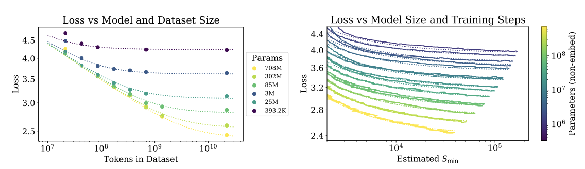
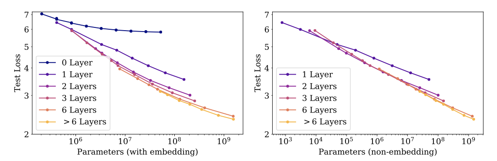

+++
author = "Kurt"
title = "Scaling Law"
date = "2023-12-22"
description = "Scaling Laws for Neural Language Models"
categories = [
    "Paper Review"
]
tags = [
    "NLP",
    "LLM",
]
draft = true
+++

## Abstract

언어 모델 성능에 대한 연구에서, 모델 크기, 데이터셋 크기, 학습에 사용된 컴퓨팅 양이 교차 엔트로피 손실을 멱법칙으로 스케일링한다는 것을 발견하였다. 네트워크의 폭이나 깊이 같은 다른 세부 사항은 큰 영향을 미치지 않는다. 큰 모델은 표본 효율이 뛰어나며, 최적의 컴퓨팅 효율은 상대적으로 적은 데이터에 큰 모델을 학습시키는 것을 포함한다. 이 모든 관계를 통해, 고정된 컴퓨팅 예산의 최적 할당을 결정할 수 있다.

---

## Introduction

언어는 인공지능 연구에 중요한 분야로, 대부분의 추론 작업을 효과적으로 수행할 수 있다. 세계의 텍스트는 비지도 학습을 위한 풍부한 데이터를 제공하며, 최근 딥러닝은 언어 모델링에 있어 빠른 발전을 보이고 있다. state-of-the-art 모델들은 많은 특정 작업에서 인간 수준의 성능에 근접하고 있으며, 이는 일관된 멀티패러그래프 작성에도 해당된다.

언어 모델링 성능은 모델 구조, 모델 크기, 학습에 사용된 컴퓨팅 파워, 학습 데이터의 양 등 여러 요소에 의존하며, 이 연구에서는 이러한 요소들이 언어 모델링 손실에 어떻게 영향을 미치는지를 transformer 구조를 중심으로 실증적으로 조사한다. 언어 작업의 성능 범위가 넓어서, 규모에 따른 추세를 좀 더 광범위하게 연구할 수 있다.

교육 시간, 문맥 길이, 데이터셋 크기, 모델 크기 등의 여러 요인에 따른 성능 변화를 관찰할 예정이다.

### Summary

Transformer 언어 모델에 대한 주요 발견은 다음과 같다:

**Performance depends strongly on scale, weakly on model shape:** 모델의 성능은 주로 모델 매개변수의 수, 데이터셋 크기, 그리고 사용된 컴퓨팅의 양에 의존하며, 다른 구조적 요소들은 성능에 상대적으로 적은 영향을 미친다.

**Smooth power laws:** $N$, $D$, $C$ 세 가지 스케일 요인이 파워와 관련이 있고, 이는 6배 이상의 크기 차이를 보인다. 상위 범위에서는 성능 향상의 감소를 보지 못했지만, 최종적으로는 성능이 안정화되어 손실이 0에 다다를 것이다.

**Universality of overfitting:** $N$과 $D$를 동시에 확장하면 성능이 예상대로 개선되지만, 둘 중 하나만 증가시키면 손실이 줄어든다. 성능 손실은 $N$과 $D$의 비율에 따라 예측 가능하며, 모델 크기를 8배 증가할 때마다 데이터를 약 5배 증가시키면 손실을 피할 수 있다.

**Universality of training:** 학습 곡선은 모델 크기에 거의 영향을 받지 않는 power-law를 따르며, 이를 통해 학습 초기부의 곡선을 확장해 더 오래 학습했을 때의 손실을 대략적으로 예측할 수 있다.

**Transfer improves with test performance:** 다른 분포의 텍스트에서 모델을 평가하면, 학습 검증 세트의 결과와 강하게 상관되며 일정한 손실이 발생한다. 이는 다른 분포로 전이할 때 일정한 패널티가 있지만, 그 외의 성능 향상은 학습 세트에서와 비슷하게 이루어진다.

**Sample efficiency:** 큰 모델은 작은 모델에 비해 최적화 단계와 데이터 포인트를 더 적게 사용하면서도 동일한 성능을 달성하는 샘플 효율성이 더 높다.

**Convergence is inefficient:** 고정된 컴퓨팅 예산 내에서, 모델 크기나 사용 가능한 데이터에 제한이 없다면, 매우 큰 모델을 학습시키고 조기에 중단함으로써 최적의 성능을 얻는다. 이런 방식은 작은 모델을 완전히 수렴시키는 것보다 샘플 효율성이 훨씬 높으며, 데이터 요구사항은 학습 컴퓨팅에 따라 매우 천천히 증가한다.

**Optimal batch size:** 이 모델들을 학습시키는 이상적인 batch size는 손실의 거듭제곱 정도이며, 가장 큰 모델의 경우 수렴 시점에서 약 1M-2M 토큰이다.

모델 크기, 데이터, 컴퓨팅을 적절히 확장할수록 언어 모델링 성능이 부드럽게 향상되며, 더 큰 언어 모델이 현재의 모델보다 성능과 샘플 효율성이 더 높을 것으로 예상한다.

### Summary of Scaling Laws

Transformer가 언어를 자동 autoregressively하게 모델링하도록 학습된 경우, 테스트 손실은 parameter의 수 $N$, 데이터셋 크기 $D$, 또는 컴퓨팅 예산으 $C_{min}$로만 제한될 때 거듭제곱 법칙을 사용하여 예측할 수 있다.

1. parameter의 수가 제한된 모델들이 충분히 큰 데이터셋에서 수렴할 때까지 학습된 경우:

$$ L(N) = (N)c / N)^{\alpha_N}; \ \alpha_N \sim 0.076, \ N_c \sim 8.8 \times 10^{13} (\text{non-embedding parameters}) $$

2. parameter 수가 제한된 모델들은 충분히 큰 데이터셋에서 수렴할 때까지 학습된다.

$$ L(D) = (D_c / D)^{\alpha_D}; \ \alpha_D \sim 0.095, \ D_c \sim 5.4 \times 10^{13}(\text{tokens}) $$

3. 컴퓨팅 양이 제한된 상황에서 충분히 큰 데이터셋, 최적 크기의 모델, 그리고 충분히 작은 batch size를 사용하여 학습할 때:

$$ L(C_{min} = (C_c^{min} / C_{min})^{\alpha_C^{min}}; \ \alpha_C^{min} \sim 0.050, \alpha_C^{min} \sim 3.1 \times 10^8 (\text{PF-days})$$

이 관계는 $C_{min}$, $N$, $D$의 크기 순서에 대해 유지되며, 이는 모델 형태와 transformer의 다른 hyperparameter에 매우 약하게 의존한다. 거듭제곱 법칙은 $N$, $D$, $C_{min}$의 확장에 따른 성능 향상의 정도를 지정하며, parameter의 수를 두 배로 늘리면 손실이 약간 줄어드다. $N_c$, $C_c^{min}$, $D_c$의 정확한 수치 값은 어휘 크기와 토큰화에 따라 달라진다.

데이터 병렬성의 속도와 효율성을 결정하는 중요한 batch size는 $L$에 대해 거듭제곱 법칙을 따른다:

$$ B_{crit}(L) = {{B_{\ast}}\over{L^{1/\alpha_B}}}, \ B_{\ast} \sim 2 \cdot 10^8 \text{tokens}, \ \alpha_B \sim 0.21 $$

모델 크기를 증가시킬 때, 데이터셋 크기도 $D \propto N^{{\alpha N}\over{\alpha D}} \sim N^{0.74}$에 따라 선형적으로 증가해야 한다는 것을 알 수 있다. 이는 $N$과 $D$에 대한 동시적인 의존성과 과적합 정도를 결정하는 식으로 결합된다.

$$ L(N, D) = \big[ \big( {{N_c}\over{N}} \big)^{{\alpha N}\over{\alpha D}} + {{D_c}\over{D}} \big] $$

다른 생성 모델링 작업에 대한 학습된 log-likelihood를 parameter화 할 수도 있다고 추측한다.

무한한 데이터 한도에서 모델을 일정한 업데이트 단계동안 학습시키면, 초기 변동기간 후에 학습 곡선은 정확하게 맞출 수 있다.

$$ L(N, S) = \big( {{N_c}\over{N}} \big)^{{\alpha N}\over{\alpha D}} + \big( {{S_c}\over{S_{min}(S)}} \big)^{\alpha S}$$

$S_c \approx 2.1 \times 10^3$, $\alpha_S \approx 0.76$이고, $S_{min} (S)$는 최적화 단계(parameter 업데이트)의 최소 가능 수를 나타낸다.

고정된 컴퓨팅 예산 내에서, 다른 제약 없이 학습시킬 때, 최적의 모델 크기, 배치 크기, 스텝 수, 데이터셋 크기가 성장해야 한다는 예측이 나온다.

$$ N \propto C^{\alpha_C^{min} / \alpha N}, B \propto C^{\alpha_C^{min} / \alpha B}, S \propto C^{\alpha_C^{min} / \alpha S}, D = B \cdot S $$

$$ \alpha_C^{min} = 1/ (1/\alpha S + 1 / \alpha B + 1 / \alpha N) $$

계산 예산 $C$가 증가함에 따라, 주로 큰 모델에 투자가 증가하고, 이로 인해 학습 시간이나 데이터셋 크기는 크게 증가하지 않는다. 이는 큰 모델이 표본 효율성이 더 높아진다는 것을 의미한다. 하드웨어 제약으로 인해 연구자들은 일반적으로 작은 모델을 더 오래 학습시킨다. 최적 성능은 총 컴퓨팅 파워에 의존적이다.

토큰 당 결과를 분석하며, LSTM과 recurrent Transformer에 대해 간단히 비교한다.

### Notation

* **$L$** cross entropy 손실은 보통 내츄럴 로그로 표현된다. 대체로 이는 컨텍스트 내의 토큰들에 대해 평균된 값으로 보고되지만, 경우에 따라 컨텍스트 내의 특정 토큰에 대한 손실을 보고하는 경우도 있다.
* **$N$** vocabulary와 positional embedding을 제외한 모델 parameter 수를 의미한다.
* **$C \approx 6NBS$** $B$는 batch size, $S$는 training step 수를 나타내며, non-embedding 학습 계산의 총량을 추정하는데 사용된다. 이 계산량은 PF-day 단위로 표현되며, 1PF-day는 약 $8.64 \times 10^{19}$의 부동소수점 연산에 해당한다.
* **$D$** 토큰 단위의 데이터셋 크기
* **$B_{crit}$** 중요 배치 크기에서의 학습은 시간과 계산 효율성 사이에서 대략적으로 최적의 균형을 제공한다.
* **$C_{min}$** 주어진 손실 값을 달성하기 위해 필요한 최소한의 non-embedding 계산량을 추정한 것으로, 이런 계산량은 모델이 중요 배치 크기보다 작은 배치 크기에서 학습될 때 사용된다.
* **$S_{min}$** 주어진 손실 값을 달성하기 위해 필요한 최소 학습 step 수를 추정한 것으로, 이는 모델이 중요 배치 크기보다 큰 배치 크기에서 학습될 때의 학습 step 수 이다.
* **$\alpha_X$** 손실 $L(X)$는 $1/X^{\alpha X}$의 형태로 $X$의 거듭제곱에 반비례하며, 여기서 $X$는 $N$, $D$, $C$, $S$, $B$, $C_{min}$ 중 하나이다. 즉, $X$가 커지면 손실은 줄어든다.

---

## Background and Methods

WebText2라는 확장된 데이터셋을 사용해 언어 모델을 학습한다. 이 모델은 $n_{vocab} = 50257$ 크기의 어휘로 토큰화되며, 1024 토큰 컨텍스트에 대한 cross-entropy 손실을 최적화한다. 주로 decoder-only transformer 모델을 학습시키지만, 비교를 위해 LSTM 모델과 Universal Transformers도 학습시킨다.

### Parameter and Compute Scaling of Transformers

Transformer 아키텍처는 $n_{layer}$(number of layers), $d_{model}$(dimension of the residual stream), $d_ff$(dimension of the intermediate feed-forward layer), $d_{attn}$(dimension of the attention output), 그리고 $n_{heads}$(number of attention heads per layer) 등의 hyperparameter를 사용해 정의된다. 입력 컨텍스트는 대체로 $n_{ctx} = 1024$개의 토큰을 포함한다.

$$ N \approx 2 d_{model} \ n_{layer} (2 d_{attn} + d_{ff} ) = 12 n_{layer} \ d_{model} $$
$$ \text{with the standard} \ \ d_{attn} = d_{ff} / 4 = d_{model} $$

embedding matrix $n_{vocab} \ d_{model}$과 positional embedding $n_{ctx} \ d_{model}$에 대한 parameter를 가지고 있지만, "모델 크기"를 논의할 때는 이들을 포함하지 않는다. 이 방식은 더욱 깔끔한 스케일링 법칙을 제공한다.

transformer의 forward pass를 평가하는 것은 다음과 같은 과정을 포함한다.

$$ C_{forward} \approx 2N + 2 n_{layer} \ n_{ctx} \ d_{model} $$

add-multiply 연산을 포함하며, 이 중 2배에 해당하는 부분은 행렬 곱셈에 사용되는 multiply-accumulate 연산에서 나온다. 

$d_{model}$이 $n_{ctx} / 12$보다 훨씬 큰 모델에서, 토큰 당 컨텍스트 종속적인 계산 비용은 전체 계산의 작은 부분이다. 따라서 학습 계산 추정에는 컨텍스트 종속적인 부분은 포함되지 않는다. backwards pass 고려 시, 학습 토큰 당 비임베딩 계산은 대략 $C \approx 6N$ non-embedding 연산자로 추정된다.

### Training Procedures

1024개의 토큰으로 이루어진 512개의 시퀀스 배치를 사용하여 $2.5 \times 10^5$ 단계 동안 모델을 Adam optimizer 도구로 학습시켰다. 메모리 제약으로 인해, 1B 개 이상의 parameter를 가진 가장 큰 모델들은 Adafactor로 훈련되었다. 다양한 learning rate와 스케줄을 실험했으며, 결과는 learning rate 스케줄에 크게 의존하지 않았다. 대부분의 학습은 3000 step의 linear warmup 후 0까지의 cosine decay를 따르는 learning rate 스케줄을 사용하였다.

### Datasets

Reddit의 공유 링크를 웹 스크랩한 WebText 데이터셋의 확장 버전에서 모델을 학습시켰다. 이 데이터셋은 2017년 12월까지의 링크와 2018년 1월부터 10월까지의 링크를 포함하며, 각 링크는 최소 3 카르마를 받았다. 이 데이터셋은 총 20.3M의 문서와 96GB의 텍스트, $1.62 \times 10^{10}$ 단어를 포함하며, 가역적 토크나이저를 적용하여 $2.29 \times 10^{10}$ 토큰을 얻었다. 이 중 일부 토큰은 테스트 셋으로 사용되었고, 추가적으로 다양한 소스의 샘플에 대해서도 테스트를 진행하였다.

---

## Empirical Results and Basic Power Laws

언어 모델 스케일링을 특성화하기 위해 다음과 같은 요소를 포함한 다양한 모델을 학습시킨다:

* Model size (ranging in size from 768 to 1.5 billion non-embedding parameters)
* Dataset size (ranging from 22 million to 23 billion tokens)
* Shape (including depth, width, attention heads, and feed-forward dimension)
* Context length (1024 for most runs, though we also experiment with shorter contexts)
* Batch size (2 19 for most runs, but we also vary it to measure the critical batch size)

### Approximate Transformer Shape and Hyperparameter Independence

Transformer의 성능은 전체 non-embedding parameter 수 $N$이 고정되어 있을 때, $n_{layer}$, $n_{heads}$, $d_{ff}$와 같은 shape parameter에 대해 매우 약하게 의존한다. 이를 확인하기 위해, 단일 hyperparameter를 변경하면서 동일한 크기의 모델을 학습시켰다. 깊은 Transformer가 얕은 모델의 앙상블처럼 효과적으로 작동한다면, $n_{layers}$의 독립성이 이어질 것이다.

### Performance with Non-Embedding Parameter Count $N$

모델은 전체 WebText2 데이터셋에서 거의 수렴할 때까지 학습되었으며, 과적합은 가장 큰 모델들을 제외하고는 발견되지 않았다.

non-embedding parameter 수 $N$과의 안정적인 추세를 찾을 수 있으며, 다음과 같이 표현할 수 있다:

$$ L(N) \approx \big( {{N_c}\over{N}} \big)^{\alpha_N} $$

$N$의 함수로서의 성능을 연구하는 것이 중요한데, 이를 통해 non-embedding parameter 수와 성능 사이의 추세를 관찰할 수 있다. 반면 총 매개변수 수를 사용하면 추세가 흐릿해진다. 이는 임베딩 행렬의 크기를 줄여도 성능에 영향을 미치지 않는다는 최근의 연구 결과를 지지한다.

WebText2 데이터셋에서 학습된 이 모델들의 테스트 손실은 다양한 다른 데이터셋에서도 $N$의 거듭제곱 법칙을 따르며, 지수는 거의 동일하다. 

### Comparing to LSTMs and Universal Transformers

LSTM은 문맥 초기에 나타나는 토큰에 대해 Transformer만큼 잘 수행하지만, 나중에 나타나는 토큰에서는 Transformer의 성능을 따라잡지 못하였다. 이는 더 큰 모델들이 패턴을 더 빠르게 인식하는 능력을 개선했다는 것을 나타낸다.

recurrent Transformer는 parameter를 재사용하여 $N$의 함수로서 약간 더 나은 성능을 보이지만, 이는 parameter 당 추가 계산 비용이 발생한다.

### Generalization Among Data Distributions

추가 텍스트 데이터 분포에 대한 모델을 테스트하였다. 모든 모델은 WebText2 데이터셋에서만 학습되었으며, 이러한 다른 데이터 분포에서의 손실은 모델 크기에 따라 부드럽게 개선되었다. 일반화는 거의 전적으로 in-distribution 검증 손실에 의존하며, 학습 기간이나 수렴에 가까움, 모델 깊이에는 의존하지 않았다.

### Performance with Dataset Size and Compute

데이터셋 크기 $D$와 학습 계산 $C$의 함수로서의 테스트 손실에 대한 경험적 추세를 보여준다.

WebText2 데이터셋의 일부에서 모델을 학습시키고 테스트 손실이 더 이상 감소하지 않을 때 학습을 중단하였다. 이 결과, 테스트 손실은 단순한 거듭제곱 법칙으로 표현될 수 있었다.

$$ L(D) \approx \big( {{D_c}\over{D}} \big)^{\alpha_D} $$

학습 중 non-embedding 계산의 총량은 $C = 6NBS$로 추정된다. 주어진 $C$ 값에 대해, 다양한 $N$을 가진 모든 모델을 검토하여 최상의 성능을 내는 모을 찾을 수 있다. 하지만, 모든 모델에 대해 batch size $B$가 고정되어 있기 때문에, 이 결과는 실제로 최적이 아니다.

결과는 다음과 같이 표현될 수 있다:

$$ L(C) \approx \big( {{C_c}\over{C}} \big)^{\alpha_C} $$

데이터 분석 결과, 모델 크기가 커질수록 샘플 효율성이 향상되는 것을 확인할 수 있다. 

---

## Charting the Infinite Data Limit and Overfitting

언어 모델링 성능의 기본적인 스케일링 법칙을 발견하였다. 여기서는 $N$과 $D$를 동시에 변화시키며, $D$ 토큰의 데이터셋에서 학습된 크기 $N$의 모델 성능을 연구한다. 최적으로 학습된 테스트 손실이 스케일링 법칙을 따르며, 이는 모델 크기 증가와 과적합 통제를 위한 데이터 요구량을 안내한다.

### Proposed $L(N, D)$ Equation

---

## Reference

* [Paper](https://arxiv.org/pdf/2001.08361.pdf)