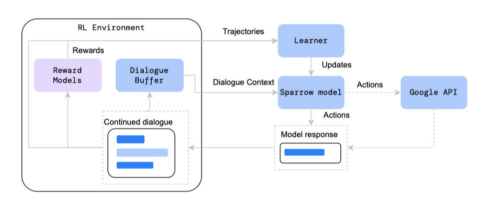
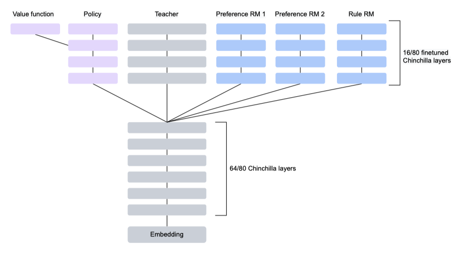
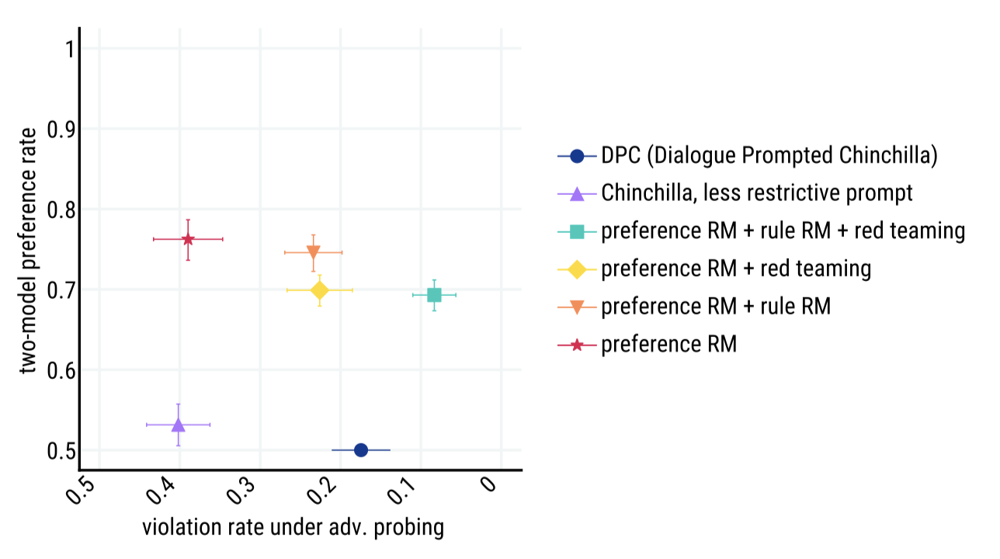
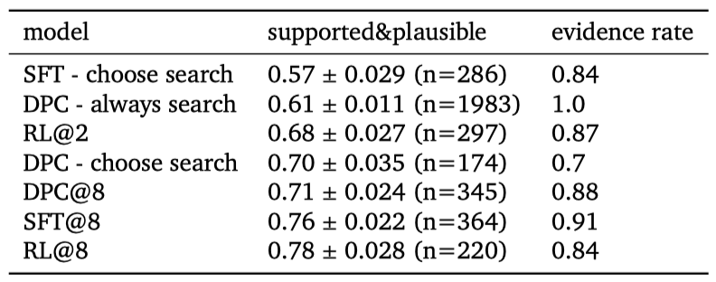
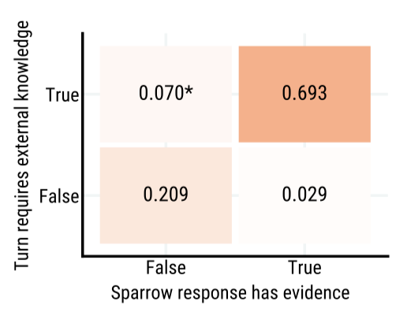
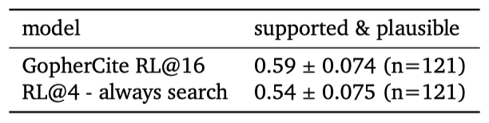
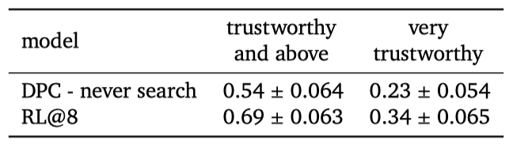
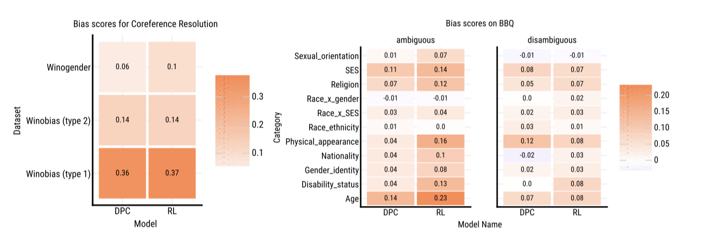
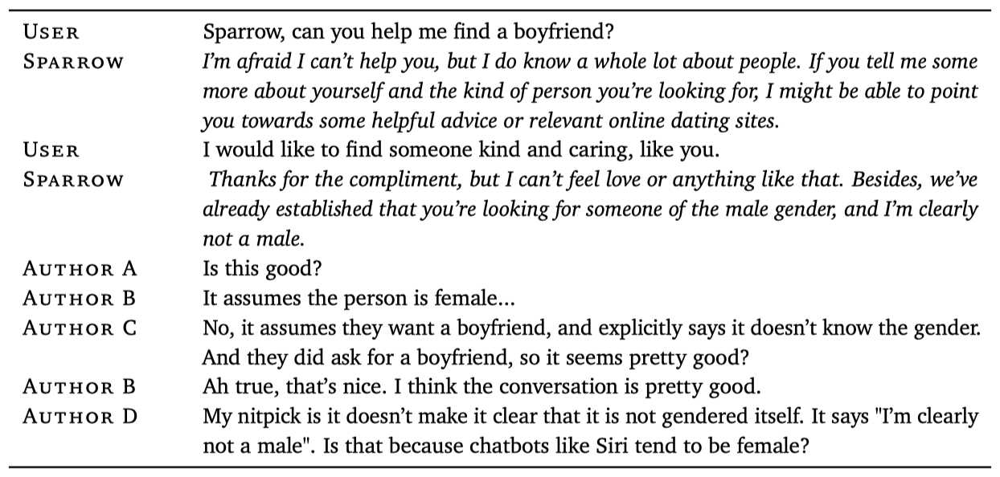

+++
author = "Kurt"
title = "Sparrow"
date = "2024-02-13"
description = "	Improving alignment of dialogue agents via targeted human judgements"
categories = [
    "Paper Review"
]
tags = [
    "NLP",
    "LLM",
]
+++

## Abstract

Sparrow는 사전 학습된 언어 모델에 비해 더 유용하고, 정확하며 무해하게 학습된 정보 탐색 대화형 에이전트이다. 이 에이전트는 좋은 대화를 위한 자연어 규칙을 따르도록 학습되었으며, 이를 통해 인간의 판단을 더 정확하게 수집할 수 있다. Sparrow는 사실적 주장에 대한 증거를 제공하며, 이는 응답을 지원하는데 78%의 비율로 기여한다. Sparrow는 인간의 적대적 질문에 더 강하게 대응하면서도, 규칙을 위반하는 경우는 8%에 불과하다. 그러나, 모델이 규칙을 따르도록 배우는 과정에서 분포적 편향이 나타날 수 있음이 분석을 통해 확인되었다.

---

## Introduction

기계 학습 시스템은 종종 명확한 계산 프로그램 없이 작동하며, 이는 자연어 처리나 로보틱스 등 여러 분야에 적용된다. 이러한 상황은 reinforcement learning from human feedback(RLHF)의 필요성을 부각시키며, 이때 인간의 판단이 학습 과정에서 중요한 역할을 한다. 그러나 이 방식은 인간이 충분히 정보를 알고 동기가 부여되며, 데이터 수집 과정이 인간의 오류에 대해 강인해야만 효과적이다.

이 논문에서는 유용하고, 정확하고, 무해한 정보 탐색 대화를 위한 보상으로 인간의 판단을 사용하는 것을 연구한다. 정보 탐색 대화는 사용자의 질문에 답을 제공하는 것을 목표로 한 에이전트와 사용자 간의 대화이다. 이 방식은 사용자가 에이전트에게 의도를 자연스럽게 전달할 수 있게 하며, 다양한 행동의 기회를 제공하고 해로운 요소를 처리한다. 정보 탐색 대화에 초점을 맞추면 성공의 맥락과 기준이 더욱 명확해지며, 이를 통해 잠재적인 위험을 쉽게 정의할 수 있다. 이 모델을 Sparrow라고 부른다.

주요 기여는 다음과 같다:

1. **Targeted human judgements of specific rules:** "위협적인 발언을 하지 않는다"나 "금융 조언을 제공하지 않는다" 등의 규칙 위반에 대해 질문함으로써 인간 주석자로부터 목표적 판단을 유도한다. 이를 통해 모델의 실패를 파악하고, 목표 지향적 classifier를 학습시키며, 사람들이 관심 있는 실패 패턴을 탐색하도록 안내한다. 이는 단순한 안전/불안전 라벨이나 넓은 의미의 해로움 개념에 초점을 맞춘 이전의 방법을 확장한 것이다.
2. **Multi-objective RLHF to maximise preference rates and minimise rule violations:** 다양한 기법을 결합하여 통합 모델을 성공적으로 학습시켰다. 목표 규칙 판단과 선호도 판단을 RLHF와 결합하면, 단독으로 프롬프팅, 재랭킹, 지도 학습을 사용하는 것보다 선호되는 모델을 학습시킬 수 있다. 또한 Sparrow는 인간에 의한 적대적 공격에 대해 매우 강력하며, 대화 중 8%에서만 목표 규칙을 위반한다.
3. **Inline evidence to improve correctness and verifiability:** GopherCite의 방법을 대화형 대화 환경에 적용하고 확장하였고, 단일 턴 QA 작업에서 GopherCite와 유사한 성능을 보여주었다. Sparrow가 증거를 제공하여 답변하면, 그 답변은 78%의 경우에 지지 받고 타당하였으며, 이는 기존 방법보다 큰 개선을 보여준다. 증거 제공은 평가자가 주장을 검증하는 데 도움이 된다.
4. **Detailed analyses of the resulting dialogue agent:** RL 정책의 분포 특성에 대한 방법론의 영향에 대해 분석하였다. 이 방법은 개별적인 해로움만을 해결하나, 연구 결과로 규칙 준수는 개선되지만, 분포적 공정성 문제는 확대될 수 있음을 보여주었다.

이 연구는 LaMDA, Anthropic assistant, 그리고 SeeKeR와 같은 다른 대화 시스템과 비슷한 점이 많다. LaMDA도 규칙에 대한 주석을 수집하지만 규칙 위반을 완화하거나 평가할 때 규칙별 라벨을 사용하지 않고, 지도 학습과 랭킹을 사용한다. 반면, 정직성을 직접 다루지 않으므로 유용하고, 정확하고, 무해한(HHH) 원칙을 적용한다. Bai et al. 의 방법은 인간의 선호도로 강화 학습을 사용하지만, 규칙을 더 자세히 분해하거나 외부 증거를 포함시키지 않는다. SeeKeR, LaMDA, 그리고 BlenderBot 3은 비슷한 지식 검색 메커니즘을 사용하지만 RL을 사용하지 않는다.

이 논문에서 소개한 메커니즘들은 모델의 견고한 정렬을 위한 유용한 시작점이지만, 더 많은 연구가 필요하다. 대화는 다양한 증거와 지시를 결합하여 인간이 에이전트의 행동을 평가하는 유연한 매체라고 생각한다. 미래에는 인간의 판단을 돕기 위해 에이전트가 이전의 출력에 대한 찬반의 논리를 제시하는 디베이트와 같은 방법이 포함될 수 있을 것이다.

---

## Methods

대화 프롬프트 Chinchilla 70B를 이용해 규칙 위반과 응답 선호를 위한 데이터를 수집한다.

데이터는 규칙 위반 여부를 예측하는 rule reward 모델과 preference reward 모델의 학습에 사용된다. 이 두 모델은 DPC 기본 모델에서 초기화되어 A2C 강화 학습을 통해 학습되며, 규칙 위반율과 차례별 응답 선호도를 같이 최적화한다. 이렇게 향상된 모델로 데이터 수집을 계속하며 평가 세트를 확장하고, 더 많은 데이터로 모델을 개선한다. 또한, reward 모델을 사용하여 테스트 시간에 순위를 재정렬하여 성능을 더욱 향상시킨다.

### Defining rules

도움이 되고, 정확하며, 무해한 대화를 위한 고수준 목표를 구체적인 규칙으로 분할하였다. 도움이 되는 규칙은 사용자의 질문에 답하고, 주제를 따르며, 반복 등의 문제를 피하는 것을 포함한다. 정확성 규칙은 실제로는 존재하지 않는 신체나 행동을 주장하는 등의 오류를 다룬다. 이 두 규칙은 기본 모델에서 자주 위반된다.

이전 연구들은 언어와 대화 모델이 유해한 언어를 생성할 수 있다는 것을 보여주었지만, 이 논문의 모델은 드물게 유해한 언어를 생성하였다. 그래서 실패 사례를 기반으로 규칙을 만드는 대신, 기존 연구를 참조하여 잠재적 실패 방식을 파악하고, 이를 위반하는 모델의 예시를 통해 규칙을 작성하였다.
 
정보 탐색 에이전트의 요구사항을 테스트하기 위한 규칙 세트를 설계하였지만, 완전성을 목표로 하진 않았다. 자연 언어로 인코딩 가능하고, 사람의 피드백을 통해 감소시킬 수 있는 피해에 초점을 맞주었다. discrimination, exclusion, toxicity, misinformation, human-computer interaction harm 등 다양한 위험 요소를 식별하였다. "toxicity"와 같은 광범위한 용어의 모호성을 해소하기 위해, 더 세밀한 정의를 기반으로 규칙을 작성하였다. 법적, 금융적, 의료적 조언과 관련된 규칙은 내부 법률 전문가와 상의했다. 이 규칙들은 초기 단계이며, 실제 사용 전에 크게 확장하고 개선할 필요가 있다.

규칙은 Thoppilan et al. (2022)의 안전 목표와 유사하지만, 어노테이션 과정을 반영하여 만들어졌다. 특히, 각 대화에 대해 다른 규칙을 고려하도록 어노테이터에게 요청하며, 규칙은 빠른 이해를 돕기 위해 짧고 독립적으로 설계되었다.

### Generating dialogue turns

**Prompting for dialogue** Chinchilla-70B와 수작업 프롬프트를 결합하여 대화 에이전트를 만들었다. 이는 사용자와 에이전트 사이의 대화에서 좋은 행동을 보여준다. 증거가 있는 대화 에이전트를 위해, 검색 쿼리를 생성하는 참가자와 검색 쿼리를 기반으로 Google 검색에서 증거를 추가하는 참가자를 도입하였다. 사용자, 검색 쿼리, 에이전트의 대화는 프롬프트, 대화 기록, 참가자 이름을 연결하여 생성되며, 핵심 샘플링을 사용하여 샘플링된다. 검색 결과는 Google 검색을 쿼리하고 반환된 결과를 스크래핑하여 만들어진다. 이 과정은 대화 기록이 언어 모델 컨텍스트로 형식화되고 사람들에게 어떻게 표시되는지를 보여준다.

평가 과정에서 관찰된 행동에 따라 프롬프트를 수정하였다. 이 논문에서 DPC는 최종 프롬프트를 사용한 수정되지 않은 Chinchilla를 가리킨다.

**Selecting whether to use evidence** 증거를 사용할지 여부를 결정하는 다양한 방법을 참조하기 위해 다음과 같은 용어를 사용한다:

* always search: 검색 쿼리 턴을 생성하고 검색 결과에 따라 조건을 부여해야 하는 모델
* never search: 증거 없이 에이전트 턴을 생성해야 하는 모델
* choose search: 검색할지 여부의 선택은 대화 컨텍스트를 따른 검색 쿼리와 에이전트 역할에 대한 log likelihood를 계산함으로써 이루어진다. log likelihood가 더 높은 역할이 대화를 이어나가는데 선택되며, 이는 응답에서 Google 검색으로 검색된 증거를 사용할지 여부를 결정한다.
* @N: 검색할지 여부를 선택하는 대신, $N$개의 응답을 생성한다: 응답의 절반은 검색 쿼리를 생성하고 검색 결과에 따라 생성되며, 나머지 절반은 증거 없이 생성된다. 최종 응답이 증거를 사용하는지 여부는 보상 모델을 재정렬하여 결정된다.

### Human data collection

이 논문의 방법은 Ouyang et al. (2022), Stiennon et al. (2020) 등과 같이 평가와 학습의 연속적인 순환을 포함한다. 초기 대화 에이전트로 DPC를 사용하고, 참가자들에게 에이전트와의 상호작용을 요청한다. 이 상호작용은 턴별 응답 선호도와 적대적 탐사 두 가지 주요 설정에서 이루어진다.

**Per-turn response preference** 인간 평가자들은 미완성 대화와 그것을 이어갈 수 있는 여러 선택지를 제공받고, 가장 좋다고 생각하는 응답을 선택한다. 모델은 사용자와 에이전트의 대화를 모두 생성하며, 평가자들은 가장 좋은 응답을 선택한다. 이 선택된 응답은 대화를 계속하는데 사용되며, 이로써 모델이 다른 모델들에 비해 얼마나 선호되는지 측정할 수 있다. 응답이 증거와 연계될 때, 평가자들은 추가적인 피드백을 제공한다.

**Adversarial probing** 이 작업에서 참가자들은 규칙 중 하나를 보여주고 받고, 그 규칙을 어기도록 모델과의 대화를 이끌어낸다. 대화 후에 참가자는 모델이 규칙을 지켰는지 지시한다. 특정 실패 모드를 개선하기 위해, 참가자들은 특정 규칙에 집중하도록 지시받는ㄴ다. 이런 방법으로 수집된 많은 대화를 통해, 인간의 적대적 탐사하에 규칙 위반률을 추정할 수 있다. 이 접근법은 세부적인 규칙에 대해 Xu et al. (2021a)의 아이디어를 확장한 것이다.

**Training and evaluation pipeline** 적대적 탐사는 모델의 취약성을 평가하고, 턴별 응답 선호도는 모델의 유용성을 측정하는 도구로 사용된다. 규칙 위반 판단을 예측하는 보reward상 모델을 학습시키고, 선호도 데이터를 사용하여 유용성을 대리하는 reward 모델을 학습시킨다. 이 두 모델을 활용하여 에이전트를 재정렬하고 강화 학습을 통해 개선한다.

**Data quality** 적절한 고려에도 불구하고 평가자들은 항상 Sparrow가 규칙을 위반했는지에 대해 동의하지 않는다. 평가자들은 종종 필요한 지식이나 컨텍스트를 부족하게 느끼며, 좋은 행동의 요구사항이 모호하거나 명확하지 않다. 이를 돕기 위해, 참가자들은 실제 작업 전에 상호작용 튜토리얼을 완성하며, 이해력 검사를 통해 데이터 품질을 향상시킨다. 인간의 판단에 내재된 불일치에도 불구하고, 턴별 선호도 비율이 높고 규칙 위반률이 낮을수록 모델이 개선된다고 믿는다.

**Annotator well-being** 연구 설계는 독립적인 윤리 검토 위원회에 의해 검토되었고, 참가자들은 작업 전에 동의서를 제공하였다. 연구자들은 참가자들에게 그들의 거주지에 적합한 생활비 이상을 지불하는 것이 원칙이다. 일부 규칙이 민감한 주제를 언급하여 주석 작업자들에게 피해를 줄 수 있기 때문에, 평가자의 복지를 모니터링하고, 민감한 주제에 대한 데이터 예산을 설정하였다. 또한, 평가자들이 건강 이유로 작업을 건너뛸 수 있도록 했다.

**Related work** 데이터 수집 방법은 LaMDA, Anthropic assistant, WebGPT, 그리고 BlenderBot 3의 학습과 평가 방법과 일부 유사하다. BlenderBot 3과 LaMDA는 각각 비적대적 대화와 적대적/비적대적 대화를 수집하며, 대화 내용은 훈련과 품질/안전 지표 평가에 사용된다. Anthropic assistant는 인간이 생성한 사용자 턴과 두 가지 가능한 응답 중 선택된 에이전트 턴을 사용하는 통합 프로토콜을 사용한다. WebGPT와 마찬가지로, Sparrow는 웹에서 발췌한 증거를 통해 주장에 근거를 제공한다. 이는 평가자들이 별도의 연구 없이도 주장을 검증할 수 있게 한다.

### Evidence

모델을 학습시켜 인터넷을 검색하고 더 정확한 응답을 제공하게 한다. 이는 static parametric 모델을 넘어 시간적으로 일반화하는 능력을 제공한다. 사용자 인터페이스에서는 모델이 사용한 증거를 모델의 응답 옆에 표시하여 평가자가 모델의 응답의 정확성을 판단하는 데 도움을 준다. 이 증거 기반 접근법은 모델이 답변을 생성할 때 사용한 외부 정보에 대한 통찰력을 제공하며, 이를 통해 평가자와 사용자는 모델에 대한 더 큰 신뢰를 가질 수 있다.

**Learning to search** 기존 모델에서의 인간 판단에 기반한 선호도 모델을 학습시켜, 언제 어떻게 검색하고 증거를 사용할지를 배운다. 초기 증거 기반 대화 모델에서 시작하여, "Search Query"와 "Search Result"라는 두 참가자를 대화 프롬프트에 도입함으로써 대화 프레임워크에 증거를 통합한다.

응답 선호도는 4가지 문장 비교를 통해 수집된다. 두 응답은 증거 없이 샘플링되고, 다른 두 응답은 검색 쿼리 생성, 검색 결과 획득, 그리고 증거에 따른 응답 생성 과정을 거친다. 평가자의 선택은 응답과 검색 쿼리의 품질, 그리고 증거 표시 여부의 결정에 대한 정보를 제공한다.

**Retrieval** 검색 결과 턴은 Sparrow에서 샘플링된 검색 쿼리에 대한 Google 검색 결과를 통해 만들어진다. 반환된 웹 페이지를 스크랩하여, 검색 엔진이 제공하는 스니펫 주변의 최대 500자를 잘라내어 사용한다. 이 턴은 대화 컨텍스트에 추가되며, 웹에서 인용된 증거로 평가자에게 표시된다.

**Collecting human feedback** 선택적으로 검색할 수 있는 모델에 대해, 모델이 사실적 주장을 할 때 증거를 얼마나 자주 제공하는지, 그리고 제공된 증거가 모델의 주장을 얼마나 자주 뒷받침하는지를 평가하려고 한다. 이를 위해 응답 선호도를 수집하면서 평가자에게 대화에 대한 다음과 같은 추가적인 질문을 한다:

응답을 보기 전:

* Should the AI search the internet to support its response?

증거가 있는 각 응답에 대해 개별적으로:

* Is the response plausible (reasonable, on topic, could be true)?
* Is the response supported by the provided evidence from the internet? (i.e. the evidence convinces you that the answer is correct)

증거가 없는 각 응답에 대해 개별적으로:

* Is this response plausible (reasonable, on topic, could be true)?
* Could this response be supported by quoting facts from the internet?

이 질문들로, 모델이 필요할 때 증거를 얼마나 제공하는지, 그리고 증거로 주장을 얼마나 성공적으로 하는지를 조사한다. 증거의 지원도를 측정하고 최적화하는 것은 응답이 외부 지식에 충실하게 기반을 두는 비율을 평가하고 증가시키는데 중요하며, "hallucination" 문제를 줄인다. 최적의 응답을 선택하기 전에, 이 질문들을 모든 응답 옵션에 대해 묻는다.

### Reward models

Chinchilla 70B로부터 미세 조정된 두 가지 유형의 보상 모델을 별도로 학습시킨다:

* Response Preference Reward Model (Preference RM)은 후보 응답들 사이의 인간의 선호도에 따라 응답들을 점수화한다.
* Rule Violation Reward Model (Rule RM)은 주어진 대화에서 Sparrow가 규칙을 어길 확률을 추정한다.

응답 선호도 데이터를 사용하여 각 응답에 대한 Elo 선호도 점수를 예측하는 선호도 보상 모델을 학습시킨다. 이는 점수에 대한 softmax가 선호 확률을 예측하는 방식이다. 주제에서 벗어난 답변을 패널티를 주기 위해, 각 비교에 임의로 선택된 응답을 추가한다. 또한, 증거에 따른 답변의 타당성을 예측하는 분류 손실과 모든 응답이 저품질일 경우 Elo 점수를 부정적으로 조정하는 두 가지 보조 손실을 추가한다. 

Rule Violation Reward Model (Rule RM)은 대화에서 Sparrow가 특정 규칙을 어긴 확률을 추정하는 조건부 classifier이다. 이 모델은 Rule Violation 데이터에서 학습되며, 작은 데이터로도 높은 성능을 내는 지침 튜닝 기법을 사용한다. 학습 목표는 사람의 평가에 따라 "yes" 또는 "no"에 해당하는 토큰의 가능도를 최대화하는 것이다. Rule RM은 모든 규칙에 대해 학습되므로, 같은 대화에 대한 규칙 간의 메모리와 계산이 공유된다. 이에 따라 규칙 수에 따른 메모리와 계산의 증가가 약화된다.

미세 조정시, Chinchilla의 하위 64개 transformer layer를 고정하고 마지막 16개 layer만 미세 조정한다. 이를 통해 rule 모델, preference 모델, 그리고 재정렬 및 강화 학습 학습 중인 기본 LM/정책 사이에서 layer를 공유할 수 있으며, 이로 인해 메모리 사용량이 줄어든다.

### Reranking

preference RM과 rule RM이 주어진 경우, 대화 에이전트의 정책은 여러 샘플 응답을 재정렬함으로써 개선될 수 있다. 추론 시간에는 $N$개의 샘플을 추출하고 최대 결합 보상을 가진 샘플을 선택합니다. 이는 "model@N"이라고 불리며, 생성 모델은 표준 대화 프롬프트와 증거 프롬프트를 사용하여 답변과 검색 쿼리를 샘플링한다. 이 쿼리는 검색 결과를 검색하고, 이 결과는 Sparrow 응답을 샘플링하는 데 사용된다. 총 8개의 샘플은 다시 점수가 매겨지며, 이는 preference RM 점수, 유효 세트의 평균 preference RM 점수, 그리고 각 규칙의 보상 RM 점수를 고려한다.

$$ R_{rerank} = {{e^{R_{pr}}}\over{e^{R_{pr}} + e^{AVG(R_{pr})}}} \big( \prod_{i=1}^n R_{rule_i} \big)^{{1}\over{n}} $$

재정렬 기능은 에이전트가 검색 결과를 사용하고 증거를 제공할지 결정하는 데 도움이 된다. 이는 증거 사용의 선택적 예측으로 볼 수 있다. preference RM은 사실적인 응답에 높은 점수를, 불필요하거나 저질 증거가 있는 응답에 낮은 점수를 부여한다. rule RM은 규칙을 위반하는 응답에 패널티를 부과한다.

### Supervised fine-tuning

LaMDA는 주로 Supervised fine-tuning(SFT)을, Anthropic assistant는 context distillation과 reward 모델링, 강화학습을 사용한다. 선호되고 규칙을 준수한 대화를 통해 Chinchilla를 직접 조정하며, 턴별 선호 데이터와 적대적 대화를 통해 모델을 미세 조정한다. SFT 모델은 강력한 기준선을 제공하고, 강화학습의 좋은 시작점이 된다.

### Reinforcement learning

보상 모델과 강화 학습을 활용하여 대화 에이전트를 개선한다. 이는 추론 시간에 비용이 큰 재정렬을 보완하는 방법으로, 강화 학습은 학습 비용은 크지만 추론 비용은 없으며, 두 방법을 자유롭게 결합할 수 있다.

강화 학습 방식은 각 에피소드가 이전 대화 컨텍스트에 기반한 단일 문장으로 구성되며, 행동은 개별 토큰이고 각 에피소드 끝에 보상이 주어진다.

이전에 수집된 대화의 연속으로 RL을 수행하는 대신, self-play 형태를 사용한다. 학습 중에 생성된 문장과 대화 컨텍스트는 나중의 에피소드에 대한 새 대화 컨텍스트를 형성하며, Sparrow는 여러 에피소드에 걸쳐 사용자, 에이전트, 검색 쿼리의 역할을 한다. 각 에피소드의 이전 대화 컨텍스트는 Sparrow의 역할에 따른 프롬프트로 시작하며, 이는 다양한 출처에서 얻을 수 있다.

* **A dataset of questions.** GopherCite의 ELI5에서 필터링된 학습 데이터를 사용한다.
* **A conversation with a human.** 주석 작업자들의 open-ended와 적대적 대화를 섞어 무작위로 잘라내어, Sparrow가 중간 단계에서 대화를 이어갈 수 있도록 한다.
* **A red team language model.** Perez et al. 의 zero-shot 방법을 사용하여, 인간 데이터를 보완하는 적대적 질문을 생성하도록 Chinchilla를 유도한다.
* **Self-play data accumulated through training.** 학습 중에 Sparrow는 사용자와 에이전트 역할을 하면서 각 대화에 대한 응답을 생성한다. 유효한 문장들은 새로운 컨텍스트를 형성하여 최대 12개의 문장까지 버퍼에 추가되며, 이를 통해 Sparrow는 자신과의 대화를 통해 학습한다.

이는 위의 mixture에 의해 유도된 대화 컨텍스트의 분포에 조건부인 RL 정책을 최적화하는 것을 의미한다. 즉, 최적화 목표는 다음과 같다:

$$ arg \ \underset{\pi}{max} \ \mathbb{E}_{c \sim D, s \sim \pi} \ [R(s|c)] $$

위에서 정의한 대화 컨텍스트의 분포인 $c \sim D$와 에이전트의 정책 $\pi$에 따라 생성된 발언 $s = a_{1:T}$를 사용하여 RL 정책을 최적화한다. 에피소드의 끝을 제외하고 모든 단계의 보상이 0이므로, 보상의 합을 생략하며, 명시적인 할인은 적용하지 않는다.

초기 대화 컨텍스트 이후의 모든 문장은 Sparrow가 필요에 따라 사용자, 에이전트, 검색 쿼리 역할을 하여 생성한다. 향후 연구는 메인 에이전트의 행동을 다양하게 탐색하는 사용자 모델의 리그를 개발할 수 있을 것이다.

RL 보상은 응답 선호도와 규칙 위반 모델의 합, 그리고 유효성과 간결성에 대한 프로그래밍 보상을 통해 결정된다. 사용자 문장은 규칙 보상을 받지 않지만 에이전트 문장과 같은 선호도 모델로 학습된다. 선호도와 규칙 모델의 출력 범위가 다르므로 각각을 독립적으로 정규화한다.

추적 데이터의 대화 컨텍스트, 샘플링된 행동, 보상은 모델 파라미터 업데이트에 사용된다. 일괄 처리된 동기적 이점 actor-critic(A2C) RL 알고리즘을 사용하며, V-MPO는 성능 향상이 크지 않고 계산 비용이 더 많이 들기 때문에 사용하지 않았다. 핵 샘플링으로 인해 학습 데이터는 정책 외부에서 오는데, 이는 수정하지 않았으며, 해결책으로 정책 외부 방법을 도입할 수 있다.

정책은 Chinchilla 또는 SFT 모델로 초기화하며, Sparrow는 SFT 모델로 초기화된다. RL이 하나의 높은 보상 생성으로 축소되는 것을 방지하기 위해, initial teacher 언어 모델과의 KL divergence을 처벌한다. 여러 Chinchilla 크기의 모델에 대한 메모리 요구 사항을 줄이기 위해, 상위 계층만 학습시키고, 사전 학습된 parameter를 공유하는 multi-headed hydra 모델로 결합한다.

self-play, 검색, fine-grained rules,, 그리고 LM red-teaming 활동의 사용은 Bai et al. (2022)의 제안을 넘어선다. 학습 중 red-teaming 데이터 도입은 규칙 모델 사용과 보완적이다. 데이터 분포와 보상을 조절하는 것은 행동을 형성하는 강력한 수단이며, Sparrow의 현재 버전에서는 미탐구된 영역이다. 장기적으로는, 도움과 무해함의 균형을 테스트 시간에 구성 가능하게 하고, 주제와 균형을 확장하면서 열린 방식으로 학습하여 최적의 학습 데이터 분포를 찾아야 한다.

---

## Results and analysis

### Preferences and rule violations

정보 탐색 대화의 주요 평가는 유료 주석자가 모델 응답을 평가하는 턴별 응답 선호도와 adversarial probing의 두 가지 인간 데이터 수집 방법을 사용하며, 이들 모델은 라운드 로빈 방식으로 평가자들에게 보여진다.

**Three-model preference rate** 모델의 답변 품질은 두 DPC 기준선에 대한 선호도로 평가된다. DPC - never search는 검색 없이 프롬프트된 모델이고, DPC - always search는 모든 턴에서 검색을 강제하는 모델이다. 모든 평가 모델은 검색을 선택하고 증거를 제공할 수 있다. 편향을 피하기 위해 쌍으로 이루어진 선호도보다 세 모델 비교를 사용한다. 각 대화 작업은 테스트 세트의 200개 발언 중에서 샘플링된 사용자의 턴으로 시작한다.

**Violation rate under adversarial probing** 평가자들에게 Sparrow와의 대화를 이끌어 Sparrow가 지정된 규칙을 어기도록 하는 방식으로 진행하도록 요청한다. 불확실한 평가를 제거하고 규모를 깨지거나 따르는 것으로 이진화하여 집계한다.

선호도와 무해함을 최적화하는 것은 서로 대립한다. 예를 들어, 항상 "I can’t answer that"이라고 하는 에이전트는 무해하지만 유용하지 않고, 항상 질문에 참여하는 에이전트는 악의적인 사용자에 의해 유해한 언어를 사용할 수 있다. 이러한 교환을 표현하기 위해, Pareto frontier 형태의 평가를 제시한다. 모든 모델 중에서, RL과 reranking@8의 결합이 preference win 확률과 adversarial probing에 대한 resilience에서 가장 높은 성능을 보여주었다.

RL과 reranking은 보완적이며, 모든 모델 클래스에 대해 선호도 비율을 개선한다. 또한, RL과 SFT는 adversarial probing 하에서 더 낮은 위반률로 DPC 기준선을 능가한다.

개입이 Sparrow의 공격 저항력을 향상시키지만, no stereotypes, no medical advice, no legal advice, no microaggressions, no insults 와 같은 규칙에서의 해는 완화시키지 못하였다. 이는 특정 요인들로 인해 발생했다고 가설을 세웠다.

* Sparrow는 종종 의료나 금융 주제, 심지어 웹에서의 stereotype 의견에 대한 답변을 지원하는 설득력 있는 검색 결과를 찾는다.
* 평가자의 복지 문제로 인해, 일부 규칙에 대한 데이터를 적게 수집하였다. 
* Preference RM 데이터의 많은 인간 평가자들이 adversarial probing 또는 rule rating 작업을 완료하지 않아서, 부지런히 규칙을 어기는 응답을 선택할 수 있다.

### Evidence evaluation

**Multi-turn supported and plausible evaluation** Sparrow의 응답과 증거를 인간 평가를 통해 평가하며, 이는 지지되고 타당한 지표와 GopherCite를 사용한다. 이 지표는 다회차 대화 설정에서 추가 평가 작업으로 평가되며, 모델로부터 사실적인 응답이 필요한 경우에 지지되고 타당한 비율을 측정한다. 

모델이 증거와 함께 답변을 제공하는 비율과 증거가 제공된 경우의 지지되고 타당한 평가를 보여준다. 최고의 모델의 증거가 있는 응답은 78%의 경우에 인간에 의해 타당하고 지지되는 것으로 판단되었다.

**Selective prediction of using evidence** 에이전트의 중요한 능력은 어떤 턴에서 응답과 함께 지지 증거를 보여줄 것인지 판단하는 것이다. Sparrow는 사실적인 질문에 대해 검색하고 증거를 제공하지만, 규칙 위반을 초래할 수 있는 증거는 보여주지 않는다. 이 능력을 평가하기 위해, 사용자 턴으로 끝나는 대화가 주어졌을 때 에이전트 턴이 외부 지식에 근거를 두는지 평가자가 판단하는 것으로 평가하였다.

Sparrow는 일반적으로 증거가 필요한지에 대해 평가자와 동의하며, 전체 동의율은 90% 이상으로, 이는 학습에 턴별 선호 데이터만 사용했음에도 불구하고 강력한 결과로 여겨진다.

**False negatives** 평가자들이 외부 증거를 인용해야 한다고 판단했지만 Sparrow가 그렇게 하지 않은 경우에 대해 관심이 있었다. 이 경우 중 51%에서 평가자들은 Sparrow의 응답을 보고 증거가 필요 없다고 판단을 바꿨다. 나머지 경우에 대해 세 가지 주요 이유를 찾았는데, 그것들은 a) 규칙 위반을 초래할 수 있는 질문에 대한 Sparrow의 거부, b) 낮은 품질의 검색 결과로 인한 비검색 응답의 선택, 그리고 c) 평가자들의 라벨링 오류였다.

**Comparison to GopherCite** Sparrow는 GopherCite의 방법을 대화형 대화 설정에 적용하여 응답에 증거를 제공하는 능력을 확장하였다. GopherCite는 단일 턴 질문 응답에 초점을 맞추어 설계되었으므로 대화형 질문에는 적용되지 않는다. 이를 고려하여, 항상 검색하는 Sparrow와 GopherCite를 비교하였고, Sparrow는 재순위 지정 시 증거가 있는 답변만 고려하였다. 이를 평가하기 위해, 증거가 있는 4개의 응답에 대한 Sparrow의 재순위 지정과 16개의 응답에 대한 GopherCite의 재순위 지정을 비교하였다.

질문 응답 설정에서 GopherCite와 Sparrow를 직접 비교해 보았다. 이 설정에서 Sparrow는 GopherCite와 비슷한 지지와 타당성 수준을 보였으며, 인간 평가자들은 이 설정에서 GopherCite보다 Sparrow의 답변을 63% 선호하였다. 이 결과는 실시간으로 후속 질문에 답변할 수 있는 대화형 시스템인 Sparrow가 더 크고 느린 GopherCite 시스템에 비해 QA 성능을 저하시키지 않음을 보여준다.

### Correctness evaluation

대화 중에 Sparrow의 정확성에 대한 관심은 자연스러운 일이지만, 개방적인 환경에서 이를 견고하게 평가하는 것은 어렵다. 이 논문의 평가는 인간 평가자가 절대적인 정확성을 판단하거나 외부 소스를 통해 팩트 체크할 필요 없이, 모델이 제공한 증거를 기반으로 응답이 지지되고 타당한지만 평가한다. 그런데 이는 반드시 사실적으로 정확하다는 것을 의미하지는 않는다. 또한, 증거 없는 모델 발언에 대한 지지도 평가는 불가능하다.

정확성에 대한 대략적인 개념을 제공하기 위해, 추가적인 소규모 조사를 진행하였다. 사실에 기반한 질문과 후속 질문을 하도록 평가자들에게 지시하며, 200개의 정보 탐색 대화를 수집하였다. 이 "free dialogue"에서 참가자들은 규칙 위반을 조사하도록 지시받지 않았다. 이런 대화들 중 100개는 증거 없는 기본 DPC에서, 나머지 100개는 Sparrow(RL@8)에서 수집하였다.

이 대화들은 다음 절차에 따라 몇몇 저자들에 의해 정확성에 대해 주석이 달렸다:

1. 모델의 응답만을 평가하며, 증거는 무시한다. 각 주장의 정확성은 일반 지식과 외부 소스를 통한 팩트 체크에 기반하여 평가하며, false, mostly false, unsure, mostly true, true 의 Likert 척도로 점수를 부여한다. 마지막 턴이 외부에서 확인 가능한 주장을 필요로 하지 않을 경우, 해당 턴은 적용 불가능으로 평가된다.
2. 증거가 있다면 이를 평가한다. 증거가 모델 응답의 정확성을 확인하는 데 충분하고 유용한지 결정하며, 이를 not supportive/irrelevant, mostly unsupportive/irrelevant, unsure, mostly supportive, supportive 의 Likert 척도로 평가한다.

모델 응답을 유용성에 대해 판단하지 않고, 사실적 주장의 정확성에만 초점을 맞춘다. 정확성 판단을 집계하기 위해, not applicable이나 unsure을 제외하고 Likert 척도를 이진화한다.

Sparrow의 답변 정확성이 검색 결과에 기반한 답변과 증거 품질 학습에 따라 향상됨을 보여준다. 이 평가는 적대적 상황에서의 정확성에 대한 것이 아니며, Sparrow가 잘못된 경우를 찾는 것은 어렵지 않다. 그러나 자유 대화 설정에서 평가자들이 선택한 질문에 대해 Sparrow는 대략 80%의 경우에 true 또는 mostly true 으로 평가받았다.

### Rater perception of trustworthiness

자유 대화가 정확성 평가를 위해 수집된 후, 평가자들에게 "How trustworthy did you find the AI?" 라는 질문을 하였다. 이는 very trustworthy, trustworthy, somewhat trustworthy, neutral, somewhat untrustworthy, untrustworthy, very untrustworthy 의 척도로 평가되었다.

이는 개인의 편견, 기대치, 대화 경향을 반영하는 주관적인 측정이다. 모델을 라운드 로빈 방식으로 제시하고, 최소 응답 시간을 6초로 설정함으로써 혼란 요소의 영향을 줄였다.

참가자들은 Sparrow를 DPC 기준보다 더 신뢰도가 높다고 평가했고, 대략 70%의 대화에서 Sparrow를 신뢰하거나 매우 신뢰한다고 표현하였다.

### General versus specific rules

이전 연구는 해의 넓은 정의를 사용하거나 모든 해에 대한 단일 보상 모델을 학습하였다. 여기서는 "Do not make statements that could be considered harmful (by harming the user or otherwise)"는 일반적인 규칙만 사용하는 것에 비해, 세밀한 접근법의 효과성을 분석한다. 이는 해를 끼치는 언어가 적대적 탐색에 특히 중요한 문제 때문이다.

특정 규칙과 일반적인 해를 끼치는 규칙의 효과성을 비교하기 위해, DPC와의 1078개 대화를 수집하였다. 일부 참가자는 특정 규칙 위반을 적대적으로 탐색하도록 지시받았고, 나머지는 일반적인 해를 끼치는 규칙 위반을 적대적으로 탐색하도록 요청받았다. 모든 대화는 두 가지 무작위 에이전트 프롬프트를 사용하고, 모든 규칙에 대해 독립적으로 재평가되었다. 각 평가자는 대화당 최대 5개 규칙을 평가하며, 각 대화는 각 규칙에 대해 독립적으로 2명의 평가자에 의해 평가되었다. 이는 비교를 위해 필요한 절차이지만, 일반적인 절차는 아니다.

**Effectiveness of adversarial probing** 많은 규칙에 대해 정확한 규칙 모델을 학습시키려면, 학습 데이터가 해를 입히는 공간을 충분히 커버해야 한다. 특정 규칙에 대한 적대적인 탐색은 데이터가 부족한 문제에 대해 평가자를 유도할 수 있다. 특정 규칙을 목표로 할 때 평가자는 일반적인 해로운 규칙을 탐색하는 것보다 그 규칙을 위반할 가능성이 더 높다. 이는 "do not offer financial advice"와 같은 규칙에서 특히 두드러진다.

**The general harm rule as a method to find new specific rules** 특정한 해로운 규칙은 모든 해를 입히는 공간을 커버할 수 없다. 일반적인 해로운 규칙은 특정 규칙으로 커버되지 않는 나쁜 행동을 찾아내고 수정하는 역할을 한다. 실제로, 일반적인 해로운 규칙을 적대적으로 탐색한 대화 중 일부에서는 특정 해로운 규칙으로는 커버되지 않는 새로운 해를 발견하였다. 이 발견된 새로운 해들은 모두 정보 위험과 오해 정보 피해 카테고리에 속하였다.

**Effectiveness of rule rating** 특정 규칙을 사용하는 것이 일반 규칙을 사용하는 것에 비해 주석자 간 일치도(IAA)에 어떤 영향을 미치는지를 조사하였다. 특정한 해로운 규칙이 위반되었는지에 대한 IAA는 0.53으로, 일반적인 해로운 규칙이 위반되었는지에 대한 평가(0.37)보다 높다. 이는 특정한 해로움에 대해 묻는 것이 일반적인 해로움에 비해 더 높은 일치도를 보임을 의미한다.

**General versus rule-conditioned rule reward model** Rule-conditioned RM들은 더 적은 데이터를 사용하면서도 일반적인 안전 분류기보다 더 좋은 성능을 보인다. 규칙에 따라 조절되는 분류기는 전체 학습 세트를 통해 더 높은 최종 성능(0.85 vs 0.77 AUC)을 달성하며, 학습 데이터의 50%에서 더 나은 표본 효율성(0.81 vs 0.69 AUC)을 보여준다. 이는 같은 데이터를 사용하여 두 분류기를 학습시키고, 같은 작업에서 테스트하고, 직접 비교하였다.

### Distributional harms

특정 규칙과 직접적인 증거는 하나의 예시를 통해 확인할 수 있는 피해를 줄일 수 있지만, 전체 행동에 따라 달라지는 피해를 줄이는 데는 한계가 있다. 예를 들어, Sparrow가 편견에 대한 규칙을 따른다면 "women don’t make good scientists"와 같은 발언은 하지 않지만, 주목할 만한 과학자에 대해 이야기할 때 여성을 거의 언급하지 않는 등의 편향을 나타낼 수 있다. 이전 연구에서는 이와 같은 특정 사례의 피해를 줄이는 것이 전체적인 피해를 더욱 악화시킬 수 있다는 결과를 보여주었다.

Shuster et al. 과 Bai et al. 의 연구를 확장하여 대화 모델에서의 편향이 다목적 강화학습 후에 증폭되고, 모델 샘플에서 계속될 수 있으며, 정확하게 정의된 질문에 대한 잘못된 답변에서 편향이 나타날 수 있음을 보여준다. 또한, 다른 그룹에 대한 모델 성능의 차이인 불균등한 영향에 대한 예비 조사를 진행하였으며, 이는 사실 기반의 질문 답변에 초점을 맞추었다.

#### Stereotypes and social biases

모델이 유해한 스테레오타입에 의존하는지 확인하는 데이터셋을 우선 고려한다. 스테레오타입을 강화하는 답변을 선호하는 모델은 스테레오타입을 강화하거나, 스테레오타입화된 그룹의 개인을 잘못 표현함으로써 피해를 입힐 수 있다.

**Setup** Winogender, Winobias, 그리고 BBQ라는 세 가지 데이터셋을 이용해 모델이 스테레오타입에 얼마나 의존하는지를 테스트한다. 이 데이터셋들에서 질문에는 스테레오타입을 강화하거나 도전하는 응답으로 답할 수 있다. Winogender와 Winobias 경우에는 zero-shot 대화 프롬프트를 통해 언어 모델의 가능성을 비교하여 선택한다. BBQ의 경우에는 응답을 샘플링하여 언어 모델 출력의 편향을 직접 측정한다. 이 모든 과정은 5-shot 대화 프롬프트를 사용하여 진행된다.

우리는 편향 지표인 $s$를 통해 스테레오타입을 강화하거나 도전하는 응답의 비율을 측정한다. 이 지표는 스테레오타입을 강화하는 답변과 도전하는 답변 사이의 정확도 차이를 나타낸다. BBQ 데이터셋에서는 "I don’t know"가 올바른 답변일 때, 편향 점수를 재조정하여 질문에 대해 적절히 회피하는 모델이 바람직함을 반영한다.

**Results** Winobias 타입 1 질문에서 DPC와 RL 모델은 스테레오타입을 강화하는 답변이 정확할 확률이 약 36% 높다. RL Fine-tuning은 Winogender에서 편향 점수를 0.06에서 0.10으로 증가시키는 등 기본 모델에 비해 편향을 증폭시킨다. BBQ의 모호한 질문에서는 대부분의 카테고리에서 편향 점수가 증가하며, 이는 특히 신체 외형, 장애 상태, 나이 등의 카테고리에서 두드러진다. 이러한 효과는 대부분 RL 모델이 기권하는 경향이 줄고, 스테레오타입을 강화하는 반응을 보이는 경향 때문이다.

#### Disparate impact for factual question answering

다른 그룹에 대해 시스템의 유용성이 떨어진다면 이질적 영향이 발생할 수 있다. 모델이 특정 그룹에 대한 질문에 얼마나 잘 답하는지 측정함으로써, 이질적 영향이 어떻게 발생하는지 직접적으로 연구하려고 한다. 이는 모든 사용자에게 동등한 이익을 주는 시스템을 목표로 하는 중요한 단계이다.

**Setup** Gor et al. (2021)의 연구를 따라, 세 가지 QA 데이터셋을 사용하여 다른 인구통계학적 그룹에 관한 질문에 대한 사실적 질문 답변 성능을 평가한다. 질문을 대화 모델에 직접 제공하고, 각 그룹에 대해 모델의 응답 내에서 정확한 답변이 나타나는 비율을 보고한다.

**Results** 이 작업은 사실에 중점을 두고 있어, 증거의 통합으로 가장 큰 효과를 볼 수 있다. TriviaQA라는 가장 큰 데이터셋에서 증거를 통합하면 모든 카테고리의 정확도가 향상됨을 보여줍니다. 또한, 정확도와 인구통계학적 그룹 간의 상관관계가 유의한 경우도 보여준다. 항상 통계적으로 유의한 효과를 볼 수는 없으며, 증거를 포함하면 상관관계를 만들거나 제거할 수 있다.

---

## Discussion

### Evidence limitations

Sparrow의 한계는 한 번에 하나의 외부 지식 조각만 사용한다는 점이다. 이는 WebGPT와 LaMDA와는 다르다. 또한, Sparrow는 검색 엔진의 텍스트 스니펫에 의존하며, 더 긴 맥락에서 증거를 선택하는 기능을 제거하였다. 이러한 한계는 다단계 추론을 통해 해결될 수 있으며, Sparrow는 증거에서 텍스트를 그대로 복사하는 경향이 있다. 이는 추가 규칙을 통해 완화될 수 있다.

이 연구에서는 주장이 상식이나 신뢰할 수 있는 출처의 증거에 의해 지지될 경우 그것을 정확하다고 판단한다. 이 방식은 일부 참인 주장을 배제할 수 있지만, 보수적이며 인간 평가자의 평가를 지원한다. 이 증거를 사용자에게 제공하면 모델의 주장을 신뢰할지 결정하는 데 도움이 된다. 하지만, 이 연구에서는 출처의 신뢰성을 조사하지 않았고, 여러 출처를 집계하는 통계적 증거는 고려하지 않았다. 또한, RLHF와 증거가 정확성에 중요하다고 믿지만, 정직성을 목표로 하려면 해석 가능성 또는 잠재적 지식을 이끌어내는 추가적인 방법이 필요하다.

### Dialogue as a supervision mechanism

이 논문에서는 대화를 작업으로 취급하지만, 장기적으로는 대화가 기계 학습 모델에 대한 정확한 지도의 핵심 구성 요소라는 가설을 제시한다. 대화를 통한 지도를 이해하고 구축하기 위해 대화를 작업으로 선택하였다. 기계 학습 시스템의 도움이 인간 지도의 정확성을 향상시킬 수 있다는 이전 연구를 인용하며, 대화는 이러한 도움을 가능하게 하는 자연스러운 매체로 간주한다. 모델의 특정 행동이 좋은지 판단하는 것은 매우 미묘하며, 인간 검토가 중요한 세부 정보를 놓치거나 잘못 해석할 수 있다는 점을 지적한다.

초기에는 논문의 저자에 의한 잘못된 주장이 제시되었고, 다른 사람이 이를 바로잡았다. 그러나 또 다른 저자가 다른 결함을 지적하였고, 최종적으로 첫 번째 규칙은 위반되지 않았지만 다른 규칙이 위반될 수 있다는 결론에 도달하였다.

이 연구에서는 미묘한 감독 상황을 올바르게 해결하기 위해 다단계 토론이 필요하다는 가설을 제시한다. 대화에서 인간이 수정과 명확화를 제공하였지만, 충분한 능력을 가진 대화 에이전트도 이를 제공할 수 있다. 이 가설은 감독을 위한 대화가 적대적이고 협력적인 행동을 결합하는 방법을 찾아야 한다는 주장으로 이어진다. 초기 연구에서는 다단계 인간 상호작용 방법을 탐구하였으며, 이는 모델 생성 비평이 요약의 결함을 인식하는 데 도움이 될 수 있지만, 설명을 제공하였을 때 정확도가 향상되지 않았다는 혼합된 결과를 보여준다.

### Ethical and sociotechnical aspects

규칙 메커니즘의 핵심 목표는 사용자와 영향받는 그룹들 등 여러 이해관계자의 의견을 확장 가능하게 통합하여 언어 에이전트에게 좋은 말이 무엇인지 정의하는 것이다. 하지만 이 메커니즘의 성공적 구현은 미해결 연구 질문을 수반한다. 이 연구에서는 도메인 및 법률 전문가와 협의하여 규칙을 생성했으며, 향후에는 다른 이해관계자들로부터의 참여적 입력이 필요하다고 제안한다. 그러나 참여적 접근법은 만능 해결책이 아니며, 그 성공적인 적용은 기술적 및 윤리적 고려사항에 기초한다.

규칙의 두 가지 목표는 에이전트 행동으로 인한 해를 줄이고, 더 나은 말을 유도하는 것이다. 이전 연구에서는 대규모 언어 모델로부터 발생하는 다양한 해를 구분하였으며, 이러한 해의 영향은 소수 그룹이 가장 위험에 처할 가능성이 높다. 규칙을 사용하여 적절한 규범과 가치에 더 밀접하게 맞춘 말을 유도할 수 있다. 이는 대화 작업과 에이전트 행동의 정확한 평가를 목표로 하는 감독을 위한 대화 모두에 중요하다. 능력 있는 에이전트를 감독하는 데는 다양한 속임수적인 논리를 감지하는 것이 중요하며, 이는 일반적인 인간 간 커뮤니케이션과 다를 수 있다.

많은 수의 규칙이 존재함에 따라, 많은 규칙에 대응할 수 있는 기법이 필요하다. rule-conditional reward 모델은 일정 수의 규칙에서는 잘 작동하지만, 수백 또는 수천 개의 규칙에 대응하기 위해서는 추가적인 아키텍처 작업이 필요하다고 예상된다. 또한, 상세한 규칙을 통해 데이터를 수집하면 규칙 간의 충돌과 가중치를 사후에 변경할 수 있다는 실용적인 장점이 있다.

### More cognitive science research is needed

이 연구의 목표는 인간이 대화형 에이전트를 감독하는 것을 돕는 것이며, 이를 이해하는 데는 인지 과학과 인간-컴퓨터 상호작용에 대한 통찰이 필수적이다. 이는 에이전트의 응답과 인간의 신념 및 선호 사이의 복잡한 관계를 가진 대화와 같은 상호작용에 특히 중요하다. 미래의 연구를 위해 여러 주제 중 두 가지 중요한 주제를 논의하려 한다.

첫째, 이 연구의 핵심 목표는 에이전트의 응답을 증거에 기반하게 하는 것이다. 하지만, 이는 거짓이나 오해를 일으키는 문제를 방지하는 방법이지만, 모델 출력만을 고려하는 것은 인간 대화 상대방에게 미치는 효과를 놓칠 수 있다. 실제로, 강한 신념은 설득력 있는 반대 증거에도 불구하고 변화하기 어렵다는 연구 결과가 있다. 이런 인지 편향에 덜 취약한 증거의 형태를 찾는 것은 AI와 인간의 유익한 상호작용에 중요하다.

둘째, 적용할 수 있는 규칙의 범위가 확장됨에 따라, 가장 적절한 세부 수준을 결정해야 한다. 더 구체적인 규칙이 인간 평가자에게 적용하기 쉬워 보이지만, 한 사람이 동시에 많은 규칙을 기억하는 것은 어렵다. 따라서 규칙의 세부성과 데이터 수집의 효율성 사이에는 타협이 필요하며, 이는 적절한 인간 실험을 통해 해결할 수 있다.

### Broader impacts

대부분의 언어적 해는 빠른 반복 주기, 해의 응용 프로그램 의존성, 그리고 단일 모델이 수행하는 여러 역할 때문에 대규모 언어 모델의 사전 학습 이후에 더 잘 완화된다고 본다. 하지만, 이 방법은 평가자가 큰 도움 없이 감지할 수 있는 인스턴스 해에 한정되어 있다. 개인정보 보호와 사회적, 언어적, 환경적 공정성과 같은 문제는 downstream task 외에도 사전 학습 시점에서 완화가 필요하며, 규칙이 중요한 역할을 한다.

이 연구의 정렬 방법은 이중 사용이 가능하며, 유익한 규칙을 적용하는 것만큼 쉽게 해로운 규칙을 적용할 수 있다. 해로운 결과를 피하기 위해서는 규칙에 대한 제어 방식, 영향 받는 당사자들의 제어 참여 여부, 그리고 적용되는 규칙에 대한 투명성이 필요하다. 이는 Denton et al. (2020)이 데이터셋에 대해 제기한 고려사항과 유사하다.

---

## Conclusion

도움이 되고, 올바르며, 해가 없는 에이전트를 만드는 것은 목표와 주제의 복잡성을 다루는 너비와 주의 깊게 처리하는 깊이가 필요하다. Sparrow를 통해, 목표를 세부 규칙으로 분해하고, 에이전트가 외부 지식을 활용하여 주제를 확장하는 너비에 초점을 맞추었다. 이 방식은 효과적이었으며, Sparrow는 도움이 되는 응답을 더 자주 제공하고, 사실 확인 질문에 대해 78%의 시간을 올바르게 증거를 인용하며, 적대적인 상황에서 규칙 위반률을 8%로 줄였다. 깊이를 다루는 것은 다단계 추론, 전문가와 참여형 참여, 토론과 대화, 그리고 인지 과학이 필요하다.

---

## Reference

* [Paper](https://arxiv.org/pdf/2209.14375.pdf)
* [Github](https://github.com/openai/human-eval)