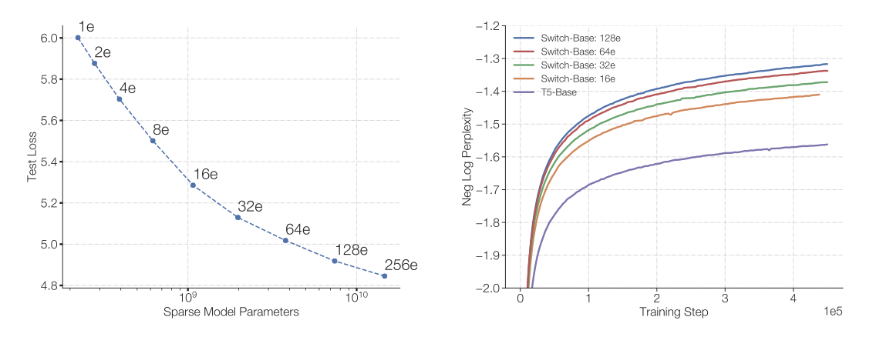

+++
author = "Kurt"
title = "Switch Transformers"
date = "2023-12-28"
description = "Scaling to Trillion Parameter Models with Simple and Efficient Sparsity"
categories = [
    "Paper Review"
]
tags = [
    "NLP",
    "LLM",
]
draft = true
+++

## Abstract

딥러닝에서 대부분의 모델은 동일한 parameter를 재사용하지만, Mixture of Experts (MoE) 모델은 각 입력에 대해 다른 parameter를 선택한다. 이로 인해 많은 parameter를 가진 sparsely-activated 모델이 만들어지지만, 계산 비용은 일정하다. 그러나 복잡성과 통신 비용, 학습의 불안정성 때문에 MoE는 널리 적용되지 못하였다.

이 문제를 해결하기 위해 Switch Transformer를 도입했고, MoE 라우팅 알고리즘을 단순화하고 통신 및 계산 비용을 줄인 개선된 모델을 설계하였다. 이를 통해 처음으로 lower precision(bfloat16)로 large sparse 모델을 학습시킬 수 있었다.

이러한 개선을 통해, 동일한 계산 자원을 사용하면서 사전 학습 속도를 최대 7배 향상시켰고, 모든 101개 언어에서 mT5-Base 버전보다 성능을 향상시켰다. 또한, 최대 1조 개의 parameter 모델을 사전 학습하여 언어 모델의 규모를 확장하였고, T5-XXL 모델보다 4배 빠른 속도를 달성하였다.

---

## Introduction

대규모 학습은 신경 언어 모델을 향상시키는 효과적인 방법으로 증명되었다. 그러나, 이는 계산적으로 매우 집약적이다. 따라서, 이와 같은 모델 규모의 성공에 영감을 받아, 더 큰 계산 효율성을 추구하며 sparsely-activated expert 모델인 Switch Transformer를 제안한다. 이는 각 들어오는 예제에 대해 신경망 가중치의 부분집합만을 활성화함으로써 이루어진다.

sparse 학습은 연구와 엔지니어링 분야에서 활발하게 진행되고 있지만, 현재 기계 학습 라이브러리와 hardware accelerator는 주로 dense matrix 곱셈에 초점을 맞추고 있다. 이에 대해, "Mixture-of-Expert (MoE)" 패러다임을 단순화하여 학습 안정성과 계산적 이점을 추구하였다. MoE 모델은 기계 번역 분야에서 성공을 거두었지만, 복잡성, 통신 비용, 학습 불안정성 등의 문제로 널리 채택되지는 못하고 있다.

이 연구에서는 알고리즘 문제를 해결하고 번역을 넘어서 자연어 분야에서의 광범위한 활용 가능성을 발견하였다. 사전 학습, 미세조정, 다중 작업 학습 등 NLP의 다양한 체제에서 우수한 확장성을 측정하였다. 또한 Switch Transformer 아키텍처는 슈퍼컴퓨터 뿐만 아니라 몇 개의 계산 코어에서도 효과적이며, 큰 희소 모델은 품질 향상의 30%를 유지하면서 밀집 버전으로 축소할 수 있음을 보여주었다.

이 논문의 기여는 다음과 같다:

* Mixture of Experts를 간소화하고 개선한 Switch Transformer 아키텍처.
* T5 모델에 대해 동일한 FLOPS 당 토큰을 사용하면서도 사전 학습 속도를 7배 이상 향상시킨 것을 확인하였다. 또한, expert가 두 명만 있는 계산 자원이 제한된 상황에서도 성능 개선이 가능하다는 것을 보여주었다.
* sparse 사전 학습 및 전문화된 미세조정 모델을 small dense 모델로 성공적으로 축소(distillation)하면서, 모델 크기를 최대 99%까지 줄이고, 동시에 sparse 모델의 품질 향상의 30%를 유지하였다.
* 사전 학습 및 미세조정 기법을 개선하였다: (1) bfloat16 precision으로 학습 가능한 selective precision 학습 (2) 더 많은 expert로 확장 가능한 초기화 방식 (3) sparse 모델의 미세조정 및 다중 작업 학습을 향상시키는 expert regularization 증가.
* 다국어 데이터에 대한 사전 학습의 이점을 측정했고, 이를 통해 모든 101개 언어에서 개선을 확인하였다. 또한, 91%의 언어에서 mT5 기준선에 비해 4배 이상의 속도 향상을 확인하였다.
* 데이터, 모델, expert-parallelism을 효율적으로 결합하여 최대 1 trillion 개의 parameter를 가진 모델을 만들어, 신경 언어 모델의 규모를 확장하였다. 이 모델들은 T5-XXL 기준선의 사전 학습 속도를 4배로 향상시켰다.

---

## Switch Transformer

---

## Reference

* [Paper](https://arxiv.org/pdf/2101.03961.pdf)
* [Github](https://github.com/kyegomez/SwitchTransformers)