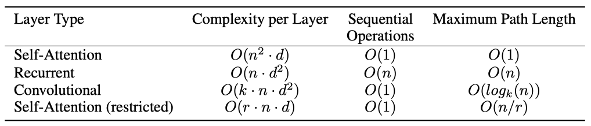

+++
author = "Kurt"
title = "Transformers"
date = "2023-12-01"
description = "Attention Is All You Need"
categories = [
    "Paper Review"
]
tags = [
    "NLP",
    "LLM",
]
+++

## Abstract

recurrent와 convolutional을 완전히 제거하고 attention mechanism에만 기반한 새로운 신경망 아키텍처인 transformer를 제안한다. 이 모델은 더 우수한 품질을 제공하면서 병렬화가 가능하고 학습 시간이 훨씬 적게 든다. 영어-독일어와 영어-프랑스어 번역 작업에서 state-of-the-art를 뛰어넘는 성능을 보였고, 영어 구문 분석에도 성공적으로 적용되었다.

---

## Introduction

RNN, 특히 LSTM과 GRU는 언어 모델링과 기계 번역 등에서 state-of-the-art로 인정받았다. 이후에도 이러한 모델과 아키텍처의 한계를 끊임없이 넓혀가고 있다.

recurrent 모델은 입력과 출력 시퀀스의 위치에 따라 계산을 분류하며, 이는 순차적인 특성으로 인해 학습 예제 내의 병렬화를 방해한다. 이는 메모리 제약이 있는 긴 시퀀스에서 중요한 문제가 된다. 최근의 연구는 계산 효율성을 향상시키는 방법을 제시하였지만, sequential computation의 근본적인 제약은 여전히 남아 있다.

attention mechanism은 시퀀스 모델링에 있어 핵심 역할을 하며, 입력이나 출력 시퀀스의 거리에 관계 없이 종속성을 모델링할 수 있다. 그러나 대부분의 경우, attention mechanism은 recurrent 네트워크와 함께 사용된다.

recurrent을 배제하고 attention mechanism에만 의존하는 transformer를 제안한다. transformer는 더 많은 병렬화를 가능하게 하고, 8개의 P100 GPU에서 단 12시간 학습만으로 state-of-the-art를 달성할 수 있었다.

---

## Background

sequential computation을 줄이는 것은 Extended Neural GPU, ByteNet, ConvS2S 등의 핵심 목표인데, 이들은 모두 CNN을 사용해 모든 입력과 출력 위치에 대한 표현을 병렬로 계산한다. 그러나 이 모델들은 두 임의의 위치간의 관계를 학습하는데 필요한 연산 수가 위치 간 거리에 따라 증가하므로, 먼 위치 간의 종속성을 학습하기 어렵다. transformer는 이를 상수 수의 연산으로 줄이지만, attention-weighted를 평균화함으로써 해상도가 감소하는 비용이 따르며, 이는 Multi-Head Attention을 통해 상쇄시킨다.

self-attention은 단일 시퀀스의 다양한 위치를 연관시켜 시퀀스의 표현을 계산하는 방법으로, 독해, 요약, 텍스트 함의 파악, 작업 독립적 문장 표현 학습 등 다양한 작업에 성공적으로 활용되었다.

end-to-end memory network는 recurrent attention mechanism을 기반으로 하며, 간단한 언어 질문 응답 및 언어 모델링 작업에서 좋은 성능을 보여주었다.

transformer는 시퀀스에 정렬된 RNN이나 convolution을 사용하지 않고, 완전히 self-attention에 의존하여 입력과 출력의 표현을 계산하는 최초의 transduction 모델이다.

--- 

## Model Architecture

대부분의 neural sequence transduction 모델은 encoder-decoder 구조를 가지고 있습니다. encoder는 기호 표현의 입력 시퀀스 $(x_1, ..., x_n)$를 연속적인 표현의 시퀀스 $z = (z_1, ..., z_n)$로 변환하고, 이를 기반으로 decoder는 한 번에 하나씩 기호의 출력 시퀀스 $(y_1, ..., y_m)$를 생성한다. 이때 모델은 이전에 생성된 기호를 추가 입력으로 사용하는 auto-regressive 방식을 취한다.

transformer는 encoder와 decoder 모두에 대해 쌓인 self-attention과 point-wise, fully connected layer을 사용하여 encoder-decoder 구조를 따른다.

### Encoder and Decoder Stacks

**Encoder:** encoder는 $N = 6$개의 동일한 계층으로 이루어져 있으며, 각 계층은 multi-head self-attention mechanism과 positionwise fully connected feed-forward network의 두 sub-layer로 구성된다. 각 하위 계층은 residual connection과 $LayerNorm(x + Sublayer(x))$를 통해 처리되며, 모든 하위 계층과 임베딩 계층은 차원 $d_{model} = 512$인 출력을 생성한다.

**Decoder:** decoder는 $N = 6$개의 동일한 계층으로 구성되며, encoder의 출력에 multi-head attention을 수행하는 세 번째 sub-layer이 추가된다. 각 sub-layer 주변의 residual connection과 layer normalization를 사용하며, 후속 위치에 주의를 기울이는 것을 방지하기 위해 decoder의 self-attention sub-layer을 수정한다. 이러한 수정은 위치 $i$의 예측이 $i$보다 작은 위치에서의 알려진 출력에만 의존하도록 보장한다.

### Attention

attention 함수는 query와 key-value 쌍을 벡터 형태의 출력으로 매핑하며, 출력은 값들의 가중치 합으로 계산된다. 이때 각 값의 가중치는 query와 해당 key의 호환성에 따라 결정된다.

#### Scaled Dot-Product Attention

"Scaled Dot-Product Attention"은 query와 key의 차원이 $d_k$, 값의 차원이 $d_v$인 입력을 처리한다. query와 모든 key의 내적을 계산하고, 이를 $\sqrt{d_k}$로 나눈 후, softmax 함수를 적용하여 값에 대한 가중치를 얻는다.

여러 쿼리들을 동시에 처리하기 위해 행렬 $Q$에 패킹하고, key와 value 또한 각각 행렬 $K$와 $V$에 패킹한다. 그리고 이를 이용해 출력 행렬을 계산한다:

$$ Attention(Q, K, V) = softmax({{QK^\intercal}\over{\sqrt{d_k}}})V $$

가장 흔히 사용되는 attention 함수는 additive attention과 dot-product (multiplicative) attention입니다. dot-product attention은 알고리즘과 ${{1}\over{\sqrt{d_k}}}$의 스케일링 요소를 제외하면 동일하며, additive attention은 feed-forward network를 이용해 호환성 함수를 계산한다. 두 방법은 이론적으로 유사하지만, dot-product attention은 최적화된 행렬 곱셈 코드를 통해 더 빠르고 공간 효율적으로 구현될 수 있다.

$d_k$ 값이 작은 경우 두 메커니즘이 유사하게 작동하지만, $d_k$ 값이 크면 스케일링 없는 dot-product attention의 성능이 떨어잔다. 이는 dot-product 값의 크기 증가로 인해 softmax 함수의 기울기가 매우 작아지는 것을 방지하기 위해, dot-product을 ${{1}\over{\sqrt{d_k}}}$로 스케일링한다.

#### Multi-Head Attention

$d_{model}$-dimensional key, value, query에 single attention 함수를 사용하는 대신, 각각을 다른 선형 변환을 통해 $d_k$, $d_k$, $d_v$ 차원으로 $h$번 변환하는 것이 유익하다는 것을 발견하였다. 이 변환된 query, key, value에 대해 병렬로 attention 함수를 수행하면, $d_v$ 차원의 출력 값이 나오며, 이들은 연결되고 다시 변환되어 최종 값이 생성된다.

multi-head attention은 다른 표현 하위 공간에서 다른 위치의 정보에 동시에 주의를 기울일 수 있게 해주는 반면, single attention head는 이를 평균화하여 방해한다.

$$ MultiHead(Q, K, V) = Concat(head_1, ..., head_h)W^O $$
$$ where \ head_i = Attention(QW_i^Q, KW_i^K, VW_i^V) $$

프로젝션은 parameter 행렬 $W_i^Q \in \mathbb{R}^{d_{model \times d_k}}$, $W_i^K \in \mathbb{R}^{d_{model \times d_k}}$, $W_i^V \in \mathbb{R}^{d_{model \times d_v}}$ 그리고 $W^O \in \mathbb{R}^{hd_v \times d_{model}}$이다.

이 작업에서는 8개의 병렬 attention layer를 사용하며, 각 계층에 대해 $d_k = d_v = d_{model} / h = 64$를 사용한다. 각 head의 차원이 줄어들었기 때문에 전체 계산 비용은 전체 차원의 single-head attention과 유사하다.

#### Applications of Attention in our Model

transformer는 세 가지 다른 방식으로 multi-head attention을 사용한다:

* "encoder-decoder attention"에서는 이전 decoder 계층에서 query가 생성되고, encoder의 출력에서 메모리 key와 value이 생성된다. 이를 통해 decoder의 모든 위치가 입력 시퀀스 전체에 주의를 기울일 수 있습니다. 이는 일반적인 sequence-to-sequence 모델의 encoder-decoder attention mechanism을 따른다.
* encoder에는 self-attention layer가 있으며, 이 layer에서는 모든 key, value, query가 encoder의 이전 layer의 출력에서 생성된다. 이를 통해 encoder의 각 위치가 이전 layer의 모든 위치에 주의를 기울일 수 있다.
* decoder의 self-attention layer는 decoder의 각 위치가 그 위치를 포함해 그 이전의 모든 위치에 주의를 기울일 수 있게 한다. auto-regressive 속성을 유지하기 위해, 불법적인 연결에 해당하는 값을 마스킹 아웃($-\infty$로 설정)하여 decoer 내부의 정보 흐름을 제한한다.

### Position-wise Feed-Forward Networks

encoder와 decoder의 각 layer에는 각 위치에 독립적으로 적용되는 fully connected feed-forward network가 포함되어 있으며, 이는 두 개의 linear transformation과 그 사이의 ReLU activation 함수로 구성된다.

$$ FFN(x) = max(0, xW_1 + b_1)W_2 + b_2 $$

linear transformation은 다른 위치에도 동일하게 적용되지만, layer마다 다른 parameter를 사용한다. 이는 kernel size 1의 두 개의 convolution으로도 설명할 수 있다. 입력과 출력의 차원은 $d_{model} = 512$이고, inner-layer의 차원은 $d_{ff} = 2048$이다.

### Embeddings and Softmax

학습된 임베딩을 사용하여 입력 토큰과 출력 토큰을 벡터로 변환하며, 학습된 linear transformation과 softmax 함수를 사용해 decoder 출력을 다음 토큰 확률로 변환한다. 두 임베딩 layer와 pre-softmax linear transformatio에서 동일한 가중치 행렬을 공유하고, 임베딩 layer에서는 이 가중치에 ${{1}\over{\sqrt{d_k}}}$를 곱한다.

### Positional Encoding

transformer 모델은 recurrence와 convolution이 없기 때문에, 시퀀스의 토큰 위치에 대한 정보를 주입함으로써 시퀀스의 순서를 활용한다. 이를 위해, "positional encoding"을 입력 임베딩에 더하며, 이는 임베딩과 동일한 차원을 가진다. positional encoding은 학습되거나 고정될 수 있다.

다른 주파수의 sine 함수와 cosine 함수를 사용한다:

$$ PE_{(pos, 2i)} = sin(pos/10000^{2i/d_{model}}) $$
$$ PE_{(pos,2i+1)} = cos(pos/10000^{2i/d_{model}}) $$

positional encoding의 각 차원이 sinusoid에 해당하도록 sine 함수와 코사인 cosine를 사용한다. 이 함수를 선택한 이유는 모델이 상대적 위치에 따라 주의를 쉽게 배울 수 있도록 하기 위해서이다. 즉, 어떤 고정된 오프셋 $k$에 대해서도, $PE_{pos+k}$는 $PE_{pos}$의 선형 함수로 표현될 수 있다.

학습된 positional embedding을 사용해 실험해봤고, 두 방식이 거의 동일한 결과를 생성함을 확인하였다. sinusoidal 버전을 선택한 이유는 학습 중에 접한 것보다 더 긴 시퀀스 길이로 extrapolate 할 수 있을 것이라 판단했기 때문이다.

---

## Why Self-Attention

recurrent및 convolutional layer와 self-attention layer을 비교한다. 이들은 모두 가변 길이의 심볼 표현 시퀀스를 동일한 길이의 다른 시퀀스로 매핑하는데 사용된다. self-attention 사용의 동기를 설명하기 위해, 세 가지 조건을 고려한다.

하나는 각 계층에서의 전체 계산 복잡성이다. 또 다른 하나는 병렬화할 수 있는 계산량으로, 이는 필요한 최소 연속 작업의 수로 측정된다.

세 번째는 네트워크 내에서 long-range dependency 사이의 경로 길이이다. long-range dependency를 학습하는 것은 시퀀스 변환 작업의 주요 도전 과제이다. 이를 학습하는 능력은 네트워크 내에서 신호가 이동하는 경로의 길이에 크게 영향을 받는다. 입력과 출력 시퀀스의 임의의 위치 사이의 경로가 짧을수록 long-range dependency을 학습하기 쉽다. 따라서, 다른 layer 유형으로 구성된 네트워크에서 두 입력과 출력 위치 사이의 최대 경로 길이도 비교한다.

self-attention layer는 연속적인 연산을 통해 모든 위치를 연결하며, recurrent layer에 비해 더 빠른 계산 속도를 제공한다. 특히, 시퀀스 길이가 표현 차원보다 작은 경우에 더욱 그렇다. 매우 긴 시퀀스를 처리하는 작업의 계산 성능을 높이기 위해, self-attention은 출력 위치를 중심으로 한 입력 시퀀스의 이웃만을 고려하도록 제한될 수 있다. 이는 최대 경로 길이를 $O(n/r)$로 증가시키며, 이에 대한 연구를 미래에 더 진행할 계획이다.

커널 너비가 $k < n$인 단일 convolutional layer는 모든 입력과 출력 위치를 연결하지 않는다. 이를 위해선 복수의 convolutional layer이 필요하고, 이로 인해 네트워크 내 두 위치 사이의 가장 긴 경로가 늘어난다. 보통 convolutional layer는 recurrent layer보다 $k$배의 비용이 더 들지만, 분리 가능한 convolution을 사용하면 복잡성이 크게 줄어든다. 그러나 $k = n$인 경우에도, 분리 가능한 convolution의 복잡성은 self-attention layer와 point-wise feed-forward layer의 결합과 동일하다. 

self-attention은 더 해석 가능한 모델을 만들 수 있는 이점이 있다. 우리 모델에서는 각 attention head가 다른 작업을 수행하도록 학습하며, 이들 중 많은 헤드가 문장의 구문적 및 의미적 구조와 관련된 행동을 보이는 것으로 파악되었다.

---

## Training

### Training Data and Batching

약 450만 개의 문장 쌍을 포함하는 표준 WMT 2014 영어-독일어 데이터셋으로 학습했다. 더 큰 WMT 2014 영어-불어 데이터셋도 사용하였다. 각 학습 배치는 약 25000개의 소스 토큰과 타겟 토큰을 포함하는 문장 쌍을 포함하였다.

### Hardware and Schedule

8개의 NVIDIA P100 GPU에서 모델을 학습시켰다. 기본 모델들은 각 학습 단계마다 약 0.4초가 걸렸고, 총 100,000단계 또는 12시간 동안 학습되었다. 큰 모델들은 단계 시간이 1.0초였고, 300,000단계 또는 3.5일 동안 학습되었다.

### Optimizer

Adam optimizer, $\beta_1 = 0.9$, $\beta_2 = 0.98$ 그리고 $\epsilon = 10^{−9}$를 사용하였다. 다음의 공식에 따라서 learning rate을 변화시켰다:

$$ lrate = d_{model}^{−0.5} · min(\text{step_num}^{−0.5}, \text{step_num} · \text{warmup_steps}^{−1.5}) $$

warmup_steps 동안 learning rate을 선형적으로 증가시키고, 그 이후에는 단계 수의 역제곱에 비례하여 감소시킨다. warmup_steps = 4000을 사용하였다.

### Regularization

세 가지 유형의 regularization를 사용한다:

**Residual Dropout** 각각의 sub-layer의 출력과 encoder 및 decoder 스택의 임베딩과 positional encoding의 합에 드롭아웃을 적용합니다. 기본 모델에서는 dropout rate로 $P_{drop} = 0.1$을 사용한다.

**Label Smoothing** 학습 동안에는 $\epsilon_{ls}= 0.1$의 값을 가진 라벨 스무딩을 사용하였다. 이는 모델이 더 불확실하게 학습하도록 만드므로 혼란스러움(perplexity)을 증가시키지만, 정확도와 BLEU 점수는 향상시킨다.

---

## Results

### Machine Translation

WMT 2014 영어-독일어 번역 작업에서, 큰 transformer 모델은 이전 모델들을 2.0 BLEU 이상 뛰어넘어 state-of-the-art인 28.4의 BLEU 점수를 달성하였다. 이 모델은 8개의 P100 GPU에서 3.5일 동안 학습되었다. 기본 모델조차도 이전의 모든 모델과 앙상블을 능가하며, 경쟁 모델의 학습 비용의 일부에 불과했다.

WMT 2014 영어-불어 번역 작업에서, BLEU 점수 41.0을 달성하여 이전에 발표된 모든 단일 모델들을 능가했고, 이전 state-of-the-art 모델의 학습 비용의 1/4 미만이었다. 이 모델은 dropout rate로 $P_{drop} = 0.1$을 사용했다.

기본 모델에 대해 마지막 5개의 체크포인트를 평균한 단일 모델을 사용했고, 큰 모델에 대해선 마지막 20개의 체크포인트를 평균냈다. beam search를 통해 beam size 4와 length penalty $\alpha = 0.6$을 사용했다. 이 값들은 개발 세트에서 실험 후 결정되었다. 추론 시 최대 출력 길이는 입력 길이 + 50으로 설정되었으나, 가능하다면 일찍 종료한다.

모델 학습에 사용된 부동 소수점 연산의 수는 학습 시간, 사용된 GPU의 수, 각 GPU의 단정밀도 부동 소수점 용량의 추정치를 곱하여 추정하였다.

### Model Variations

transformer의 다양한 요소의 중요성을 평가하기 위해, 기본 모델을 다양하게 변형하며 개발 세트인 newstest2013에서의 영어-독일어 번역 성능 변화를 측정하였다. beam search을 사용했지만 체크포인트 평균화는 사용하지 않았다.

single-head attention은 최적 설정보다 0.9 BLEU가 떨어지며, head 수가 너무 많아져도 품질이 떨어진다.

attention key 크기를 줄이면 모델 품질이 떨어진다는 것을 확인하였다. 이는 복잡한 호환성 함수가 필요할 수 있음을 시사한다. 더 큰 모델이 더 좋고, dropout이 over-fitting을 피하는 데 매우 유용하다는 것을 확인했다. sinusoidal positional encoding을 learned positional embedding으로 대체했을 때 기본 모델과 거의 동일한 결과를 얻었다.

### English Constituency Parsing

transformer가 다른 작업에 일반화할 수 있는지 확인하기 위해, 구조적 제약이 강하고 입력보다 긴 출력을 가진 영어 구성성 파싱 작업에 대한 실험을 수행하였다. RNN sequence-to-sequence 모델은 이 작업에서 state-of-the-art를 달성하지 못하였다.

Penn Treebank의 Wall Street Journal (WSJ) 부분에 대해 약 4K 개의 학습 문장을 사용하여 $d_{model} = 1024$의 4-layer transformer를 학습시켰다. 또한, 약 17M 문장을 포함하는 대형 말뭉치를 사용하여 반지도학습 환경에서도 학습시켰다. WSJ만을 대상으로 하는 경우 16K 토큰의 어휘를, 반지도학습 설정에서는 32K 토큰의 어휘를 사용하였다.

dropout, learning rate, beam size를 결정하기 위해 Section 22 개발 세트에서 몇 가지 실험을 수행했고, 모든 다른 parameter는 기본 번역 모델에서 변경되지 않았다. 추론 시에는 최대 출력 길이를 입력 길이 + 300으로 늘렸다. beam size 21과 $\alpha = 0.3$을 모든 설정에 사용하였다.

작업 특화 튜닝이 없음에도 이전 모델들보다 더 좋은 성능을 보였고, 이는 Recurrent Neural Network Grammar을 제외한 모든 이전에 보고된 모델들보다 더 좋은 결과를 가져왔다.

RNN sequence-to-sequence 모델과는 달리, transformer는 오직 WSJ 학습 세트의 40K 문장만을 이용하여 학습했음에도 BerkeleyParser를 능가하는 성능을 보여주었다.

---

## Conclusion

transformer는 attention 기반으로 만들어진 첫 시퀀스 transduction 모델로, encoder-decoder 구조의 recurrent layer를 multi-headed self-attention로 대체하였다.

transformer는 recurrent나 convolution 기반 아키텍처보다 빠르게 학습되며, WMT 2014 영어-독일어와 영어-프랑스어 번역 작업에서 state-of-the-art를 달성하였다. 이 중 영어-독일어 작업에서는 이전의 모든 앙상블보다 더 뛰어난 성능을 보여주었다.

attention 기반 모델을 다른 작업에 적용하고, 텍스트 이외의 다양한 입력과 출력 문제에 transformer를 확장하려 한다. 또한, 큰 이미지, 오디오, 비디오 등을 효율적으로 처리하기 위해 restricted attention mechanism을 연구하고, 생성 과정을 덜 순차적으로 만드는 것을 목표로 하고 있다.

---

## Reference

* [Paper](https://arxiv.org/pdf/1706.03762.pdf)
* [Github](https://github.com/tensorflow/tensor2tensor)