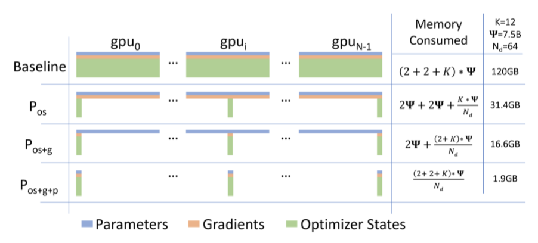

+++
author = "Kurt"
title = "ZeRO"
date = "2023-12-20"
description = "Memory Optimizations Toward Training Trillion Parameter Models"
categories = [
    "Paper Review"
]
tags = [
    "NLP",
    "LLM",
]
draft = true
+++

## Abstract

large deep learning 모델은 높은 정확도를 제공하지만, 기존의 데이터 및 모델 병렬화 솔루션은 메모리 적합성에 한계를 보인다. 따라서 Zero Redundancy Optimizer(ZeRO)를 개발하여 메모리를 최적화하고, 학습 속도를 향상시키며, 효율적으로 학습할 수 있는 모델 크기를 증가시켰다. ZeRO는 메모리 중복을 제거하고, 낮은 통신량과 높은 계산 세밀도를 유지하면서 모델 크기를 확장할 수 있는 가능성을 보여준다.

ZeRO를 구현하고 평가했는데, 이는 400개의 GPU에서 super-linear 속도 향상을 통해 100B 이상의 parameter를 가진 대형 모델을 학습시키며, 15 Petaflops의 처리량을 달성하였다. 이는 기존 기술에 비해 8배의 모델 크기 증가와 10배의 성능 향상을 보여준다. 또한, ZeRO는 모델 병렬화 없이 최대 13B parameter의 대형 모델을 학습시킬 수 있다. 마지막으로, 연구자들은 ZeRO를 사용하여 기록적인 정확도를 가진 세계 최대의 언어 모델을 만들었다.

---

## Extended Introduction

딥러닝 모델이 점점 커지면서 정확도가 크게 향상되고 있다. transformer는 자연어 처리 분야에서 대형 모델의 발전을 이끌었지만, 이런 모델들은 단일 장치의 메모리에 들어갈 수 없어 학습시키는 데 어려움이 있다. 더 많은 장치를 추가하는 것만으로는 이 문제를 해결할 수 없다.

기본 데이터 병렬화는 장치당 메모리를 줄이지 않아, 큰 모델에 대해 메모리 부족 문제가 발생한다. 파이프라인 병렬화, 모델 병렬화, CPU 오프로딩 등의 기존 해결책들은 각종 효율성과 기능성, 사용성 사이에서 타협을 이루어야 하지만, 이들 모두가 학습의 속도와 규모를 위해 중요하다.

거대 모델 학습에 가장 유망한 방법인 모델 병렬화(Model Parallelism, MP)는 모델을 수직으로 분할하여 여러 장치에 분배한다. 이 방법은 단일 노드에서 잘 작동하지만, 노드를 넘어서면 효율성이 빠르게 저하된다. 이 논문의 실험에서는, 두 개의 DGX-2 노드에서 40B parameter 모델을 테스트했을 때, V100 GPU당 약 5 Tflops(하드웨어 피크의 5% 미만)의 성능을 보여주었다.

거대 모델을 더 효율적으로 학습하기 위해, 기존 시스템의 메모리 소비를 분석하고, 모델 상태와 잔여 상태 두 부분으로 분류한다. 모델 상태는 메모리의 대부분을 차지하며, 잔여 상태는 나머지 메모리를 차지한다. 이 두 부분 모두에서 메모리 효율성을 최적화하면서 높은 계산 및 통신 효율성을 얻기 위해 ZeRO를 개발하였다. 이 두 부분은 각각 다른 도전과제에 직면하므로, 각각에 대한 해결책을 개발하고 논의하였다.

**Optimizing Model State Memory** 모델 학습 중 메모리의 대부분을 차지하는 모델 상태를 효율적으로 관리하기 위해, ZeRO-DP를 개발하였다. 기존의 DP와 MP 방식의 한계를 극복하고자, ZeRO-DP는 모델 상태를 복제하는 대신 분할하여 메모리 상태 중복을 제거하고, 동시에 계산/통신 효율성을 유지하기 위해 동적 통신 일정을 사용한다. 이를 통해 DP의 계산/통신 효율성과 MP의 메모리 효율성을 모두 달성하려 한다.

ZeRO-DP는 옵티마이저 상태, 그래디언트, 파라미터를 분할하는 세 가지 주요 최적화 단계를 순차적으로 활성화한다.

1. Optimizer State Partitioning ($P_os$): 메모리 감소량 4배, DP와 동일한 통신 볼륨
2. Add Gradient Partitioning ($P_{os+g}$): 메모리 감소량 8배, DP와 동일한 통신 볼륨
3. Add Parameter Partitioning ($P_{os+g+p}$): 메모리 감소량이 DP 정도 $N_d$와 선형적이다.

예를 들어, 64개의 GPU($N_d = 64$)에 걸쳐 분할하면 메모리 감소량이 64배가 된다. 통신 볼륨은 50% 증가한다.

ZeRO-DP는 메모리 중복을 제거하여 클러스터의 전체 메모리를 활용하게 한다. 세 단계 모두 활성화하면 ZeRO는 1024개의 NVIDIA GPU만으로 1조 개의 파라미터 모델을 학습할 수 있다. 이는 각 GPU가 대략 16GB의 메모리를 사용하게 되며, 이는 대부분의 GPU(예: 32GB 메모리를 가진 GPU)가 감당할 수 있는 범위이다.

**Optimizing Residual State Memory** ZeRO-DP가 모델 메모리 효율성을 향상시킨 후에도, 활성화, 임시 버퍼, 사용 불가능한 메모리 조각 등으로 인해 두 번째 메모리 병목 현상이 발생할 수 있다. 이를 해결하기 위해, 각 요소에 의한 잔여 메모리를 최적화하는 ZeRO-R을 개발하였다.

1. activation에 대해, 체크포인팅이 도움이 되지만 큰 모델에는 충분하지 않다는 것을 발견했다. 그래서 ZeRO-R은 activation partitioning을 통해 기존 MP 방법에서 activation 복제를 식별하고 제거함으로써 activation 메모리를 최적화한다. 또한 적절할 때 CPU로 활성화를 오프로드한다.
2. ZeRO-R은 메모리와 계산 효율성 사이의 균형을 위해 임시 버퍼의 적절한 크기를 정의한다.
3. 학습 중에 다른 텐서의 수명 차이로 인해 메모리가 파편화되는 것을 관찰하였다. 파편화로 인한 연속적인 메모리 부족은 충분한 여유 메모리가 있음에도 불구하고 메모리 할당 실패를 일으킬 수 있다. ZeRO-R은 텐서의 다른 수명에 기반하여 메모리를 적극적으로 관리함으로써 메모리 파편화를 방지한다.

ZeRO-DP와 ZeRO-R을 결합하여 ZeRO라는 딥러닝 학습용 메모리 최적화 시스템을 구성한다.

**ZeRO and MP:** ZeRO는 데이터 병렬처리의 메모리 비효율성을 제거하므로, 모델 병렬처리(MP)의 필요성이 줄어든다. ZeRO-DP는 MP와 비교해서 장치당 메모리 사용량을 적어도 같게 줄이거나, 때로는 더 효과적으로 줄일 수 있다. 또한, 스케일링 효율성도 비슷하거나 더 좋다. 데이터 병렬처리는 쉽게 사용할 수 있어 다양한 작업에 적용할 수 있지만, MP는 모델과 시스템 개발자의 추가 작업이 필요하며, 제한된 연산자와 모델만 지원한다.

ZeRO-R과 함께 사용하면, MP는 매우 큰 모델의 활성화 메모리 사용량을 줄일 수 있으며, 활성화 메모리가 문제가 아닌 작은 모델에서는 DP만을 이용한 배치 크기가 너무 클 경우 MP가 이점을 가질 수 있다. 이런 경우, ZeRO를 MP와 결합하여 적절한 배치 크기로 모델을 적용할 수 있다.

ZeRO는 MP와 결합될 수 있으며, 이는 각 장치에서 최대 이론적 메모리 감소를 $N_d \times N_m$배 달성하는 결과를 가져온다. 이를 통해, 1024개의 GPU 1 trillion 개의 parameter 모델을 효율적으로 운영할 수 있게 된다. 이는 16-방향 모델 병렬처리와 64-방향 데이터 병렬처리를 이용하며, 적당한 배치 크기를 사용한다.

**Implementation & Evaluation** ZeRO의 최적화 세트는 1 trillion 개의 parameter를 가진 모델을 고급 하드웨어 클러스터에서 실행할 수 있지만, 계산 능력의 한계와 긴 학습 시간 때문에 실제 적용이 어렵다. 그래서 현재 하드웨어의 계산 능력 범위 내에서 최첨단보다 10배 많은 parameter(약 100B 개의 parameter)를 효율적으로 지원하는 것에 초점을 맞추었다. 이를 위해 ZeRO-DP의 $P_{os+g}$와 ZeRO-R을 결합한 ZeRO의 최적화 하위 집합인 ZeRO-100B를 구현하고 평가하였다.

Model Size: MP와 결합된 ZeRO-100B는 170B 개의 parameter 모델을 효율적으로 실행할 수 있다. 반면, Megatron만을 사용하는 기존 시스템은 400억 개의 parameter 이상으로 효율적으로 확장할 수 없다. 이는 state-of-the-art 대비 모델 크기가 8배 이상 증가한 것이다.

Speed: 향상된 메모리 효율성은 처리량을 높이고 학습 속도를 빠르게 한다. ZeRO는 400개의 Nvidia V100 GPU 클러스터에서 1000억 개의 parameter 모델을 GPU당 38TFlops, 총 15Petaflops의 성능으로 실행한다. 이는 동일한 모델 크기에 대해 state-of-the-art 대비 학습 속도를 10배 이상 향상시킨다.

Scalability: 64-400개의 GPU 영역에서 GPU의 수를 두 배로 늘릴 때 성능이 두 배 이상 향상되는 슈퍼 선형 속도 향상을 관찰하였다. 이는 ZeRO-DP의 특성으로, DP 차수를 늘릴수록 모델의 메모리 사용량이 줄어들고 GPU 당 더 큰 배치 크기를 적용할 수 있게 되어 성능을 향상시킨다. 400개를 넘는 GPU 수를 더 늘릴 경우 이런 행동이 계속될 것으로 예상한다.

Democratization of Large Model Training: ZeRO-100B는 데이터 과학자들이 모델 리팩토링을 필요로 하는 MP나 PP 없이 최대 13B 개의 parameter로 모델을 학습할 수 있게 한다. 이를 통해 데이터 과학자들은 병렬 처리에 대해 걱정하지 않고 큰 모델로 자유롭게 실험할 수 있다. 반면, 기존 시스템들은 1.4B 개의 parameter 모델에서 메모리가 부족해진다.

New SOTA Model: ZeRO는 17B 개의 parameter를 가진 가장 큰 언어 모델인 Turing-NLG를 지원하며, 이는 기록적인 정확도를 보여준다.

---

## Related Work

### Data, Model and Pipeline Parallelism

---

## Reference

* [Paper](https://arxiv.org/pdf/1910.02054.pdf)
* [Github](https://github.com/microsoft/DeepSpeed)